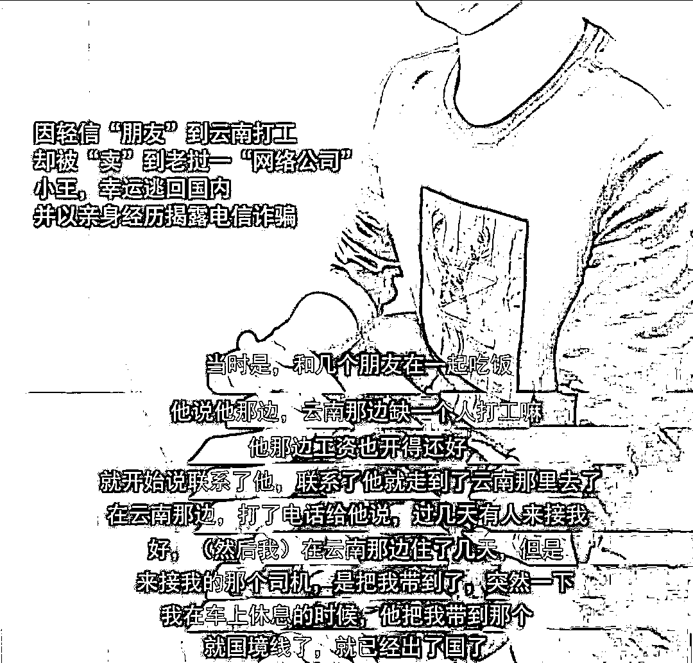
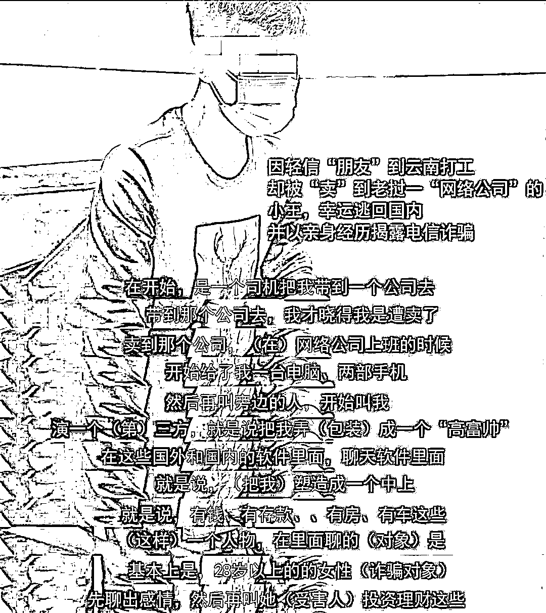
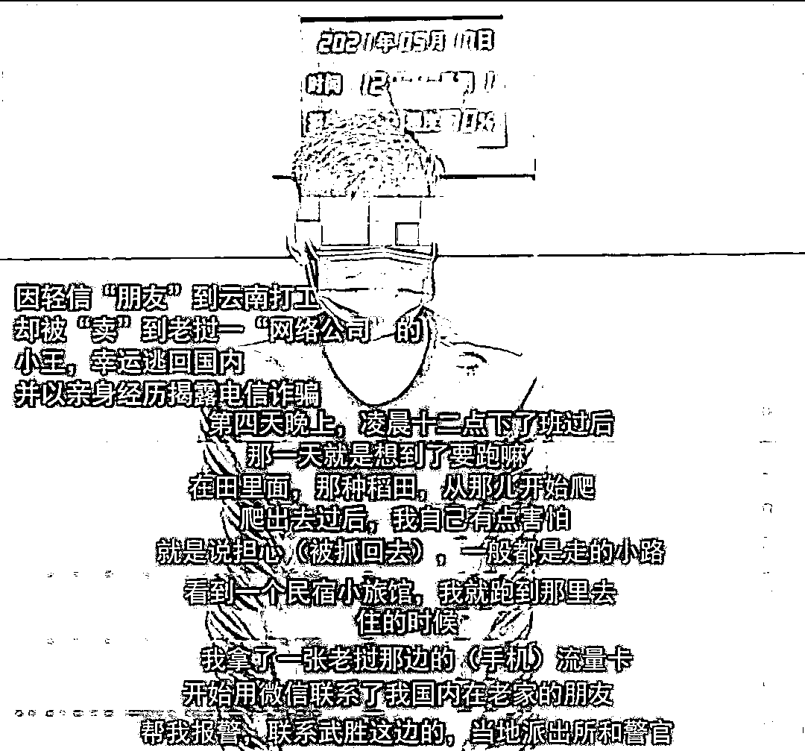
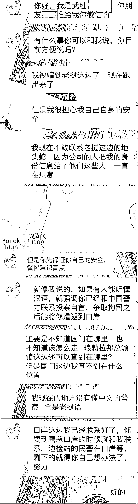

# 四川小伙云南求职被卖老挝，九死一生逃回国

> 原文：[`mp.weixin.qq.com/s?__biz=MzIyMDYwMTk0Mw==&mid=2247514494&idx=1&sn=b5224e4cf18a0fe9b226d124e1d68bcd&chksm=97cb7246a0bcfb50699ff8f4329280327cbc59a5b4c46a042d1292333e0f0abfad343440b4ce&scene=27#wechat_redirect`](http://mp.weixin.qq.com/s?__biz=MzIyMDYwMTk0Mw==&mid=2247514494&idx=1&sn=b5224e4cf18a0fe9b226d124e1d68bcd&chksm=97cb7246a0bcfb50699ff8f4329280327cbc59a5b4c46a042d1292333e0f0abfad343440b4ce&scene=27#wechat_redirect)

王丹回到国内，在派出所里讲述自己被骗经历。本文图片  四川武胜公安

24 岁的四川武胜县小伙王丹（化名），从老挝回国，看见中国界碑上的国徽时流下了眼泪，一直紧绷的心这一刻放松了下来。

 短短一个多月时间，这位被“朋友”卖到电信诈骗窝点的小伙子，经历了逃离、被悬赏捉拿、躲藏、自首、隔离等一系列不堪回首的经历，终于踏上了中国的土地。

 5 月 19 日，四川省武胜县公安局相关负责人向澎湃新闻介绍，王丹听朋友介绍说，云南那边朋友缺开车送货的司机工作，工资很高。王丹于是辞职去云南求职，结果被卖到了老挝的电信诈骗窝点。不愿从事电信诈骗的王丹，经历九死一生逃离电信诈骗窝点，并联系上四川警方，在警方协助下回到了中国。

 王丹说：“网络上很多‘高富帅’‘白富美’主动和你聊天，都是假的，是电信诈骗。成套的话术剧本，虚假的各种证件信息人设，都是为了骗你的钱，让你家破人亡。”王丹希望他的经历被更多的人看到，希望年轻人不要再相信国外打工挣大钱，希望不再有人上当受骗。

求职途中一觉醒来已被卖到老挝

据王丹介绍，他今年 24 岁，因学习成绩不好，在初中时就辍学了。离开学校后，他去学了安装空调，随后便南下打工。“在外面打工，认识了很多人，形形色色。”打工时，王丹认识了很多“朋友”。

2020 年因为疫情原因，他所在的公司效益不是很好，导致工资收入也逐渐变少。

“在外面打工，就是想多挣点钱。”眼看公司的效益越来越差，他便萌生了跳槽的想法。在一次“朋友”聚会中，王丹把这个想法说了出来。酒桌上，一位“朋友”的“朋友”给指了一条路。“我听说，云南那边有个地方要招个司机，开车送货，工资比你现在高多了。”

听到这个消息，王丹没有犹豫，立即向这位“朋友”要了云南那边招工的联系方式，准备去云南取得更好的发展，但他万万没有想到，去那里只是“噩梦”的开端。

通过网络联系，云南那边很快有了回应，王丹急匆匆赶到了云南。“到了云南，对方让我找了个旅馆住下来，到时候来接我。”王丹在旅馆里面等了几天，终于等来了一辆接他的车。

上车后，车辆在山路上颠簸前进，王丹心中有些忐忑，他感觉有些不对，但又说不清哪里有问题。当时他已经很疲惫，没有多想，慢慢就在车上睡着了。当司机叫醒他时，他发现周围的人又黑又瘦，“不像中国人”，这是他第一想法。

“到了，下车。”“这是哪里？不像在云南了啊？”“这是老挝！”一系列的对话，让他当场懵在那里，一觉醒来，竟然到了国外！

“我当时就想回去，但是司机说，不拿钱，就不准回去。我身上没有那么多钱，只能选择留下。”王丹无奈地选择了留下。随后，司机把他带到了老挝一个“公司”。这时，他才知道，他被“朋友”给卖了。

看到不愿诈骗的“同事”被打

进入这个“公司”，周围都是此起彼伏的电话声音与键盘敲击声。王丹被安排了一个座位，“公司”收了他的手机，发给他用于“工作”的电脑和手机。随后，就有人过来教他，在网络上把自己包装成一个“高富帅”成功人士，并网上找 28 岁以上的女性聊天，以男女朋友的关系，骗到虚假 APP 上投资。

“我没想到的是，我被包装的这个人设，从车子的行驶证到公司营业执照，甚至还有‘父母’的名字以及各种炫富照片都准备好了，全是假的。”他说，当时，他就想，这肯定是诈骗，是骗人的，从坐下那一刻就开始抵触。

 王丹虽然读书成绩不好，但人较为老实，不愿意干违法的事情。但这时，他已身不由己，只能假装配合“公司”拿着话术在网上聊天。

“我旁边有个人，在新加坡的一个聊天软件上，聊到一个女的，两三天时间，就取得了信任，骗到了钱。我真的不敢相信，为什么有人会这么傻去上当？”王丹说，旁边有个“同事”，炫耀着自己的“战果”，十来天时间就“杀猪”成功，骗到了数十万美金，折合人民币 400 余万元。

 “每天都是煎熬，在网上说着言不由衷的话，‘公司’有些人也不愿意诈骗，他们不是挨打，就是被关，没有业绩也会被打被关。”王丹说，由于他才进入“公司”没几天，还处于“学习”阶段，且他表面上配合“公司”干工作，显得比较积极，没有挨打。但他看到其他不愿意干诈骗的“同事”挨打，或者被关起来等待家里拿钱赎人等等。

逃离电信诈骗窝点后，王丹和四川武胜警方取得联系。 

半夜逃离“窝点”求助国内警方

“我一直在找机会逃跑。在第四天晚上的时候，终于找到了机会。”在“公司”的第四天晚上，王丹终于找到了机会。他说，因为一直表现积极，看守放松了警惕。凌晨 1 点左右，他趁着夜色，从“公司”里逃离出来。公路两旁都是武装设卡，要是被抓到了带回去，后果不敢想象。

“我只能从公路旁边的稻田爬过去。爬了半个多小时，到了另外一条公路上。”他说，爬的时候，大气都不敢出。幸运的是，爬出稻田，成功逃脱了。他上了另一条公路后，随便选择一个方向走去，直到路边出现了房子。

“在旅馆里面，我找了一张老挝的手机卡，用微信联系到家里的朋友帮我报警。”死里逃生的他在旅馆里松了一口气。朋友帮忙报警后，四川武胜县公安局反诈中心、出入境管理大队、中心派出所，先后和他取得了联系。王丹通过定位软件确定了自己的位置。在四川民警的联系下，他找到了回国的方法。

“跑了后，‘公司’在悬赏抓我。在武胜公安的指导下，我躲了几天，确保了安全后就去老挝警方自首，然后就被安排到一个防疫点做了核酸和隔离，隔离之后，被送到了中国磨憨口岸。”当他看见中国界碑上的国徽时，紧绷的神经终于放松了下来。逃离、被悬赏、躲藏、自首、隔离，前前后后近一个月，他终于踏上了中国的土地。

“奉劝大家，网络上很多都是骗人的，‘高富帅’‘白富美’主动和你聊天，都是假的，是电信诈骗。成套的话术剧本，虚假的各种证件信息人设，都是为了骗你的钱，让你家破人亡。”王丹希望他的经历被更多的人看到，希望年轻人不要再相信国外打工挣大钱，希望不再有人上当受骗。

**相关报道：**

[嫌疑人亲述：在缅北，连呼吸都要交钱！](http://mp.weixin.qq.com/s?__biz=MzIyMDYwMTk0Mw==&mid=2247514280&idx=1&sn=957bfe8688785730c1916ca18c39667e&chksm=97cb7390a0bcfa8639e0d793d60b6c78d562a9cbdbc3d79d933804556e198edf81e6fe919d4b&scene=21#wechat_redirect)

[“底薪 8000 元，你来芒市当网管”！21 岁小伙被骗到缅北 剁断 4 根手指！](http://mp.weixin.qq.com/s?__biz=MzIyMDYwMTk0Mw==&mid=2247514230&idx=1&sn=e1556f0ce8c3f2ec2cbd67e92de06eab&chksm=97cb734ea0bcfa58102560d78e4f8d69c00b37a19b94891e29a3611a2e3be6380b60c5b27b1b&scene=21#wechat_redirect)

[除了电诈、赌博，还有更恐怖的……江西又有 2 人从缅北逃回家！](http://mp.weixin.qq.com/s?__biz=MzIyMDYwMTk0Mw==&mid=2247513378&idx=2&sn=cf06d0f8504d932282242f21e3e55d90&chksm=97cb7e1aa0bcf70c2fadd7096421014bb88e8111f607a5ed6acf3f2042d0efb0ac915cb7fa0c&scene=21#wechat_redirect)

[他们从缅甸回来就自首，揭开真实的缅北，听着都手心冒汗！](http://mp.weixin.qq.com/s?__biz=MzIyMDYwMTk0Mw==&mid=2247512728&idx=5&sn=0edec71756e71d6a3d3dd52da07c695e&chksm=97cb79a0a0bcf0b6bffe8a591167ee7d5bb5e30bd0c1872b8720a9eb943f2b0342a432b50270&scene=21#wechat_redirect)

来源：澎湃新闻

← 向右滑动与灰产圈互动交流 →

