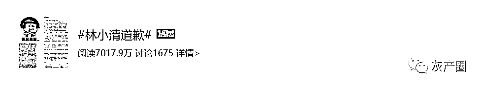
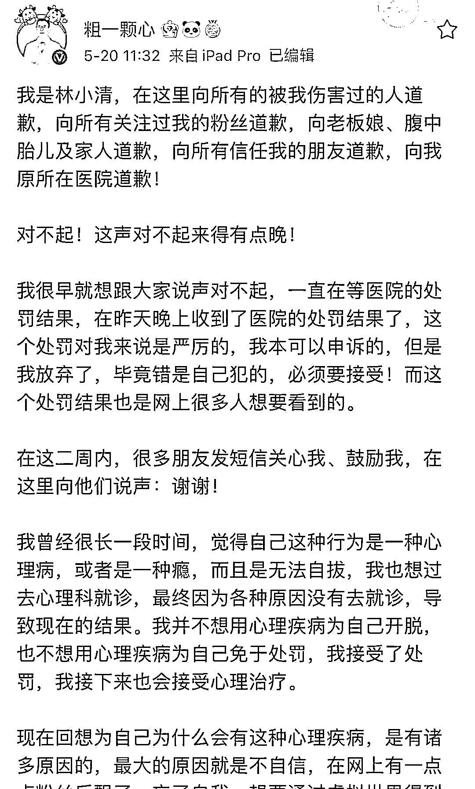
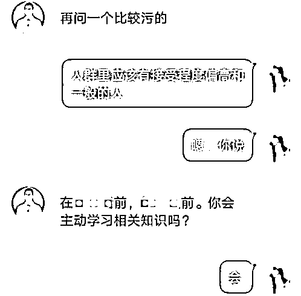
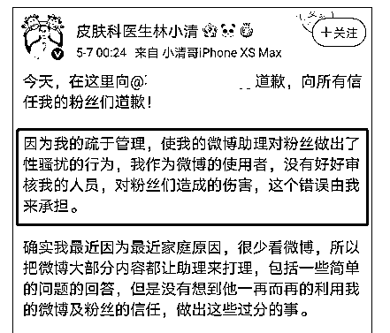

# 性骚扰还“甩锅”助理，医疗大 V 道歉！

> 原文：[`mp.weixin.qq.com/s?__biz=MzIyMDYwMTk0Mw==&mid=2247514494&idx=3&sn=63a29e0751c238ffe1fb017541c79259&chksm=97cb7246a0bcfb500f4a7a17f09b7f24548324e8336795c32b8295c2d76a435cbbb0a241d758&scene=27#wechat_redirect`](http://mp.weixin.qq.com/s?__biz=MzIyMDYwMTk0Mw==&mid=2247514494&idx=3&sn=63a29e0751c238ffe1fb017541c79259&chksm=97cb7246a0bcfb500f4a7a17f09b7f24548324e8336795c32b8295c2d76a435cbbb0a241d758&scene=27#wechat_redirect)

**做人，**

## 

**撒了第一个谎，**

**可能要用无数个谎来圆第一个谎。**

医疗大 V 被曝“深夜私信性骚扰”后于 5 月 20 日再次发声称，已收到医院处罚结果，并就性骚扰女粉丝及“甩锅”给助理的行为致歉。

微博截图

此前被指“深夜私信女粉丝进行性骚扰”的医疗大 V“皮肤科医生林小清”已更名为“粗一颗心”。5 月 20 日中午，该用户发微博致歉称，他是林小清，已于 5 月 19 日晚收到医院的处罚结果。

> “对不起！这声对不起来得有点晚！我很早就想跟大家说声对不起，一直在等医院的处罚结果，在昨天晚上收到了医院的处罚结果了，这个处罚对我来说是严厉的，我本可以申诉的，但是我放弃了”。

5 月 20 日中午，福建医科大学附属第一医院宣传部相关工作人员回应记者称，对于林小清被举报性骚扰一事，闽南医院已经有相关的处理意见，目前还在走流程，之后会通过官网发布。

林小清在前述微博中对自己微博私信女生进行性骚扰这一行为做出解释。他称：**“曾经很长一段时间，觉得自己这种行为是一种心理病，或者是一种瘾，也曾想过去心理科就诊，最终因为各种原因没有去，导致现在的结果。”**他表示，接下来他将会接受心理治疗。

此外，林小清在微博中承认自己在事发后 “甩锅”给助理。他解释称，当初“害怕造成不好的影响，反而弄巧成拙。”他在微博中承认助理是自己找的，而非医院配备的。**该助理只是帮他收集一些资料等，并没有帮他发微博内容。**

据此前报道，5 月 6 日晚，一网友自称当日凌晨遭到微博大 V“皮肤科医生林小清”的言语骚扰。**从聊天截图来看，“皮肤科医生林小清”聊天提问多为两性问题，内容露骨。**

5 月 7 日凌晨，“皮肤科医生林小清”发帖致歉称，因为疏于管理，使其微博助理对粉丝做出了性骚扰的行为。

前述举报者称，她不接受林小清的道歉。在曝光此事后，已经有超过六十名女生联系她，称曾受到林小清的言语骚扰。当日，泉州市卫健委、警方介入调查。

**世上有两样东西不可直视，**

**一是太阳、二是人心，**

**愿艳阳当空、医者仁心！**

来源：澎湃新闻、央视网

← 向右滑动与灰产圈互动交流 →

