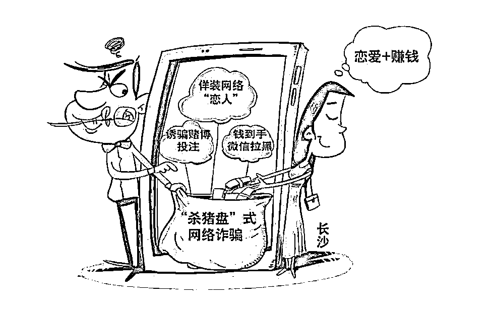

# 当心情人节变成情人“劫”！

> 原文：[`mp.weixin.qq.com/s?__biz=MzIyMDYwMTk0Mw==&mid=2247514494&idx=4&sn=5560dc013f4de441174f807a15eac0cd&chksm=97cb7246a0bcfb50bcb2840d88ecb3b3163b65d0e961d0235083018459dbd34b84f2c57e253f&scene=27#wechat_redirect`](http://mp.weixin.qq.com/s?__biz=MzIyMDYwMTk0Mw==&mid=2247514494&idx=4&sn=5560dc013f4de441174f807a15eac0cd&chksm=97cb7246a0bcfb50bcb2840d88ecb3b3163b65d0e961d0235083018459dbd34b84f2c57e253f&scene=27#wechat_redirect)

**今天的朋友圈**

**一点也不意外****各种秀 520 的恩爱****在这个节日里****诸位在座的单身汪们****也别急着在****网上找关爱****因为找到的可能****不是关爱**

**是诈骗**

**为****了防止钱被骗光****就安静的吃着瓜围个观就好****记得给亲人表达 520 哦~******有情人终成眷属哦~********

**杀猪盘**  生日红包  **失恋了好难过**

爷爷的茶叶没有卖出去  妈妈住院了

网恋  **带你投资** 家里欠了很多钱

高富帅在线征婚 内幕消息

可以向你借点钱救急吗

**你在网上遇到的那些“****真爱****”**

**很有可能只是把你当成****待宰的猪...**

**而对方与你的“****海誓山盟****”**

**只是在一个“****养肥****”的过程**

**一旦时机成熟**

**曾经的“爱情”就变成了“****杀猪****”的那把刀**

套路分析
       所谓“杀猪盘”，是指骗子将自己伪装成为帅气多金的成功男士或者美丽可爱的年轻女子，通过相亲网站、微信、探探、陌陌、抖音等方式与受害人结识，经过一番“爱心攻势”后按照诈骗话术假装和其陷入网络爱河，再透露自己掌握一些赌博平台、投资理财平台、彩票平台的获利方法，推荐受害人前去投资或投注。他们一开始会让受害人先尝到甜头，在受害人深信不疑加大投入后，平台制造各种借口提现失败甚至关闭跑路，受害人投进去的钱也打了水漂！

**       1、取得信任。**

骗子会在添加好友之后，频繁与你聊天，让你对其产生信任，有些骗子甚至会对你关怀备至，与你确定恋爱关系，让你对他（她）的信任更深。

**2、怂恿投****资。**

等到关系稳定，骗子便开始怂恿你在他（她）们自制的平台购买股票或者参与赌博，大多数人就会试着小额投入几笔，骗子会通过后台操作，让你小赚几笔。

**3、大量投入。**当你尝到甜头之后，骗子会声称自己已经掌握了这个股票 APP 的规律，只要跟着他（她）投资稳赚不赔。这时，你已经深信不疑，便往平台里面大量投入。

**4、无法提现。**

等到受害人投入大量金额之后，看到平台金额并未增加，准备将里面的金额提现，发现提不出来。

**5、销声匿迹。**

再想与对方交涉时，骗子已经消失得无影无踪。等到受害人恍然大悟，发现自己上当受骗后，钞票已经进入骗子的口袋了。

**除了“杀猪盘”诈骗之外，**

**以婚恋交友的名义实施诈骗的套路还有很多...**

婚恋网站诈骗

各大婚恋网站大都会在 520 等这类有特殊意义的日子中举办各种活动，不法分子往往也瞧准这个机会布下陷阱。在婚恋网站中编造虚假身份来引起受害者的兴趣。在网上对你进行了数周的追求后，往往会说有突发状况发生，让你转账汇款，亦或是其他各种理由骗取你的钱财。

**警方提示：**

本类诈骗受害者多为在婚恋网站注册会员的单身中年男女，有一定经济实力，社交简单，渴望通过网络择偶。警方提醒不要轻信网络征婚交友广告，在付出你的真心和钱财前，要通过多种途径尽量核实清楚对方的真实身份。

网购礼物诈骗

情侣们通常都会在 520 这天互赠礼物表达爱意，这又给不法分子提供了机会。当你在购物网站选中一个礼物提交订单后，会接到自称对方是网站客服的电话或信息，以订单出现异常为由要求办理退款，之后将提供带有木马程序的虚假银行网站，以此获取你的银行卡、身份证等信息，最终将卡里的钱转走。

**警方提示：**

一些对网购交易流程、网购保障方式不熟悉的消费者，极易上当受骗。遇到此类诈骗，一定要提高警惕，仔细查看对方提供的网址域名是否有出入，及时拨打官方客服咨询，鉴别网上银行、网购平台等网站的真伪。

广告邮件诈骗

临近 520 期间，你的邮箱里可能会收到很多以 520 为主题的广告邮件。一些不法分子也趁机给用户发送带木马病毒的广告邮件，用户一旦点击邮件中的链接，个人账户信息就可能被不法分子盗取。

**警方提示：**

查收邮件之前，不要随意点击，确定邮箱地址真实性。

社交工具诈骗

面对 520 期间情侣间的你侬我侬，一些单身人士难免心急，先要通过网络寻找艳遇。骗子们瞧准人们的这种心理，通过微信、陌陌等社交工具，对“附近的人”进行诈骗。有的骗子将微信头像换成美女头像，通过“寻找附近的人”的功能，添加附近的男性为好友。加好友后，再以各种理由骗取钱财。

**警方提示：**

不法分子通过“附近的人”功能，联系受害人，而后以各种理由要求受害人转账汇款，诈骗成功后即失去联系。受害人往往经受不住诱惑，落入对方设下的陷阱。大家要对社交工具上的暧昧信息保持警惕心理，以免被犯罪分子利用，遭受不法侵害。

**蜀黍提醒小伙伴们**

**网络交友要擦亮眼**

**自觉抵制不良诱惑**

**一起认清情感诈骗**

**戳破他们的面纱**

交友投资杀猪盘

防范意识走在前

婚恋交友需谨慎

别因感情蒙双眼

投资理财多陷阱

网络博彩都是骗

切莫贪图高回报

本金被骗全都完

来源：邯郸市反电信网络诈骗中心

← 向右滑动与灰产圈互动交流 →

