# 兼职刷单？小心被骗！有人赔上所有积蓄…背后牵出 2000 万诈骗大案→

> 原文：[`mp.weixin.qq.com/s?__biz=MzIyMDYwMTk0Mw==&mid=2247514494&idx=5&sn=a29bd38ef3cd697096ac017c839eb0bb&chksm=97cb7246a0bcfb503629e2a309aa762302683ccfff718935d2d086f279e06068d67741b543bf&scene=27#wechat_redirect`](http://mp.weixin.qq.com/s?__biz=MzIyMDYwMTk0Mw==&mid=2247514494&idx=5&sn=a29bd38ef3cd697096ac017c839eb0bb&chksm=97cb7246a0bcfb503629e2a309aa762302683ccfff718935d2d086f279e06068d67741b543bf&scene=27#wechat_redirect)

近年来，电信诈骗层出不穷，很多人深受其害，这其中也不乏求职者。在一些所谓网络兼职的背后，却隐含着诈骗分子设下的层层圈套。而更让人匪夷所思的是，一些实施诈骗的人，正是曾经的受害者。

**01**

**受害人变诈骗犯，网上兼职要小心**

[`mp.weixin.qq.com/mp/readtemplate?t=pages/video_player_tmpl&action=mpvideo&auto=0&vid=wxv_1876165229630259209`](https://mp.weixin.qq.com/mp/readtemplate?t=pages/video_player_tmpl&action=mpvideo&auto=0&vid=wxv_1876165229630259209)

△央视财经《经济半小时》栏目视频 

前不久，一条网络平台上的招工信息，引起了江苏省淮安市市民李先生的兴趣。工作很简单，就是在家里包装牙刷、塑料勺这些小东西就可以挣一点手工费。这个工作正好适合自己赋闲在家的妹妹。

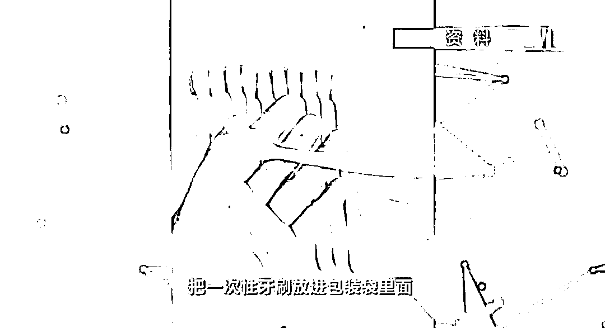

按照网上提供的联系方式，李先生和一名女子取得了联系，她要李先生交一笔 696 元的押金，然后她把手工活的原材料邮寄给李先生。2020 年 2 月 28 日中午 12 点多，李先生通过微信向对方转了 696 元押金。钱转出去没多久，李先生就发现对方联系不上了。

意识到受骗，李先生立刻到派出所报案，淮安市公安局清江浦分局民警根据李先生提供的支付账户，迅速锁定了一个名叫王某霞的嫌疑人。

2020 年 3 月 11 日，办案民警在淮安市郊区的一户农家，找到了骗走李先生钱的嫌疑人王某霞。王某霞对骗走李先生 696 元押金的事情供认不讳，并且承认，她实施诈骗的对象多达百余人。而且她认识多个在网上以招工为名，收取代理押金诈骗的人。

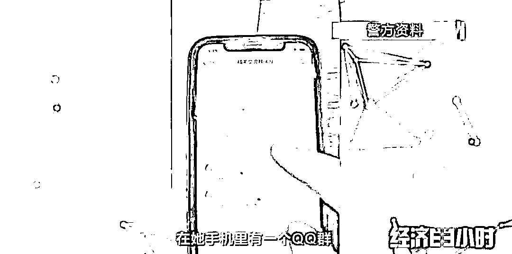

这些宝妈，绝大多数和王某霞一样，都是利用各种社交软件发布手工兼职招工广告，然后通过收取应征者的代理押金来获取不法利益。在完成初步取证后，2020 年 3 月 19 日，淮安市公安局清江浦分局抽调 100 余名警力，奔赴全国 16 个省市，对这个电信诈骗团伙展开集中收网。

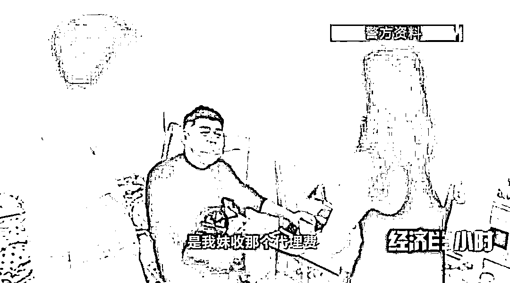

**在这次行动中，警方共抓捕 42 名涉嫌以招工为名实施电信诈骗的嫌疑人，其中大部分都是“宝妈”。不少嫌疑人，还是曾经的受害者。**

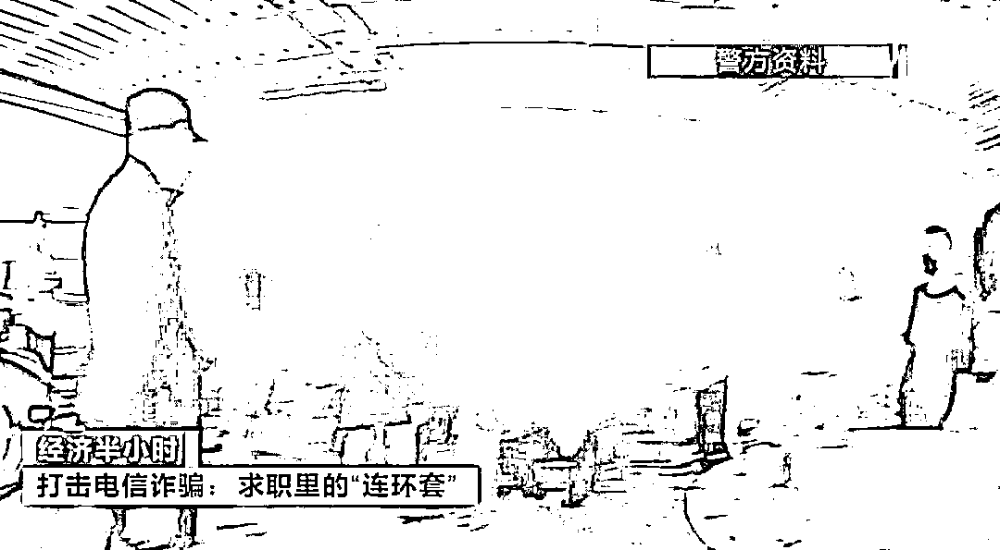

这些宝妈在交纳了押金之后，就领到了第一次任务。任务往往非常简单，就是做做小手工进行包装，比如安装圆珠笔芯，做好的手工活邮寄到指定地址后，她们就领到了第一笔劳务费。

随后，她们就接到了第二次任务，要求在一个月之内完成一幅一米左右的十字绣。但这一次的任务几乎不可能完成。

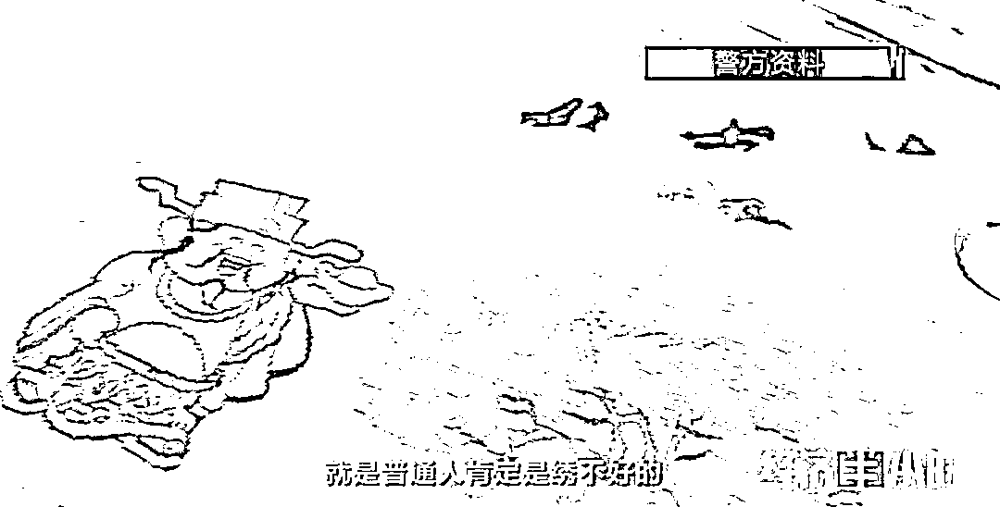

按照约定，没能在规定的时间内完成规定的工作任务，就拿不回之前交的代理押金。这个时候，就会有工作人员为这些宝妈指点新的财路。

受害人被洗脑后，一旦有意成为代理，这些人就会被拉进另一个群，由组长进行培训。**抱着挽回损失的想法，很多受害人转变成了拉人头骗钱的“推荐代理人”。**她们在社交媒体账号中广撒网，争取更多在家带娃的“宝妈”入局。

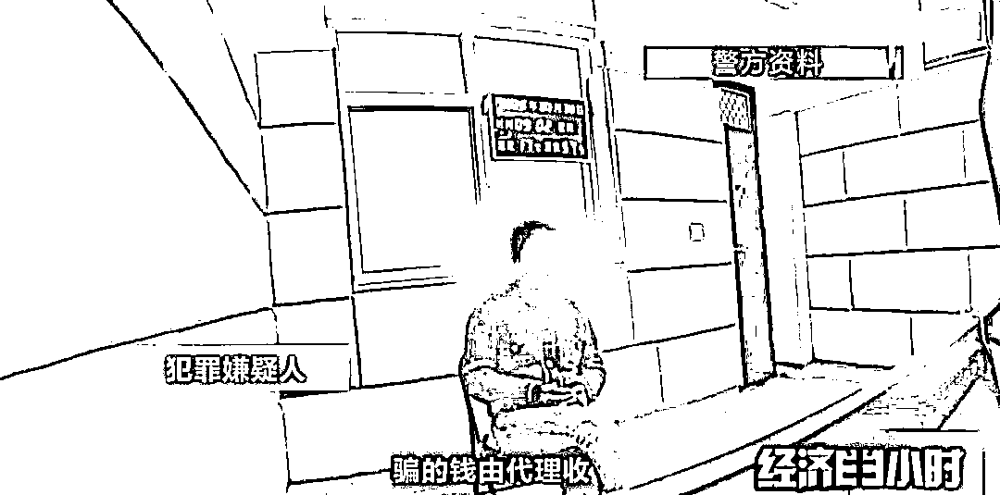

这些受害人的上线成某和古某在 2018 年左右，她们就遭遇过类似的电信诈骗陷阱，被嫌疑人发展成为代理后，发现非常赚钱，于是决定自己出来单干。而部分受害者都没发现这是一个陷阱。

如果有受害人觉得怀疑，提出退还代理押金时，嫌疑人就以拖字来应对。实在拖不下去就一“踢”了之。

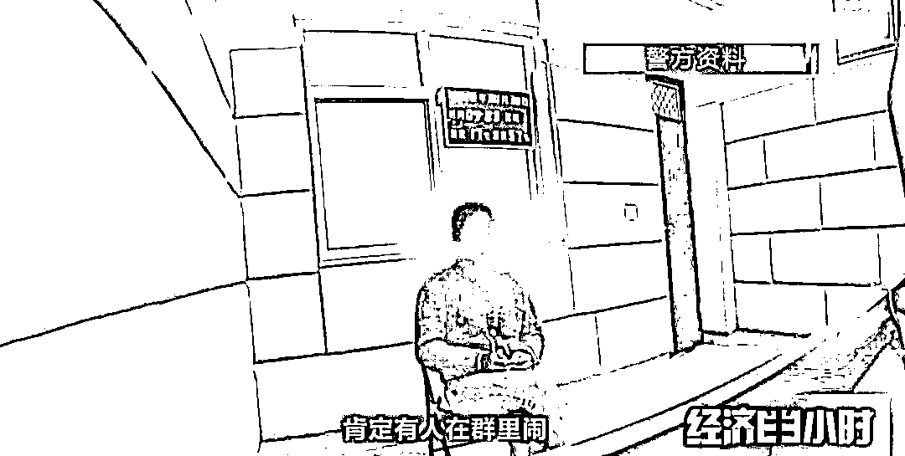

经查证，**全国陷入这场招工骗局的共有 8000 多人，涉案资金高达 500 多万元。**目前本案已经进入司法程序。

**02**

**想赚佣金却赔进 16 万，刷单赚钱都是骗局**

[`mp.weixin.qq.com/mp/readtemplate?t=pages/video_player_tmpl&action=mpvideo&auto=0&vid=wxv_1876165624163270658`](https://mp.weixin.qq.com/mp/readtemplate?t=pages/video_player_tmpl&action=mpvideo&auto=0&vid=wxv_1876165624163270658)

△央视财经《经济半小时》栏目视频 

河南汝阳的张女士 2019 年被网上的一则兼职刷单广告所吸引，就是电商付款，请人假冒顾客，通过虚构交易的方式提升网店的销量和排名，从而吸引更多的顾客光顾。

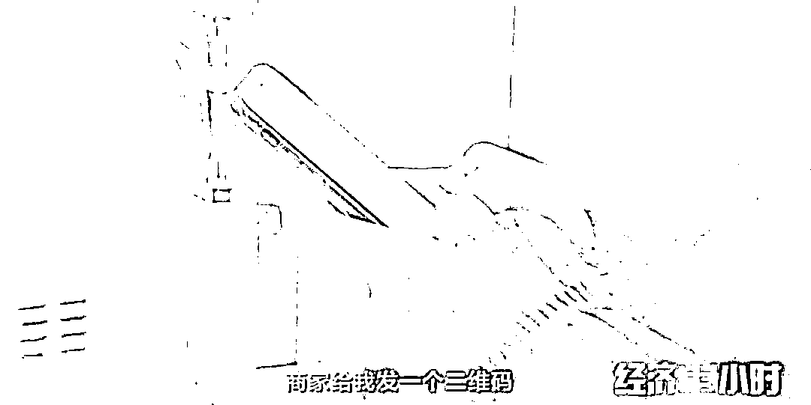

张女士觉得动动手指就能赚钱简直太轻松了，却没有想到，网络刷单是一种通过虚假宣传，伪造虚假销量，营造虚假信誉的违法行为。

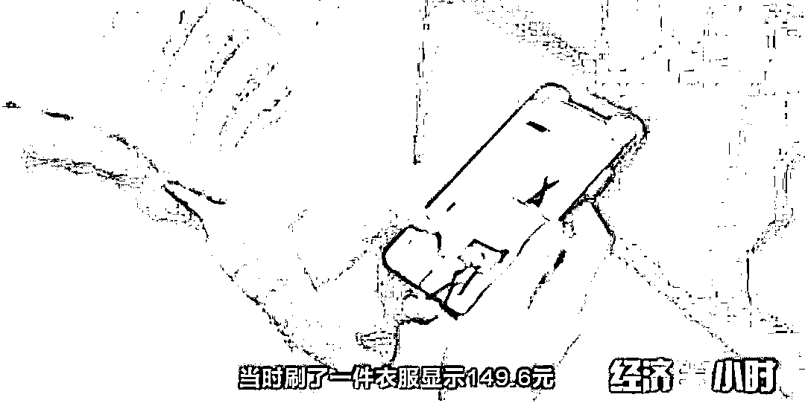

接下来，张女士又支付了 743 元，买了一个小电器，过了几分钟，60 多元佣金到账，这让张女士对刷单赚钱这件事深信不疑。

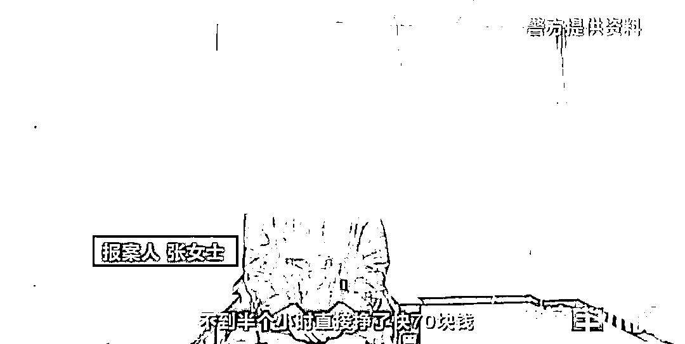

接下来，张女士不停刷单，手表、首饰…金额也越来越大，当刷到 5 万元钱的时候，张女士不想刷了，但是钱又没有返回来。客服说她第一单刷错了，必须再刷，才能把之前的钱返回来。就这样，张女士把家里的全部积蓄都打给了对方，但还是无法提现，这个时候张女士意识到，自己可能被骗了。而之后，客服就联系不上了。

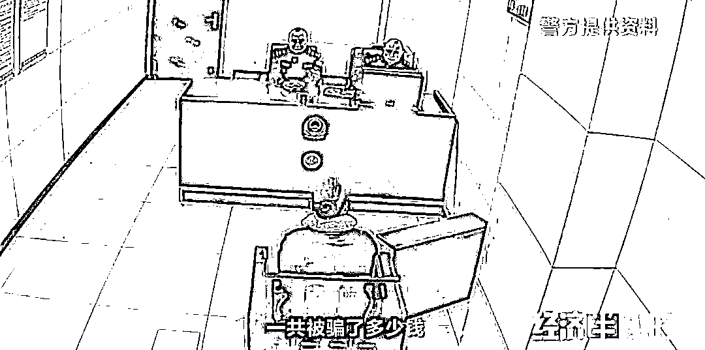

警方调查发现，这起案件跟以往的电信诈骗案相比，有共同之处，犯罪嫌疑人使用的网络名称都是虚构的。张女士的购物平台并不是正规的电商平台，是对方做的一个假链接。

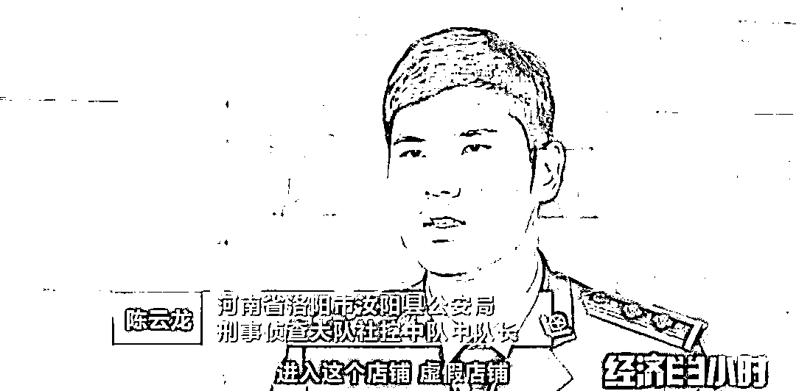

在这起案件中，嫌疑人曾给张女士返点转过钱，警方借此找到了突破口，查到涉案账户的银行卡对应的持有人姓冯，1955 年出生，河南汝阳当地人。但冯先生对三年前办的这张卡一点印象也没有了。

经过调查，警方发现老冯是在完全不知情的情况下，因为贪图小便宜，被坏人给利用了。与此同时另外一组侦查员发现，张女士的 16 万元在同一天内分 8 次打给了 6 个不同的账户，顺着资金流继续查下去，结果令人震惊。

涉案的银行卡虽然多，但是不管怎么转移，最终都汇集到了江西兴国县一个杨姓男子的身上。**通过对涉案的 600 多张银行卡进行串并之后，民警又串并出全国另外的 107 起电信诈骗案件，涉案资金高达 2000 多万，这些案件类型几乎包含了我们所熟知的诈骗手段。**

根据资金流向，侦察员也提取到了张女士那起案件的相关视频，经过比对，证实取钱的人正是杨某。杨某每次取走赃款，都会马上把钱又转存到了一个姓魏的男子户头上，经过魏某之手赃款流向了境外。

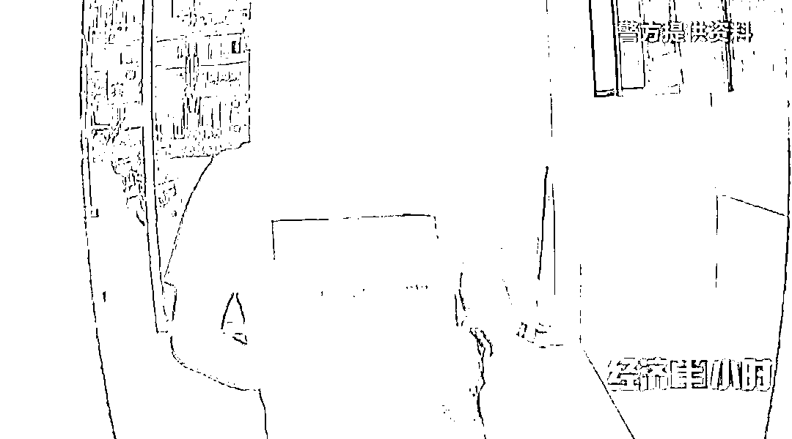

魏某交代，此前因为做过电商，积攒了一些人脉，借助这些所谓的人脉为整个团伙的资金流提供了洗钱的渠道和方法。受害者被骗走的钱，经过这些所谓电商的漂白，又经过杨某、魏某，最后汇总到了境外。目前此案正在进一步侦办中。

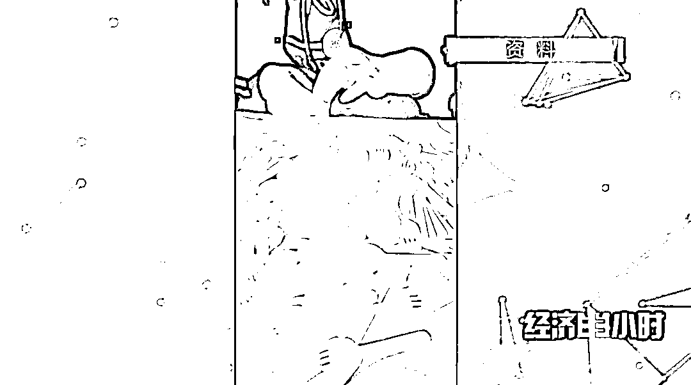

**网上兼职要当心**

近年来，电信诈骗犯罪发展势头迅猛，诈骗手段伴随通讯习惯、金融支付手段的改变不断翻新“进化”。一些不法分子在网络上以兼职的名义，吸引求职者加入，并要求其根据指示，参与一些违法的事。部分求职者涉世未深，因此上当受骗，甚至触犯了法律。

在这里我们要再次提示大家提高警惕，凡是兼职刷单刷信誉的，就是诈骗！在就业压力面前，一定擦亮眼睛，加强自身防范意识，尽量到正规的网站、人才中心、中介机构和政府举办的招聘会应聘，一旦发现被骗，要注意留下相关证据，并及时报警求助。

来源：央视财经

← 向右滑动与灰产圈互动交流 →

