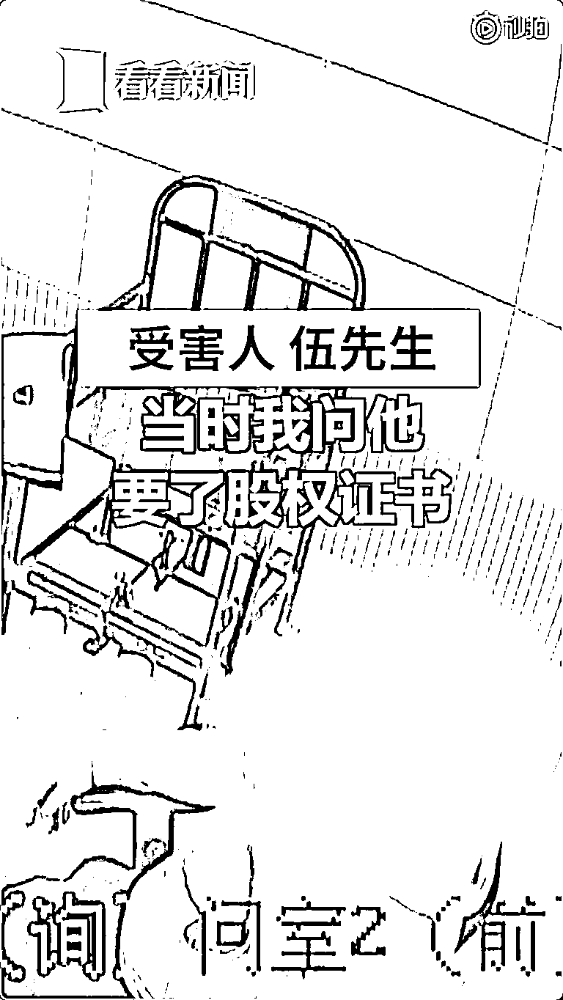
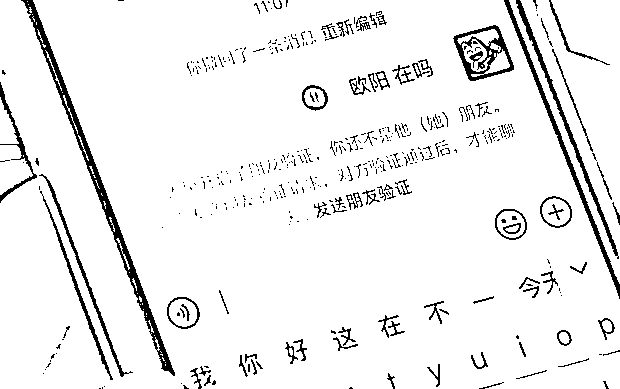
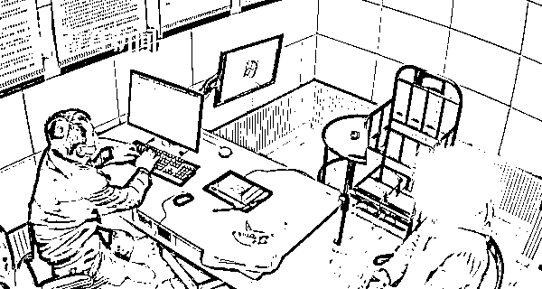
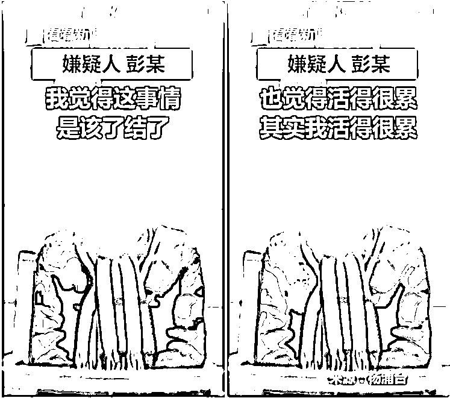
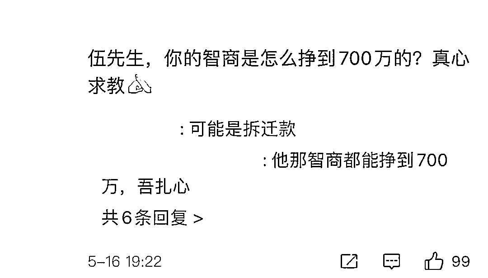

# 一老板 10 年被大妈骗了 700 万！大妈：其实我活得很累

> 原文：[`mp.weixin.qq.com/s?__biz=MzIyMDYwMTk0Mw==&mid=2247514494&idx=6&sn=1a9248548278208201f9e03ae64d6634&chksm=97cb7246a0bcfb50e4c7e1a58244f3bd4394517837c53ad9c68ab3172efb827307f4337f5b6f&scene=27#wechat_redirect`](http://mp.weixin.qq.com/s?__biz=MzIyMDYwMTk0Mw==&mid=2247514494&idx=6&sn=1a9248548278208201f9e03ae64d6634&chksm=97cb7246a0bcfb50e4c7e1a58244f3bd4394517837c53ad9c68ab3172efb827307f4337f5b6f&scene=27#wechat_redirect)

最近，市民伍先生

报警称自己这个老板

**竟被一个大妈骗了**

**被骗金额高达 700 万元**

**且这个骗局竟长达 10 年之久**

据伍先生介绍 2010 年，他自己建了一个股票交流 QQ 群群里都是自己认识的朋友，一天一位名叫欧阳曦敏的人主动加了进来，欧阳曦敏自称是某知名地产公司老总王九（化名）的老婆有机会可以介绍王九与伍先生认识。

2015 年，欧阳曦敏推了王九的微信给伍先生，伍先生和王九偶尔也在微信上聊几句。没过多久，王九就问伍先生，要不要买“万通地产”的原始股票？因为伍先生从网上新闻得知，王九和万通地产的老总关系很好，然后就相信了王九的推举。

伍先生说：“他（王九）提出给我 500 万原始股份，因为我当时一下子拿不出，生意很忙的，公司资金押进去几千万，流动资金只有 200 万，我说就买 200 万吧。200 万资金通过银行转账转给王九后，伍先生试图问王九要过股权证书，但一直被敷衍搪塞。”

虽然有怀疑但是考虑到自己挣钱确实辛苦靠着对原始股的憧憬伍先生选择了相信王九。

就这样，股权证书一拖就是两年 2017 年，王九又跟伍先生说他要帮助欧阳曦敏的公司上市这次，伍先生又转过去了 500 万因为他还是选择了相信。

转眼又是三四年到今年，也就是 2021 年的 1 月份伍先生发现，自己的微信已经被王九和欧阳曦敏删掉了直到此时，伍先生才意识到被骗。

警方接到报警后立即成立专案组，立案侦查很快将犯罪嫌疑人彭某抓获。

目前，犯罪嫌疑人彭某因涉嫌诈骗罪，已被警方依法刑事拘留，案件正在进一步审理中。

咦？

不是王九和欧阳曦敏夫妻俩吗？

怎么犯罪嫌疑人只有一个？

原来

**王九和欧阳曦敏**

**都是彭某自编自演的两个角色**

长达 10 年之久的骗局

彭某一直用两个微信号跟伍先生周旋

为了让伍先生相信

自己是王九的老婆

她还在网上找来王九的照片

把自己亲孙子的照片

当做是欧阳曦敏与王九生的儿子

虽然骗了伍先生 700 万

但彭某并不高兴自己不敢多花

也不敢给家人花

直到被抓，她才觉得释然

彭某设局骗人巨额钱财

是犯罪！

但不少网友觉得

伍先生也太容易轻信他人了 。

也有网友在猜测“王九”是谁？

反诈民警提醒：

网上交友要慎重，不要向网友透露自己的身份信息和财富，不要被对方的花言巧语与表面行为所迷惑。

眼见不一定为实，只要对方开始谈钱和投资，就要提高警惕，不要给陌生人转账!发现疑似骗局的苗头，立即止损!一旦被骗，保存好证据、聊天记录、转账凭证及时报警！

来源：红网、新闻坊、看看新闻网、上观新闻、网友评论

← 向右滑动与灰产圈互动交流 →

