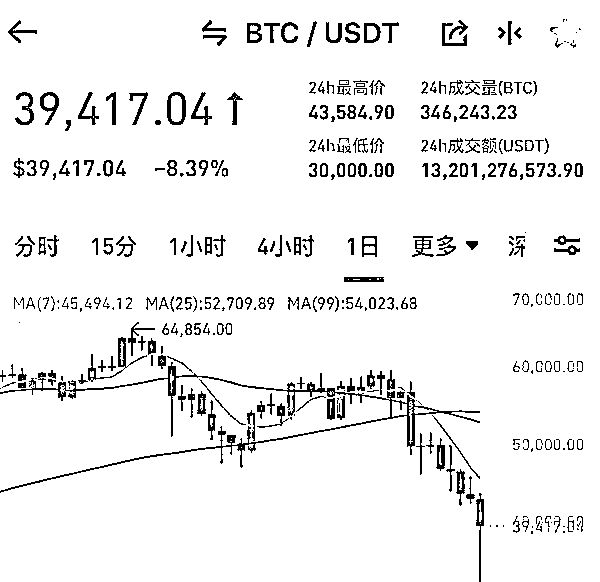
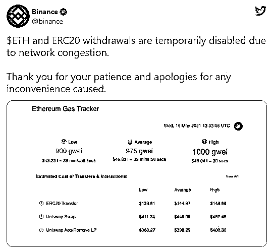
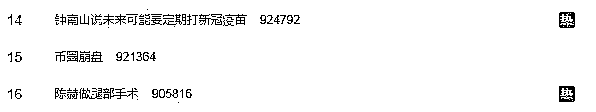

# 比特币、狗狗币暴跌、抹茶 MXC 交易所崩盘、币安拔网线

> 原文：[`mp.weixin.qq.com/s?__biz=MzIyMDYwMTk0Mw==&mid=2247514550&idx=3&sn=cecd7b0ca8150162b1fd8f3254720b07&chksm=97cb728ea0bcfb985d3abe956b993d3f713566a9e6c636dac1c5ed6efbcfb485610fc8a6f2f0&scene=27#wechat_redirect`](http://mp.weixin.qq.com/s?__biz=MzIyMDYwMTk0Mw==&mid=2247514550&idx=3&sn=cecd7b0ca8150162b1fd8f3254720b07&chksm=97cb728ea0bcfb985d3abe956b993d3f713566a9e6c636dac1c5ed6efbcfb485610fc8a6f2f0&scene=27#wechat_redirect)

1、比特币、狗狗币：加密货币市场腥风血雨 57 万人爆仓 443 亿。5 月 19 日晚上虚拟货币延续暴跌。当晚，比特币一度跌破 31000 美元，24 小时内跌幅达 30%，创今年 1 月底以来新低，并跌破 200 日均线；以太坊跌破 2000 美元大关，跌超 40%；狗狗币失守 0.3 美元/枚，日内跌超 40%。

不过，之后加密货币市场反攻，跌幅缩小，截至发稿，比特币价格反弹至 3.9 万美元左右，24 小时跌幅缩小至 8%；以太坊价格为 2640 美元，跌幅缩小到 22%；狗狗币也重回 0.3 美元之上。虽然加密货币市场有所反弹，但爆仓数据依然惊人！

2、“比特儿交易所”：这个交易所就是前段时间报道说改名“芝麻开门”，【坑掉了用户价值 15 万狗狗币】的交易所。

据用户爆料，他在 2014 年间买了 100 万个瑞波币，以及一些其他的小币种放在比特儿的账户里。谁知近日重新登录比特儿（芝麻开门）的账户却发现账户内部一无所有，不光 100 万个瑞波币，就连一些其他的币也都被黑掉了，资产全部被清零。

同样的手法，同样的套路，当初 15 万的狗狗币是这样，如今百万的瑞波币也是这样，难道这是一个正常的交易所该有的格局吗？

3、特斯拉 CEO 马斯克在个人社交媒体账号上发布了“特斯拉有钻石手（Diamond Hand）”的消息。按通常的意思，有“钻石手”的意思是不畏市场波动，持有仓位直到目标。市场观点将其解读为特斯拉不会抛售手中已有的比特币。

4、币安、Coinbase:因为数字货币暴跌，交易所一度“拔网线”。美国最大的数字加密货币交易所 Coinbase19 日出现宕机。

“币安”（Binance）19 日上午也宣布，将暂停一些加密数字货币提现。 

全球最大的加密货币交易所币安以网络拥堵为由暂时禁止以太币提取。

币安网发布通告称，已暂停 BTCUP、BTCDOWN、ETHUP、ETHDOWN、BNBUP、BNBDOWN 之外的所有杠杆代币的交易，并暂停所有杠杆代币的申购和赎回功能。交易、申购和赎回恢复时间将另行通知。

5、“币圈崩盘”排名微博热搜榜第 15 位，最近一段时间，币圈暴涨暴跌，在全球主要媒体都开始不断的上热搜，引起了广泛的关注与讨论，随之而来的便是监管的进一步加强，因此每一次炒作之后都是一地鸡毛！

6、抹茶 MXC 交易所：这个交易所就是一个靠传/销起家的小公司，后期不断上线空气币收割韭菜，已经被很多自媒体曝光！抓紧从这个交易所提币，否则你就是下一个被收割的对象！

5 月 19 日，据抹茶 MXC 交易所 APP 显示，该交易所已暂时关闭 OTC 业务，目前其 OTC 板块显示“暂时没有广告”，用户无法在该平台进行法币交易业务。

（本文内容仅供参考，不构投资建议，如有侵权，联系删除）

来源：币圈速闻

← 向右滑动与灰产圈互动交流 →

