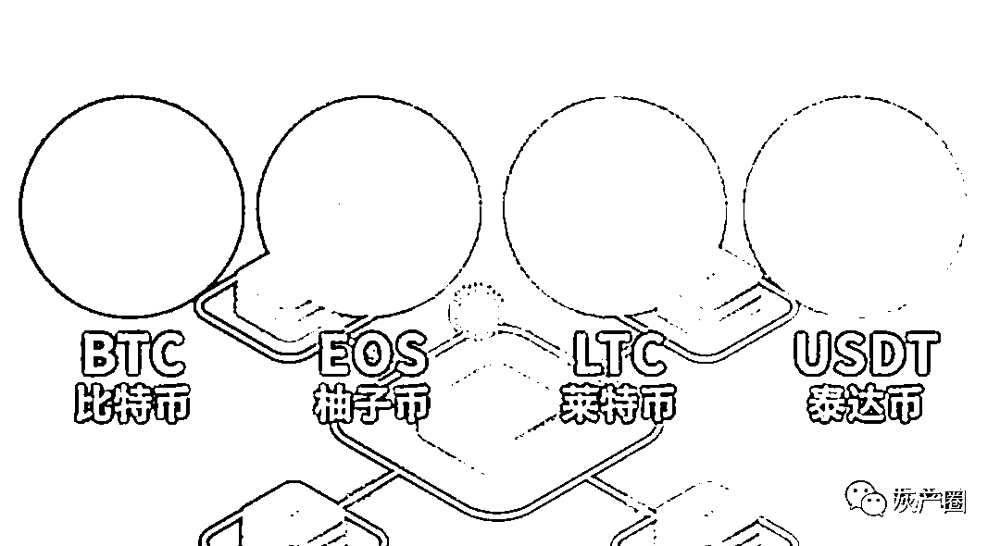
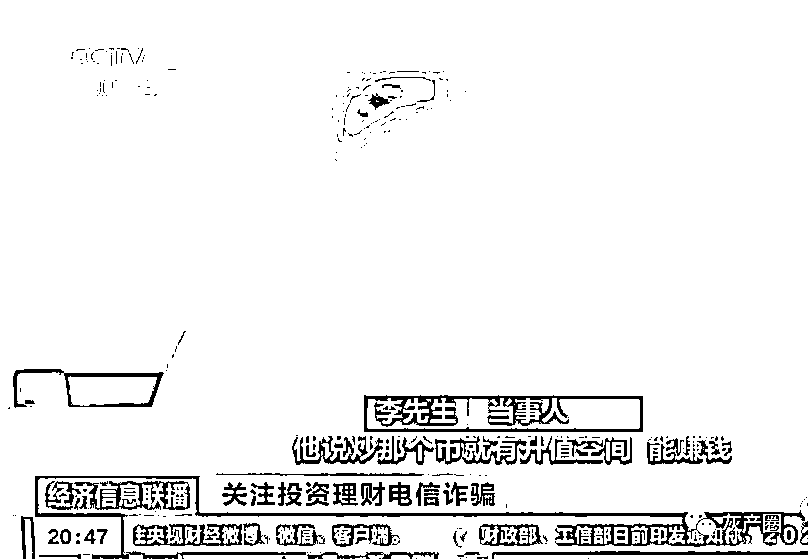
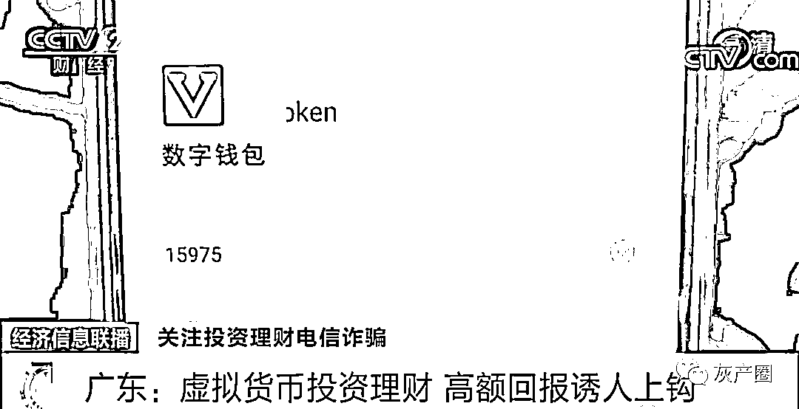
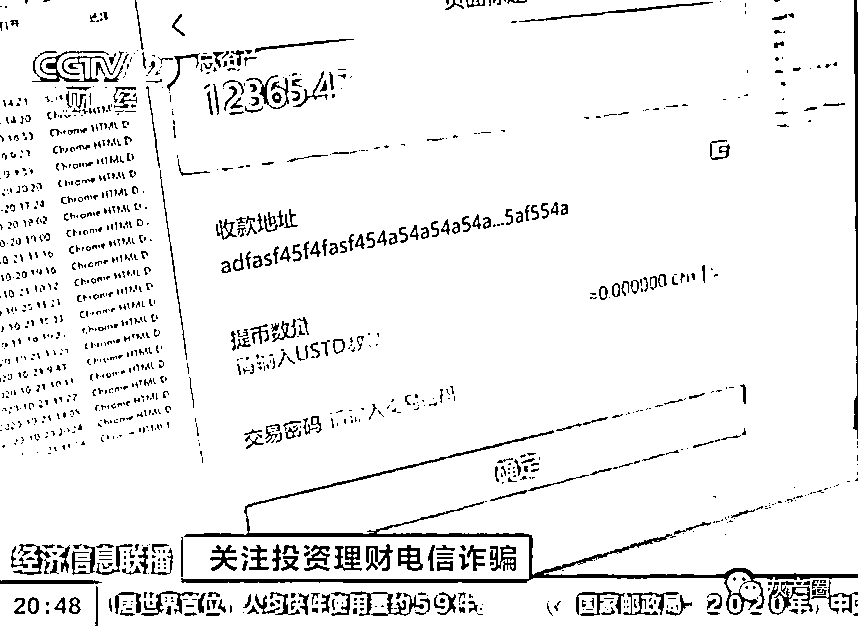
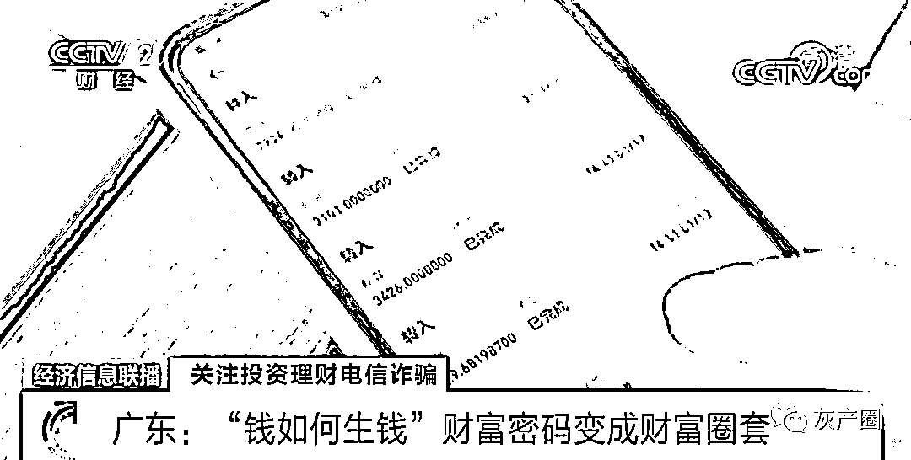
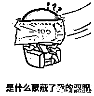
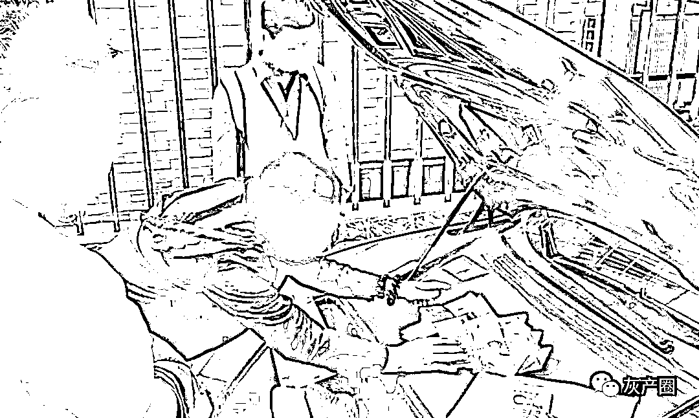
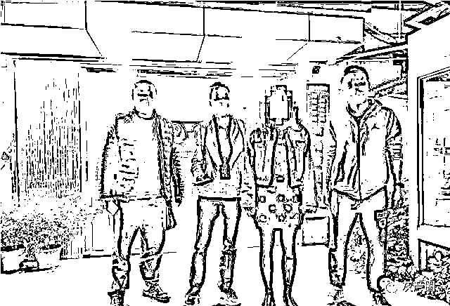

# “财富密码”突然出现？都是虚拟货币诈骗圈套！

> 原文：[`mp.weixin.qq.com/s?__biz=MzIyMDYwMTk0Mw==&mid=2247514550&idx=4&sn=c7366a9fea9aee8a67391568e3f6bbf2&chksm=97cb728ea0bcfb98474b8649841f67c9c359169d2a9480c8e0107d67ec6a22141c383395abc1&scene=27#wechat_redirect`](http://mp.weixin.qq.com/s?__biz=MzIyMDYwMTk0Mw==&mid=2247514550&idx=4&sn=c7366a9fea9aee8a67391568e3f6bbf2&chksm=97cb728ea0bcfb98474b8649841f67c9c359169d2a9480c8e0107d67ec6a22141c383395abc1&scene=27#wechat_redirect)

近年来

随着网络技术的发展

多种虚拟货币日益火热

成为投资者的宠儿

然而，不少诈骗团伙也盯上了虚拟货币

以此为噱头设下圈套

本以为自己掌握了“财富密码”

怎料落入了“财富圈套”

戳视频看看近期央视曝光的

一些炒币者的被骗遭遇

据报道

广州的李先生听堂哥说

炒币能赚钱

并推荐了一位做代理的朋友给他

代理说自己投了十万元

一个月就回本

每三天能提现一万元

听到如此高额的回报

李先生心动了

在代理的指导下

李先生在虚拟货币交易网站上买了

三万多元的虚拟货币进行投资

代理告诉李先生想要快速获利

还要把购买的虚拟货币

充值到指定的“数字钱包”

但事实上

这个“数字钱包”是假的

李先生刚把虚拟货币充进去

诈骗分子就窃取了李先生的虚拟货币密钥

并将虚拟货币转走

而软件上并未显示异常

为了骗取更多的钱

诈骗团伙还引诱李先生将虚拟货币

从电子钱包转到另一个投资平台上

声称这样一笔钱就可以反复获利

以此诱骗李先生买入更多虚拟货币

五天后，李先生突然发现

电子钱包和投资平台打不开了

所有的投入通通没了

4 月 22 日

广东警方成功打掉了这个诈骗团伙

肃清了整个犯罪链条

投资有风险

当有人自诩“投资高手”

还告诉你投资虚拟货币

“风险低、高回报”时

一定要提高警惕

去年 12 月

广州的黄先生就被一位“投资高手”

骗了近 500 万元

起初，黄先生接到一个

自称是某证券公司经理的电话

在对方的推荐下

加入了一个投资数字货币的微信群

几天后，黄先生经群友介绍

在某平台直播间认识了“投资高手”姜老师

姜老师自称有丰富的投资经验

是国外一家数字货币投资公司的核心成员

目前该公司正推出一款数字货币

投资风险低，年回报高达 10 倍

接着，“粉丝”们陆续晒出

近期投资数字货币获利的截图

不断印证投资数字货币的真实性

使黄先生深信不疑

黄先生按照姜老师的指引

安装了某交易平台

开始充值购买数字货币

2021 年 1 月 12 日至 21 日期间

黄先生共转账 22 笔资金到

对方指定的多个银行账号

合计近 500 万元

1 月 22 日，黄先生发现该平台已关闭

相关微信交流群全部被解散

其微信和手机号也被对方拉黑

于是，黄先生报警了

广州海珠警方分别于 1 月 23 日、25 日在广州、佛山两地抓获谢某等 7 人，查扣银行卡、手机等涉案物品一批。随后，警方于 2 月 4 日在海珠区抓获团伙主要成员陈某、黄某，并在陈某车辆中查获大量现金。

目前，警方已依法对涉嫌帮助信息网络犯罪活动罪的陈某等 9 名犯罪嫌疑人执行逮捕。案件正在进一步侦办中。

本案的作案手法是这样的，首先，诈骗分子以投资数字货币可获巨额收益为诱饵，诱导事主在非法搭建的“假平台”进行投资，并转账到“洗钱”团伙的银行账户。

“洗钱”团伙取得事主转来的资金后，便会在“真平台”购买等额数量的“虚拟币”，并将“虚拟币”转至诈骗分子预设的账号中，抽取资金总额的 0.25%至 0.6%作为提成牟利，以此达到为电信诈骗提供资金转账，隐藏不法资金流向，逃避公安机关打击的目的。

警方抓获团伙主要成员黄某（右二）

厅哥在此提醒

大家要警惕不法分子

打着投资虚拟货币、数字货币的幌子

实施的诈骗或非法传销活动犯罪

常见套路是什么呢？

大众应当如何防范？

戳以下视频了解

↓↓↓

警方提醒

虚拟货币交易不受我国法律保护。虚拟货币交易平台大多使用境外服务器，交易操控机构真实情况不明，极易被不法分子利用投资虚拟货币的名义实施诈骗。

投资者应通过正规合法的平台进行投资交易，不安装来历不明的网络投资理财 APP，不点击陌生链接，谨防不法分子打着“虚拟货币投资低风险、高回报”的幌子实施诈骗。如发现被骗，要及时向公安机关报警。

来源：央视新闻、公安部网安局、平安广州

← 向右滑动与灰产圈互动交流 →

