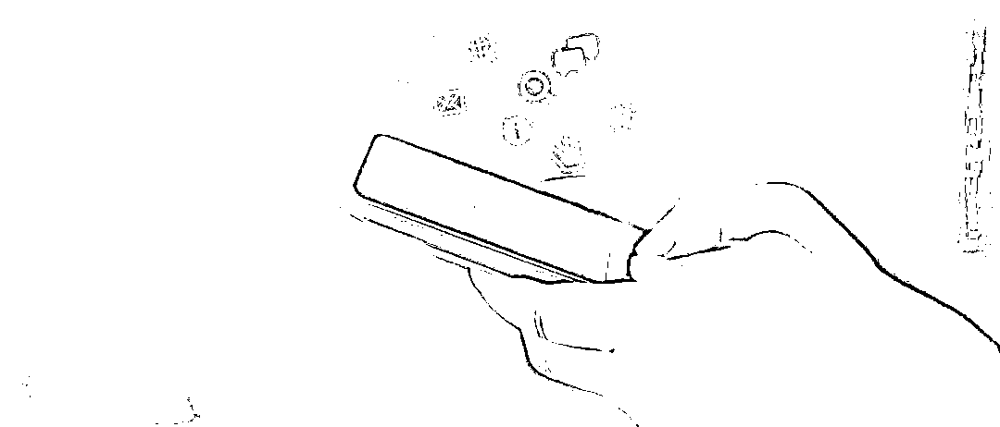
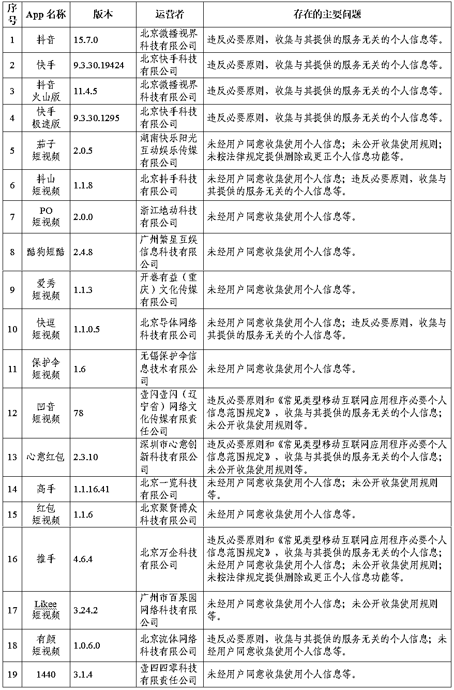
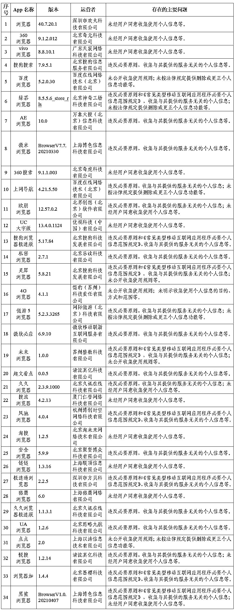
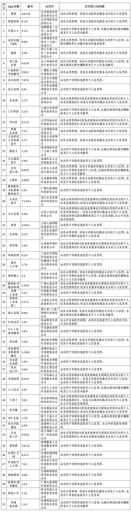
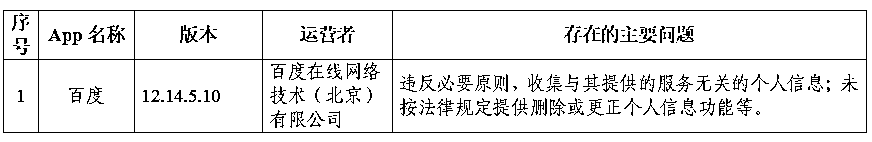

# 抖音等 105 款 App 被通报！

> 原文：[`mp.weixin.qq.com/s?__biz=MzIyMDYwMTk0Mw==&mid=2247514550&idx=5&sn=8ec3b26a5e57eabb7cb80a6956789da3&chksm=97cb728ea0bcfb98facc955b439f60c3b9448ca899d7422fcf3b18b0cf4d6111ae99ef26ac27&scene=27#wechat_redirect`](http://mp.weixin.qq.com/s?__biz=MzIyMDYwMTk0Mw==&mid=2247514550&idx=5&sn=8ec3b26a5e57eabb7cb80a6956789da3&chksm=97cb728ea0bcfb98facc955b439f60c3b9448ca899d7422fcf3b18b0cf4d6111ae99ef26ac27&scene=27#wechat_redirect)

## 

近期，针对人民群众反映强烈的 App 非法获取、超范围收集、过度索权等侵害个人信息的现象，国家互联网信息办公室依据《中华人民共和国网络安全法》《App 违法违规收集使用个人信息行为认定方法》《常见类型移动互联网应用程序必要个人信息范围规定》等法律和有关规定，组织对短视频、浏览器、求职招聘等常见类型公众大量使用的部分 App 的个人信息收集使用情况进行了检测。现将有关情况通报如下：

一、短视频类 App 情况

****

二、浏览器类 App 情况

三、求职招聘类 App 情况

四、实用工具类 App 情况

国家互联网信息办公室要求，针对检测发现的问题，相关 App 运营者应当于通报发布之日起 15 个工作日内完成整改，逾期未完成整改的将依法予以处置。

来源：国家网信办网站

← 向右滑动与灰产圈互动交流 →

