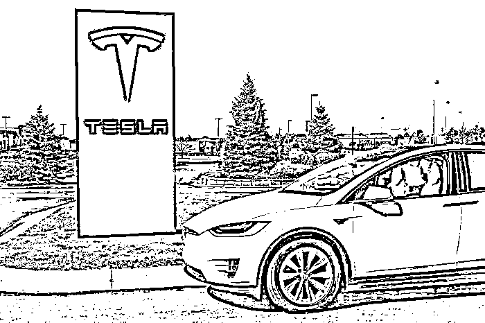
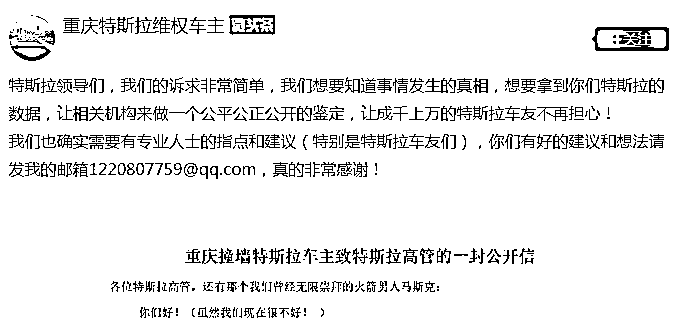
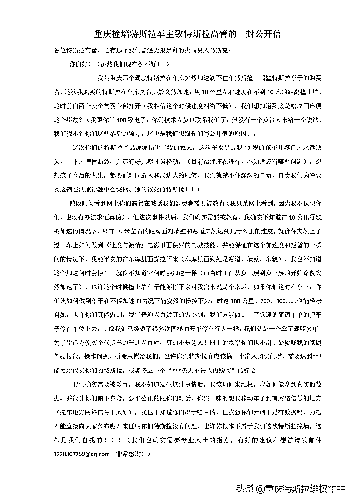

# “是交通工具还是杀人工具”？特斯拉又遭维权

> 原文：[`mp.weixin.qq.com/s?__biz=MzIyMDYwMTk0Mw==&mid=2247514550&idx=6&sn=2a1a32a3e513b2f1da72b8f8e34e43a8&chksm=97cb728ea0bcfb9854f97fe064f03331955bae7034cfd6c2cc75f603cfc317122d1a465c1627&scene=27#wechat_redirect`](http://mp.weixin.qq.com/s?__biz=MzIyMDYwMTk0Mw==&mid=2247514550&idx=6&sn=2a1a32a3e513b2f1da72b8f8e34e43a8&chksm=97cb728ea0bcfb9854f97fe064f03331955bae7034cfd6c2cc75f603cfc317122d1a465c1627&scene=27#wechat_redirect)

近日，特斯拉再遭遇维权事件。

5 月 20 日晚间，一个名为“重庆特斯拉维权车主”头条号发布了一条《重庆撞墙特斯拉车主致特斯拉高管的一封公开信》。

该维权车主在公开信中表示，“我是重庆驾驶特斯拉在车库突然加速刹不住车然后撞上墙壁特斯拉车子的购买者，**这次我购买的特斯拉在车库莫名其妙突然加速，从 10 公里左右速度在不到 10 米的距离撞上墙**，这时前面两个安全气囊全部打开（我相信这个时候速度相当不低），我们想知道到底是啥原因出现这个事故？我跟你们 400 致电了，你们技术人员也联系我们了，但没有一个负责人来给一个说法，我们找不到你们这些幕后的领导，这也是我们想跟你们写公开信的原因。”

重庆特斯拉车主称

停车时自动加速撞墙

据上游新闻报道，5 月 18 日，重庆，张女士驾驶特斯拉在车库内撞墙，致儿子牙槽骨被撞裂。她称，车辆在低速情况下突然加速，踩刹车毫无反应。车头受损严重，前排安全气囊已弹出，附近有不少血迹。

据封面新闻，张女士的丈夫蓝先生称：“在车库的行驶速度能有多快？时速最多 10 公里左右。”从行车记录仪可以看到，车辆行驶到事发路段时，特斯拉有明显提速，并且踩了刹车后没有反应，直至撞墙车才停下。

根据车库物管提供的事发监控画面显示，车辆是在行至下坡路段时突然加速，并且在撞墙以前刹车灯亮起。此外，事发时车库内地面干燥，也无降雨情况，因此，也不存在路面打滑的情况。

张女士表示，自己有 10 年驾龄，车是今年 2 月新买的。特斯拉售后回应称将积极协助处理后续事宜。

**事故造成蓝先生、张女士的儿子上下牙槽骨裂，掉了四颗门牙，七八颗牙齿松动，另外一个孩子也受了伤。**

“特斯拉究竟是交通工具还是杀人工具？（特斯拉）一定要给我个明明白白的解释，每辆车背后都是一个家庭啊。”蓝先生表示说。

没出事前，蓝先生一家人对特斯拉还是挺满意的，“我本人也算是马斯克的‘粉丝’，觉得他是个很了不起的人物，买过他很多传记和小说，还总给儿子讲他的事迹。”

特斯拉回应

5 月 20 日晚，蓝先生、张女士发布了《重庆撞墙特斯拉车主致特斯拉高管的一封公开信》，信中称遭遇网络水军质疑张女士的操作技能，怀疑事故发生的原因是操作失误。

蓝先生、张女士在信中表示：“我们的诉求非常简单，我们想要知道事情发生的真相，想要拿到你们特斯拉的数据，让相关机构来做一个公平公正公开的鉴定，让成千上万的特斯拉车友不再担心。”

信中还提到特斯拉对外事务副总裁陶琳曾称“消费者需要被教育”，他愤慨道**“我们的确需要被教育，发生这件事后该如何维权，该如何拿到真实数据”**。车主呼吁特斯拉，希望特斯拉能够“教育”下消费者车辆为何突然加速、为何刹车踩不住？

据上游新闻，5 月 20 日，特斯拉工作人员回应称，“5 月 18 日晚我们了解到该事故信息后第一时间抵达现场，主动配合相关调查，与车主积极沟通并高度关切小朋友的情况。”

特斯拉工作人员称：**“目前车主暂未接受车辆检测，我们还将继续与车主沟通，并提供相关协助，帮助车主尽快恢复正常用车生活。”**

一周前杭州车主曾遇相似问题

值得注意的是，5 月 13 日，杭州一位特斯拉车主在小区车库里也遇到了和上述重庆车主相似的问题。

据钱江晚报·小时新闻报道，5 月 13 日晚上 23 点 28 分，罗女士加班结束后，驾车回到小区车库，先是经过一个下坡，左转一小段路，再经过一个长长的直行道，在本该右转的通道口，罗女士突然发现刹车怎么踩也踩不下去了，她很慌张，又不敢猛打方向盘，只能任由车子撞到墙壁上了。

“当时我很用力地踩刹车，踩到底了，有制动的感觉，但是明显就是刹不住了。其实我的车速是不快的。”撞车后，罗女士第一时间联系了保险公司、特斯拉售后，并调取了监控录像，留存了刹车痕迹等证据。从事故照片可以看出，车子的前保险杠有破损，车库墙壁也被撞掉了一块墙皮。

罗女士的特斯拉订购于 2020 年 4 月，6 月提车。近一年的时间里，车一直由她本人开着，日常上下班和接送孩子，体验一直还不错，对车也非常熟悉。

罗女士说，当时打电话给特斯拉售后，对方回复是：“**后台数据显示刹车没有失灵，可能是因为路面湿滑，且车速过快。”**但罗女士并不认可，她说，虽然前一天晚上下雨，车库地面是有些湿漉，但是她的车速不快，而且从车库入口到撞车经过了长时间的缓冲，地面湿滑不应当成为它刹不住的理由。而且从撞击力道来看，也可以说明车速不快。

据中国乘用车市场信息联合会公布中国市场汽车销量显示，2021 年前 4 个月，特斯拉累计销量达 95,125 辆，其中 4 月销量为 25,845 辆，与 3 月销量相比下降 27%。

除了在华销量下滑、品牌陷入危机外，特斯拉在资本市场也遇到了一些“小麻烦”。自今年 1 月末以来，**特斯拉公司市值已经蒸发近 3000 亿美元。** 

不过北京时间 5 月 20 日夜，科技股大反弹，苹果、特斯拉市值一共涨了 4200 亿。 

消息面上，美东时间周四，加州空气资源委员会推出美国首个共享出行服务行业的监管规则。据相关规则的要求，类似优步（Uber）和 Lyft 等公司到 2030 年需要实现 90%的车辆为电动汽车。

此外，由于特斯拉持有大量比特币，比特币价格的反弹也带动了特斯拉股价的反弹。截至北京时间今晨 6 点 50 左右，过去 24 小时内，比特币价格涨幅超 7%。马斯克周四表示，自己没卖比特币也没卖狗狗币，还表示对可再生能源进行审计可能解决比特币能耗过高的担忧。

特斯拉美国上调三款车售价

北京时间 5 月 21 日下午消息，特斯拉美国官网显示，特斯拉 Model 3 标准续航升级版起售价为 3.999 万美元，此前为 3.949 万美元，上调 0.05 万美元。特斯拉 Model 3 长续航版起售价为 4.899 万美元，此前为 4.849 万美元，上调 0.05 万美元。特斯拉 Model Y 长续航版起售价为 5.199 万美元，此前为 5.149 万美元，上调 0.05 万美元。

来源：21Tech、每日经济新闻、上游新闻、封面新闻、钱江晚报、新浪科技、中国基金报等

← 向右滑动与灰产圈互动交流 →

