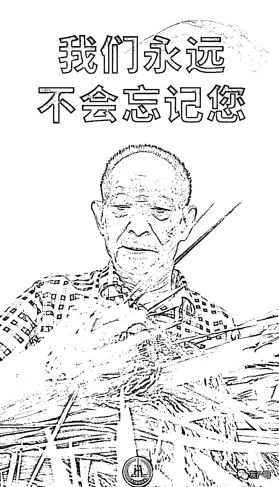

# “袁爷爷，一路走好！”

> 原文：[`mp.weixin.qq.com/s?__biz=MzIyMDYwMTk0Mw==&mid=2247514579&idx=1&sn=a6248ce7338ce63ad48ad42d4384c3ed&chksm=97cb72eba0bcfbfd8245f255854b0e5f92fce10f3c6247458d81ace1924d394ef4c78c8308d1&scene=27#wechat_redirect`](http://mp.weixin.qq.com/s?__biz=MzIyMDYwMTk0Mw==&mid=2247514579&idx=1&sn=a6248ce7338ce63ad48ad42d4384c3ed&chksm=97cb72eba0bcfbfd8245f255854b0e5f92fce10f3c6247458d81ace1924d394ef4c78c8308d1&scene=27#wechat_redirect)

**下午，雷从天边滚来
轰隆隆轰隆隆
炸在苍穹四野
巨星陨落
雷用敏感颤抖的手，敲响祭奠的大鼓
乌云从西边蔓延
遮天蔽日，一派肃穆
听说有些天空的云变成了稻状
如果真有什么神灵
一定是冥冥之中，上天自有安排

古有神农氏
现有袁隆平
一个让全世界十分之一人口远离饥饿的英雄
突然离开了我们
咋能忘怀

大风在屋外嚎哭
鸣鸣，鸣鸣地呜咽
树在摇晃，田野在摇晃
五月的鲜花绿草，丰满的大地
一齐在风雨中默哀

国之大器，一路走好！**