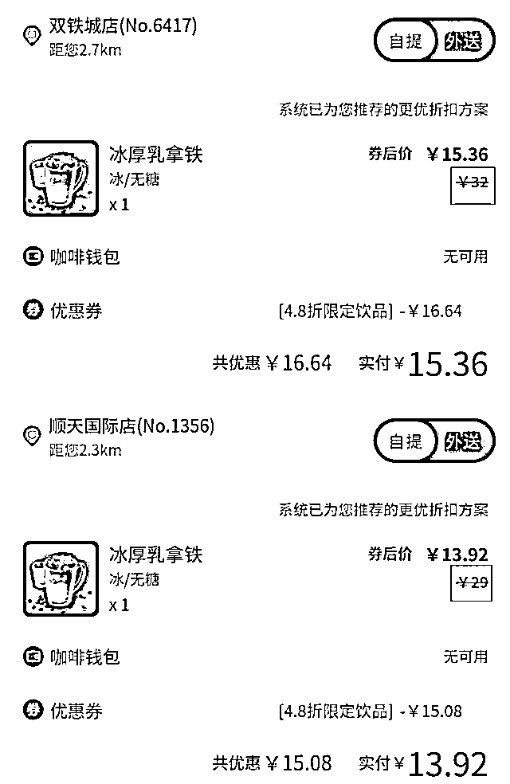
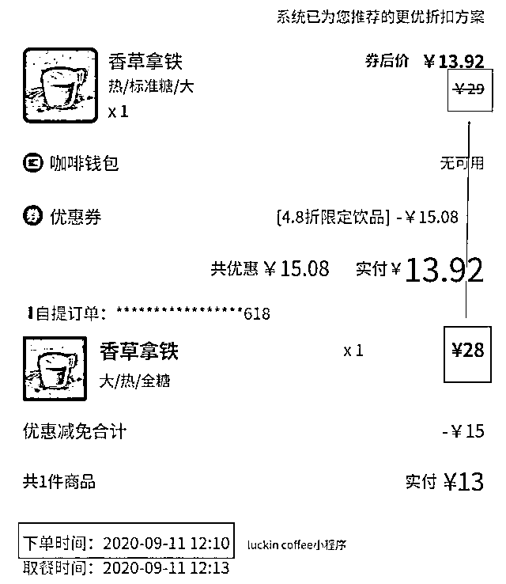

# 瑞幸咖啡定价有问题：同一饮品换个店价格就变了，自提外送也有价差

> 原文：[`mp.weixin.qq.com/s?__biz=MzIyMDYwMTk0Mw==&mid=2247514579&idx=4&sn=46f9f6e493838f98727e8eb926b7102b&chksm=97cb72eba0bcfbfdebf7064c7a430417ce4f590166c5918512e708934224d54449e740f140c8&scene=27#wechat_redirect`](http://mp.weixin.qq.com/s?__biz=MzIyMDYwMTk0Mw==&mid=2247514579&idx=4&sn=46f9f6e493838f98727e8eb926b7102b&chksm=97cb72eba0bcfbfdebf7064c7a430417ce4f590166c5918512e708934224d54449e740f140c8&scene=27#wechat_redirect)

近期，有媒体报道称，部分消费者在瑞幸咖啡购买同款饮料，"自提"与"外送"价格不同。5 月 21 日，记者走访长沙部分瑞幸门店，发现价格多变这一现象确实存在，不仅仅是"自提"与"外送"的差异定价，同一饮品在不同门店的定价也有不同。

自提与配送存在价差

"同一家门店同样的饮料，我选自提居然比外送还贵一两块钱。"一位消费者向媒体表示，其在一家瑞幸咖啡点单时误把"自提"选成了"外送"，而在修正后，他发现自己点的饮料总价变了：云南红蜜 · 拿铁的价格从 19 元变成了 21 元，加浓美式则从 16 元涨到 17 元。该消费者表示，瑞幸咖啡点餐与其他不同，不论是堂食还是外卖都只能用同一平台进行线上点餐，因此价格变化一目了然。

记者也在长沙不同地点点餐，发现上述"自提"与"外送"之前切换存在差价的现象偶有存在，而与该消费者不同的是，记者在实验中，是"外送"比"自提"提价 1-2 元的现象比较多。比如"冰厚乳拿铁"在"外送"状态下的价格是 18 元，而在"自提"状态下的价格是 16 元。

对此，记者咨询了瑞幸咖啡（长沙）有限公司相关工作人员："外送的价格和自提价格有浮动是因为配送的话有个配送成本在，这是正常价格浮动。"也有客服表示，虽然消费者只是切换了"自提"和"外送"按钮，但是系统派发的门店在切换时已经有可能不是同一门店。

不同门店的区别定价

记者在调查中也发现，同一饮品在不同门店的相同提货状态下，价格也不一样。同样以"冰厚乳拿铁"为例，长沙双铁城店的定价为 32 元，使用 4.8 折券后为 15.36 元，而周边其他门店的定价则为 29 元，使用 4.8 折券后为 13.92 元。

北京青年报报道称，瑞幸咖啡的门店可以根据自己情况向区域主管申请调价，饮品原价最高可以申请 3 元涨幅，算下来折扣后大概每杯饮料在不同门店有 1 到 2 元的差价。饮料调价仅靠门店申请，与门店地段没有必然关系，同时其也表示虽然价格有差异，但产品都是一样的。也有媒体报道称，因物流、运营等成本不同，所以瑞幸不同门店存在差异定价。

对于同一产品的不同门店的价格浮动的问题，瑞幸咖啡（长沙）有限公司相关工作人员表示："我们的价格是统一的，并且我们不存在门店可以自己申请提价的情况，或许是消费者在下单时用券不同导致最后价格不同。"对于记者提出的产品本身定价就不同这一问题，对方尚未给出回应。

不再"实惠"的瑞幸

曾经扬言"要请全中国喝咖啡"的瑞幸，如今正在悄悄涨价。记者翻看过往订单对比发现，以"香草拿铁"为例，2020 年 9 月的定价为 28 元，而如今的定价为 29 元；2019 年 3 月的"摩卡"定价为 27 元，如今定价为 29 元。

或许是因为瑞幸的常常放出各种折扣券满减券，使得多数消费者对涨价并不敏感，只是能感觉出瑞幸饮品的补贴和打折力度下降了不少。"过去瑞幸常常发大额补贴，我基本上 10 元以内就能喝到一杯咖啡，现在的补贴力度明显小了，基本券后一杯咖啡的价格在 13 元左右。"消费者小米告诉记者。

瑞幸也取消了免费配送的优惠，原本买三杯或者一定金额可以免外送费，如今在长沙地区的瑞幸咖啡已经变为" 6 元配送费，满 55 元减 3 元"。

一直以来，瑞幸咖啡都以低价、优惠来吸引消费者，而其背后是巨大的财务压力。瑞幸招股书披露，瑞幸咖啡于成立至 2017 年底、2018 年、2019 年前三季度，净亏损分别约为 0.56 亿元、16.19 亿元、17.65 亿元，累积亏损 34.4 亿元。

在 2020 年第一季度，瑞幸就已全线涨价 1 元。中国食品产业分析师朱丹蓬认为，"瑞幸依托其运营模式、市场占有率、品牌影响力，已经在消费端获得了一定认可，涨价一元带来的影响不会太大。"品牌在运营力和话语权不断增强后，根据自身发展的节奏，去进行价格上的弹性调整很正常。"对于瑞幸而言，此举有利于其加快达到盈亏平衡点的速度。"

来源 ：潇湘晨报

← 向右滑动与灰产圈互动交流 →

