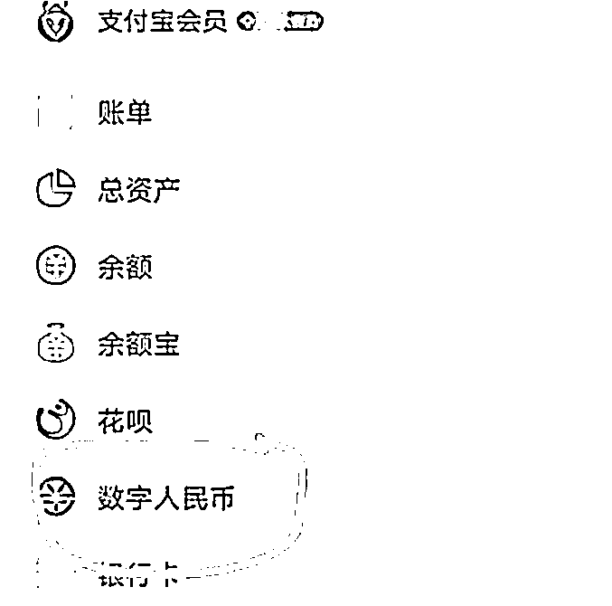
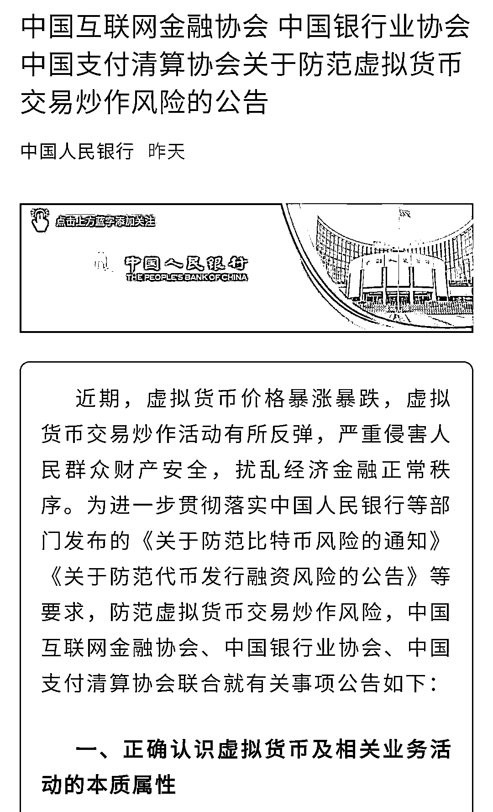
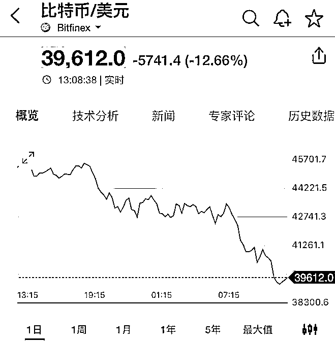
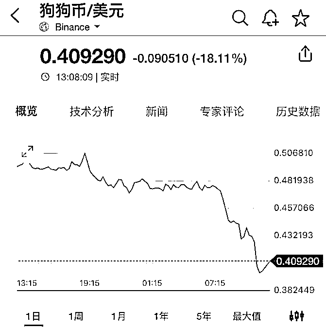
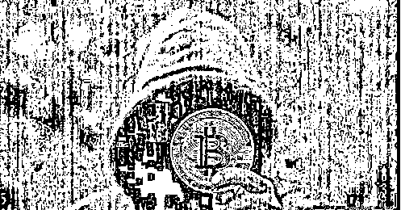
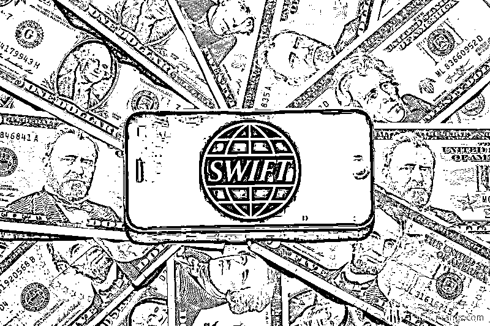
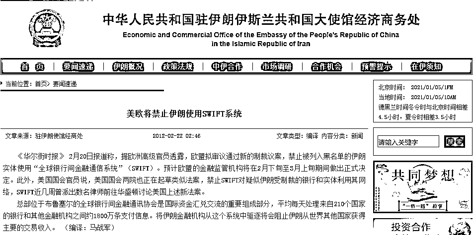
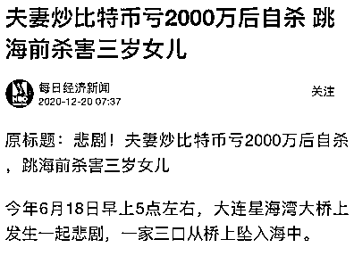

# 重磅！连夜宣布，全面封杀！！！

> 原文：[`mp.weixin.qq.com/s?__biz=MzIyMDYwMTk0Mw==&mid=2247514620&idx=1&sn=21dd12ddf68d2f44fb5caa9cf5eec510&chksm=97cb72c4a0bcfbd291d0e0f2643a20f088bb9bd68502e852c0573d608adf9bb5689089a12080&scene=27#wechat_redirect`](http://mp.weixin.qq.com/s?__biz=MzIyMDYwMTk0Mw==&mid=2247514620&idx=1&sn=21dd12ddf68d2f44fb5caa9cf5eec510&chksm=97cb72c4a0bcfbd291d0e0f2643a20f088bb9bd68502e852c0573d608adf9bb5689089a12080&scene=27#wechat_redirect)

**全面封杀！**

**该来的，终于来了！**

一周前，国家正式下发通知，将中国自己的法定数字人民币接入支付宝。再加上中国的最大 6 个巨无霸银行。工商、农业、中、建、交、邮储六大国有银行！

同时上线！中国自己的数字人民币！全都打通消费！包括饿了么、盒马鲜生、天猫超市等等网购，也全都打通！全都开始广泛使用！

要知道，作为中国最大的手机支付巨头之一，支付宝上可是链接了超过 8000 万的商家和超过 2000 个的金融机构合作伙伴，我们中国超过 10 亿的用户，几乎都在使用。

数字人民币，一下子将中国最大的六大银行，和移动支付巨头支付宝，全部一起打通！虽然当时国家没有直接下发通知，但任何一个有金融嗅觉的人，都知道。天变了！！

中国法定的数字人民币！即将迎来全国范围内的大规模使用。。。（与纸币人民币的兑换同样是 1 比 1）

**紧接着，昨天央行就向全国人民，正式宣告了一件重大文件：** 

**封杀全球所有非主权国家信用背书的，虚拟币！**

**包括比特币！！**

文件的具体内容，我挑出重点贴给你们看看： 

**1、封杀所有非货币当局发行的虚拟货币！**

国家正式明确：只要不是国家主权单位发行的数字货币，就全都是虚拟货币！虚拟货币就是虚拟的商品，不由货币当局发行，不具有法偿性与强制性等货币属性，不是真正的货币，不应且不能作为货币在市场上流通使用。

**2、兑换，交易，虚拟币，属于非法！！**

开展法定货币与虚拟货币兑换及虚拟货币之间的兑换业务、就是中央的对手！方便买卖虚拟货币、为虚拟货币交易提供信息中介和定价服务、代币发行融资以及虚拟货币衍生品交易等相关交易活动，全都属于违法！

发行虚拟币、非法发售代币票券等等活动，全都属于犯罪！

**3、任何金融机构、支付机构不得开展与虚拟货币相关的业务。**

包括但不限于：为客户提供虚拟货币登记、交易、清算、结算等服务；接受虚拟货币或将虚拟货币作为支付结算工具；开展虚拟货币与人民币及外币的兑换服务

这一条就狠了。 

等于所有中国的银行，金融机构。即日起，都不准开展人民币兑换虚拟币的业务。任何在中国的银行账户，都不得用于虚拟货币账户充值和提现！ 

**4、向全国人民发布风险预警！**

央行正式向全国的消费者发布警告。让大家提高风险防范意识，谨防财产和权益损失。

并鼓励所有人，只要有线索，就直接举报。

金融机构、支付机构发现违法违规线索的，必须第一时间采取限制、暂停或终止相关交易、服务等措施，并向有关部门报告。

毫无疑问，这一文件的公布，对于虚拟货币来说，将是一场天大的灾难。。 

即日起，包括比特币等等在内的 99.99%的虚拟币，全都将彻底在中国封杀！任何提供宣布、交易、充值、买卖虚拟币的相关人员，一被发现，将全都直接按照“ 违法犯罪 ”，直接定性！！ 

成千上万的炒币大军，今天全都要被关门打狗了。。。

02

话音未落，虚拟货币一场大血洗，开始了！

这真是一场惨绝人寰的“大绞杀”，用“财富绞肉机”这个名词，也许能够更好形容这场赌局覆灭的残酷！

看吧，在持续打击下，**刚刚，比特币报价击穿 38000 美元关口，短短两周，2 万美元跌没了。（夜间一度下探 30000 元，跌了 30%）**

各种抄袭比特币代码、莫名其妙的虚拟货币，更是惨遭血洗，一个个高台跳水，跌得粉身碎骨，不少甚至以爆仓告终。

**这是狗狗币，跌超 20%，真跌成了狗。**

屎币也来了个 20%的跳水，从 5 月 11 日的高点下来已经膝斩，跌成了屎。

**币圈瀑布还在继续，一天之内，超过 50 万人被洗劫一空，200 亿美元财富蒸发。**

这一幕，和一个月前的气氛，真是大相径庭。短短一个月后，整个币圈，经历了一场从平谷到高潮、再回落至冰点的戏剧人生，

**看过币圈割韭菜的赤裸裸以后，总会觉得中国的股市竟有一些温柔：**

> 股市可以当投资场，也可以当赌场，一般说来，股市被套后，咬牙忍它几年，还可能回本，并以此感慨人生。而币圈不一样，被币圈割过的人，一般都将没什么人生了，永劫不复。

这一切正应了那句话：眼看他起高楼，眼看他宴宾客，眼看他楼塌了！

早知今日、何必当初！

听，那让人毛骨悚然的泡沫破灭的撕裂声！

03

**虚拟货币，不管是比特币，还是狗屎币，都是一个个赌场，最精明的不过是开赌场的人，目的就是忽悠更多的人参赌，赌徒们亏了正常，赢了大不了拔网线。**

**时至今日，比特币被广为人知的创始人中本聪，都是一个没有解开的谜题，**这个人到底是日本人、澳大利亚人，还是美国人，甚至究竟存不存在这个人都两说。

**但我们肉眼可见的是，美国资本家、华尔街财团是比特币在全球搜刮财富的最大幕后受益者，这同美国利用美元霸权全球割韭菜如出一辙。**

实际上，世界上也仅有美国、日本、德国等极少数国家承认比特币的合法地位，绝大多数国家都不认可这来路不明的东西。

中国现在不可能，今后更不可能承认比特币，因为这意味着我们在被美元压了 60 年后，在下一代数字货币形态上，还要继续在全世界被美国打压，人民币将再难有出头之日，这是中国绝不容许发生的事。

**眼下全球金融体系仍牢牢掌控在美国手上，他们仰仗 SWIFT（全球货币结算系统）这一国际版银联，**全球 200 多个国家和地区的银行和金融交易都必须经过 SWIFT 结算才能完成，美国可以不用军事手段，就能搞垮一个国家。

他们曾多次对不肯就范的伊朗动用这招，直接掐断伊朗的 SWIFT 通道结算系统，将伊朗变成了金融孤岛，即使中国、俄罗斯想继续同伊朗做生意，除非一手交钱一手交货，否则也无计可施。

这就是为何，近几年我们一边大力推广人民币海外结算和使用，另一边大力发展数字人民币技术的原因所在，央行数字货币的研发已处于全球第一梯队，走在了美国等西方国家的前面。

**央行研发的数字人民币，已经架空了传统美元霸权，只需要带一个数字钱包，连网络都不需要，就能直接完全交易，更不用担心数据被美国监控或截取，简直就是对美国掌控的 SWIFT 系统的毁灭性打击。**

**央行不光加速了数字人民币的测试，将其搬上了支付宝，还同泰国、阿联酋央行联合发起了“多边央行数字货币桥”项目研究，有意解决数字人民币跨境支付难题。这一问题一旦完美搞定，无疑将是给美元霸权敲响的丧钟！**

美国被逼急了，一定程度上可以说，包括马斯克在内的美国资本家频频喊单虚拟币，还有意无意的让中国用户听到，割中国韭菜事小，破坏阻挠央行数字人民币推广的速度事大。

04

从“郁金香泡沫”这个人类历史上第一次有记载的金融泡沫开始，一次次的泡沫形成、膨胀再破裂，贯穿了一部金融史。

从根本上说，无论是郁金香泡沫，还是密西西比泡沫，亦或这次的比特币泡沫，**这些泡沫本质上不过是“割韭菜”的利刃，而它们的内在价值，与所有金字塔骗局的结局一样：零。**

热炒之后，当没有更多的信徒接盘，最终结果只能是打回原形，分文不值！

其实，虚拟货币骗局的画皮，本来并不那么别致，只是真的有太多的人太想一夜暴富，被欲望蒙住了眼睛，即使将信将疑，诱惑之下，还是心甘情愿当了那只扑火的飞蛾。 

此情此景，真让人感叹：历史不会重复，但总是带着同样的韵脚。**在金融投机这个问题上，人性似乎从未改变过。当人们被暴利、财富蒙蔽了双眼时，就会陷入自我催眠，乃至疯狂。**

的确，今天的我们，并不比当年炒郁金香的荷兰人高明多少。

一次又一次血的教训都在告诫我们：

**1、君子爱财取之有道，不要为蝇头小利就冲昏了脑袋！**这个世界，不承受较大幅度波动，而能够取得 10%以上年化率的资产，其实是很少的。即使是巴菲特那么样的投资大牛，年化率也就 25%左右，那已经是顶天了。

2、你贪的可能是人家给的高息，但人家要的是你的本金。**无论打着什么美妙的旗号，什么互联网+、什么数字货币，投资要取得高收益，背后一定是高风险、高波动。**对那些承诺高收益而低风险的投资，一定要瞪大眼睛，更不能指望有天上掉馅饼的好事。

3、在梦想取得高额回报之前，首先看住你自己辛辛苦苦赚来的本金。**看不懂的千万别碰，没信心的千万别投，追涨一时爽，下跌火葬场，**利令智昏，孤注一掷，最后的结果往往是赔了夫人又折兵，人财两空！

4、永远不要以为自己比别人高明，能够逃过击鼓传花的最后一棒！**即使你在前 100 次都侥幸脱险，但第 101 次的陷落，你就将永劫不复。**只有清醒地认识到自己和别人一样无知，你才真正走上了智慧之路！

金融不是谁都可以亵玩的游戏，对金融必须保持敬畏，提高防范意识，不被高利诱惑，自觉抵制金融传销和非法集资。

土地是财富之母，劳动是财富之父，天下永远没有免费的午餐！

## 

本文综合自：

财闻要参（ID：mofzpy）《突发！连夜宣布，全面封杀！！！》

## 

https://mp.weixin.qq.com/s/Obv9npnl5uV4jnCD0Y0YaQ

## 

互联网热点（ID：web-news）《突发！！比特币遭全部封杀！！》

## 

https://mp.weixin.qq.com/s/s5xENsHRwN8Rjvq3IBGc_w

## 

鸣金网（ID：mingjin-wang）《全面封杀，果然崩了！》

https://mp.weixin.qq.com/s/XNlMDD4QA557Vc4bVRTnww

来源：朱正义

← 向右滑动与灰产圈互动交流 →

