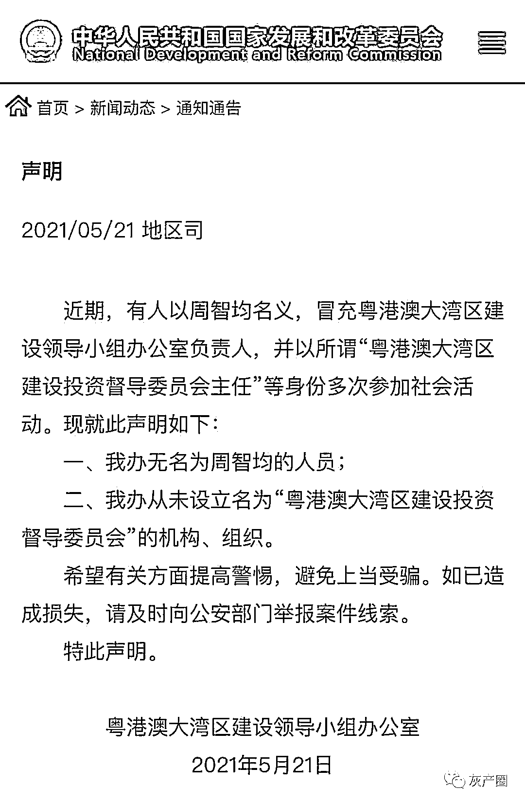
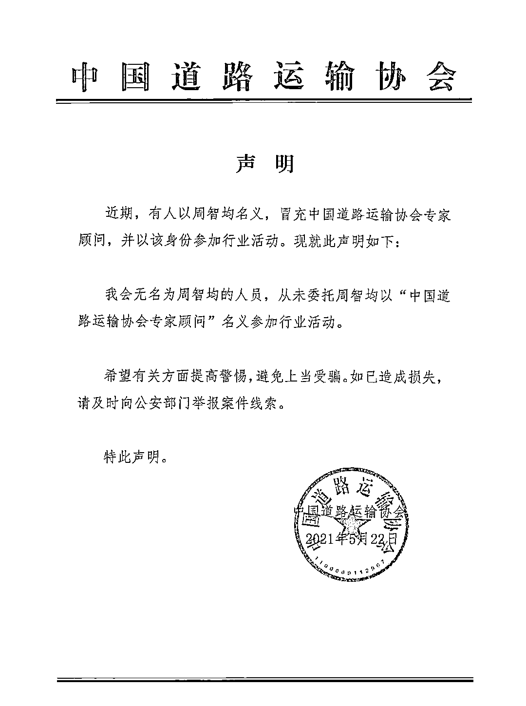
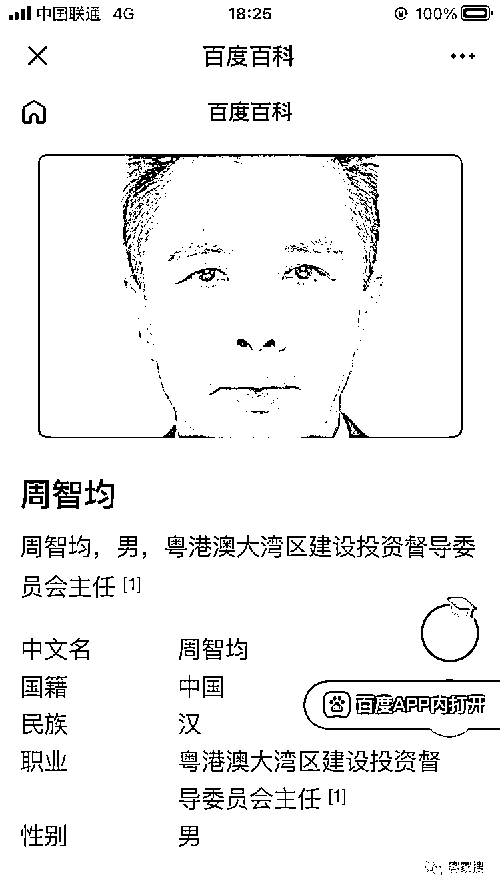
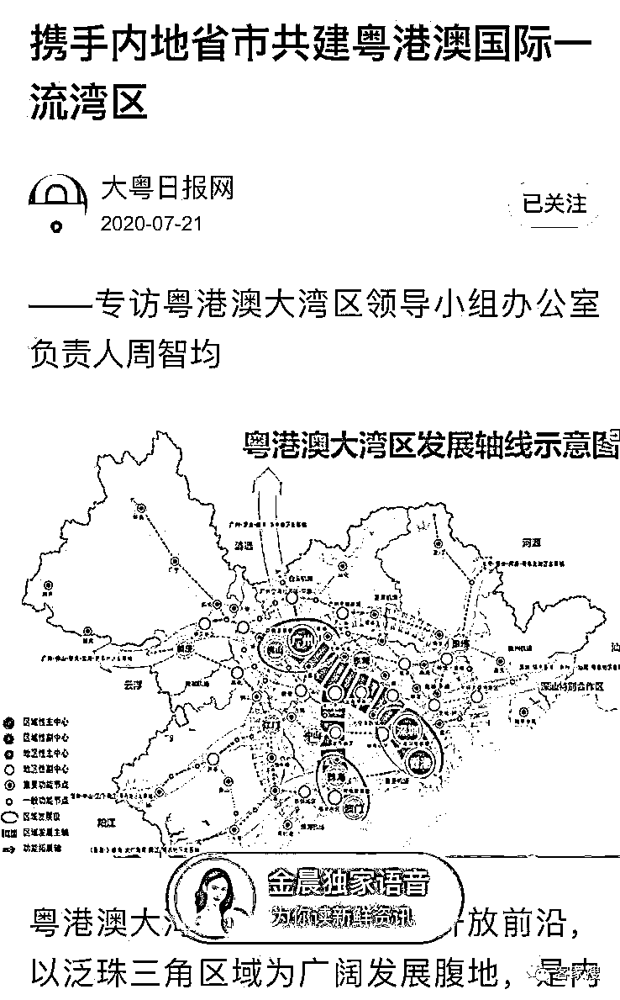

# 被国家发改委点名示警的周智均是谁?

> 原文：[`mp.weixin.qq.com/s?__biz=MzIyMDYwMTk0Mw==&mid=2247514620&idx=2&sn=7a89689017c6543372f9db73f002b89d&chksm=97cb72c4a0bcfbd21b0d106e8c779acda23b963460f9a8fc11b268e518634a299e86fa5efd26&scene=27#wechat_redirect`](http://mp.weixin.qq.com/s?__biz=MzIyMDYwMTk0Mw==&mid=2247514620&idx=2&sn=7a89689017c6543372f9db73f002b89d&chksm=97cb72c4a0bcfbd21b0d106e8c779acda23b963460f9a8fc11b268e518634a299e86fa5efd26&scene=27#wechat_redirect)

**（5 月 21 日）国家发改委官微发布声明“打假”。**

**声明称，近期，有人以周智均名义，冒充粤港澳大湾区建设领导小组办公室负责人，并以所谓“粤港澳大湾区建设投资督导委员会主任”等身份多次参加社会活动。**

就此，**国家发改委表示，粤港澳大湾区建设领导小组办公室无名为周智均的人员，也从未设立名为“粤港澳大湾区建设投资督导委员会”的机构、组织。希望有关方面提高警惕，避免上当受骗。如已造成损失，请及时向公安部门举报案件线索。** 

国家发改委官网截图。

**中国道路运输协会 22 日发布声明。**

声明明确指出：我会无名为周智均的人员，从未委托周智均以“中国道路运输协会专家顾问”名义参加行业活动，并提醒有关方面提高警惕。

据百度百科介绍，**周智均，男，粤港澳大湾区建设投资督导委员会主任。“社会活动”一栏介绍，此人 2013 年赴长沙调研；2021 年参加某媒体与某集团战略合作协议。**

百度截图。

**此外，记者查询发现，网上还可以查到《携手内地省市共建粤港澳国际一流湾区》一文中，此人还以“粤港澳大湾区建设领导小组办公室负责人周智均”的身份接受了媒体采访。**

不过，他能行骗成功，主要是因为在互联网上他的信息能够前后佐证。比如有多家媒体报道，他在百度百科上有专属词条和标准照。

虽然百度百科不是官方网页，但得承认的是，从市场地位来说，百度在国内搜索引擎里的市场份额是“统治级”的，百度百科也基本是最主流的商业百科平台。可以说，百度百科里“有这人”，在很多人心中，就代表着一种认证。

在百科信息里，周智均还冒充过“中国道路运输协会专家顾问”“首都新机场建设领导小组副局长”，可谓人有多大胆，头衔就有多长。这种涉及国家机关、事业单位的重要信息，百度百科有无进行审核，以致于堂而皇之地出现在了词条里？

此外，周智均还有些新闻稿通过名为“凤凰通讯社”的网站发出，并且还被多家商业平台转载。而“凤凰通讯社”也与正规新闻单位凤凰卫视和凤凰网没有关系。还曾因商标近似，被法院判赔 500 万元。

这么看，其实周智均的骗术其实并不高级。但对于外人来说，各种信息的交叉验证之下，还颇有迷惑性：一看百度百科，赫然写着粤港澳大湾区建设领导小组办公室负责人；一查新闻，确实有报道，还有商业网站转载。然后相关单位紧接着就被忽悠了。

这个造假链条应该深挖。比如百度百科这种平台，在涉及一些国家企事业单位等重要信息的时候，应当有相应的审核机制，比如审核编写者的资质，相关信息能否得到公开政务信息的佐证。否则，任何人都可以摇身一变，在互联网上以“领导”“首长”的身份存在。

由于百度百科的市场优势地位，往往起到的是一种名片式的效果。互联网上的虚假或纰漏信息，其实很容易就反馈到现实生活。2015 年，就有相声演员诉百度百科侵权，指控在其本人的百度百科页面上，“毕业”被写成了“肄业”，虚假信息挂了近 8 年，给其生活造成了相当的困扰。

从这个角度看，作为在细分市场领先的互联网平台，其市场地位本身就意味着一种“信用”，而这种信用对应一种社会责任。从魏则西事件到周智均事件，都能看到因为信息误导而造成巨大的社会成本，相关平台应当有所反思与改进。

另外，互联网新闻发布转载当然有相关规范，这个“凤凰新闻社”究竟有无新闻采编资质，又为何能长期存在，那些关于周智均的稿件为何可以到处传播并被商业网站收纳，这些也应当彻查。

互联网的意义，是让信息来源更透明、信息获取更便利，而不应走向反面，反而让用户更容易被眼花缭乱的信息所迷惑。用真实性来规制海量信息，对于提供互联网服务的单位来说，这是应尽之责

来源：Pubmed

← 向右滑动与灰产圈互动交流 →

