# “黑嘴”一开，净赚 3000 万！

> 原文：[`mp.weixin.qq.com/s?__biz=MzIyMDYwMTk0Mw==&mid=2247514620&idx=3&sn=d3444f7a9185d650b8dc18b2660efd73&chksm=97cb72c4a0bcfbd29a0105bffc0d41470ba341cf9ad153713b8c90c131457efaf6cb66934dba&scene=27#wechat_redirect`](http://mp.weixin.qq.com/s?__biz=MzIyMDYwMTk0Mw==&mid=2247514620&idx=3&sn=d3444f7a9185d650b8dc18b2660efd73&chksm=97cb72c4a0bcfbd29a0105bffc0d41470ba341cf9ad153713b8c90c131457efaf6cb66934dba&scene=27#wechat_redirect)

2020 年 9 月 9 日，代码为 002969 的股票嘉美包装，上演了极其异常的走势。从涨停到跌停，短短几分钟就上演“天地板”，数亿元资金频繁进出，股价剧烈震荡。这眼花缭乱的背后，究竟谁是真正的幕后“黑手”？

仅仅几分钟，出货 4 亿多元

早上九点三十分，嘉美包装在短短的一分钟之内，瞬间从开盘价 11.9 元拉升到涨停价 13.19 元，而在两分钟后，这只股票急转直下，再次跌回开盘价。随后，股价再次上扬，在九点三十九分，重新接近涨停，而后又继续急转直下，就这样反复拉升和回调，五个小时之后，下午两点二十五分，这只股票一路下滑，一度触及跌停价，最终收在每股 10.8 元。

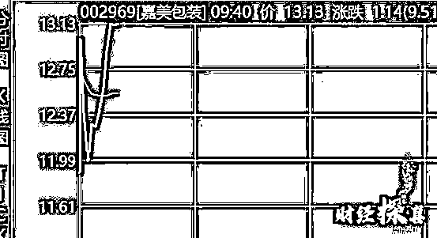

**仅仅一个交易日，嘉美包装从涨停板到跌停板，这种极为罕见的“天地板”引发了监管部门的注意。**

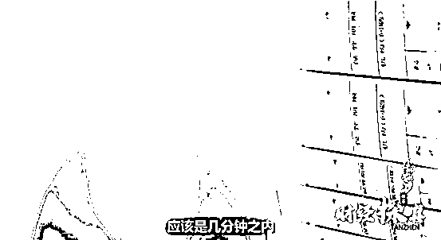

如此的资金异动也在同一时间引起了辽宁省公安厅经侦总队的注意，他们发现，嘉美包装股票的异动和五个月之前他们和证监会联合查办的惠发食品案件十分相似。

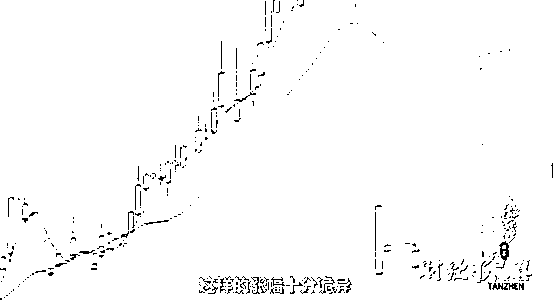

证监会与公安部对此展开了联合调查。调查人员发现，惠发食品和嘉美包装背后都存在操盘方，而操盘方采取了截然不同的出货形式，**惠发食品用了将近一周的时间完成全部出货，而嘉美包装采用的则是暴力出货，仅仅几分钟就完成了 4 亿多元的出货。**

经过稽查人员对两起案件线索的串并分析，发现嘉美包装、惠发食品这两只股票的异动账户高度重合。所有的交易和资金流转信息同时指向了一家位于浙江杭州的 A 公司，而这家公司对外宣称就是专门做股票配资的。

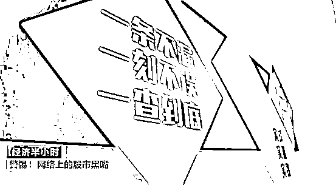

调查信息显示，浙江 A 公司成立于 2018 年 1 月 11 日，是一个主要经营非法场外配资及大宗股票代持业务的配资公司，组织严密、分工明确、隐蔽性强，数十名员工不仅有专门负责管理资金的，还有多个专门的后台操纵人员

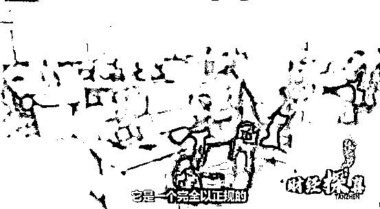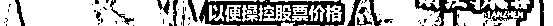

2020 年 9 月 25 日，辽宁地方公安协同证监会稽查部门成立共一百五十余人的联合调查组，分赴浙江杭州多地，展开抓捕行动。在杭州的一处居民楼里，抓捕小组发现了 A 公司藏匿在一个单元房中的后台系统。他们在房间里清点出 200 多台电脑。

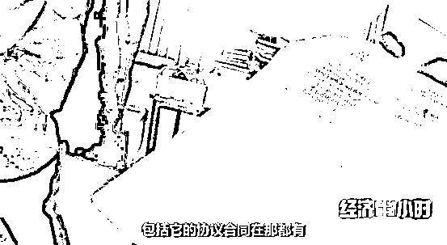

在辽宁抚顺公安局的库房里，我们看到几百台笔记本，几十台服务器，占满了一个五十多平方米仓库的空间，而这些，就是配资公司的操盘手们用来操纵股票涨跌的工具。

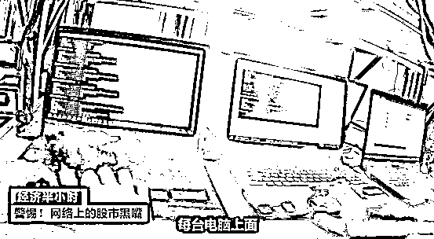

经过交易信息比对，相关的资金往来、笔记本电脑上的有关信息、股票登录的账户，和其他抓捕现场发现的资料都完全符合。

只有找“韭菜”接盘，才能变现成功

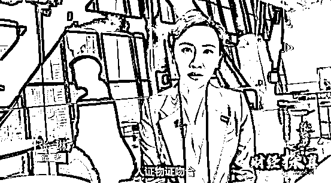

郑某，38 岁，江苏盐城人，高中文化，是操纵股票的老手，之前就因为涉嫌操纵股票，被证监会约谈过，而且郑某又涉及多起官司，被限制高消费，日常只能依靠车辆出行，就是人们俗称的“老赖”。在警方的调查中，郑某才是真正的幕后主谋。作为江浙一带混迹股市多年的江湖大佬，他是如何一步步走向股市的？又是如何选中了嘉美包装呢？

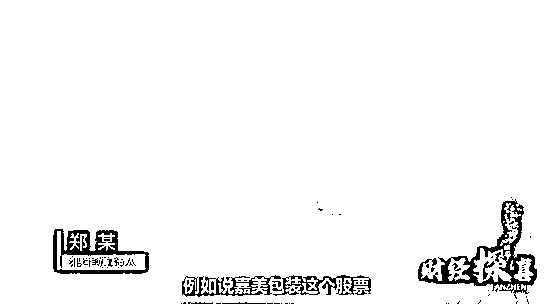

郑某供诉，这个股市的黑江湖里，参与各方分工十分明确。郑某作为庄家，负责选取股票，并向后台人员下达操作指令，配资平台 A 公司从市场上筹集资金供郑某使用，他们以 1 比 4 的比例配资购买股票，也就是郑某购买八千万元，A 公司负责为他配资到四亿元。

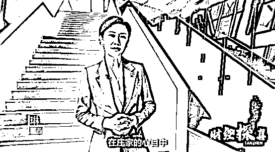

2020 年 9 月，嘉美包装的股价被抬升到了历史最高点位，他们这个时候只有找人接盘，把这些高价股全部出掉，才能够成功变现，**而就在他们这个所谓的“割韭菜”过程中，要想迅速变现的最快方法，就是找“股市黑嘴”帮忙。**在一名中间人的介绍下，郑某和一名“股市黑嘴”见了面，商谈了嘉美包装出货的事情。

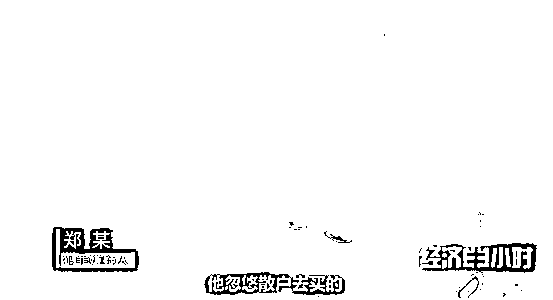

 “专家”带你赚钱？想多了！

2021 年 2 月 26 日，联合调查组再次协同作战，在湖南、深圳两地对参与非法操作“嘉美包装”等多只股票的“黑嘴”团伙实施统一收网，一举捣毁“黑嘴”直播间 3 处，抓获主要犯罪嫌疑人 4 名。

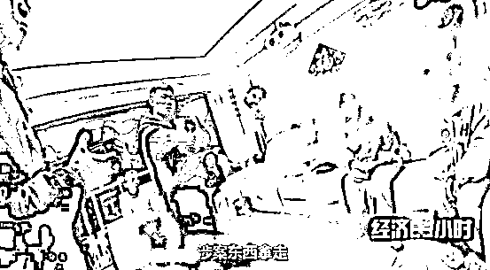

根据“股市黑嘴”主犯陈某的供述，他们一般收取交易金额的 10%作为佣金，也就是说假如交易额一个亿的话，这些“股市黑嘴”的收益就有一千万。**而做这一切的前提是先培养粉丝，用他们的行话就是说先“种韭菜”等收割。**

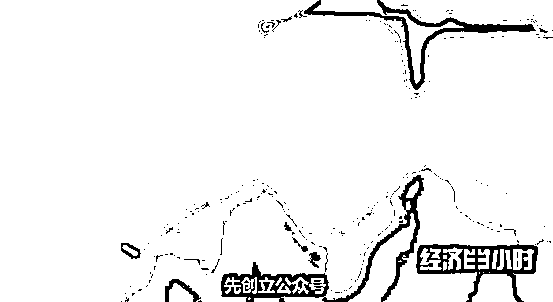

股市黑嘴主犯 陈某

通过这样大量的发广告、加粉丝、建微信群，这些“股市黑嘴”们很快就拥有了几千名粉丝。吸粉工作完成之后，“股市黑嘴”们定期会给群里的股民进行授课，通过网络直播平台向股民讲授股市涨跌趋势及炒股的技巧、心得，并不断向群内发布即时的股市热点，推荐近期热度高的优质股票，**目的就在于让群内股民信任其“专业性”，为后续“跟投”做好铺垫。**

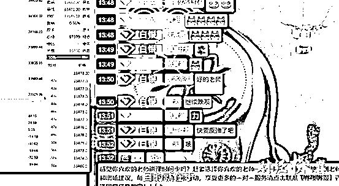

**然而讽刺的是，这些直播间里所谓的股市专家们其实对股票一窍不通，推荐股票，完全凭运气。**

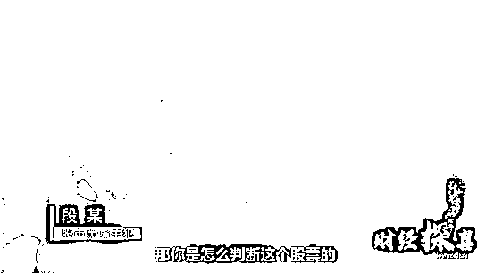

在完成了吸粉、固粉、授课后等一系列的步骤之后，接下来就到了最关键的一步，这些“股市黑嘴”们，会和那些像郑某一样有出货需求的庄家们建立联系，然后向群里的股民推荐被庄家操纵的股票标的，从而进行收割，获取高额利益。

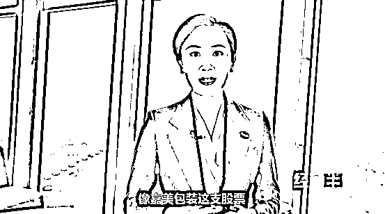

像嘉美包装这只股票，在 2020 年 9 月 9 日当天，**短短几****分钟，****出货 4 亿多元，这些“股市黑嘴”们就从郑某的手中拿到 3000 万元的高额回报。**

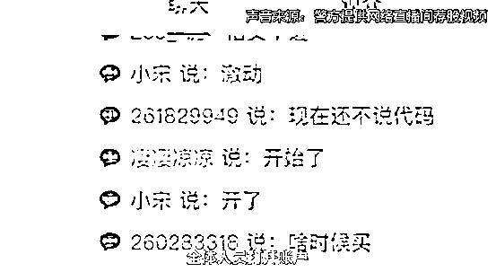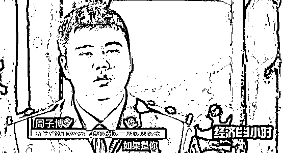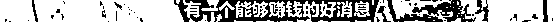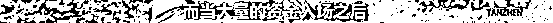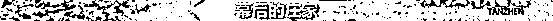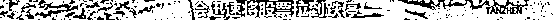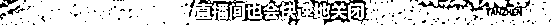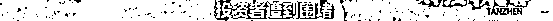

**这些所谓的“荐股专家”可以说是两头通吃，他们一方面在荐股群里收取几千元到上万元不等的所谓学员费，而另一方面服务于“幕后的庄家”，收取巨额的佣金。**

**还是那句老话，投资有风险，入市需谨慎，远离所谓“荐股专家”，理性投资。**

来源：央视财经

← 向右滑动与灰产圈互动交流 →

