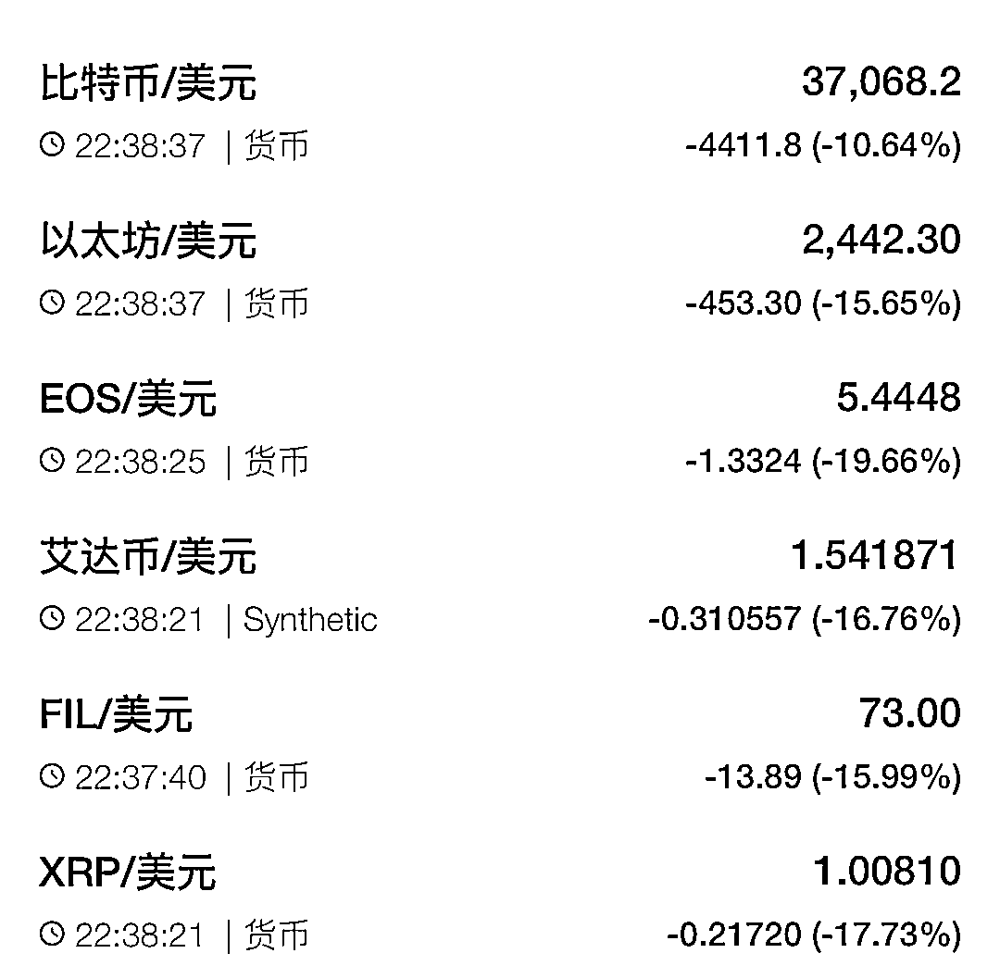
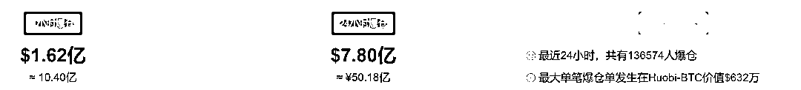
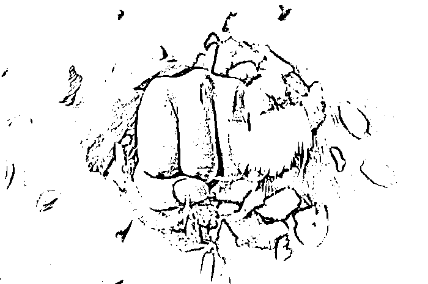
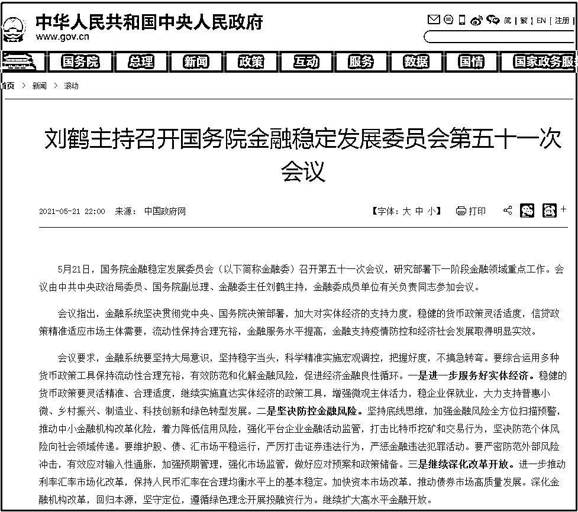
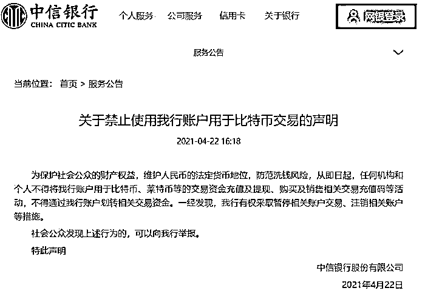

# 重磅！这次国家出手了！打击比特币挖矿和交易行为！

> 原文：[`mp.weixin.qq.com/s?__biz=MzIyMDYwMTk0Mw==&mid=2247514620&idx=4&sn=f8b63a28869df8337021081c422ff567&chksm=97cb72c4a0bcfbd2cf67d8ec7f11d3acd749df9688a903d123e346808b6e91a302a171424689&scene=27#wechat_redirect`](http://mp.weixin.qq.com/s?__biz=MzIyMDYwMTk0Mw==&mid=2247514620&idx=4&sn=f8b63a28869df8337021081c422ff567&chksm=97cb72c4a0bcfbd2cf67d8ec7f11d3acd749df9688a903d123e346808b6e91a302a171424689&scene=27#wechat_redirect)

5 分钟内下跌超过 2000 美元！

最新数据显示，比特币报 37068.2 美元，跌破 38000 美元，距离其 4 月 14 日创下历史最高的 64838 美元已相距甚远。

其它加密货币同样未能逃出暴跌的命运。

据比特币家园，最近 1 小时爆仓 10.21 亿，24 小时内，13.6 万人爆仓 50 亿。

与此同时，美股区块链板块跌幅扩大，比特矿业跌近 20%，第九城市跌 9%，嘉楠科技跌 5.5%，Bit Digital、迅雷、亿邦国际、Marathon Patent 均跌超 4%。

就在刚刚，国家宣布出手了，将打击比特币挖矿和交易行为。

图/图虫

**国务院金融委：**

**打击比特币挖矿和交易行为** 

据中国政府网，5 月 21 日，国务院金融稳定发展委员会(以下简称金融委)召开第五十一次会议，研究部署下一阶段金融领域重点工作。会议由中共中央政治局委员、国务院副总理、金融委主任刘鹤主持，金融委成员单位有关负责同志参加会议。

会议指出，金融系统坚决贯彻党中央、国务院决策部署，加大对实体经济的支持力度，稳健的货币政策灵活适度，信贷政策精准适应市场主体需要，流动性保持合理充裕，金融服务水平提高，金融支持疫情防控和经济社会发展取得明显实效。

会议要求，**金融系统要坚持大局意识，坚持稳字当头，科学精准实施宏观调控，把握好度，不搞急转弯。**要综合运用多种货币政策工具保持流动性合理充裕，有效防范和化解金融风险，促进经济金融良性循环。

一是**进一步服务好实体经济**。稳健的货币政策要灵活精准、合理适度，继续实施直达实体经济的政策工具，增强微观主体活力，稳企业保就业，大力支持普惠小微、乡村振兴、制造业、科技创新和绿色转型发展。

 二是**坚决防控金融风险**。坚持底线思维，加强金融风险全方位扫描预警，推动中小金融机构改革化险，着力降低信用风险，强化平台企业金融活动监管，**打击比特币挖矿和交易行为**，坚决防范个体风险向社会领域传递。要维护股、债、汇市场平稳运行，严厉打击证券违法行为，严惩金融违法犯罪活动。要严密防范外部风险冲击，有效应对输入性通胀，加强预期管理，强化市场监管，做好应对预案和政策储备。

 三是**继续深化改革开放**。进一步推动利率汇率市场化改革，保持人民币汇率在合理均衡水平上的基本稳定。加快资本市场改革，推动债券市场高质量发展。深化金融机构改革，回归本源，坚守定位，遵循绿色理念开展投融资行为。继续扩大高水平金融开放。

**此前中国三大监管机构**

**联手“封杀”比特币** 

最近，比特币、其他虚拟币以及交易平台股价的突然不景气，一方面是因为监管因素，另一方面是市场因素。

“近期，虚拟货币价格暴涨暴跌，虚拟货币交易炒作活动有所反弹，严重侵害人民群众财产安全，扰乱经济金融正常秩序。”

5 月 18 日，中国互联网金融协会、中国银行业协会、中国支付清算协会联合发布《关于防范虚拟货币交易炒作风险的公告》。

公告强调，金融机构、支付机构等会员单位不得用虚拟货币为产品和服务定价，不得直接或间接开展与虚拟货币相关的业务。

各家银行也率先关注到了比特币侵害人民币法币地位及其洗钱风险。比如中信银行在 4 月 22 日公告称：

“为保护社会公众的财产权益，维护人民币的法定货币地位，防范洗钱风险，从即日起，任何机构和个人不得将我行账户用于比特币、莱特币等的交易资金充值及提现、购买及销售相关交易充值码等活动，不得通过我行账户划转相关交易资金。一经发现，我行有权采取暂停相关账户交易、注销相关账户等措施。”

**各国收紧监管几成定局**

值得注意的是，此前 4 月 17 日，土耳其央行发布声明称，**明确禁止比特币以及其他虚拟货币作为商品和服务的支付形式**。土耳其央行还禁止电子货币机构充当向虚拟货币平台转账的中介。

不仅如此，4 月 18 日，印度政府关于虚拟货币的监管政策也再次传出，多家媒体报道称印度政府将禁止虚拟货币，对在该国交易甚至持有此类资产的人处以罚款，任何有关加密资产的行为被定义为犯罪行为。

事实上，自 2020 年 12 月比特币开启疯涨模式以来，除了土耳其外，海内外各国呼吁防范虚拟货币风险的消息屡有出现，在虚拟货币监管方面也逐渐收紧。美国财长耶伦就曾公开表示，比特币具有高度投机性，投资者应该当心。

在虚拟货币监管收紧方面，据媒体报道，韩国自 3 月 25 日开始实施虚拟货币交易实名制，韩国虚拟货币交易平台必须在 2021 年 9 月前向政府机构报告其交易数据，并称将严厉打击与虚拟货币交易有关的非法活动;4 月 5 日，阿根廷央行向国内区域性银行发出通知，要求提交购买或持有比特币以及其他虚拟货币的客户信息。

“国外央行逐渐收紧虚拟货币监管，也与虚拟货币价格持续走高有关。”王鹏表示，在 2020 年海外多国主导的宽松货币政策下，包括比特币在内的虚拟货币价格大幅上升。以经济金融基础较为薄弱的土耳其为例，在产生大量通货膨胀后，炒作性质的虚拟货币积累大量系统性风险，将进一步侵蚀央行主导的全球金融、结算体系，相关金融监管部门必然会采用更为审慎的态度来对待虚拟货币。

**9 年经历 15 次重大价格回调**

据富途牛牛援引 CoinMarketCap 统计，**自 2012 年以来，比特币共计经历了 15 次从高位回调的行情。**其中：

2012 年 8 月 17 日-19 日，跌幅达 56.3%，主因是有人运行了一个名为“比特币储蓄信托(BST)”的庞氏骗局，共涉及 70 万个比特币，根据当前的价格计算，这些比特币价值达到 2.43 亿美元。随后当事人 Trendon Shavers 被捕入狱，判罚 4000 万美元。

2013 年 4 月 10 日-12 日，跌幅高达 82.6%。

2013 年 11 月 30 日-2016 年 1 月 14 日，跌幅高达 86.9%，回调原因包括：1)中国禁止比特币;2)昔日世界最大比特币交易所 Mt.Gox 被黑客攻击并最终宣布破产，该案件涉 85 万个比特币，按当时价值计算约 5 亿美元。

2017 年 12 月 17 日-2018 年 12 月 15 日，跌幅 83.6%，在此期间，日本东京黑客入侵了一个名为 Coincheck 的加密货币交易所，盗走了总值超 5 亿美元的数字货币。

2021 年 4 月 14 日-5 月 17 日，跌幅 51.1%，期间，特斯拉 CEO 马斯克(Elon Musk)在社交媒体上宣布将停止使用比特币来购买特斯拉电动车。

**别盲目相信天花乱坠的“币圈神话”** 

据新华网客户端，虚拟货币本质上是没有实际价值支撑的虚拟商品，并不是真正的货币，且投资风险较高，为什么还能如此“令人疯狂”?

**狂热的投机客、煽风点火的宣传、坐享其成的中介……投机炒作盛行，推动虚拟货币市场走热。**

有关炒币的营销信息在互联网平台上屡见不鲜，加上一些自媒体和“炒币客”的推波助澜，不少投资者由此“入坑”。但这类宣传信息有意放大了虚拟货币的所谓高额回报率，却时常刻意忽略投资的高风险。

此外，大部分虚拟货币交易平台不受法律监管，虚构交易、操纵价格、“断网”跑路、诈骗勒索等情况时有发生，尤其在我国，一些“地下”交易所服务器往往设置在境外，投资者财产较难获得保护。

其实，炒作虚拟货币，风险不仅存在于金融市场，还让一系列违法犯罪活动如影随形。例如，诈骗分子谎称准备大量收购虚拟货币，请专业“炒手”操盘，并承诺交易费用和一定的比例的报酬。为了使“炒手”对“代购”深信不疑，前期成功交易几笔使对方完全入套。最终以最大的一笔交易为目标，得到“炒手”的虚拟货币后不支付交易费用，直接跑路并将虚拟货币套现。

**故意夸大虚拟币、炮制“空气币”概念，进行非法融资、吸收公众存款，最终“爆雷”跑路。**例如，虚拟币钱包 Plus Token 用分红和奖励催促会员发展下线，通过拉人头，导致 200 万人卷入传销组织，涉案金额超 400 亿元。还有传销组织，自称“国币”、用“天河二号”运算，以提供虚拟数字货币增值服务为幌子，进行非法集资、传销、诈骗活动。

**利用虚拟币可以变现的特点，为犯罪行为洗“黑钱”。**有媒体报道，日前遭遇黑客勒索的美国最大成品油管道运营商，就被迫以虚拟货币支付了赎金。

**与传统投资工具相比，虚拟货币市场不成熟，波动性高、投机性高、炒作性高，且缺乏明确交易监管规则，风险极高。**如何防范虚拟货币炒作、交易风险，是监管部门一直关注的问题，严监管也是大势所趋。

面对虚拟货币的市场乱象和衍生的违法犯罪行为，需要各方合力给虚拟货币戴上“紧箍咒”。在国家进一步严格监管的同时，消费者还是要增强风险意识，不参与虚拟货币交易炒作活动，**千万别轻信虚拟货币的“造富神话”**。

来源：21 财汇网

← 向右滑动与灰产圈互动交流 →

