# 一场马拉松越野赛 21 人遇难，亲历者讲述惊魂历程，求救信息让人心碎

> 原文：[`mp.weixin.qq.com/s?__biz=MzIyMDYwMTk0Mw==&mid=2247514620&idx=5&sn=2b2ba5204cb3bc369f090f53e6ef5383&chksm=97cb72c4a0bcfbd2a5e429ba99d2b29a19f2097395d69c5b961b4dff48c90f17bb3f7f052e64&scene=27#wechat_redirect`](http://mp.weixin.qq.com/s?__biz=MzIyMDYwMTk0Mw==&mid=2247514620&idx=5&sn=2b2ba5204cb3bc369f090f53e6ef5383&chksm=97cb72c4a0bcfbd2a5e429ba99d2b29a19f2097395d69c5b961b4dff48c90f17bb3f7f052e64&scene=27#wechat_redirect)

5 月 22 日上午 9 时，由甘肃省白银市景泰县举办的 2021（第四届）黄河石林山地马拉松百公里越野赛暨乡村振兴健康跑在黄河石林景区举行。共有近万人参加比赛和健康跑，其中 172 名参赛人员参加百公里越野赛。

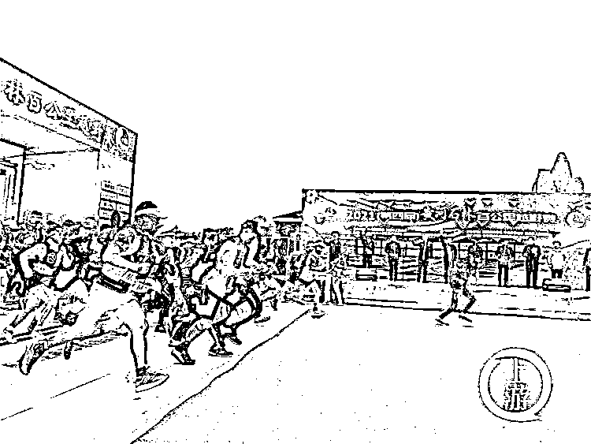

当天 13 时左右，百公里越野赛高海拔赛段 20 公里至 31 公里处，受突变极端天气影响，局地出现冰雹、冻雨、大风灾害性天气，气温骤降，参赛人员出现身体不适、失温等情况，部分参赛人员失联，比赛停止，当地立即组织多方力量搜救失联人员。

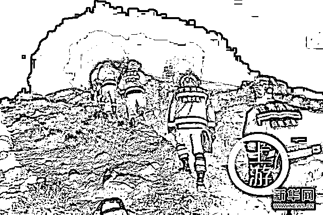

今天（23 日），救援指挥部召开新闻发布会，公布事故搜救最新情况。

目前，共搜救接回参赛人员 151 人，其中 8 人轻伤在医院接受救治，21 名参赛人员找到时已失去生命体征。

<mpvideosnap class="js_uneditable custom_select_card channels_iframe" data-pluginname="videosnap" data-id="export/UzFfAgtgekIEAQAAAAAApZs1J-FEkAAAAAstQy6ubaLX4KHWvLEZgBPE86MMfxksNoD_zNPgMIstk1-YVIiaI4f3ZJFm2j_n" data-url="https://findermp.video.qq.com/251/20350/stodownload?encfilekey=XGocBFxVWK5dcyOOqpEU47RpBHQIvlhnXafgLuDMCV8fZG5LgATJ9oI6QfvlBlWJDiczsVyVIVMpzzlB4YxLQSichXdMic5CK96XsJkhpEkTeGnJWa4wFUKBgLZ6lcjMzeUh1zL4XVLvRUCUu2VvYrccUtiasBMB4TP5gnn8Da2MuZ7jr8iaicVthATg&amp;adaptivelytrans=0&amp;bizid=1023&amp;dotrans=0&amp;hy=SH&amp;idx=1&amp;m=8a432c512b90b274d284f414e2368840&amp;token=x5Y29zUxcibBiaGHtmXXicGxvSgV7OXtfS37qMudXYpxNAyYBfXXiaZibde98Hiajr8Qnk" data-headimgurl="http://wx.qlogo.cn/finderhead/Q3auHgzwzM7mDc4Xrwibb2bXKKDYGGXJjXJCKiaC29IWKmPCLBBHonmg/0" data-username="v2_060000231003b20faec8c5e58a1bc5d3cf0ce533b0771a0cdbb94f8e37fe3d7b8fc3e41b1194@finder" data-nickname="吃瓜不吐葡萄皮" data-desc="跑友讲诉甘肃马拉松越野赛惊魂经历" data-nonceid="900029254012106742" data-type="video"></mpvideosnap>

马拉松跑友聊天记录曝光：多名选手被冻僵，口吐白沫，保暖毯被吹烂，求救信息让人心碎！

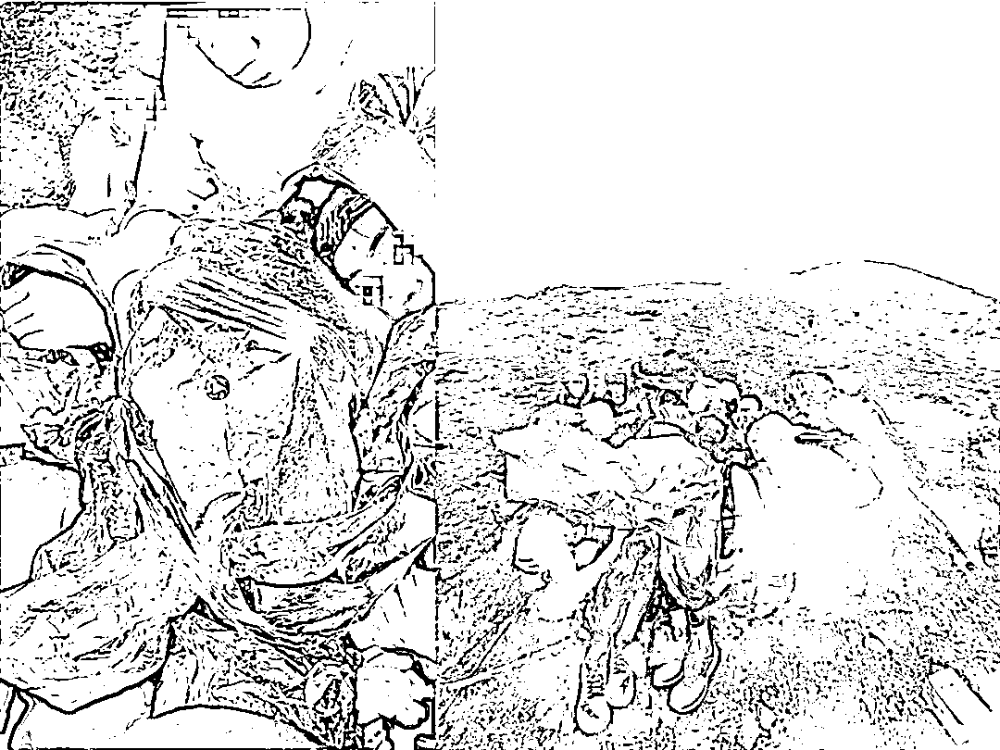

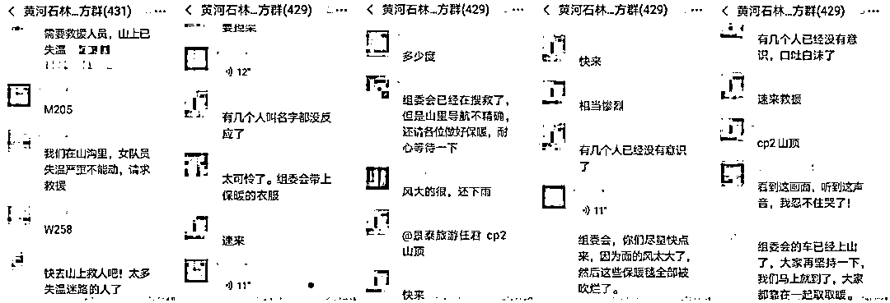

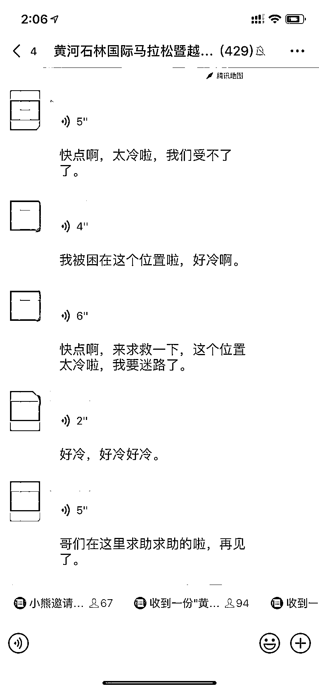

据国内越野跑顶尖选手梁晶的教练魏普龙确认，宁波江南百英里冠军梁晶在比赛中不幸遇难。

梁晶是亚洲第一和全球第 8 现役排名的耐力越野跑运动员，代价实在太大！！

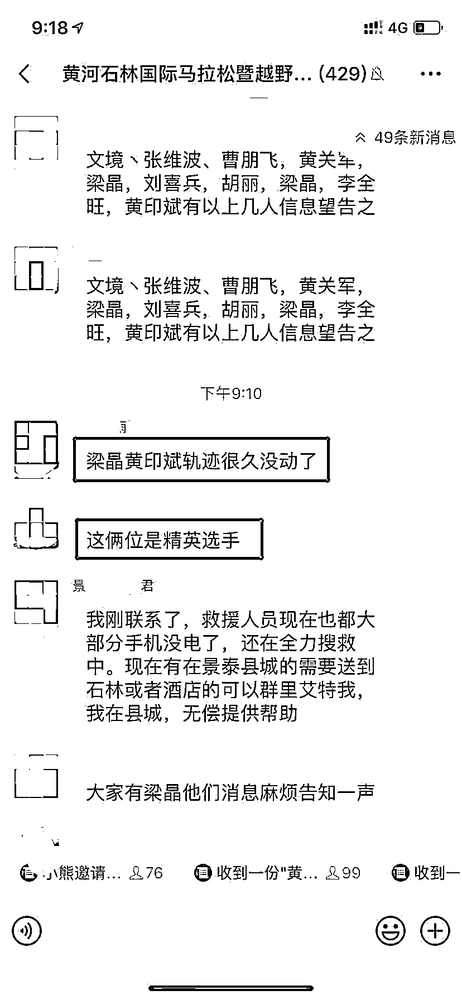

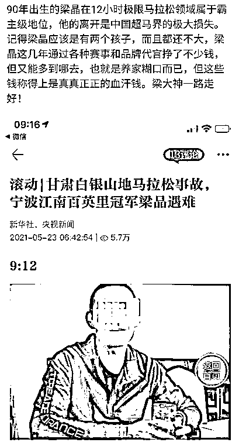

目前，当地景区已发布紧急闭园公告，搜救工作仍在进行。

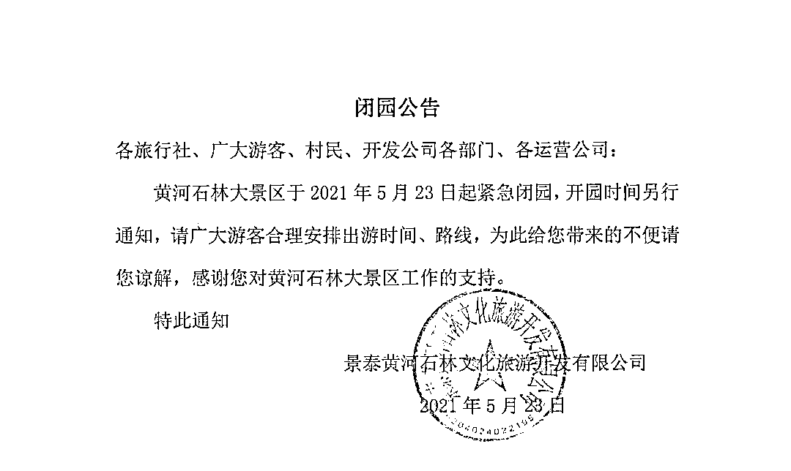

一位来自黑龙江的亲身经历者“**流落南方**”，作为曾经的一名媒体调查记者，他与多位朋友一起参加该赛事，在遇到恶劣天气时，他虽极力坚持，但最终感觉不对，及时下撤，幸免于难，但不幸的是，他有另外几位朋友遇难或失联。流落南方写下一篇文章，仔细讲诉了自己的亲身经历。

**极端天气没有预报**

黄河石林百公里越野赛，比赛地在甘肃省白银市景泰县黄河石林风景区，大致可以理解为是景区为了宣传自身而操办的一个赛事，主办单位是中共白银市委、白银市人民政府，承办单位是白银市体育局、中共景泰县委、景泰县人民政府，执行单位是黄河石林大景区管理委员会、甘肃晟景体育文化发展有限公司。

这个比赛已办四届。前面几届，赛事组织工作一般般，但完赛即发 1600 元补助，让选手们仍旧趋之若鹜。毕竟，除掉 1000 元报名费，完赛可净赚 600 元，一般地域的选手参赛费用基本就覆盖掉了。

黄河石林百公里越野赛的赛道，有人说是国内最简单的百公里越野赛，这话大概基于两点，一是整体爬升不大，约 3000 米以内的累计爬升，和其他百公里越野赛相比确实较低；二是赛道难度低，属于基本都能跑起来的高速赛道。

但我看来，它又不算简单的百公里，也是基于两点，一是赛道海拔不低，整体在 2000 海拔上下，对于平原生活的选手，这算高海拔了且出了景区之后赛道绝大部分都处于无人区；二是门槛，关门时间 20 小时，这基本上意味着，热衷于网红赛事的跑渣小白们是没办法报名的，这部分人 20 小时完赛可能性不大。

今年的比赛，赛事公司没有变，但 21 日晚技术会，发现讲解赛道的赛事总监换人了，一些组委会工作人员也是新面孔。技术会上，我就跟身边朋友说了句，感觉这批人还是蛮靠谱的。

如上所述，该赛事当地介入很深，当然，这和比赛组织工作好不好关系不大，并不是官方参与度高，赛事就一定是好赛事，这个，有过比赛经验的朋友都了解。

黄河石林这个比赛，即便赛事组织达不到一百分的标准，几届搞下来，也算是一个成熟赛事了，赛道几年没变过，工作人员、志愿者等相关人员都了然于胸，且往年的比赛没有出现过一单哪怕是极小极小的问题，有也只是未完赛选手因为前半段关门时间设置的比较苛刻而引起的吐槽，认为组委会是故意如此，把一部分选手关门，以达到节省费用的目的。毕竟关掉 10 个人就少支出一万六。

然而今年，肉眼可见一些细节，比如赛道布标，感觉黄河石林这个比赛槽点变少了，组织工作更细腻了。但偏偏就是今年的比赛出了问题，而且是大问题。

问题出在天气上，极端天气。

甚至 521 这天的天气预报，都没有预报出来第二天的这种极端天气。

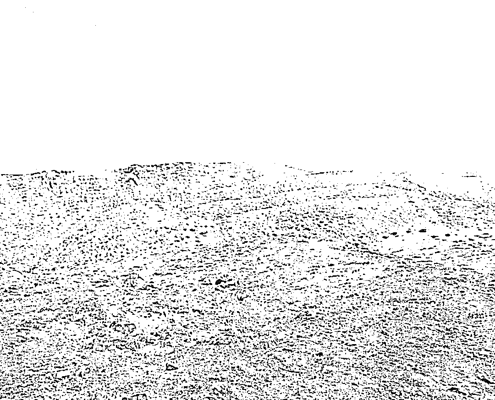

**十指失去知觉后及时下撤**

522 比赛日，早上，风和日丽，阳光甚好，坐摆渡车去起点之前甚至还有一丝暖意。

下摆渡车那一刻，天色转阴，随即起风，风力有四五级的样子。体感温度瞬间降低，参加百公里越野赛，开枪前我跑了两公里来热身，这是从来没有过的事儿，更麻烦的是，跑完这两公里，身上也没有热起来。

五月底，白银已经入夏，基于前几届的经验，冲锋衣并没有被列入强制装备，而是做为建议装备写进了赛事手册。关于这一点，没有人提出异议，我的冲锋衣装进了转运包，存放到赛道 62 公里处的 CP6 换装点，正常情况天黑前能赶到这里。

哦，还有一点是，组委会收集转运包的时间是在赛前一晚，如果是比赛当天早上，可能很多人就会把冲锋衣穿在身上了。

这个比赛因为前十名的高奖金，即便拿不到名次奖金，也还有 1600 元补助兜底，所以每年高手参赛的比重都不低。比赛开始，大神们很多都穿着短袖短裤，等待起跑的时候都哆哆嗦嗦的，枪一响，都箭一般冲了出去。

开跑就是几公里的盘山路陡下坡，大家都是想借助下坡迅速让身体热起来，起码我是这么想的。

问题是，9 点整比赛开始，风力有增无减，这个长下坡，不知道有多少人帽子直接被吹飞，又停下来返回捡帽子。

起点到 CP1，这段基本在景区内跑，在石林的夹缝中跑，高大的石林挡住了风。过了 CP1 之后，就是一马平川的戈壁，但到 CP2 之前大部分赛道是顺风，也还好。

我到 CP2 之前，就开始下雨了，从零星的雨点，到比零星更密一些的雨点。这时候大概是 10 点半前后。

过了 CP2 之后，才是真正的麻烦来临。

首先是逆风，风力已经加大到七八级，雨更密了，风裹挟着雨点打到脸的，像密集的子弹打过来一样，真疼。眼镜被雨水糊住，眼睛在强风密雨下也睁不开，只能眯着缝儿，视线受到严重影响。

<mpvideosnap class="js_uneditable custom_select_card channels_iframe" data-pluginname="videosnap" data-id="export/UzFfAgtgekIEAQAAAAAAMSoDMlAzVgAAAAstQy6ubaLX4KHWvLEZgBPEy6NgByt3NID_zNPgMIvMsh58PLGg1bcAoBlxqNZi" data-url="https://findermp.video.qq.com/251/20304/stodownload?encfilekey=XGocBFxVWK5dcyOOqpEU47RpBHQIvlhnTyAia7HPS3HIqYopzq6wicjAf6aRglyJFvHZAPredv6E7arDpklndtibgbmNtWha29AYLJ0HIPNlKQlb7UH01SOMmSglDRU7I0ibBTPUO1aRY5dKLzuL6PtGKzZOcmBhp7w0jQEHDtQLIHaKib9CqVgLeyg&amp;adaptivelytrans=0&amp;bizid=1023&amp;dotrans=0&amp;hy=SH&amp;idx=1&amp;m=9ba0986161ea476a990e3bff876f5848&amp;token=cztXnd9GyrG0x7aBXH688RC0KQbu28KB51D4o3Qc4o9JT89jMOFOEn44EEMNnsaF" data-headimgurl="http://wx.qlogo.cn/finderhead/Q3auHgzwzM7mDc4Xrwibb2bXKKDYGGXJjXJCKiaC29IWKmPCLBBHonmg/0" data-username="v2_060000231003b20faec8c5e58a1bc5d3cf0ce533b0771a0cdbb94f8e37fe3d7b8fc3e41b1194@finder" data-nickname="吃瓜不吐葡萄皮" data-desc="甘肃白银马拉松越野赛现场" data-nonceid="7209365824323168055" data-type="video"></mpvideosnap>

原本黄河石林的赛道，最难的部分就在这一段，从 CP2 到 CP3，8 公里距离，爬升 1000 米，且只有爬升没有下降。山是石头与砂土混合的路况，很多段都非常陡。

在以往的比赛中，这一段都无比艰难，选手们需要手脚并用往上爬，这里是摩托车都上不去的，所以 CP3 不提供任何补给，这意味着，即便到达山顶，也没有可补充的食物、饮水，热水更是妄想，暴露的山体，更无处可休息，且无法在此处退赛。还要坚持到 CP4。

但 522 这一天，问题 N 倍放大，越往上爬，风越大、雨越大、温度越低，体感温度更低。

我在往上爬的时候，看到第一个从上面往下走的选手，说上面太冷了，受不了，退赛。第一时间我在想什么：就这样放弃一千六了吗？后来每念及，我都想抽自己。

继续往上爬，陆续又有几名选手下来。包括很大神的选手。

而我的情况，越来越不好。全身都已经湿透，包括鞋子袜子全部都湿了，风吹的站不住，非常担心被吹倒，冷的愈发受不了，找了一个相对避风的地方掏出保温毯，裹在身上，瞬间就被风吹散开，什么用都没有。还有选手的保温毯，直接被大风给撕碎了。

我戴一副无指手套，用登山杖，手冻的受不了，就把登山杖夹在腋下，慢慢往山上走。

很快，发现十根手指都没有感觉了，这是在除东北的冬天外从未发生过的情况。把手指放嘴里含着，感觉含了很久，但手指仍然无感觉，同时觉得舌头也冰凉了。

这个瞬间，我果断决定退赛，下山。

既然下山，就肯定想尽快下去，尽快回到暖和的地方，但，不可能。

上山容易下山难，这种很陡的地形尤甚。岩石是湿滑的，视线是模糊的，而身体，也开始不由自主地发抖，抖得没办法停下来那种。

一小步一小步地往下挪，而我觉得已经有迷迷糊糊的感觉了，越抖，这种迷糊的感觉越强，我只有一个信念，一定要坚持到山下，即便要倒，也要倒在山下。

我想我是幸运的，在最后时刻及时做了决定。做决定那一刻，应该是在失温的边缘徘徊，处在临界点上，毫厘之间，下山的时候，已经出现了失温的症状。

这样讲，如果我没及时下撤，接下来可能就是在我毫无提防的情况下，忽然倒下。

失温，太可怕了。何苦是这一天极端天气之下在最难的赛道路段选手们大面积失温。

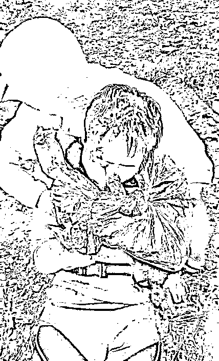

**朋友失联 一边刷消息一边流泪**

我撤到山腰，蓝天救援队的人员指引到一个小木屋，屋内已经有十位左右先撤下来的选手了。在小木屋等待救援的一个多小时时间，小木屋里选手的人数已经达到接近五十人。

<mpvideosnap class="js_uneditable custom_select_card channels_iframe" data-pluginname="videosnap" data-id="export/UzFfAgtgekIEAQAAAAAAEAkX9Y4bQgAAAAstQy6ubaLX4KHWvLEZgBPEx6NMIFdGNoD_zNPgMIuJBsvOlza2nSK7YzYb0Gqi" data-url="https://findermp.video.qq.com/251/20304/stodownload?encfilekey=XGocBFxVWK5dcyOOqpEU47RpBHQIvlhnA8qNblzKibzwwsaGWpuvkPoFoxFB1icZxjJcLdjug6sPDshxqEzVUxLYL43N5hJWNpJppZbOH8noPp8ibr3Dj4dm31jlsrmrv7ibEFmlL1ZcsuyGzyLAZmZDFdjBwUOlnKD7jjWic0eKicJH974LX5E0N7jg&amp;adaptivelytrans=0&amp;bizid=1023&amp;dotrans=0&amp;hy=SH&amp;idx=1&amp;m=8f18ecef49445b64942cd9b5110ad60c&amp;token=cztXnd9GyrHT1jF33iahtW95cROxfa9fk6uexNPiamVWx6eB5cLaoSkfibfhbLQq8F4" data-headimgurl="http://wx.qlogo.cn/finderhead/Q3auHgzwzM7mDc4Xrwibb2bXKKDYGGXJjXJCKiaC29IWKmPCLBBHonmg/0" data-username="v2_060000231003b20faec8c5e58a1bc5d3cf0ce533b0771a0cdbb94f8e37fe3d7b8fc3e41b1194@finder" data-nickname="吃瓜不吐葡萄皮" data-desc="甘肃马拉松参赛选手在小木屋等待救援" data-nonceid="10322404385825991432" data-type="video"></mpvideosnap>

我下山的时候，还没有见到躺在山上没有知觉的人，我下山的时候还有大部队选手们在上山。后面撤回到小木屋的选手们带回来的消息，都是一路上看到倒下来若干位选手，躺在路边一动不动的、已经口吐白沫的（各跑步群群已经都有视频），一位选手说，有一位六十多岁的老年选手，“已经不行了”，求蓝天救援队队员尽快上去施救，最终我们在小木屋里等到了这位老人，好消息是，他被扶进来时，嘴唇红润，应无大事。而面对选手们说的山上其他选手的情况，这个点位仅有的几名蓝天救援队队员也无能为力，一直在用对讲机和组委会联系。

这个路段，比赛难，救援更难。

撤下来的选手们说，看到路边躺着的人，有心无力，没办法帮助他们，自己都保不住自己。说这话时，他们眼圈都是红的。而我，联想到自己下山时那个情况，感同身受。

一个多小时后，山下上来一位救援人员，对小木屋里的下撤选手们说，车开不到这个位置，能动的，返回到 CP2 坐车回终点，不能动的，得继续等救援上来。

我和已经缓过来的一批人一起下山，回到 CP2，20 人坐进一辆中巴，我们这些，成为了山上第一批安全撤回到终点的选手。回到位于景区内的比赛终点，大概是不到 16 时。

返程的路上，有些人在一边刷比赛群一边流眼泪。

回到酒店后，我就不停地在刷选手们的位置，刷比赛群内的消息，到此刻，已经午夜。

下午的时候，大家都惦念着，要在天黑前把选手们都救下来啊，而现在，已经午夜。一批一批的消防、武警，从下午开始就陆续上山，救援力量一直在增加。

道听途说的、无法证实的、未经确认的信息很多，本文不谈。罗列一些了解到的事实部分——

有多位选手摔伤流血，伤情各异。

有多位选手滞留山上，他们情况各异。有失温的，有失温导致了更严重情况的，有几个人找到了一隅稍避风的地方抱团取暖等救援的，有个别一两个人具备超能力一直在赛道上前进到夜色降临后的。

国内多位越野顶级选手基本全部退赛，GPS 位置数小时未移动过，且部分人电话无信号，无法取得联系。

还有一个事实是，我很亲近的一位朋友，女生，在快到山顶的地方失温。她告诉我，她失温了，坐下来，后来是被另外一位女选手叫醒的，之后她发现她的腿摔破了流血，但她完全不记得腿是怎么摔破的。说明她在那段时间失去意识了，我告诉她：你要好好感谢叫醒你的小姐姐，你今天可能差点人就没了……

在文章最后，“流落南方”表示，以后参加类似的高海拔地区的比赛，一是带足救命的装备，二是在平时就要能做到正确认知自己的身体状况，三是面对比赛中的突发情况，及时果断做决定。

* * *

**最给大家分享野外生存指南---户外旅行必备**

随着生活水平的提高，越来越多的人喜欢上户外运动，到野外去旅行，回归到大自然享受慢生活。然而盲目的到野外旅行，风险非常大，稍不注意可能就有生命危险，所以一些基础的野外生存知 识要掌握一下，下面从几个方面来介绍野外生存必备的几个知识点。

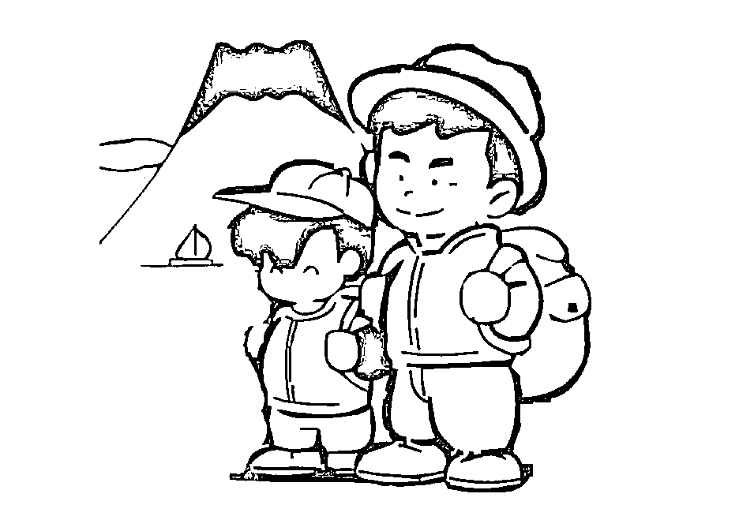

**衣物装备**

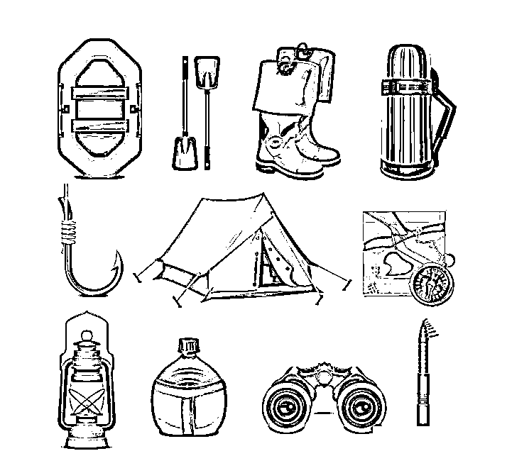

**内衣**

1，炎热天气,内衣首选棉质,触感好,容易吸汗;

2，寒冷天气，纯棉内衣被称为“死亡装备”,千万别穿。

毛质内衣是不错的选择,有伸缩性,穿上后可贴紧身体,被淋湿也不会有寒冷感。

内衣长度以能插进裤内、弯腰不会露背为宜，袖长与手腕平齐。

**外套**

1，首先考虑防风防雨功能,兼顾透气性和耐磨性。

野外生存难免遇到雨雪天气,外套材料最好能防雨水渗透;

运动过程中会出汗,外套透气以免潮湿积内不散。

2，长度最好盖过臀部。

寒冷的天气尤其要注意保暖,腰部一旦被寒气入侵,身体会感到严重不适。

3，外套最好有帽子,能在有风的时候护住头部。

4，能防蚊虫叮咬。

领口和袖口要有松紧性,以免蚊虫或爬行动物钻进衣服里。

5，选择颜色鲜艳的为佳,一旦出现紧急情况,容易被救援人员发现。

**鞋子**

1，选择棉袜,针织,纤维类袜子出汗后容易打滑。

2，选—双大小适当的旧鞋,新鞋还未经磨合,容易卡脚,而旧鞋与脚较为契合,穿起来舒适。

3，搭配一双舒适的鞋垫,棉质鞋垫可以吸收汗水,防止打滑。

**帽子**

1，寒冷的地方，帽子要能保暖,护住耳朵和颈部。

2，炎热的地方,要选择有帽檐的帽子,可以戴头巾,必要时把面部遮挡起来,防止阳光灼伤。

**手套**

1，首选防水、透湿性能好的手套,面料的抗撕裂性能也要好。

2，手套掌部应采用防滑、耐磨的胶粒革材料或真皮材料,增加摩擦力和附着力。

3，腕部应有弹性收紧设计和专业防水拉链，最好还设计有扣件和挂绳。

此外,护目镜、口罩、护膝和护肘在野外活动时能起到较好的保护作用。

**帐篷**

1，首选坚固耐用、携带方便、质量轻、有防雨功能的。

2，颜色最好是黄色、红色等亮色调的。

**急救包**

药片、创可贴、消毒水等。

睡袋、背包

挑选合适自己的。

**实用工具**

刀具、针线包、点火照明工具、导航工具、绳索,观察工具、别针、铅笔、塑料袋等。

此外,雨具、食物、炊具、清洗用品、通讯设备等也是有必要带的。

**总结**

野外生存,装备尽量要带齐全,另外要保证身体状况允许。

良好的心理素质,处事不惊,也是野外生存的必要条件。

**营地选择**

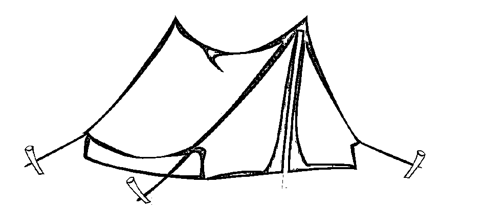

1，夏季,应选择在比较干燥、地势相对较高、通风良好、蚊虫较少的地方。

通风的山脊、山顶以及湖泊附近较为隐蔽的地方都可以。

2，冬季,应选择在避风、易于保暖的地方,比如森林里、旧房屋以及灌木丛中。

营地距离燃料水源等也不宜太远。

切勿在背风坡面或是悬崖下方搭建帐篷。

也不要在大石头或是金属物体上设立营地。

3，理想的地点应离水源较近,附近有充足的可利用树木。

但不能过分靠近,那样容易受到蚊虫的骚扰。

野生动物常常在夜间饮水,若被它们发现、安全会受到威胁。

4，在树林里露营，要先观察周围的树木上是否有蜂窝或者枯老的树木,不要在孤立的高大乔木下露营,容易成为雷击的目标。

5，蛇、蝎子活动频繁的季节要做好防范。

不要在野兽经常路过的道路上搭建帐篷,可以将帐篷建在有人类痕迹的地方。

**天气预测**

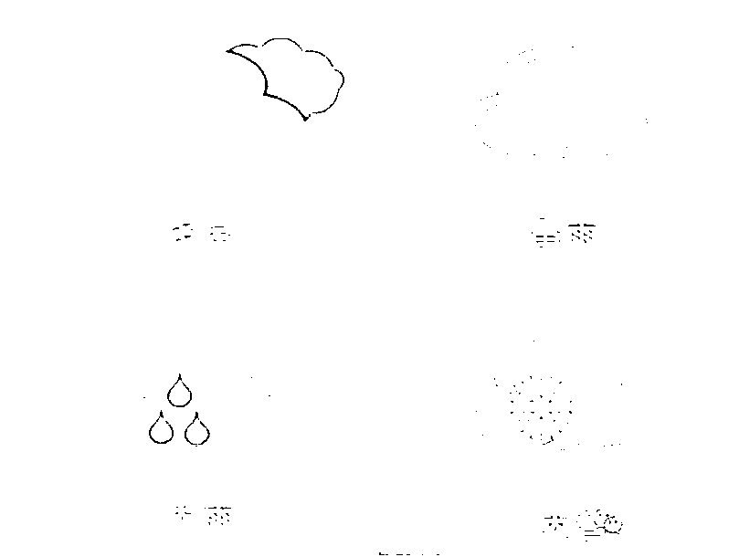

**山地天气**

1，天气变好的征兆

白天谷风自山下往山上吹,夜晚则由山峰吹向山谷;

白天山口有云团逐渐分化为气雾而消散。

傍晚太阳落山时,西边山谷上方出现橙色或玫瑰色的晚霞。

清晨地面有露水或是霜冻,傍晚山下有雾,夜晚天气较凉,天空星光稳定。

2，天气变坏的征兆

白天谷风从山顶吹向山谷,夜晚则从山谷吹向山顶;

清晨满山是雾,到了傍晚仍没有消散;

夜间气温升高，闷热;

黎明前星光闪烁不定。

**天空中的信息**

1，平晨出现灰色的天空,意味着又是干燥的一天;

2，清爽的夜空意味着美好一天的开端;

3，晴朗的夜空点缀—颗或者几颗星星,预示天气会有变化;

4，日华变大是天气晴朗的预兆,缩小的日华或月华意味着将要下雨。

**看云识天气**

1，“日落火烧云,明朝晒死人”:

如果日落时西边出现红云，第二天一定是大晴天;

2，“红云变黑云,必是大雨淋”:

如果随着太阳的升高,原先太阳初升时的红云变成了黑云,那么—场大雨即将来临;

3“早上云如山，黄昏雨连连”“早起乌云现东方,无雨也有风”:

这是在说,在夏天的早晨,如果东方一大早就出现了乌云,那么当天很可能会下雨。

**动物信号**

1，白天看见兔子寻找食物或是松鼠贮存粮食,天气可能会变得很糟糕;

2，蜘蛛忙忙碌碌地在网上添丝,表明天气可能会转好;

3，蜜蜂出窝天放晴;

4，蚯蚓和蛇都比较怕雨,在下雨前会爬出洞穴寻找适宜的环境。

**辨识可食用的植物**

如何在野外简单地鉴别食物是否有毒,可以采用以下的方法:

1，初步判断:嗅气味，将鼻子靠近植物的枝叶,若有强烈的刺激性气味,需要谨慎。

2，接触皮肤测试:折断植物茎干或者撕开叶子,等有液体流出时,将少量涂在肘部或手腕处,然后观察。皮肤红肿、灼热则该植物有毒性。

3，咀嚼之后做决定:选取植物的一小部分,用舌尖轻舔,没有异常再放入嘴里咀嚼,千万不要咽下,怪味植物要小心

4，煮过之后见分晓:用水漫泡 5 个小时以上,然后再品尝。

5，洒上食盐看颜色:将植物切开小口,洒上盐,切口不变色,这种植物相对安全。

这些植物可以吃:

1，野菜可以充饥:荠菜、苦菜、蒲公英、蕨菜，马齿苋、鱼腥草、竹笋、水芹菜、车前草、益母草、刺儿菜、扫帚菜;

2，菌类味道好:口蘑、鸡菌、猴头菇、牛肝菌、竹荪、鸡枞、青头菌、木耳;

3，野果可采食:山葡萄、茅莓、火棘、蓝锭果桃金娘、沙棘、橄榄等。

**教你如何生火**

在野外,火能用来取暖、烘干衣服,还可以驱赶野兽和蚁虫。

此外，火还可以将食物烤熟,将水煮沸进行消毒,遇到危险的时候还是最好的求教信号之一。

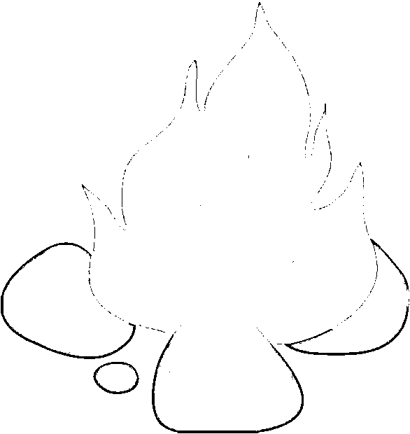

**打火棒**

打火棒的主体是一根镁合金棒,本身接触火源时不会燃烧,也不怕潮湿,只要用配套的刮匙或是小刀快速地垂直刮擦其表面,就能刮下—些碎屑,后者会在空气中迅速自燃。

**聚焦阳光取火**

凸透镜一面对准太阳,使阳光透过凸透镜聚焦到引|火物,进行生火。

凸透镜聚焦的阳光直接照射到单张纸或者树叶上,一般不易起火,只会烧成—个小黑洞，最佳的办法是把纸卷起来，或用细干草引火。

凸透镜哪里找?

1，望远镜、瞄准镜或者照相机上都会有，取下来即可;

2，打磨冰块成凸透镜；

3，大的透明塑料瓶、玻璃瓶。

**电池加铅笔**

将电池的正负两级接在削了本皮的铅笔芯两端,没多久,通电的铅笔芯会像电炉丝一样发热发红,将易燃材料放上去,火苗就会冒出来了。

**火石取火**

在“火石”周围放上引火物,然后用刀背等铁器敲打,使“火石”进出的火花落到引火物上。

开始冒烟后,慢慢地吹或煽即可。

**弓钻取火**

找—根强韧的树枝或竹条,将鞋带、绳子或皮带绑在树枝或竹条上,做成一把弓。

在弓上缠一根干燥的木棍,用它在一块木头上迅速地旋转,钻出的黑粉会冒烟产生火花。

**藤条取火**

把一根干燥的树干一头劈开,将劈开的裂缝撑住,使之有一定间隙，塞上引火物。

用一根长约两尺的藤条穿在火种后面,双脚紧踩树干,迅速地左右抽动藤条，使之摩擦发热而将火种点燃。

**辨别方向**

除了地图、指南针、GPS 定位系统等,大自然中有很多奇妙的规律可以帮助我们在野外辨别方向。

**太阳**

1，借助手表:手表必须是当地时间,且有时针、分针和秒针。

手表持平,若在北半球,将时针指向太阳,时针与 12 点的夹角的平分线所指方向即为正南方;

若在南半球,将 12 点的位置指向太阳,时针与 12 点的夹角的平分线所指的方向即为正北方。

2，树枝阴影:早晨，太阳从东方升起,一切物体的阴影都倒向西方;太阳落山时则相反。

**星座**

1，在北半球,找到北极星,基本就找到了正北方。

北极星是小熊星座中最亮的一颗。

北斗七星形状像勺子,从斗口边两星的连线向斗口外延长 5 倍左右,便可找到北极星。

2，在南半球，利用南十字星来定位。

南十字星由 4 颗亮星组成,其中最亮的两颗星连线的延长线即指向南方。

**风**

1，世界各地的季风变化是有规律的。

生长在空旷处的树木和灌木丛由于长期受到某一方向的风的吹袭,常会朝一边倒。

生长在热带地区的棕榈树则相反,有逆风生长的倾向。

2，一般来说,沙丘和雪垄的迎风面,坡度较缓;沙丘和雪垄的背风面,坡度较陡。

**植物**

1，蓄蓟通常生长在背阴且潮湿的树皮和岩石上;

2，寒冷地区,高大的植物通常都朝阳生长，阳光照射的一面长得比较茂盛；

3，有些花会向阳，随着太阳的移动而转动;

4，冷杉、云杉等在北坡生长得好;

5，马尾松、华山松、杨树等多生长于南坡。

**动物**

1，在干燥地区:若动物足迹都朝着同一个方向,则表明此方向通往水源地;

2，蚂蚁的巢穴:为了多得到阳光,蚂蚁的巢大多构筑在树根以南，南边修得平缓,北边比较陡峭。

**急救**

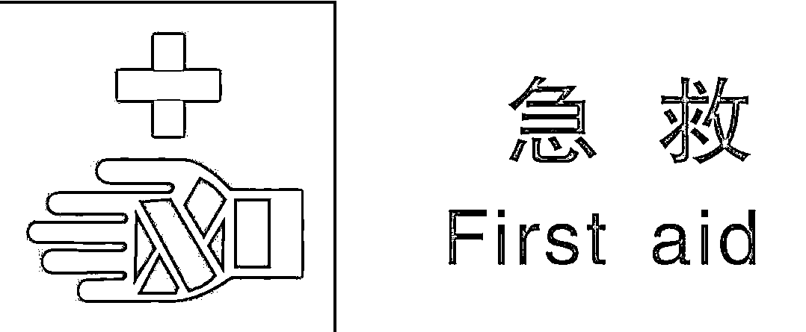

**出血急救**

1，包扎止血法:用绷带、三角巾、止血带等物品，直接敷在伤口或结扎某一部位。

2，指压止血法:较大的动脉出血后,用拇指压住出血的血管上方(近心端),使血管被压团住,中断血液。

但每次按压不要超过 10 分钟,否则会影响肢体血液供应。

3，一般小动脉和静脉出血可用加压包扎上血法。

较大的动脉出血,应用止血带止血。在紧急情况下,须先用压迫法止血,然后再根据出血情况改用其它止血法。

**骨折急救**

1，肢体骨折可用夹板和木棍、竹竿等将断骨上、下方两个关节固定,避免骨折部位移动,以减少疼痛,防止伤势恶化。

2，开放性骨折,伴有大出血者,先止血,再固定,并用干净布片或纱布覆盖伤口,然后速送医院救治。

切勿将外露的断骨推回伤口内。

3，疑有颈椎损伤的话,在使伤员平卧后,用沙士袋（或其他替代物)放置头部两侧以使颈部固定不动。

4，腰椎骨折应将伤员平卧在硬木板上，并将腰椎躯干及两下肢一同进行固定,预防瘫痪。

5，送医院诊治。

**溺水急救**

1，红保持呼吸通道顺畅、立即清除口、鼻内的泥沙、取吐物等。

松解衣领、纽扣、乳罩、腰带等。

2，控水(倒水)。

急救者一腿跪在地,另一腿屈膝,将溺水者腹部横放在其大腿上,使其头下垂,接着按压其背部,使胃内积水倒出。

3，人工呼吸与胸外心脏挤压和吸氧。

在运输中也不能停顿,坚持数小时至更长,判定好转或死亡,才能停止。

**求救**

国际通用的求救信号是 SoS,即三短三长三短,不断地循环。

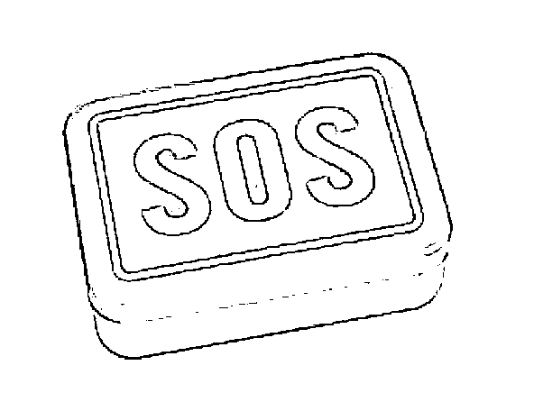

求救的方法有很多种，下面列举几种比较常用的方法。

1，放烟火

燃放烟火是最常见的求教方法。

白天用烟，即在燃火上放一些橡胶片、生树叶、苔藓、蕨类植物等,可以生成燃烟,以便通知外界。

夜晚用火应在开阔地上，向可能的居民区方向点三堆明火,用火光传达求救信号。

2，光信号

白天用镜子借助阳光,向可能的居民区或空中的救援飞机反射间断的光信号,光信号可传 16 公里之远。

方法是将一只手指瞄准应传达的地方,另—只手持反光镜调整反射的阳光,并逐渐将反射光射向瞄准的指向即可,夜晚用手电筒,向求救方向不间断的发射求救信号。

3，现代求救方法

随着时代的发展,各种现代求救设备逐渐普及。

如信标机、无线电通讯机、卫星电话等设备,如果有条件可以配备这些现代设备。

4，国际登山求救信号

手电筒照 6 次和吹哨子 6 次;挥舞某件东西 1 分钟,再停 1 分钟,然后不断重复发送信号。

回应信号是手电筒照 3 次，哨子吹 3 声或者挥舞 3 次。

5，染水剂若在船上发送求救信号,把一包染水剂投到水中，被染过的水域颜色鲜艳,容易被救援人员发现。

来源：上游新闻，吃瓜不吐葡萄皮

← 向右滑动与灰产圈互动交流 →

