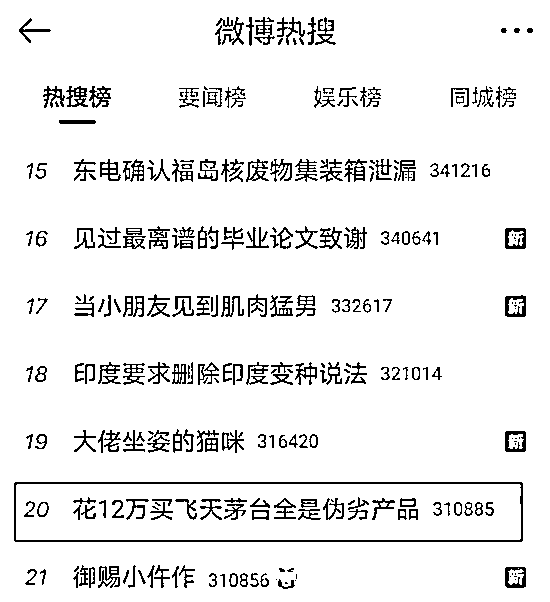
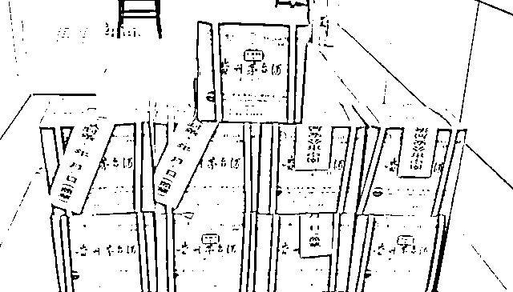
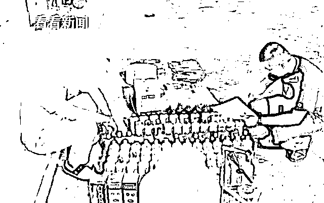
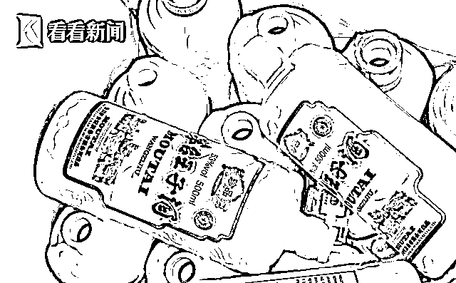
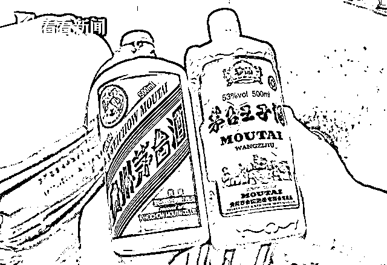
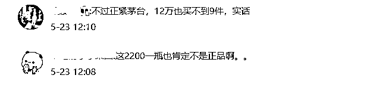
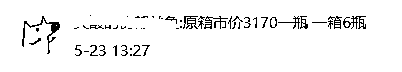
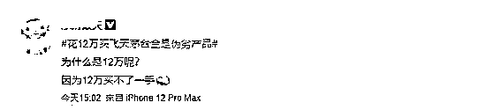
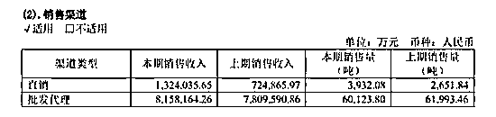

# 茅台，又又又上热搜了……这次是假茅台

> 原文：[`mp.weixin.qq.com/s?__biz=MzIyMDYwMTk0Mw==&mid=2247514859&idx=2&sn=392e6f0c0eaf2bd320e974fe10cebd8f&chksm=97cb71d3a0bcf8c592ccb4e14b71d07ccdeb57d4810c51e8d31b99ca764f50dd49398a36e600&scene=27#wechat_redirect`](http://mp.weixin.qq.com/s?__biz=MzIyMDYwMTk0Mw==&mid=2247514859&idx=2&sn=392e6f0c0eaf2bd320e974fe10cebd8f&chksm=97cb71d3a0bcf8c592ccb4e14b71d07ccdeb57d4810c51e8d31b99ca764f50dd49398a36e600&scene=27#wechat_redirect)

茅台，又又又上热搜了……不过，这次是假茅台。

5 月 22 日，南宁警方公布了一宗造假酒的案件：南宁某茶庄花了 12 万余元购买 9 件 500 毫升的 53 度贵州飞天茅台酒，结果却发现它们都是“山寨”货。随后，警方随后介入调查，发现嫌疑人周某回收酒箱、酒瓶、袋子，再用几百元的王子酒、汉酱等勾兑后倒入真酒瓶中，然后当作茅台以 2200 元左右的价格出售。

而整个造假过程中，除了酒是假的，瓶身、外包装等都是真的。

这一消息迅速登上了微博热搜。

南宁 20 岁男子网上自学制假技术

根据看看新闻的视频显示，去年 8 月，在南宁经营茶庄生意的郑先生发现，店里刚刚花 12 万元购买的一批高档飞天茅台存在猫腻——这批茅台酒的酒瓶瓶口比较松，粘合度较差，和以往买到的酒不一样。而且仔细观察发现，酒箱上的编码和酒瓶上的信息也存在差异。

南宁警方接到南宁某茶庄的报案后，立即联系厂家质检专员鉴定，最终确认这家茶庄分两批购入的 9 件贵州飞天茅台酒，都是伪劣产品。

茶庄的工作人员说，这些酒水均由一名年轻男子提供，对方自称是南宁某知名酒业公司员工。根据对方联系客户使用的电话号码，警方确认了嫌疑人的身份。

可由于那名男子没有固定住所与工作，行踪也极其飘忽。直到今年 5 月，警方才在嫌疑人位于良凤江某自建房内的落脚点将其锁定。

警方抓捕周某后，依法搜查了其造假作坊，里面堆放的全部是使用过的茅台王子酒瓶，以及飞天茅台酒的外包装、盒子以及箱子。

嫌疑人周某对其制售假酒的犯罪行为供认不讳。据周某供认，他之前曾兼职做过酒吧里的酒水推销人员，深知酒水销售的暴利。

特别是近年来，随着国酒茅台价格的上涨，市场供不应求十分热销。于是，他就萌发了用口味相近的低端酒勾兑成假茅台销售牟利的念头。他从网上自学相关的制假技术，并采购相应的制假工具及相关附属物后，从市内一些高档酒楼、饭店等场所回收空茅台酒瓶、包装箱（盒）等相关附属物。

为了躲避警方打击，周某四处精心选址，在位于良凤江边一处隐蔽的民宅租下一间出租房作为制假窝点。

同时，周某还冒充某知名酒业公司业务员，在市区各酒楼、茶庄、烟酒店等场所广发名片进行推售。

周某供认，一旦有订单上门，他就从市场采购口味相近的低端白酒，勾兑成假茅台进行销售。为了做到以假乱真的效果，他将低端白酒倒进真的空酒瓶之后，用压盖机把瓶子盖好，红绳绑好，再用吹风机对着瓶口均匀地吹，使瓶口更贴合瓶身。

据周某供认，经他勾兑制假的茅台每瓶成本在 600 元左右，再以 2200 多元的价格卖出。“哪想到刚做了一单，第二单还在送货时就被（警方）抓了。”

截至案发，周某共售出假冒的贵州飞天茅台酒 13 件，案值超过 20 万元。目前，周某已被依法刑拘。

网友：2200 元一瓶，怎么可能是真的？

网友们除了对制假售假的行为深恶痛绝，对于购买者也纷纷吐槽起来。

有网友表示，2200 元一瓶，肯定不是正品啊。

有经验的网友表示，原箱市场价 3170 元一瓶，一箱 6 瓶。 

还有网友表示，“为什么花 12 万买到假冒茅台，那是因为 12 万买不了一手茅台股

票。”

贵州茅台官宣：直销比重将继续增加

作为中国人请客吃饭是重要的“面子工程”，贵州茅台造假的事情时有发生真茅台一瓶难求，部分人只好托关系，找熟人购买，本来以为是靠谱的渠道却变成最不靠谱的事情。 

2018 年以来，茅台加速直销渠道建设，对违规经销商进行清理整顿，并成立集团营销公司，大力发展团购、商超、电商等直营渠道。

在直销渠道改革背景下，茅台酒直营比例放大带动吨价持续提升。2020 年，公司直销收入达 132.4 亿元，同比增长 82.66%，占比由 2019 年的 8.49%提升至 13.96%，直销渠道吨价达 336.73 万元。

批发代理渠道 2020 年销售收入达 815.82 亿元，同比增长 4.46%，增速明显放缓，而批发代理渠道销量在 2020 年也有所下滑。吨价方面，批发代理渠道销量吨价为 135.69 万元，只有直销渠道的 1/3 左右。

茅台董事长高卫东表示，近年来，公司为巩固和强化自营公司功能定位和市场调控能力，致力于自营公司网络布局的发展和客户资源的拓展，目前自营公司销售占比已大幅提升。2021 年，公司已在重庆增设 1 家自营店，接下来，还将根据市场需求继续增加网点设置。

警察叔叔反复提醒，没有买卖就没有伤害。想要买到真的茅台，还是要去正规渠道。 

来源：中国基金报 、南宁晚报、看看新闻等

← 向右滑动与灰产圈互动交流 →

