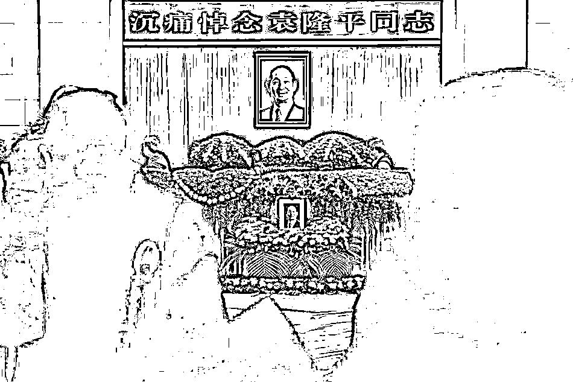
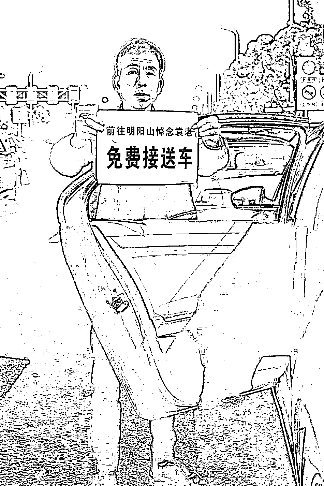

# 此刻，一起送别袁老！

> 原文：[`mp.weixin.qq.com/s?__biz=MzIyMDYwMTk0Mw==&mid=2247514859&idx=3&sn=587839dabf8d72260f74a332d9bc540b&chksm=97cb71d3a0bcf8c577bbfa653b9962e8d15a6ea37d1e486ebdb60368ebea5d6c6406865e8b02&scene=27#wechat_redirect`](http://mp.weixin.qq.com/s?__biz=MzIyMDYwMTk0Mw==&mid=2247514859&idx=3&sn=587839dabf8d72260f74a332d9bc540b&chksm=97cb71d3a0bcf8c577bbfa653b9962e8d15a6ea37d1e486ebdb60368ebea5d6c6406865e8b02&scene=27#wechat_redirect)

5 月 24 日 10 时

“杂交水稻之父”“共和国勋章”获得者

袁隆平院士遗体送别仪式

在长沙市明阳山殡仪馆铭德厅举行

[`mp.weixin.qq.com/mp/readtemplate?t=pages/video_player_tmpl&action=mpvideo&auto=0&vid=wxv_1882914640645390343`](https://mp.weixin.qq.com/mp/readtemplate?t=pages/video_player_tmpl&action=mpvideo&auto=0&vid=wxv_1882914640645390343)

（视频来源：央视新闻）

早上近 9 时许

已有众多长沙市民

手持鲜花赶来送袁老最后一程

[`v.qq.com/iframe/preview.html?width=500&height=375&auto=0&vid=i32480hdpar`](https://v.qq.com/iframe/preview.html?width=500&height=375&auto=0&vid=i32480hdpar)

**有一种致敬** 

**是“不远千里，送您一程”**

致哀的鲜花汇成海洋

**有一种缅怀**

**是“感恩国士，吾辈奋进”**

大家写给袁隆平院士的书信 

字字动人

“听着您故事的孩童长大了

我们会顶起国家的未来”

“我们会继续努力

做到‘医食无忧’”

……

**有一种纪念** 

**是“无以为报，光盘致敬”**

网友们纷纷晒出光盘

“从此以后，碗中有米，心中有您”

“天天光盘行动

就是对袁爷爷最好的纪念”

……

## **昨晚
很多市民前来送别袁老**

2021 年 5 月 23 日晚，长沙下了一天的雨终于停了。尽管已是深夜 11 点，但明阳山殡仪馆前依然有众多前来悼念袁隆平院士的民众。

2021 年 5 月 23 日晚，湖南长沙，依然有民众自发前往明阳山殡仪馆悼念袁隆平院士。澎湃新闻记者 朱伟辉 图来自全国各地的民众有序排队，在明阳厅袁隆平像前鞠躬悼念，献上鲜花，追思缅怀袁老。人群中有老人，有小孩，有和家人一起，有和朋友一起，不少民众还带着受外地朋友委托代献的鲜花。

民众前往明阳山殡仪馆悼念袁隆平院士

民众有序排队进入明阳厅

明阳厅外，悼念的鲜花已摆放了 10 多米长，2 米多高。还有许多全国各地的网友，通过外卖小哥，将鲜花等送到明阳山殡仪馆，以此来悼念袁隆平院士。

整个灵堂内也堆满了送别的鲜花，鲜花上留着民众对袁老的缅怀：“从此以后，碗中有米，心中有您”、“奇迹来自泥土。一颗种子，改变世界”、“袁隆平爷爷，一路走好”……

——“从此以后，碗中有米，心中有您”

——“奇迹来自泥土。一颗种子，改变世界！袁院士，一路走好！”

——“感谢您，毕生发光发热，坚守使命！我们定会心存感恩，珍惜当下！致谢致敬国士袁老！”

——“袁隆平爷爷，一路走好”任女士带着两个儿子前来献花，表达对袁老的悼念，“虽然孩子还小，但是也一定要让他们知道，是袁老让我们不再挨饿。”任女士说。

任女士和两个儿子向袁隆平院士献花。夜已深，明阳山殡仪馆外，不少出租车司机自发前来免费接送前来悼念的民众，左师傅是其中一位，据他了解大约有 500 多位同行自发前来。“我是今天上午来的，尽自己一份力，免费接送悼念民众往返高铁站。”他对记者说。

左师傅自发前来免费接送前往悼念的民众

91 秒追忆袁隆平

[`mp.weixin.qq.com/mp/readtemplate?t=pages/video_player_tmpl&action=mpvideo&auto=0&vid=wxv_1882854432334217221`](https://mp.weixin.qq.com/mp/readtemplate?t=pages/video_player_tmpl&action=mpvideo&auto=0&vid=wxv_1882854432334217221)

禾下乘凉梦，仓满无饥恐。
再送袁老一程！
粒粒皆辛苦，后辈不敢忘！

袁老，走好！

来源：看看新闻 Knews、央视新闻、新华社、人民日报、北京日报、红网、澎湃新闻、中国青年报

****

****

**← 向右滑动与灰产圈互动交流 →**

****