# 公安局紧急公布 2021 新型毒品，害惨很多人！

> 原文：[`mp.weixin.qq.com/s?__biz=MzIyMDYwMTk0Mw==&mid=2247514859&idx=5&sn=69e0533e0cc3a72896f0427c59e5f8a5&chksm=97cb71d3a0bcf8c57aeec08ee68c3ad85c9608b4e2b65df4cc1c397efad8c028c8d16afcb94c&scene=27#wechat_redirect`](http://mp.weixin.qq.com/s?__biz=MzIyMDYwMTk0Mw==&mid=2247514859&idx=5&sn=69e0533e0cc3a72896f0427c59e5f8a5&chksm=97cb71d3a0bcf8c57aeec08ee68c3ad85c9608b4e2b65df4cc1c397efad8c028c8d16afcb94c&scene=27#wechat_redirect)

**毒品的分类**

按来源分，**天然毒品、半合成毒品、合成毒****品**是三兄弟。天然毒品与合成毒品完全可以顾名思义，半合成毒品则是由天然毒品与化学物质精炼而成。

从对人中枢神经的作用看，毒品也可分为**抑制剂**、**兴奋剂**和**致幻剂**。

隐退于浮华之后，毒品的自然属性其实是分为**麻醉药品**和**精神药品**的；如果你一定要按辈分算，那就是**传统毒品**与**新型毒品**了。

**毒品都有哪些？**

**鸦片**，我国近代史开端的象征符号，堪称毒界鼻祖！鸦片由罂粟果的汁液烘干制成，初次吸食，容易恶心呕吐、头昏乏力甚至焦虑，长期服用包你不安流泪、发抖寒战；境界上升到一定层次后，昏迷、呼吸抑制、低血压也不再是梦想了。

**海洛因**，化学名“二乙酰吗啡”，医学上曾广泛用于麻醉镇痛，长期使用可享受体内免疫功能迟钝的"乐趣"，甚至达到心肝肾残损的极致药效。海洛因号称毒品之王，是常见的毒品走私案主角！

**大麻**，其体内的“四氢大麻酚”，于它是防晒乳，于我们是兴奋剂。不是随便什么种类的大麻都能评上毒品呢，傲视群“麻”的印度大麻，骨子里就透着"王者风范"，当代版《监狱风云》的主角们都对它顶礼膜拜……

**可卡因**，强效的中枢神经兴奋剂和局部麻醉剂，局部麻醉外送刺激大脑皮层，兴奋中枢神经。

**冰毒**，结晶体纯白无暇，能有效刺激你的中枢神经系统，让你兴奋不已，妄想、好斗、错觉如同家常便饭；天马行空、演反派或唱神曲，都是你的精彩！PS：我才不会告诉你它有损心脏和大脑，会导致死亡，免得你也去《绝命毒师》剧组抢风头。

**摇头丸**，冰毒它大侄儿，幻觉无极限，节操无底线。

**常见的新型毒品**

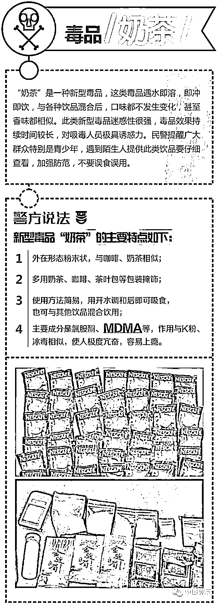

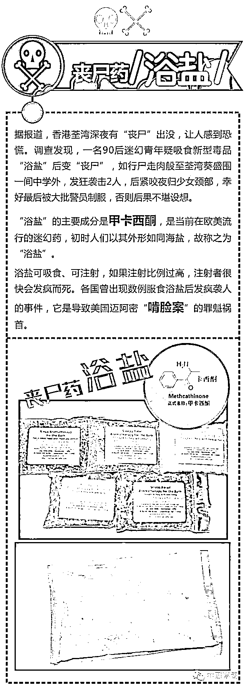

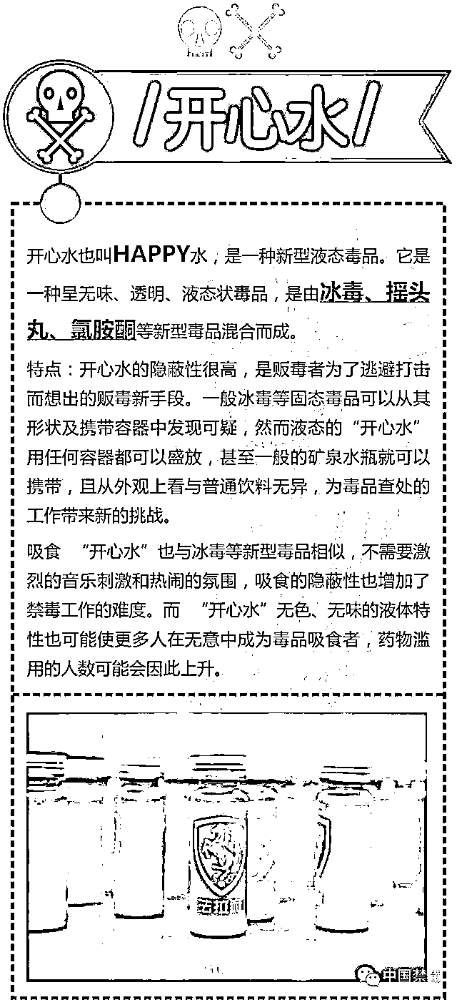

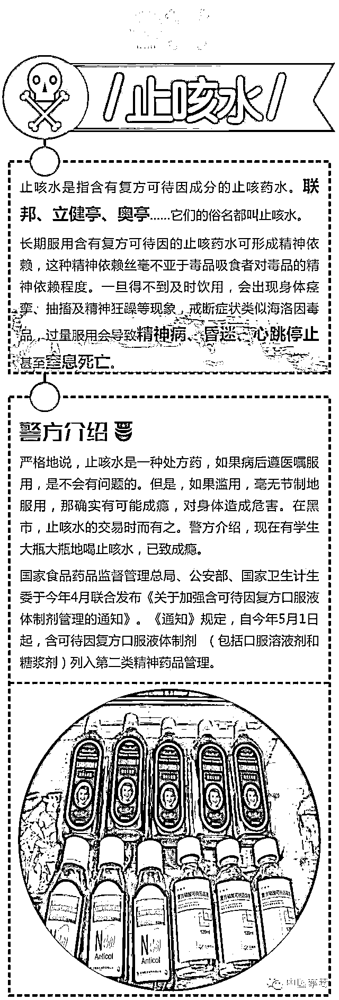

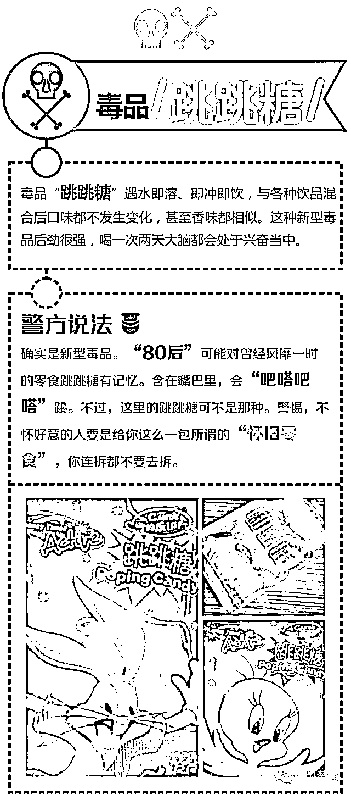

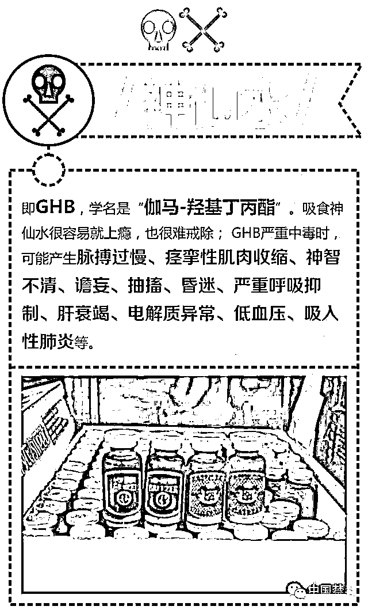

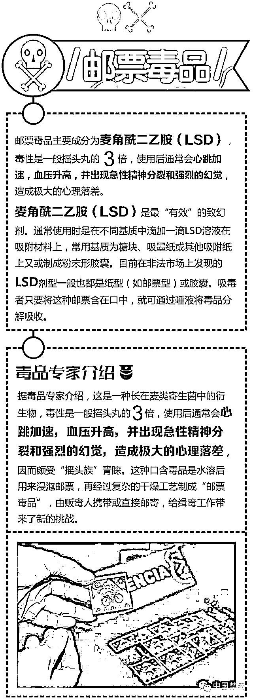

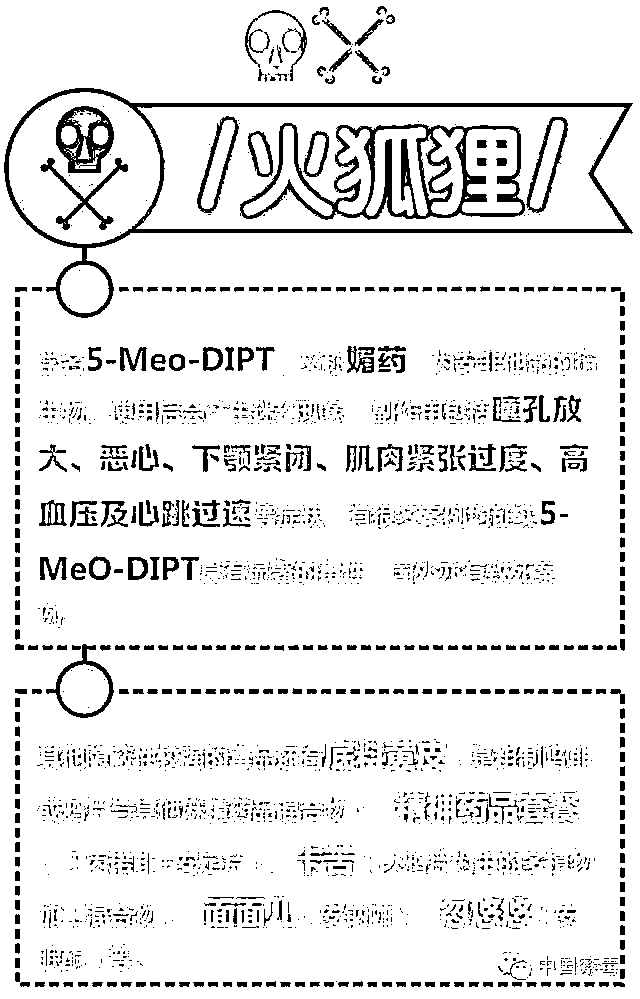

**一些常见的毒品的辨识方法教给大家**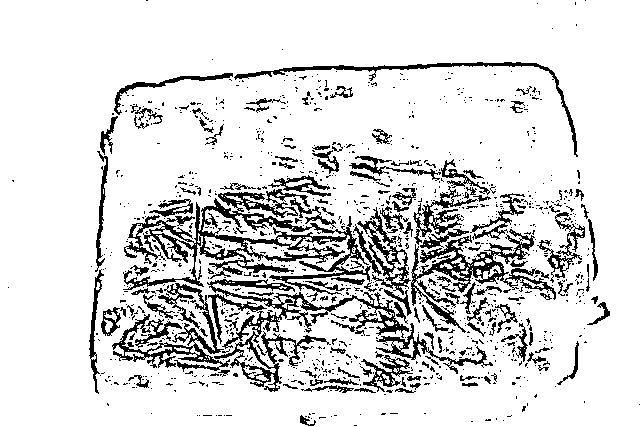

鸦片

海洛因

鸦片为一种黑褐色膏状物，有一种特殊的呛人的气味，没有嗅过的人如果近闻，可刺激你不自禁地打喷嚏。仔细嗅之，其气味中包含蜜糖、烟叶及石灰水等杂味。 

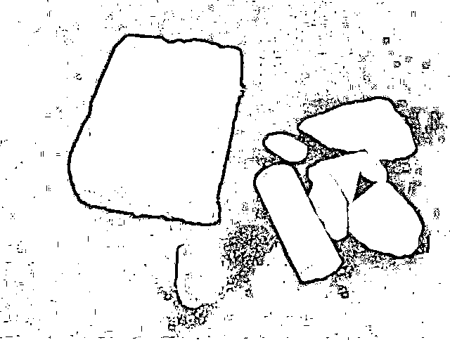

海洛因

海洛因成品的包装为灰白色长方扁块，一般为塑料薄膜热封，外面通常用黄色不透明的胶带纸缠绕，有 250 克、350 克等不同规格包装。零散毒品交易中的海洛因，一般用方形或长方形白纸包装，现在也发现有用邮票袋、小胶囊包装的，每包 0.1 克到 1 克不等。海洛因毒品一般为白色或灰色块状、粉未状物质，也有棕色较潮湿粉未状物质，还有一些因掺入其他物质后呈浅黄色、灰色等。大多数海洛因毒品均有醋酸气味。如果发现这种特殊包装的小纸包，应引起高度重视。

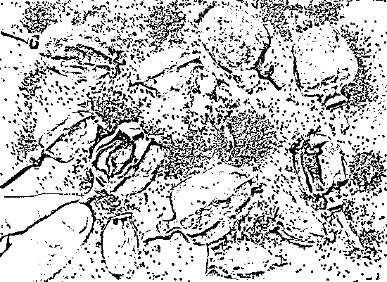

罂粟壳

火锅和食物中的罂粟壳：

第一，从外观上识别。罂粟壳外形为枣核形，如鸽子蛋大小，一头尖，另一头呈 9-12 瓣冠状物。其壳体上往往有人为切割的多道刀痕。 

第二，初吃加了罂粟壳的火锅和卤制品后，一般有心跳加快、脸微红、口感舒服，吃后不易入睡等感觉。 

第三，如觉得吃的火锅和卤制品后可疑，要揭露这种犯罪，就需要留下不少于 50ml 的火锅汤(最好取下层含油少的汤)，送到当地的毒品检测机构或公安局的刑事技术化验室进行成分分析。

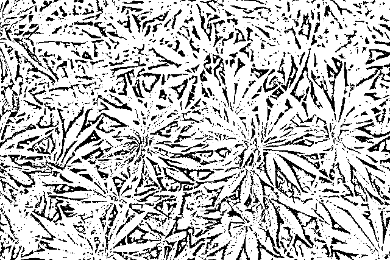

大麻

大麻

大麻是荨麻目大麻科草本植物，特指雌性植物经干燥的花和毛状体。成品大麻的颜色和外观：干草，灰绿色至棕灰色，点燃后奇香。滥用方式：烟吸。如果您或有人吸食自己卷的香烟，而烟丝的颜色与平时可见的烟丝颜色不一样，请引起高度重视或警惕。

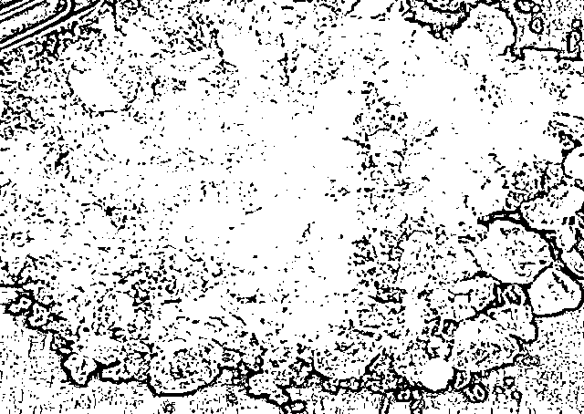

冰毒

冰毒

冰毒，即甲基苯丙胺，因其原料外观为纯白结晶体，晶莹剔透，故被吸毒、贩毒者称为“冰”（Ice）。包装多种多样，有用小的自封袋、邮票袋或白纸包装，颜色和外观：纯白结晶体，晶莹剔透，易溶于水，略带苦味，外观似冰。

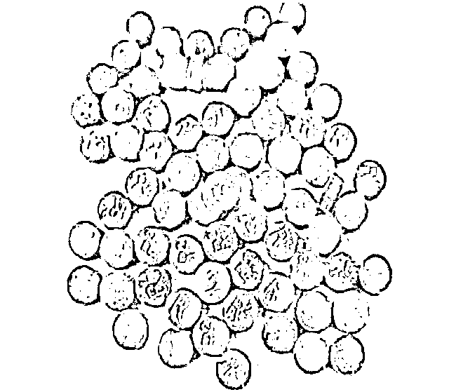

麻古

麻古 

摇头丸和麻古、麻果之所以被人们这么称作，其主要成分是冰毒，是一种加工后的冰毒片剂，外观与摇头丸相似，颜色与外观：通常为圆形片剂，有玫瑰红、橘红、苹果绿等，药片上有时和摇头丸一样，印有皇冠、花朵、英文字母，与冰毒有一样的危害。

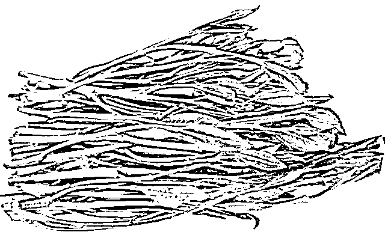

阿拉伯茶

阿拉伯茶

恰特草俗称“阿拉伯茶”，价格便宜，毒性惊人，极易精神成瘾！其外形极具迷惑性，稍不注意就会以为是茶叶或者青菜。这是到目前为止，杭州唯一查获过的一种伪装类毒品。阿拉伯茶最麻烦的一点，是它的外形实在是太有欺骗性了。很多吸毒者是直接嚼食的，所以万一有人递给你这么一片“树叶”，让你咀嚼一下，千万要说不。阿拉伯茶的叶子含有兴奋物质卡西酮，对人体中枢神经具有刺激作用，长久嚼食会染癖成瘾。

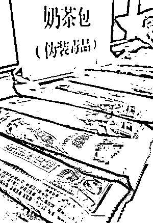

奶茶

奶茶

“奶茶”外在形态粉末状，多用奶茶、咖啡、茶叶包等包装掩饰﹔即冲即饮，冲泡后散发奶茶香味，但却混合了冰毒、K 粉，成瘾性强，毒性巨大。奶茶其实是一个伪装类别的统称，统一是小袋装式的伪装。不法分子往往装出好心，给要下手的对象泡上一杯，像个“暖男”一样，还美其名曰解解渴。尤其是妹子们，一定要小心这类陌生人。

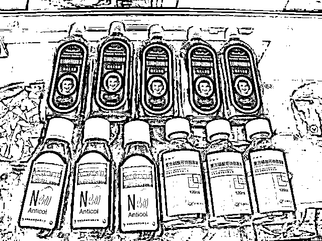

止咳水

止咳水

联邦、立健亭、奥亭……它们的俗名都叫止咳水，主要成分为磷酸可待因，其代谢物就是吗啡。近年来，止咳水在青少年中被大量滥用。现在有学生 10 毫升一袋的奥亭一次要和 30 袋，吗啡的成瘾性就凸显出来了。严格地说，止咳水是一种处方药，如果病后遵医嘱服用，是不会有问题的。但是，如果滥用，毫无节制地服用，即可能成瘾，对身体造成危害。特别要提醒家长朋友注意的一点是，很多孩子把止咳水兑上可乐饮用。

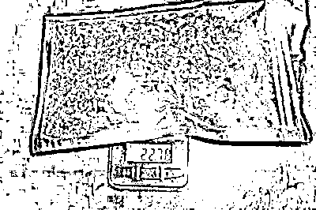

干花

干花

“干花”其实是大麻类毒品的替代品。他们把 K3 稀释后浸泡在花叶上，然后将其晒干。那么 K3 是什么呢？K3 是化学名称为“AM-2201”的合成医药中间体，而这种物质由另一种名称为“JWH-18”的化学物经氟化而成，而“JWH-18”也称“K2”，“AM-2201”则称为“K3”。它们都是一种类大麻活性物质，使用后会出现紧张、焦虑、呕吐、妄想、精神混乱、恍忽、心跳加速等症状。干花具有欺骗性，一是可以躲过检查，同时在吸食时，也会造成假象。他们想吸引别人吸食的时候，会说，这只是一种好闻的花儿，容易使人上当，不知不觉中成了毒品的吸食者。”

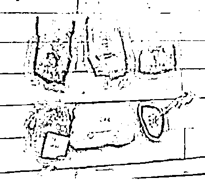

红冰

红冰

红冰形如紫晶，状如大粒海盐。它的威力至少是普通冰毒的两三倍。一旦吸上便深陷毒瘾，而且用量持续增长，吸毒人称染“红冰”者命就不长了。这是最近两年才出现的毒品类型。

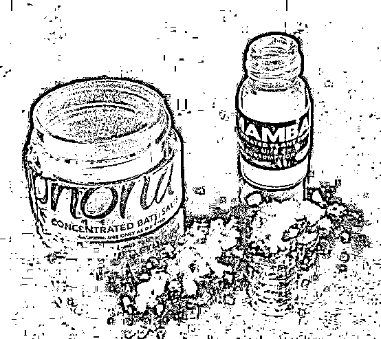

浴盐

浴盐

浴盐是一种新型的致幻剂，颜色斑斓。实际上是一种高效精神类药物——卡西酮的高纯度结晶。“浴盐”是现今最厉害的毒品。食用后会感觉自己是个巨人，并且刀枪不入。国外曾有案例，吸食“浴盐”后吸毒者把对方几乎 80%的脸啃了下来。这种浴盐颜色往往五彩缤纷，极有诱惑力。

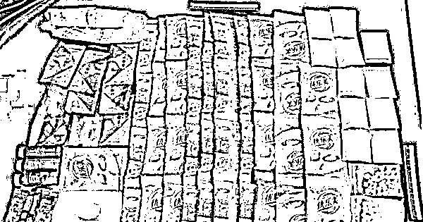

跳跳糖

跳跳糖

跳跳糖遇水速溶、即冲即饮，与各种饮品混合后口味都不发生变化，甚至香味都相似。这种新型毒品后劲很强，喝一次两天大脑都会处于兴奋当中。“80 后”可能对曾经风靡一时的零食跳跳糖有记忆。含在嘴巴里，会“吧嗒吧嗒”跳。不过，这里的跳跳糖可不是那种。警惕，不怀好意的人要是给你这么一包所谓的“怀旧零食”，你连拆都不要去拆。

来源：蜀黍家

← 向右滑动与灰产圈互动交流 →

