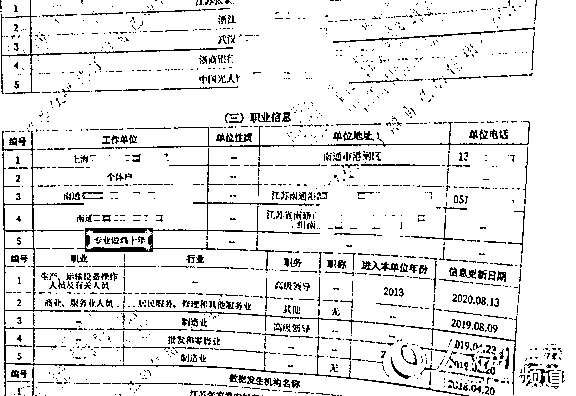
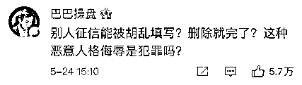
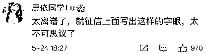

# “专业做鸡十年”？？

> 原文：[`mp.weixin.qq.com/s?__biz=MzIyMDYwMTk0Mw==&mid=2247514936&idx=4&sn=1cea7954ad3d36a840962c4e693566c8&chksm=97cb7000a0bcf9166ba6c706d2700c49fb7eacaecd099a5e9d21fe26d6adf17215cce38e7b09&scene=27#wechat_redirect`](http://mp.weixin.qq.com/s?__biz=MzIyMDYwMTk0Mw==&mid=2247514936&idx=4&sn=1cea7954ad3d36a840962c4e693566c8&chksm=97cb7000a0bcf9166ba6c706d2700c49fb7eacaecd099a5e9d21fe26d6adf17215cce38e7b09&scene=27#wechat_redirect)

近日，江苏南通市民房女士在查询个人征信时发现，其职业信息“工作单位”一栏中竟然出现了 “专业做鸡十年”字样。

中国人民银行太原中心支行 25 日表示，针对这一问题，人民银行太原中心支行于 4 月 8 日约谈了晋商消费金融股份有限公司（以下简称“晋商消费金融公司”），5 月 25 日，再次约谈晋商消费金融公司。

### 房女士征信报告职业信息里赫然写着“专业做鸡十年”字样。当事人供图

**侮辱字眼上了市民个人征信报告******

****做个体户的房女士与晋商消费金融公司之间存在借贷关系。房女士介绍，2018 年 4 月，她在位于南通中南大厦的晋商消费金融公司分支机构签署了一份 16.2 万元的个人消费贷款合同，贷款期限约定 36 个月。****

****经人民银行南通中心支行了解，去年 2 月，房女士向晋商消费金融公司提出因疫情影响延期还款，后者为其延至 2020 年底再接着还款。房女士称，按照晋商消费金融公司的算法，截至目前，她尚需偿还本息 7 万余元。****

****4 月 6 日，房女士在人民银行南通中心支行查询个人征信发现上述问题后甚为惊愕，随后向该行进行了反映。****

******征信报告怎么会有这样的字眼？******************

******这一事件被报道后，迅速引发关注，一度冲上微博热搜。许多网友表示“不可思议”。******

************

************

************

************

******对此，人民银行南通中心支行征信管理科科长姜文华在接受人民网记者采访时解释，央行征信系统是一个平台，数据都是由相关金融接入机构传送，谁传送谁负法律责任；当事人如有异议，可走征信异议处理程序。******

********“经向晋商消费金融公司核实，他们承认不当信息是由他们上传到征信系统的。”**姜文华表示，人民银行实行属地管理，因晋商消费金融公司已经撤销南通分支机构，他们遂将房女士反映的情况上报至人民银行南京分行，再协调人民银行太原中心支行处理此事。4 月 6 日当天，人民银行太原中心支行即责令晋商消费金融公司在线修改了房女士的相关职业信息。******

****据媒体报道，房女士表示已委托了律师，准备向法院起诉维权，“我希望他们能够尽快给予一个书面调查结果，登报公开道歉，并给予一定的精神赔偿”。****

******央行太原中心支行最新通报：严肃追责******************

******中国人民银行太原中心支行 25 日通报称，针对晋商消费金融公司“个人征信报告出现侮辱性字眼”问题，已于 4 月 8 日约谈了晋商消费金融公司，**5 月 25 日，再次约谈晋商消费金融公司。********

****有关情况如下：****

****2021 年 4 月 6 日，客户向人民银行南通市中心支行投诉称其个人征信报告“工作单位”里出现侮辱性字眼。4 月 8 日，人民银行太原中心支行根据南通市中心支行情况通报，约谈晋商消费金融公司，要求其依法核查情况，对错误信息立即予以更正，并做好与客户的沟通，维护客户合法权益。随后，人民银行太原中心支行对晋商消费金融公司征信业务情况开展了实地核查。5 月 25 日，人民银行太原中心支行主要负责人再次约谈晋商消费金融公司及其大股东，在重申监管意见的基础上，严肃提出后续整改要求：****

****一是要深刻反思事件经过，主动回应客户诉求，消除不良影响；****

****二是要深入调查事件原因，严肃追责；****

****三是要全面梳理内部工作流程，进一步加强内控管理，切实履行征信信息采集报送主体责任，保障金融消费者合法权益。****

****下一步，**人民银行太原中心支行将对本次事件情况调查核实后，依法依规作出严肃处理。******

******专家观点：这显然是一种违规行为******************

******中关村互联网金融研究院首席研究员董希淼表示，金融机构有权限上传征信的相关信息，但这并不意味着可以乱写信息。******

******央行征信中心对如何在征信系统上传信息都有明确的规定，这种显然是一种违规行为。同时也可以看出，相关金融机构的内控存在较大问题，员工素质和职业道德也有严重问题。******

******在董希淼看来，这件事也提醒金融机构要注意两方面问题，一方面要保证逾期、拖欠等信息及时准确的上传，这是构建诚信社会，提高整个社会信用水平、诚信水平的重要手段；另一方面也要保护消费者包括名誉权在内的合法权益，建立相应的惩戒机制。******

******同时，董希淼强调，不能单依靠金融机构的自主自觉，相关主管部门也要出台更加细致、执行性更强的规定，加强对执行情况的检查督促，对存在的违规违法行为进行处罚。******

******另据媒体报道，上海大邦律师事务所律师游云庭分析称，“个人征信报告出现侮辱人的字眼，严重侵害了房女士的名誉权”，主要责任在信息上传者（晋商消费金融公司），但征信机构（人民银行南通中心支行）也有审核责任。******

******陕西恒达律师事务所高级合伙人、知名公益律师赵良善持同样观点。赵良善建议，房女士可先与对方协商，如协商不成可诉诸法院，由法院公正裁判。******

******来源：红网，中国新闻网、人民网、红星新闻、中新经纬******

************

******← 向右滑动与灰产圈互动交流 →******

************