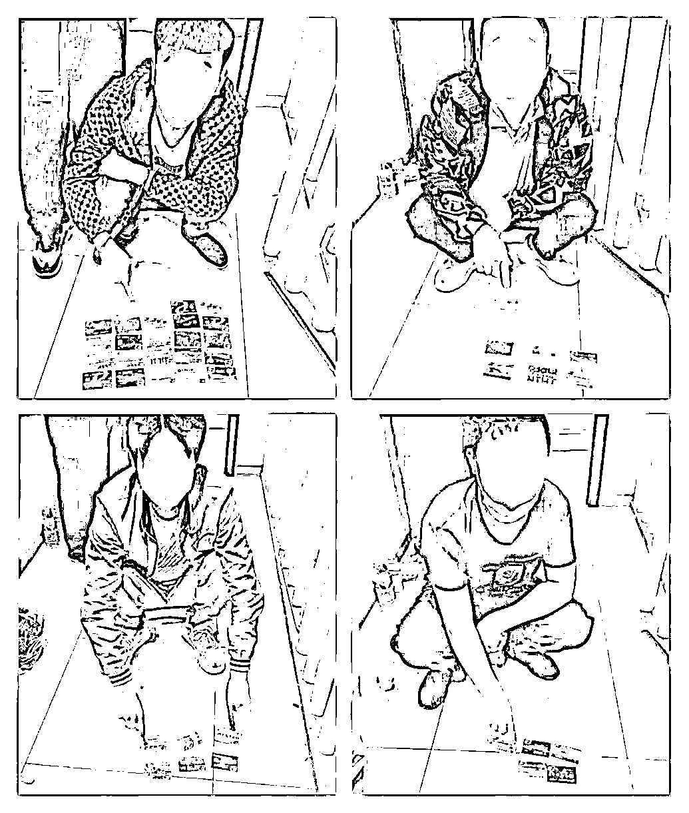

# 涉案金额 2000 余万，“黑灰色”产业链成最大帮凶！

> 原文：[`mp.weixin.qq.com/s?__biz=MzIyMDYwMTk0Mw==&mid=2247514936&idx=5&sn=7ff0e7211fd92ae736cb95a9b25e841a&chksm=97cb7000a0bcf9166d54b74d9f239f1f02076193e2994258dd276644bb65cb3a09937cac9ac0&scene=27#wechat_redirect`](http://mp.weixin.qq.com/s?__biz=MzIyMDYwMTk0Mw==&mid=2247514936&idx=5&sn=7ff0e7211fd92ae736cb95a9b25e841a&chksm=97cb7000a0bcf9166d54b74d9f239f1f02076193e2994258dd276644bb65cb3a09937cac9ac0&scene=27#wechat_redirect)

 近日，辽源警方经过一个多月的周密布控、深挖彻查，成功击毁一个帮助电信网络诈骗活动提供资金流转的犯罪团伙，铲除犯罪窝点 4 处，抓获犯罪嫌疑人 12 名，涉案金额 2000 余万元。

 2021 年 3 月末，辽源市公安局东吉分局接到国家反诈中心推送线索，辖区有 4 张银行卡存在异常，涉嫌存在违法犯罪活动。

 东吉分局民警迅速核实，锁定这 4 张银行卡持有者为辖区的王某伟及他的妻子和内弟，民警发现其资金流水额高达 600 余万。让民警惊讶的是，这三人均无工作，也未从事任何生产经营活动，如此高额的资金流水，发生在他们身上，极不正常。

 在辽源警方多个部门的联合侦查下，专案组继续深挖扩查、循线追击，最终确定以王某伟为首的犯罪团伙，以火车站附近及其他三个小区内的日租房为窝点，通过手机银行、第三方支付等方式，帮助上游诈骗团伙提供技术支撑，开展诈骗资金结算、转移等违法犯罪活动。

 5 月 11 日，专案组兵分三路，经过 16 小时的连续奋战，成功将该团伙 12 名成员全部抓获，无一漏网。当场扣押现金 2 万余元、手机 16 部、银行卡 58 张、电话卡 17 张、车辆 2 台。

 目前，该案 12 名犯罪嫌疑人均已被刑事拘留，案件仍在进一步审理中。

 电信网络诈骗分工日益细化，催生的这条黑灰产业链，加速了电信网络诈骗的蔓延，成为幕后帮凶。“断卡”行动以来，辽源公安机关坚持靶向发力，精准打击，截止目前，共破此类案件 10 余起，抓获违法犯罪嫌疑人 102 人，惩戒 327 人。

你可曾想到，**“卡农”、“中介”、“水房”**这些司空见惯的词语，在电信网络诈骗背后的黑灰产业链中，却有着别样的含义。 

**“卡农”：4 天“躺赚”1.5 万**

*** 黑语解读之******“卡农”******——系指专门为电信诈骗等犯罪分子提供银行卡用于流转涉案资金，进而非法牟利的犯罪嫌疑人。***

 在此次辽源警方打掉的犯罪团伙中，有一半以上的角色都是“卡农”，他们全部来自外地，户籍多为农村，文化程度普遍不高，年龄最小者仅 25 岁，最长者也不过 43 岁。

 这些人为什么会从外地（其中两人来自 2300 公里外的甘肃礼县）来到辽源，冒着风险从事违法活动，办案民警统计出的数据，显示出了其中的利害。

 经查，这些“卡农”依据其提供银行卡所刷的流水金额，按一定比例收取报酬，其中一名“卡农”在仅仅 4 天时间里，便收入了 1.5 万元。期间，这名“卡农”连具体的转账操作都不用干，吃吃喝喝、玩玩乐乐地就把高额利润赚到了手。

**“中介”：筛选严格 专挑“白人”**

***黑语解读之******“中介******”——系指通过社交软件招募，并组织、率领一定数量的“卡农”，为上线“水房”提供资金流转业务，从中谋取一定比例手续费的犯罪嫌疑人。***

这些“卡农”如何聚集而来，便涉及到此产业中一个重要的角色“中介”。在此案中共有 2 名“中介”，分别来自吉林舒兰、河北晋州，为了“安全”，他们在平时的“业务”往来中“各自为政”，互不交叉。

经查，这些“中介”熟知该产业操作流程，通过微信群、QQ 群等社交软件，以“跑积分”、“刷流水”等噱头，利诱“卡农”加入，并提供交通、食宿等安排。召集一定人员后，与上线“水房”协调，定好各自的利益分配后，组织“卡农”开展实际业务。

据办案民警了解，这些“中介”经验非常丰富，选人条件十分严格，“有涉案记录的不能要”、“银行失信的不能要”，为了此后的业务顺利开展，他们只挑身份干净的“白人”。

**“操盘手”：既要眼疾手快 又要“忠心耿耿”**

*** 黑语解读之******“操盘手”******——“水房”的亲信人员，“洗钱”活动的具体操作者，熟悉各种电子转账软件的操作流程，一方面能够迅速及时实现涉案资金流转，另一方面能够为犯罪分子涉案资金的安全到账提供保障。***

电信网络诈骗分子能否顺利得手，诈骗而来的资金能否“快速又安全”的到账，在这个产业链中，关键的一环就是“操盘手”。

据了解，由于金融监管机构限制措施的不断加强，手机银行转账超过一定额度时，需要刷脸、指纹等生物识别来实现。因此，当上游诈骗分子发送转款指令后，就需要“操盘手”与“卡农”面对面地快速操作手机，在第一时间内完成结算。

在此过程中，为避免“操盘手”见“利”思迁，将资金转向他处，“操盘手”的角色设定必须是“水房”身边的可靠人。在此案中，两名操盘手就分别是“水房”的妻弟和发小。

**此外，在“中介”的身边也有其亲信人员“跑手”，负责“卡农”的交通、食宿等管理，当流转资金需要现金转移时，“跑手”则会带领、看管“卡农”到各个 ATM 点提取现金。**

**“水房”：交纳“保证金” 才能成为“代理商”**

***黑语解读之******“水房”******——系指利用“卡农”或者“中介”提供的资金流转“服务”，与产业上游的电信诈骗团伙单线联系，开展“洗钱”活动的犯罪组织或个人，根据资金流水总额按一定比例抽取佣金。通过“水房”，犯罪分子大量涉案资金的流转需求得以实现。***

民警在调查中了解到，想拥有“水房”这一重要的身份，并非轻而易得。本案中的“水房”王某伟，一直以来没有固定职业，曾靠驾驶挖掘机维持生计，当他接触到这个非法产业，发现钱来得如此轻松，便放弃了原先又苦又累的营生。

最初，王某伟也是从“卡农”干起，并逐渐积累了丰富的“经验”和“人脉”。一次机会到来，他与上游犯罪分子建立了联系。为了获取更多的利益，王某伟打起了成为“水房”主意。经与上游犯罪分子商议，王某伟了解到，要想成为这个“代理商”，必须得向上游犯罪分子交纳 5 万元的保证金，当时，王某伟的同行都觉着不太可靠，可他还是一狠心，交上保证金，如愿成为了“水房”。

据民警初步估查，王某伟在当上“水房”后，近两个月来的非法获利已达到近 10 万元。

来源：吉林警事

← 向右滑动与灰产圈互动交流 →

