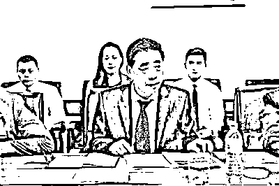

# 骗子被国家发改委揭穿，“凤凰通讯社”撇清关系

> 原文：[`mp.weixin.qq.com/s?__biz=MzIyMDYwMTk0Mw==&mid=2247514936&idx=6&sn=77e04f8e691ac3d82276531d4d2bc77e&chksm=97cb7000a0bcf916befb70f6f5f2ea6623c3f4219838aceca83df179c0794d40dc3d27ffe49f&scene=27#wechat_redirect`](http://mp.weixin.qq.com/s?__biz=MzIyMDYwMTk0Mw==&mid=2247514936&idx=6&sn=77e04f8e691ac3d82276531d4d2bc77e&chksm=97cb7000a0bcf916befb70f6f5f2ea6623c3f4219838aceca83df179c0794d40dc3d27ffe49f&scene=27#wechat_redirect)

日前，国家发改委发布声明称，有名为“周智均”的人冒充粤港澳大湾区建设领导小组办公室负责人，多次参与社会活动。北京青年报记者调查发现，该人的另一个头衔是“凤凰通讯社”董事局主席，而这个 2016 年便成立的机构多次以新闻单位的名义开展活动。

不过，该机构仅有的两名记者并未持有记者证。据该通讯社社长孙逊在与凤凰卫视的官司中自我提供的证据称，该机构不仅接受 3 万元每月的广告投放，更主要以收取加盟费等方式盈利，目前已在国内的山西、陕西、湖北等数十个省份，国外的泰国、法国、意大利等地拥有分社，每个分社收取几十万元的加盟费。

此前，凤凰通讯社在与凤凰集团的商标侵权与不正当竞争中败诉，被判赔偿 500 万元。目前，该机构的大股东孙逊已成失信被执行人。但该机构仍在正常运营中。

**声明
“董事局主席”出事
“凤凰通讯社”撇清关系**

5 月 21 日，国家发改委官网公布了一则粤港澳大湾区建设领导小组办公室的《声明》称，近期有人以周智均名义，冒充粤港澳大湾区建设领导小组办公室负责人，并以所谓“粤港澳大湾区建设投资督导委员会主任”等身份多次参加社会活动，就此声明：一、我办无名为周智均的人员；二、我办从未设立名为“粤港澳大湾区建设投资督导委员会”的机构、组织。希望有关方面提高警惕、避免上当受骗。如已造成损失，请及时向公安部门举报案件线索。

北京青年报记者发现，“周智均”除了多次以上述身份参与活动外，他的另一个“身份”还包括“凤凰通讯社董事局主席”。

在“周智均”出事后，凤凰通讯社也在 5 月 22 日发布了一份《声明》。声明称，近日，发现有人没经凤凰通讯社公司领导同意，擅自以“凤凰通讯社”名义，出去参加社会活动。凡是发生责任事故的，将自行承担一切法律责任。以前总社曾多次在网上发布声明，凡是以凤凰通讯社名义参加任何组织或任何活动的，必须有总社领导同意签发 7 日以内有效的证明函，否则均属个人行为，自行承担一切后果，与本社无关。另有一份 2020 年第 0318 号的“授权文件”因“被授权人违规行事”，被予以撤销。

**求证
查无此机构
“凤凰通讯社”并非认证媒体**

据“凤凰通讯社”自我简介称，凤凰通讯社是于 2010 年在香港政府注册的合法新闻媒体机构，具有网络、视频、杂志、手机直播平台、影视制作、商贸运营等多个领域和部门。目前凤凰通讯社已经与上百家国家级媒体、境外媒体、国际媒体的网络、电视台、报刊、杂志等主流媒体签署了长期战略合作协议，并与数百家国内外知名企业的金融专家开展了直接业务往来。

打开这一网站，可以看到内容大多关于时政、评论类，其栏目包括：要闻、新闻调查、凤通短评、一带一路等。不过，该“通讯社”的报道却以引用官方媒体消息为主，尤其是在时政报道上，除引用官方机构文章外，鲜见自采报道。比如，《支持民营企业参与国家重大战略》的电头是“凤凰通讯社转经济日报消息”，《我国前 4 月进出口同比增长 28.5%》的电头是“凤凰通讯社转新华社微博消息”，而一篇写某书法家作品的报道为“凤凰通讯社消息”，但该作者也并没有以记者身份署名。

那么，这家媒体是否是在香港注册、在国内运营的正规机构呢？在“中国记协网”上，可以查询到《港澳媒体常驻内地记者站及常驻记者最新名录》，其中香港媒体有《南华早报》、凤凰卫视、香港中国评论通讯社等 25 家认证媒体，凤凰通讯社并不在列。

“凤凰通讯社”介绍称“与国务院‘一带一路’中国企业走出去办公室”合作，把中国企业引向高端市场；还与央企的“中铁建”签约，在全球 100 多个国家进行项目合作。不过，北青报记者发现，在商务部旗下有“‘走出去’公共服务平台”，但没有上述宣称的机构。而在中铁建的官网上，也并没有与凤凰通讯社合作的任何消息。

**实情
“凤凰通讯社”只是一家有限公司
联系人为小股东**

5 月 22 日，在香港公司注册处官方网站网上查询中心北青报记者查询到，“凤凰通讯社有限公司”的公司登记注册记录，有相应编号，现状为“现用”“仍注册”，但其所宣称的“香港凤凰通讯社有限公司”和“凤凰通讯社”均显示为没有记录。

工商部门数据显示，凤凰通讯社在国内的运营主体是“凤凰佳艺（北京）文化传媒有限公司”，于 2016 年成立，注册资本 11800 万元，法定代表人此前为孙逊，2020 年 11 月变更为孙多艺，二人为公司的全部股东，持股比例分别为 90%和 10%。目前，孙多艺担任公司的执行董事、经理。另外，“凤凰通讯社有限公司”的信息显示，这是一家在香港注册的公司，孙逊的持股比例为 99.21%，另有蒋晓晶、吴国全等股东，持股 0.40%。

“凤凰通讯网”孙多艺和孙逊的个人资料

“凤凰通讯社”社长孙逊

一位做在港注册公司中介工作的人员介绍，在香港注册公司并不困难，运营人仅需提供简单资料就可以注册一家公司，公司注册资本在 1 万港元起无需验资，一般一到两个工作日即可收到全套资料。

实际上，凤凰通讯社还经常利用中央电视台以及国家机构的合作名义进行宣传。据悉，凤凰通讯社的运营主体“凤凰佳艺公司”的经营场所登记为“北京市中央电视台（海淀区复兴路乙 11 号）梅地亚中心 B 座”，耐人寻味。

有知情人士表示，凤凰通讯社承接各类广告，报价每个月只要 3 万元，就可以进行广告投放。一份其“广告业务收费标准”显示，在凤凰通讯社网站上传稿件、凤凰通讯网插入广告，杂志广告月刊、图文广告专题广告、会议视频直播、视频广告、杂志大型专题报道、CCTV《诚信中国》电视访谈节目、电影、电视剧、纪录片等需要分别支付价格不等的广告费。

在凤凰通讯社的部分广告渠道中，留有相应手机号码和微信号码，北青报记者尝试联系对方，并没有接通。不过，在尝试添加好友时看到，对方多个微信号码的名称均为“孙多艺”。

**冒名
在全球多地开办“分社”
加盟费定价数十万元**

“凤凰通讯社是继凤凰集团的凤凰卫视和凤凰网诞生之后的又一新闻媒体机构”，凤凰通讯社在其介绍中如此写道。实际上，这家机构一直是冒用凤凰集团的名义进行媒体活动。

在此前的一次公开活动中，孙逊曾这样表示：“凤凰通讯社与凤凰卫视属于凤凰集团旗下的，是各干各的事，互相间的自负盈亏……凤凰通讯社在国内相当于新华通讯社，凤凰卫视就相当于中央电视台；该公司网络业务指的就是‘凤凰通讯网’，一个分社每年的盈利为 100 万以上，且分公司承接会议业务，每场会议盈利为一二十万；一个分社的加盟费几十万。”

北青报记者发现，除了北京之外，目前凤凰通讯社还在山西、陕西、浙江、重庆、湖北、河南、湖南等多个省份拥有分社。2018 年，凤凰通讯社还在泰国举行国际分社授牌仪式，在法、英、德、意等 13 国建分社。

北青报记者看到，“凤凰通讯社-山西”的网页做得十分精美，栏目板块分为：今日头条、时政新闻、山西资讯、热点追踪等。不过，北青报记者电话联系到了其山西分社的联系人，对方表示，目前“没有广告刊例价”，之后便挂断电话不愿多谈。

为了吸引投资者，孙逊还表示：“到 2019 年初，我们在原有的 80 多个国家和分社的基础上，还要增加几十个国家的分社建设，并于 3 月份左右举办统一授牌仪式……这个平台不是一两个人的，而是大家共同的家，只要是参与者，谁都可以在这个平台上发挥和施展才华。到时候，凡是跟随合作或参与者，在上市后都要按贡献配发原始股，人人都是受益者。”

**真相
“记者“只有两名且不持证，社领导多达 40 多人**

北青报记者还看到，就是这样一家拥有多家分社、与上百家机构拥有合作关系的“媒体”，其记者竟只有 2 人。

北青报记者查询到一份 2019 年其组织机构介绍包括：董事会成员 7 人、顾问委员会 13 人、总顾问 2 人、名誉董事 8 人、董事长兼社长 1 人、总裁 1 人、执行社长 1 人、执行总裁 1 人、副总裁 2 人、副社长 5 人、投资运营总经理 1 人、总编 1 人、运营总监 1 人、影视总监 1 人、行政总监 1 人、新闻中心 2 人、记者部 2 人、编辑部 2 人、广告部 2 人、外联部 2 人、事业部 7 人、工程部 2 人、办公室 2 人、法务部 2 人、特邀记者 4 人。其中，总共 73 人的队伍中，仅有 2 名记者，总监、社长级别的 40 余人。

根据网站给出的记者名单以及记者证号码，北青报记者尝试在“国家新闻出版署”官网上搜索两名记者的名字和记者证号，结果均显示“没有找到您想要查询的内容”。

目前，其官网显示的组织机构有所变化，并无具体“记者”设置，仅显示社长、副社长、主任级别有 16 人，部长、副部长 16 人，栏目主编、顾问 15 人。

昨天，北青报记者看到，从凤凰通讯社各个网站运营及更新的情况来看，凤凰通讯社及其下属分社并未停止活动，也并没有更名。一直到 5 月 22 日，上述网站仍在发布文章。

**此“凤凰”非彼“凤凰”
冒用凤凰集团  “凤凰通讯社”被判赔偿 500 万元**

2020 年 8 月，凤凰集团向法院起诉“凤凰通讯社”，北京市海淀区人民法院作出一审判决，认定后者构成商标侵权和不正当竞争。北京市海淀区人民法院认为，凤凰佳艺（凤凰通讯社在北京的运营主体）在其网站使用的“香港凤凰通讯社有限公司”实际并不存在，是凤凰佳艺公司虚构的企业主体，目的就是误导公众。要求凤凰通讯社立即停止侵权，并赔偿 500 万元。

凤凰通讯社向法院表示，“自 2016 年成立以来，因种种原因尚未通过经营行为获取盈利收入。”后凤凰通讯社提起上诉，法院认为，“截至庭审时，凤凰佳艺公司也没有证明其停止了侵权行为，因此应当加大侵权赔偿力度，严厉制裁恶意侵权行为”，最终维持 500 万元的赔偿金额，以及 4 万余元的案件受理费。

在经历了与凤凰卫视的官司之后，孙逊并没有履行 500 万元的赔款判决，2021 年 5 月 8 日，他被北京市海淀区人民法院列为失信被执行人，无法乘坐飞机、高铁等交通工具。

网上简历显示，孙逊，1962 年出生，辽宁锦州人，1991 年在辽宁省黑山县大虎山镇做教师，后到镇政府做宣传干事；1993 年 8 月调县广播局，先后任电台新闻部主任，有线电视台文艺部主任，市广播电视报编辑部主任；1998 年 8 月考入中央电视台，之后又调到新华通讯社；2010 年至现在，先后担任“中国新闻记者协会”记者部主任，国家“新闻调查中心”主任，“凤凰通讯社”副社长、社长，兼中央电视台栏目组策划制片人等。不过，国家“新闻调查中心”机构经搜索并不存在。

该机构也对孙逊的家乡有较多的关注和报道，其为数不多的自采内容中，有一篇就是关于《辽宁省锦州市委书记参加黑山阻击战烈士纪念碑瞻仰仪式》，该文作者为“凤凰通讯社特邀记者赵井然”。

来源：北京青年报

← 向右滑动与灰产圈互动交流 →

