# 警惕！这种美容针，每 3 支就有 2 支是假货！

> 原文：[`mp.weixin.qq.com/s?__biz=MzIyMDYwMTk0Mw==&mid=2247514936&idx=7&sn=1749eb731b6da66baef60bb9ab8325ad&chksm=97cb7000a0bcf9168901b833130083a388f5a38e50991300c2ba06e4a3e78db288a9ba9467c3&scene=27#wechat_redirect`](http://mp.weixin.qq.com/s?__biz=MzIyMDYwMTk0Mw==&mid=2247514936&idx=7&sn=1749eb731b6da66baef60bb9ab8325ad&chksm=97cb7000a0bcf9168901b833130083a388f5a38e50991300c2ba06e4a3e78db288a9ba9467c3&scene=27#wechat_redirect)

近两年，介于手术整形和生活美容之间的“轻医美”，越来越受到爱美一族的青睐。其中，“水光针”就是市场认知度很高的一个爆款，不少消费者都希望通过注射它，来拥有水润、细嫩的肌肤。那么，“水光针”究竟有怎样的效果？哪些人群是主要的消费群体？ 

“水光针”备受追捧 定制配方众多推高价格 

以下视频来源于

央视财经

[`mp.weixin.qq.com/mp/readtemplate?t=pages/video_player_tmpl&action=mpvideo&auto=0&vid=wxv_1884588019865681927`](https://mp.weixin.qq.com/mp/readtemplate?t=pages/video_player_tmpl&action=mpvideo&auto=0&vid=wxv_1884588019865681927)

△央视财经《天下财经》栏目视频

消费者赵鑫已经定期注射水光针好多年了，如今，打针已经成了她一个定期的日常消费项目。

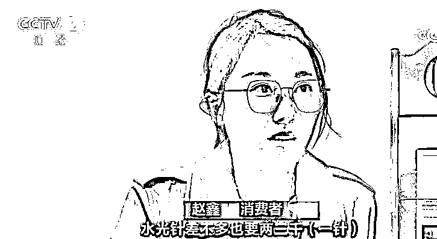

据了解，水光针是一种注射类的医疗美容项目，主要的基础成分是玻尿酸。玻尿酸又称为透明质酸，作用是补水保湿。记者走访市场后了解到，**目前一剂水光针的价格从“百元左右”到“数千元”不等。**医疗美容机构的工作人员告诉记者，这主要是因为配方不同。

**目前销售的“水光针”，可以在玻尿酸的基础上，再添加传明酸、动能素等各种配方，营养成分越多价格越高。**

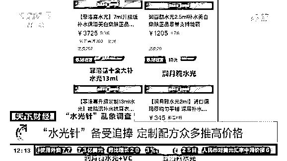

**某医疗美容机构工作人员：**基础的水光针，几百元，成分是一支玻尿酸，玻尿酸是补水、锁水的。如果想要做更好的，可以添加一点美白的，添加一点胶原蛋白或者加菲洛嘉，一支菲洛嘉药的成本就在一千多，在五百多的基础上再加一千多元。添加的营养成分是几种选，价格都不一样。

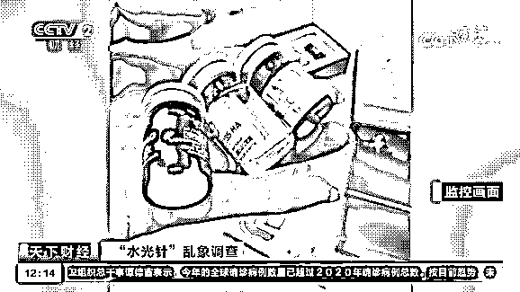

随着技术和需求的升级，在非交联玻尿酸的基础上，水光针的添加成分越来越多，价格越来越昂贵，而销量也处于快速增长的态势。 

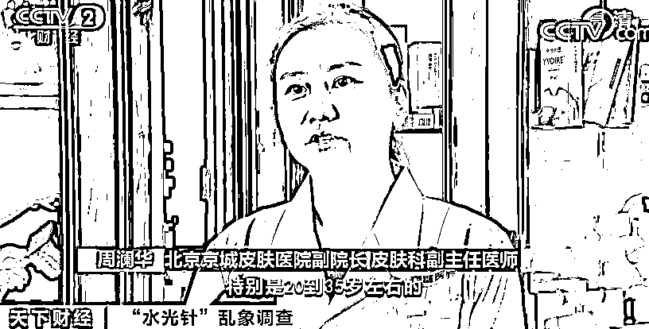

**北京京城皮肤医院副院长 皮肤科副主任医师 周澜华****：**在我的门诊中，特别是 20-35 岁左右的年轻求美者群体，比以前增多了，水光注射现在比较流行。

**“水光针”火爆的背后：假货 水货横行 ******

****以下视频来源于****

****央视财经****

 ****[`mp.weixin.qq.com/mp/readtemplate?t=pages/video_player_tmpl&action=mpvideo&auto=0&vid=wxv_1884588440738922503`](https://mp.weixin.qq.com/mp/readtemplate?t=pages/video_player_tmpl&action=mpvideo&auto=0&vid=wxv_1884588440738922503)**** 

****△央视财经《天下财经》栏目视频****

******随着“水光针”受到越来越多爱美人士的追捧，巨大的市场需求也释放出了空前的商机，而利益驱动之下，市场上的水光针，也出现了大量的水货、假货。**

大学毕业那年，付曦冉为了拍摄毕业照时更加美丽，到医疗美容机构注射了第一支水光针。从那时至今，她在水光针项目上已经累计花费了数万元。付曦冉告诉记者，她不止一次遭遇了来路不明的产品。**** 

****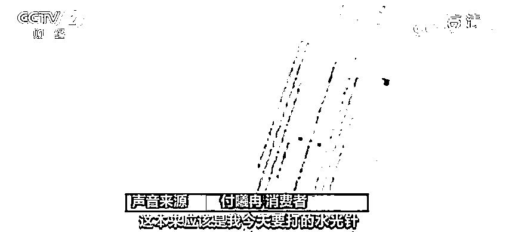****

********

******记者查询发现，水光针的主要成分——注射用透明质酸，在我国是按照三类医疗器械进行管理，生产和经营此类产品须取得相关资质。**根据我国《医疗器械监督管理条例》第五十七条规定：**“没有中文说明书、中文标签或者说明书、标签不符合本条规定的，不得进口”。****** 

****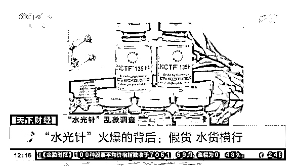****

****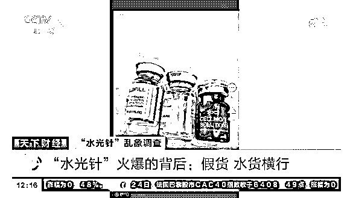****

****然而，记者在网购平台上搜索发现，**各种各样不明来源、没有相关中文标识的水光针，都可以轻而易举地购买到。**根据艾瑞咨询发布的《2020 年中国医疗美容行业洞察白皮书》，目前医美市场上流通的针剂正品率仅为 33.3%，**即每 3 支针剂当中，就有 2 支是水货、假货等非法针剂。****** 

****据了解，目前国家药品监督管理局审批通过的药物，常规分为“妆”字号、“健”字号、“械”字号等不同的字号。用于注射美容的合法药物，必须是“械”字号。但记者查询国家药品监督管理局的官方网站后发现，**一些“水光针”添加的配方产品，其批准文号是“妆”字号。****** 

****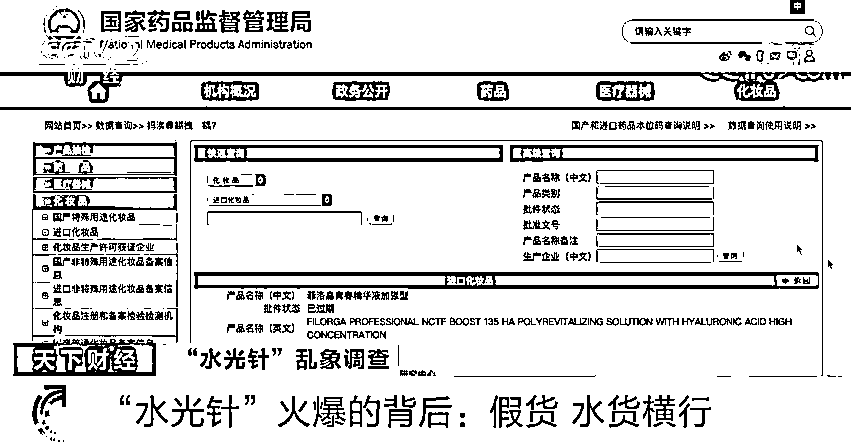****

****依据《化妆品监督管理条例》，**“妆”字号产品，也就是化妆品，是以涂擦、喷洒或者其他类似方法，施用于皮肤、毛发、指甲、口唇等人体表面，但不允许注射。 ******

******注射器任意购买 自打教程充斥网络 ******************

********以下视频来源于********

********央视财经********

 ********[`mp.weixin.qq.com/mp/readtemplate?t=pages/video_player_tmpl&action=mpvideo&auto=0&vid=wxv_1884588990024974336`](https://mp.weixin.qq.com/mp/readtemplate?t=pages/video_player_tmpl&action=mpvideo&auto=0&vid=wxv_1884588990024974336)******** 

********△央视财经《天下财经》栏目视频********

********我们的皮肤分为很多的层次，而水光针属于“中胚层疗法”的一种，注射需要由专业人员操作。然而**记者调查发现，自己打水光针的教程充斥网络，而注射器等针剂所需的用品也都可以任意购买。**很多人都严重低估了这其中的安全隐患。

采访中，多位消费者向记者反映，她们都遇到过一些没有资质的非医美机构，推销和开展水光针的项目。******** 

******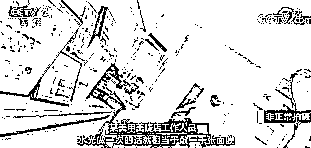******

************

******在电商平台上，**一些商家不仅销售来路不明的水光针产品，还会通过赠送或销售的方式将注射水光针所需要的麻药、碘伏棉球、医用纱布、针管针头等辅助用品配齐。********

******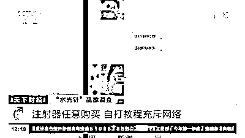******

******从商品评论中记者了解到，**目前有许多消费者都是在家自己打水光针。在社交媒体上，更是充斥着大量自打水光针的所谓“教程”。******** 

******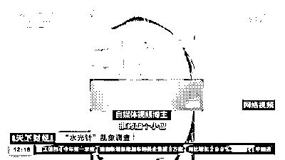******

********自媒体视频博主：**推药起个小包，这说明你已经进药了。一排一排密集打，打水光针出点儿血是很正常的，不用担心，没关系。我今天打的量非常多，12 毫升。******

********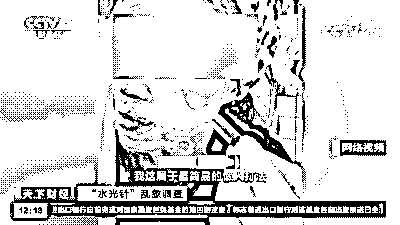********

********自媒体视频博主：**我这属于最简易的懒人打法，先用这个麻药敷全脸。这也太没有技术含量了，随意往里推，一点儿都不疼，你就随便乱戳，没感觉。******

******据了解，人体面部的血管和神经分布情况极端复杂。近年来，**非专业人士或消费者自己注射水光针所导致的血管栓塞、眼睛失明等悲剧，每年都在发生。********

************

********消费者 黄女士：****眼珠子像爆出来那种感觉，很疼**，就像要裂开那种感觉。当时医生就说我打玻尿酸误打了眼睛，玻尿酸到了眼睛后球，我这眼睛就瞎了，看不见的。******

******业内人士反复强调，注射水光针必须要到取得《医疗机构执业许可证》的机构，由具备《医师资格证书》《医师执业证书》和《医疗美容主诊医师资格证书》的人员进行操作。******

******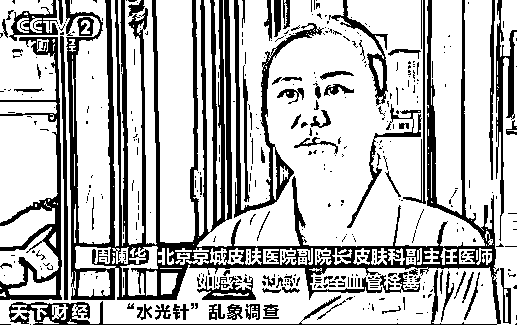******

********北京京城皮肤医院副院长 皮肤科副主任医师 周澜华：**现在比较流行的水光注射，不能忽略它存在一些医疗风险，如感染、过敏，甚至血管栓塞。因此我们要选择正规的医院或者医美机构以及专业的医师进行咨询和治疗。******

******来源：央视财经******

************

******← 向右滑动与灰产圈互动交流 →******

************