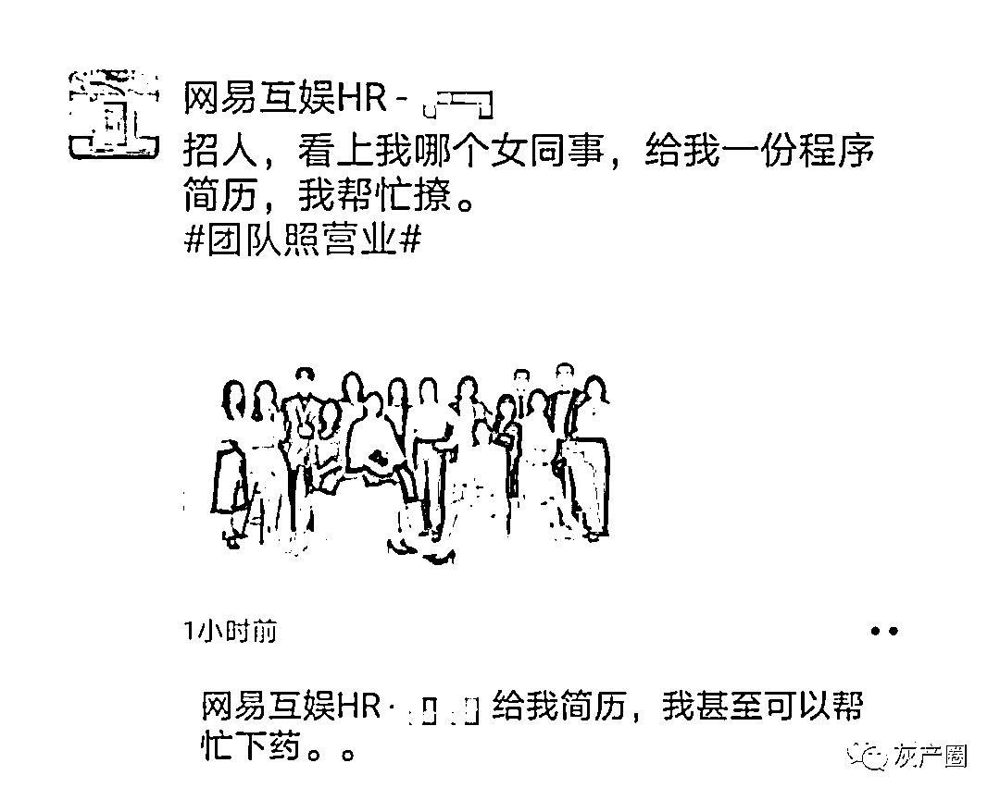
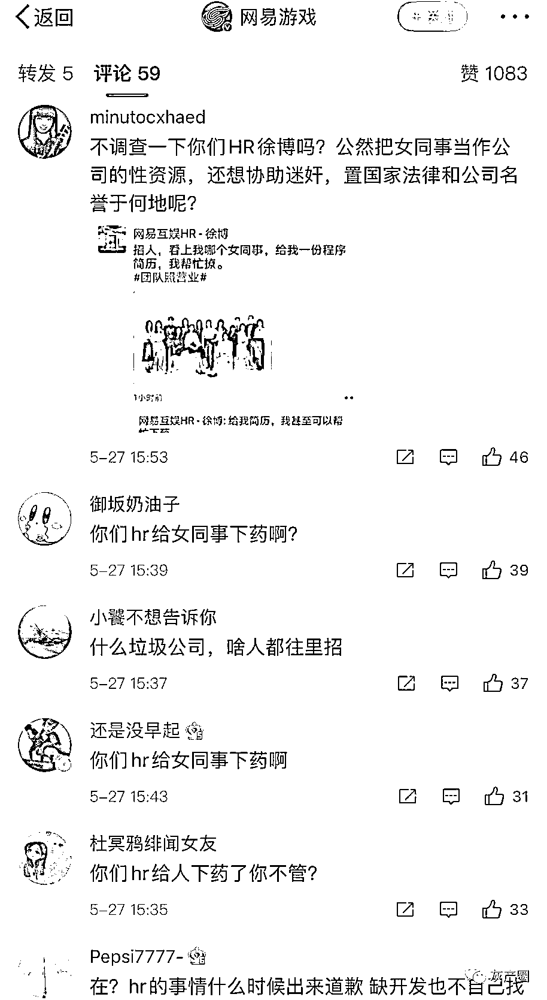
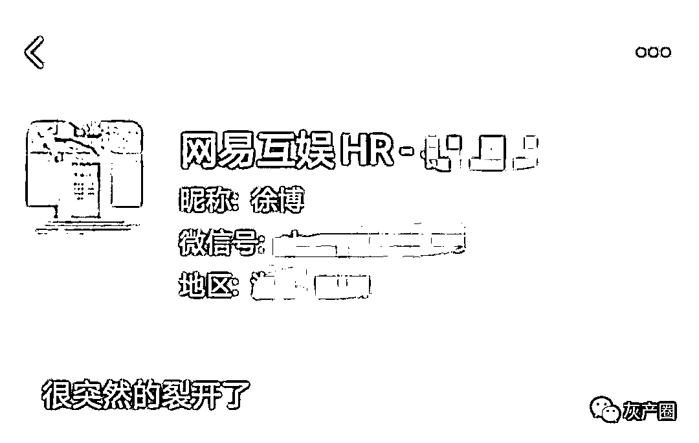
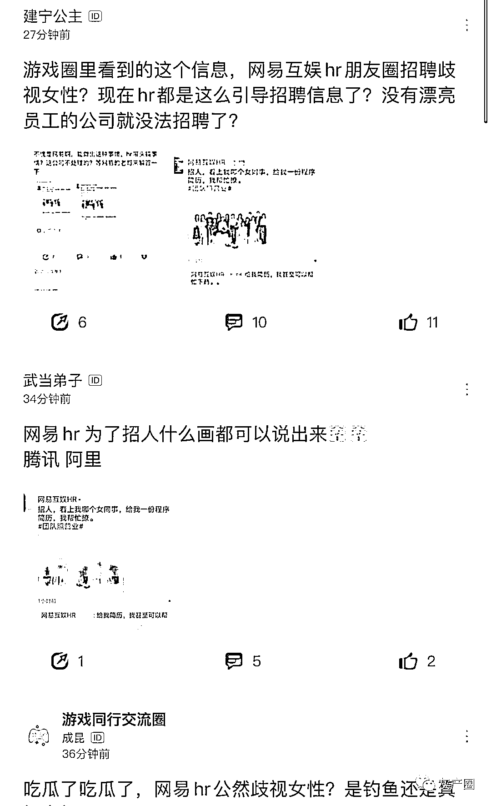

# 疑似网易互娱 HR 招人：看上哪个女同事，可以帮忙下药

> 原文：[`mp.weixin.qq.com/s?__biz=MzIyMDYwMTk0Mw==&mid=2247515008&idx=2&sn=c54d94a464d46e6c3b6e14e33574c55b&chksm=97cb70b8a0bcf9aed61bb26b32a3b68bf916f2b75dc762c39baf76c9830c1166dd1957caabab&scene=27#wechat_redirect`](http://mp.weixin.qq.com/s?__biz=MzIyMDYwMTk0Mw==&mid=2247515008&idx=2&sn=c54d94a464d46e6c3b6e14e33574c55b&chksm=97cb70b8a0bcf9aed61bb26b32a3b68bf916f2b75dc762c39baf76c9830c1166dd1957caabab&scene=27#wechat_redirect)

三言财经消息，今日有网友爆料称，网易互娱一名 HR 在朋友圈发招人信息：**招人，看上我哪个女同事可以帮忙撩，甚至可以帮忙下药。**

此言论被网友认为是歧视女性，并在网易游戏微博下留言：**你们 HR 给人下药了不管？公然把女同事当作“性资源”，置国家法律和公司名誉于何地？**

据悉，该 HR 已经删除了朋友圈，并发布了“裂开”的表情。

一些社交平台也开始讨论，称 HR 朋友圈招聘歧视女性。“没有漂亮员工的公司就没法招聘了”。

**对此，网易回应称网易道德委员会已经接到举报，现已正式受理进行调查。**

来源：三言财经

← 向右滑动与灰产圈互动交流 →

