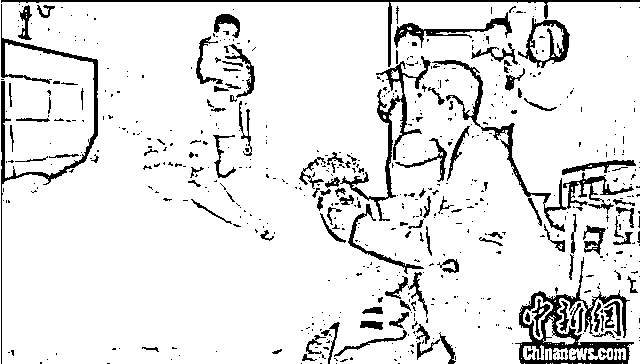
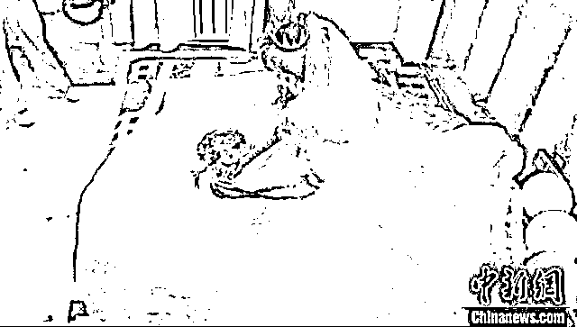
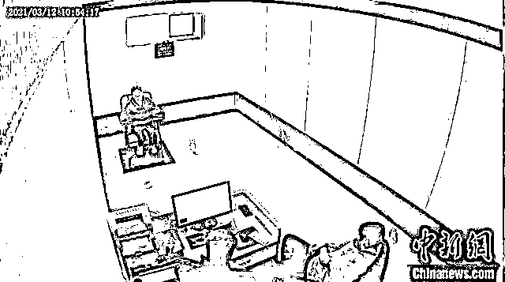
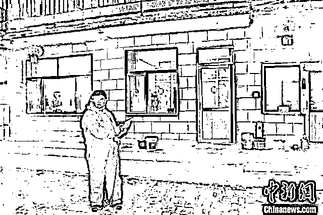

# 男子刷视频看到新婚妻子正和别人办婚礼… 真相太崩溃

> 原文：[`mp.weixin.qq.com/s?__biz=MzIyMDYwMTk0Mw==&mid=2247515008&idx=3&sn=6470cc6809ee13dd8af7324372586282&chksm=97cb70b8a0bcf9ae222b460375c029cfd2d9ae1ce7ff62ee48c80c6260d1445e94be10afaf1b&scene=27#wechat_redirect`](http://mp.weixin.qq.com/s?__biz=MzIyMDYwMTk0Mw==&mid=2247515008&idx=3&sn=6470cc6809ee13dd8af7324372586282&chksm=97cb70b8a0bcf9ae222b460375c029cfd2d9ae1ce7ff62ee48c80c6260d1445e94be10afaf1b&scene=27#wechat_redirect)

内蒙古一男子在刷短视频时 

意外刷到自己新婚不久的妻子

正在与别人举行婚礼……

[`v.qq.com/iframe/preview.html?width=500&height=375&auto=0&vid=q3248gmdvk1`](https://v.qq.com/iframe/preview.html?width=500&height=375&auto=0&vid=q3248gmdvk1)

**男子花 14.8 万元娶妻**

**却发现妻子与别人举办婚礼**

****

****今年 3 月中旬，乌拉特前旗公安局接到居民尹成(化名)报警称，他从某视频平台看到一则短视频，视频里，**自己刚结婚两个多月的妻子娜娜(化名)正在与另一男子举办婚礼。******

********

****图为娜娜与尹成结婚现场。警方供图****

****35 岁的尹成在农村来说已是大龄青年，婚事对于他家成了头等大事。****

****一个远房亲戚说认识一个媒人，通过媒人的介绍，他们村有个小伙子去甘肃相亲，结果相中了，很快就要结婚了。****

****尹家马上联系到了这个媒人，很快就接到喜讯——去甘肃相亲。****

********

****图为娜娜结婚现场。警方供图****

****尹成父子高高兴兴乘车去了甘肃，**在约定的地点和女方的“姨娘”李某见了面。**李某说，姑娘叫娜娜，一直在家照顾生病的父亲，婚事由自己做主。****

****李某还通过视频通话的方式联系到娜娜，让尹成看了看娜娜的长相。尹成看后十分满意，就让娜娜过来见了面。****

********

****图为警方审讯犯罪嫌疑人。警方供图****

****聊天中，娜娜告诉尹成，自己有过一段不幸的婚姻，曾离过婚。尹成表示不在意娜娜有过婚史，尹成的父亲也拿出 1000 元交给娜娜，以表诚意。****

****尹成的父亲希望能和娜娜的父母见个面，聊聊这门婚事。**可李某却推脱称，娜娜的村里要修高架桥，根据家里人数给村民发放补偿款，如果娜娜出嫁便少了一份补偿款。******

****见此情况，尹成的父亲索性就和李某商量彩礼和结婚事宜。最终，**尹家共给了娜娜彩礼以及金银首饰等婚嫁物品共计 14.8 万元。******

****交往 1 个月后，尹成想和娜娜办理结婚证，可因为娜娜户口的问题，始终没有办成，尹家随后为两位新人举办了婚礼。****

******妻子婚后接连失踪******************

******结婚后第 3 天，娜娜说按照老家的习俗，女方要回娘家住几天图个吉利，尹成也同意娜娜回去。一周后，娜娜从娘家回来。******

********可没过几天，娜娜又以各种理由回娘家，尹成也没有当回事，觉得娜娜远嫁，想家也是人之常情。********

****有一次，娜娜回娘家走了半个多月，尹成打电话询问，娜娜说父亲出了车祸住院需要照顾。尹成就想着去看看岳父，但娜娜却以各种理由推脱。****

****尹成有些担心，便给李某打了电话。李某说再让娜娜呆几天，如果还不回去，自己会亲自将娜娜送回去。****

********

****图为犯罪嫌疑人被抓获。警方供图****

******尹成回忆，结婚两个多月，妻子在家加起来不到十天，后来干脆电话都不接了，尹成虽然纳闷也没想太多。******

****一天，尹成闲来无事玩手机，突然一段视频让他大吃一惊。视频里是正在举行的一场婚礼，而新娘特别像妻子娜娜。尹成不敢相信，反复看了几遍，仍感觉视频中的新娘就是自己的妻子。****

****为了弄清真相，尹家人来到了婚礼的举办地西小召镇，打听到了新郎的名字。**尹成私下找到新郎，二人核对后发现他们的新婚妻子竟是同一人。******

********

****图为民警与李某的丈夫了解情况。警方供图****

******自编自导的骗婚******************

******接到尹成的报警后，乌拉特前旗警方找到了娜娜。娜娜却坚称她和尹成已经没有感情了，现在是正常结婚，不存在骗婚。******

******民警了解到，两桩婚事的介绍人都是娜娜的“姨娘”李某，此时李某正在五原县的一家宾馆。******

******民警火速赶到五原找到李某后，**李某最终承认了骗婚行为。********

****据李某供述，她和娜娜都是甘肃籍，但并不是亲戚，**结婚都是为了得到男方的彩礼，自编自导了一系列的骗局，其余嫌疑人分别扮演新娘的各种亲戚。******

****根据李某的供述，民警先后将涉案人员达某等人抓获。至此，这起有组织、有预谋的团伙系列诈骗案浮出水面。****

********

****图为犯罪嫌疑人李某(姨娘)指认现场。警方供图****

******涉 19 起婚姻诈骗******************

******事实上，早在 2019 年 8 月，乌拉特前旗西小召镇某村大龄青年石军就通过李某等人介绍，认识了甘肃女子达娃，李某向石军家索要彩礼钱 5 万元、介绍费 2 万元。******

******石军的家人凑齐钱后，**达娃回到石军家中，****但以各种理由推脱不领结婚证，并设法离开石家。**石军几次打电话让其回家，达娃非但没回，还以各种理由向其索要了 2 万余元，之后便杳无音信。******

****2020 年 6 月，**石军的妻子达娃又成了乌拉特中旗某村高富的新娘，可惜好景不长，高富给了李某等人 6.8 万元后，达娃又一次消失了。******

****最终，乌拉特前旗警方通过一则婚宴视频破获这起骗婚案，抓获 5 名涉嫌诈骗的犯罪嫌疑人，破获了涉及巴彦淖尔市乌拉特前旗、临河区、五原县，包头市固阳县，阿拉善盟阿左旗，甘肃省武威市永登县等地的**19 起婚姻诈骗案，案值 200 余万元。******

****来源：中国新闻网，长沙晚报****

********

****← 向右滑动与灰产圈互动交流 →****

********