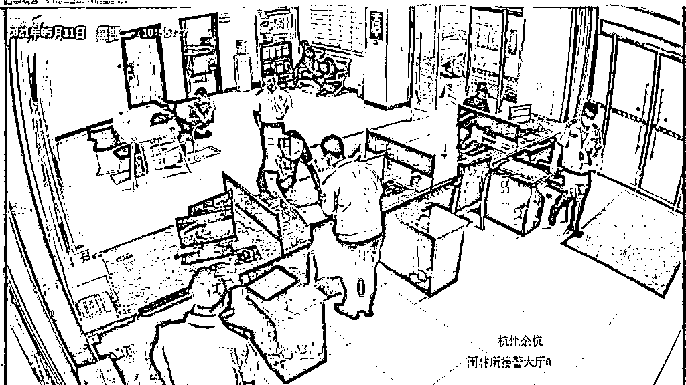
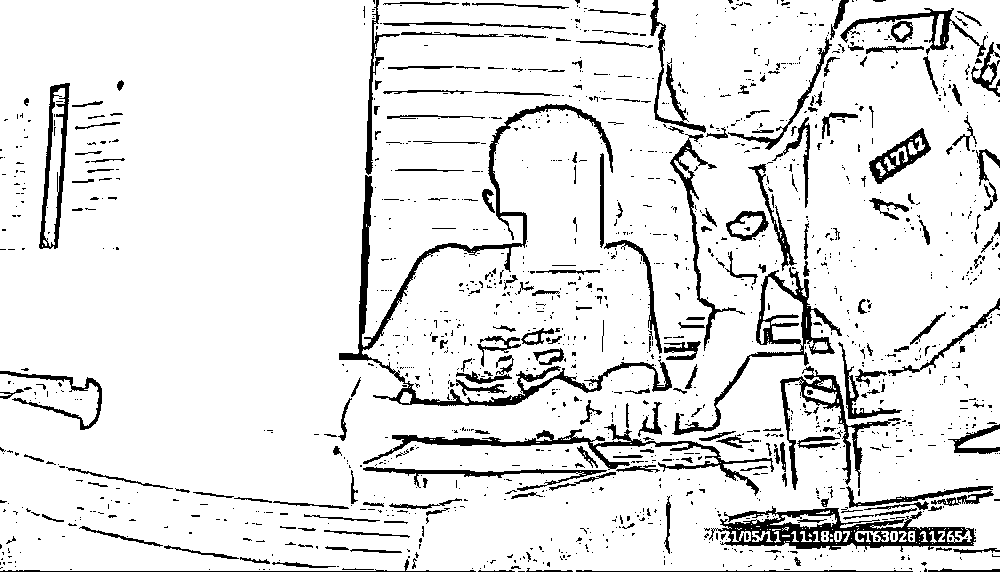
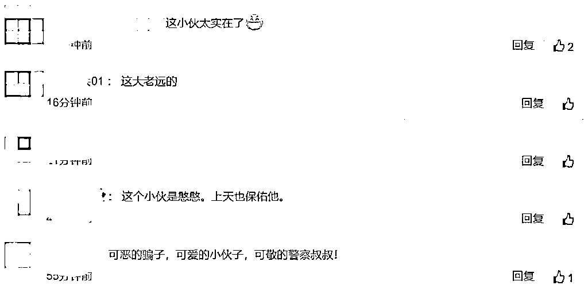

# 小伙跑了 900 公里到派出所自首：我实在拿不出 50 万！

> 原文：[`mp.weixin.qq.com/s?__biz=MzIyMDYwMTk0Mw==&mid=2247515008&idx=4&sn=964d26b8478aab07bd41c737fb04f03d&chksm=97cb70b8a0bcf9ae49200fbbd0012aaa82b145eff675856cabaa1645054c22b49a3cf07b2110&scene=27#wechat_redirect`](http://mp.weixin.qq.com/s?__biz=MzIyMDYwMTk0Mw==&mid=2247515008&idx=4&sn=964d26b8478aab07bd41c737fb04f03d&chksm=97cb70b8a0bcf9ae49200fbbd0012aaa82b145eff675856cabaa1645054c22b49a3cf07b2110&scene=27#wechat_redirect)

" 我有案底，我要来自首。" 近日，一名身穿黑色短袖、带着黑框眼镜的男子走进杭州余杭闲林派出所接警大厅，独自坐了一会后，对接警员说要自首。

什么情况？民警随即将他带至询问室。然而，当民警询问他当地派出所的名字、是什么案底、告知他有案底的民警是谁等情况时，男子却支支吾吾答不上来，只说是一个 " 朋友 " 通知他在闲林被立了案。

民警让他再给 " 朋友 " 打个电话，可怎么也打不通了。既不是本地人，也没在闲林务工，只凭一个电话就来了闲林？

随后，民警通过相关查询得知，该男子今年 29 岁，来自河南许昌。但奇怪的是，这小伙子没任何案底，也没有违法犯罪记录。这更让民警一头雾水了。

"5 月 1 日的时候接到的电话，他说他是我们那边派出所的警察，查到我有涉及失踪人口的案底，是由杭州市公安局余杭区分局闲林派出所立案的，必须配合他才能帮我销案。" 小伙这样告诉民警。

" 哦 ~" 民警恍然大悟，" 是不是让你转账给他？转多少？你转了吗？"

幸运的是，小伙并没有转账。他说，当时电话里的 " 警察 " 说要想销案，就得转账 50 万元到安全账户，否则就必须到闲林派出所自首。

50 万，可不是一笔小数目。经过几次思想斗争，小伙还是决定自首。就这样，他从河南许昌出发，坐了七个小时火车，赶了 900 公里路，最终来到了闲林派出所。

" 这是典型的冒充公检法诈骗，就算你真的有案底，我们也不会通过电话通知你的。" 民警松了口气，给小伙递上反诈宣传单，" 你没给他转钱，这是对的，但从另一方面来说你还是中了诈骗分子的圈套，到闲林派出所‘自首’了。"

民警再次提醒他，以后接到这种电话，不要告诉别人银行卡号、支付密码等信息，第一时间联系当地派出所，并叮嘱他尽快回河南，不要影响到正常的工作生活。

看到这尴尬又搞笑的一幕，网友表示 " 小伙太实在了 "、" 路费也花了不少钱啊 "。

警方提醒：" 公检法 " 机关不会通过微信、QQ 等形式发送相关法律文书和个人工作证件，更不会通过电话、网络通知涉案人员核查资金、转账汇款、下载 app 等。遇到类似情况，请广大市民时刻保持警惕，切莫轻信！

来源 : 潇湘晨报,杭州交通 918

← 向右滑动与灰产圈互动交流 →

