# 诈骗手段量身定制，总有一款适合你！

> 原文：[`mp.weixin.qq.com/s?__biz=MzIyMDYwMTk0Mw==&mid=2247515008&idx=5&sn=a9cf2e0e34e1b020a0133e88cfadde91&chksm=97cb70b8a0bcf9aeb2addfb26dd80f7b0f36df23c0d701b8c18ca3516526ae131c7510d396b0&scene=27#wechat_redirect`](http://mp.weixin.qq.com/s?__biz=MzIyMDYwMTk0Mw==&mid=2247515008&idx=5&sn=a9cf2e0e34e1b020a0133e88cfadde91&chksm=97cb70b8a0bcf9aeb2addfb26dd80f7b0f36df23c0d701b8c18ca3516526ae131c7510d396b0&scene=27#wechat_redirect)

俗话说

“流氓不可怕，就怕流氓有文化”

如果诈骗分子

不仅流氓还有文化

那将会是多么恐怖的一件事

今天有幸得到了一份

诈骗分子的计划表

**它详细计划了你人生中的各个阶段**

**阶段一：少年时期 **

这个阶段的你对世界懵懵懂懂，心智尚不成熟，诈骗分子只要用一点点的好处就可以将你摆布，**常见的诈骗套路为：游戏诈骗、领红包诈骗、充值返利诈骗......** 

**“免费送”是骗子惯用的幌子，从头到尾他们看中的都是被害者手中经过实名认证的微信个人帐号。**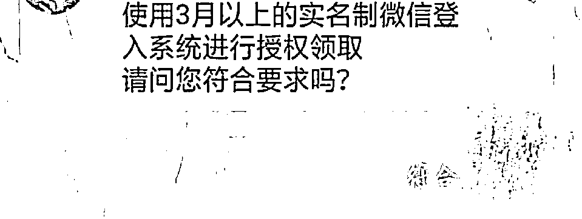

***要兑换奖品 先提供微信***

既然是要盗取受害者的个人微信帐号，那么**骗取登录密码、逃避安全拦截自然是骗局的核心。**完成这两步，骗子就基本掌握了受害者帐号的使用权。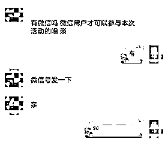以免费领取手机为例，首先，**骗子以“需要授权”为由，诱骗受害者更改微信绑定的手机号，将微信与骗子的手机号绑定。**如此一来，无论之后有什么风险操作，短信验证码都会直接发送到骗子的手机上，期间无需再通过受害者，大大方便了骗子后面计划的实施。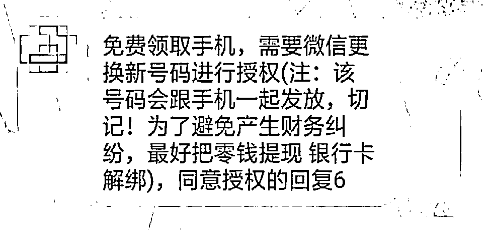随后，骗子又另找**借口要求受害者提供帐号密码、取消登陆验证等**一旦受害者按照指引完成操作，就等于为骗子打通了所有安全拦截，骗子就可以毫无障碍地登录、使用受害者的微信帐号，为所欲为。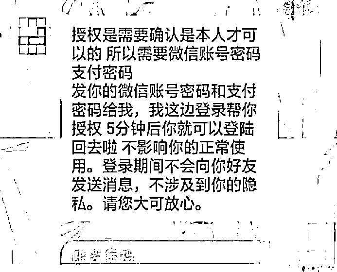之后，骗子还会**一****边向受害者提供假的物流信息，一边叮嘱对方不要修改微信的登入信息和绑定手机。**用种种方式拖延受害者的报警时间，为自己的同伙争取作案机会。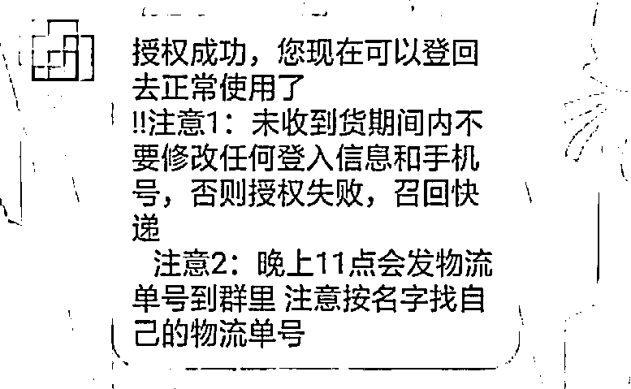等到受害者醒悟时，微信帐号早已被骗子冻结。而这时候因为帐号绑定了骗子手机号，受害者无法获得短信验证码，也就无法完成帐号的解冻流程，于是“活生生”的一个号，就这么“没了”。

***骗走微信 意欲何为***

在骗子的步步设计下，受害者在不知不觉中将自己的微信帐号拱手相让。可是，骗子为什么要大费周章地去骗普通人的微信呢？答案分为两种情况，**一种是图财，骗子盗号后清空账户余额、盗刷银行卡，冒用号主身份向朋友“借钱”，目的就是诈骗敛财。****另外一种则是为了逃避执法，借用盗取的帐号躲避实名制追踪。被盗的微信经不法商家（号商）流入黑产组织，成为其违法链条的一环。**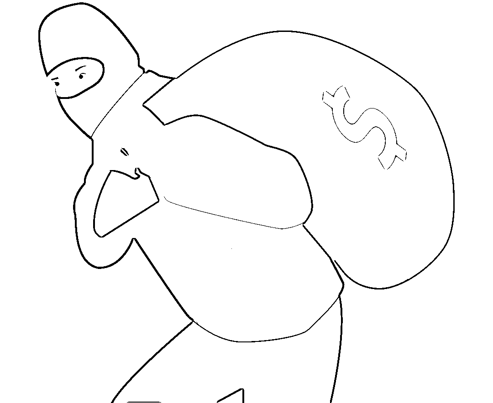后一种情况更为集中。经深入了解，这些帐号被盗一段时间后存在诈骗、赌博、洗钱等违规情况。为了提高盗号成功率，骗子甚至**在前期让受害者先解绑银行卡，提醒他们把余额转出，以此获取受害者的信任。**

***骗子广撒网 未成年人易上当***

可见，微信落入坏人手中，后果可轻可重。那么坏人当初是怎么盯上受害者的呢？又是用什么方法引诱他们落入骗局的呢？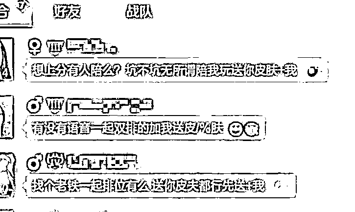据了解，骗子最初通过游戏平台或短视频软件公开发布虚假广告，**用高额佣金、奖品等吸引注意，诱惑受害者主动与之联系。**然后将他们引流到“官方群”、“活动群”，**以客服的身份接近、发布任务，告诉他们完成任务就可以领取奖励。****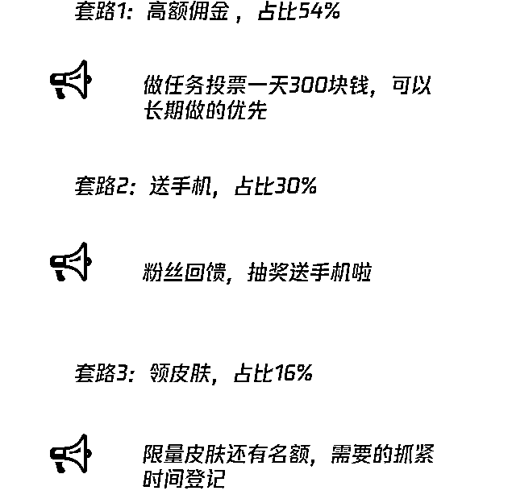**在这类骗局中，受害者多为未成年人。由于缺乏自我保护意识和甄别网络信息的经验，面对诱惑时，未成年人更容易放松警惕，相信陌生人，最终泄露帐号密码等重要信息。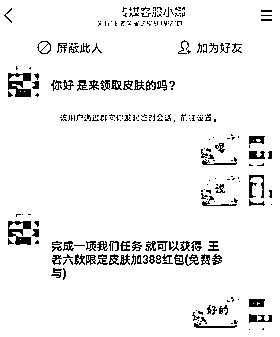利用受害者贪图便宜的心理，**用免费赠品诱使他们换绑手机、泄露帐号密码，然后盗取他们的微信帐号，再对家长实施诈骗，**这就是骗子们的手段。

**阶段二：青年时期 **

这个阶段的你充满着活力，对任何事物都有着非常大的好奇心，诈骗分子正是利用了这一点，**常见的诈骗套路为：恋爱诈骗、刷单诈骗、贷款诈骗......**

**恋爱诈骗**

诈骗分子通常会伪装为漂亮的小姐姐、帅气的小哥哥前来加你好友，并将自己包装成单身、多金、深情的人设，从而吸引你上钩，与你确定恋爱关系。

当你一旦相信对方的人设后，对方就会自然而然的开始向你借钱，或者编造“亲人看病或去世”“人在外地没路费”等急需用钱的理由。最终，你在不遗余力献出所有后，被对方拉黑。

**刷单诈骗**

诈骗分子通常会在各大网站发布虚假信息，通常打着“高薪”“轻松”的旗号吸引你的目光。一旦你主动进行联系，诈骗分子会告知你，只要在网上拍下指定的商品并付款就能获得不菲的佣金。为了取得你的信任，他们还会晒出他人的收益截图。

当你开始“工作后”，如果你运气好，他们先会给你一些甜头，在第一单甚至第二单的时候按照约定支付货款和佣金，骗取你的信任。

但是最终的目的还是让你加大投入，让你“多刷多赚”，在你支付上千元乃至上万元后，他们会用各种理由拒绝支付给你货款和佣金，并将你拉黑。

**贷款诈骗**

买手机、买电脑、买包包......现在很多商店都会有分期付款这一选项，诈骗分子将会通过打电话、发短信等形式告知你之前分期贷款出现了问题，并会发送给你一个带有木马病毒的网址，要求你补录信息，否则将会影响你的个人征信。

如果你没有多加核实，一心想着赶紧补录的话，那么你就落入了他们的圈套，一旦你将自己的个人信息、账号密码、验证码等填写到带有木马病毒的网址上后，等待你的将会是银行卡的余额被转走或莫名其妙向某个平台借了款，但是钱却不在自己卡内。

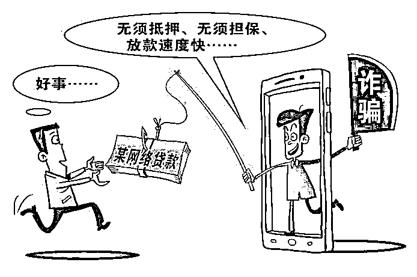

**阶段三：中年时期**

这个阶段的你事业有成、家庭和睦，自身也经过岁月的沉淀变得成熟稳定，诈骗分子也许很难从你身上入手，但是他们可以通过你的家人朋友对你进行诈骗，**常见的诈骗套路为：冒充老师（孩子）诈骗、网络赌博诈骗......**

**冒充老师（孩子）诈骗**

诈骗分子将会偷偷潜入你所在的家长群中，将头像、昵称改成与真老师一致。他们会通过观察，选在老师在上课不方便查看手机的时间段里，在群里发送虚假信息，一般都为需要缴纳学习材料费或者报考补习班。

为了孩子的学习成绩着想，群内的家长都会在群里发送红包或者转账的形式向诈骗分子提供的账户内转账。等到真正的老师反应过来时，诈骗分子早已收到钱财退群，不知去向。

而冒充孩子诈骗更加简洁明了，他们将会添加你为好友，伪装成你的孩子，再以需要缴纳学习材料费或者报考补习班为由，要求你转账汇款。

**赌博诈骗**

事业有成的你口袋里也有钱了，如果有人告诉你有一个平台可以进行赌博，他自己已经赚了好多了（其实这个人也是诈骗分子砧板上鱼肉）。这时，一旦你相信对方并且进行尝试，那么等待你的将是巨额欠款，而你美好和睦的家庭也将变得妻离子散。

所谓的平台只不过是诈骗分子自己搭建的虚假平台，一开始或许你会赢点小钱，其实这也是诈骗分子为了让你之后加大投入的套路罢了。之后就不用多说了吧，你一次一次的加大投入，最后却发现钱取不出来，平台也登不上去。

**阶段四：老年时期**

这个阶段的你退休了，每个月也有着固定的社保收入，但是诈骗分子可不会放过你，**常见的诈骗套路为：医保（社保）诈骗......**

**医保（社保）诈骗**

年纪大了或多或少有点跟不上时代的潮流，诈骗分子将会冒充相关工作人员告知你医保（社保）账户出现问题，需要你配合进行处理。

老年人一听到这样的消息基本上都会相信对方的说辞，如果不与自己的家人进行第一时间的反馈，而是选择按照对方的指示进行操作的话，那么辛辛苦苦工作一辈子攒下来的钱不仅没了，就连退休后打入银行卡内的社保钱也将会被盗走。

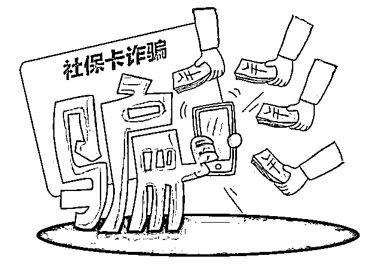

看完上文后

肯定有人会发出这样的感慨

天呐！

难道要一辈子

都活在诈骗分子的阴影下吗？

你可听说过这样一句话

“机会是留给有准备的人”

那么是不是可以理解为

**诈骗分子的套路**

**是留给没准备的人**

说了多少遍了

你就真的记住了吗？

长点心吧！

来源：微平利，反诈骗先锋

← 向右滑动与灰产圈互动交流 →

