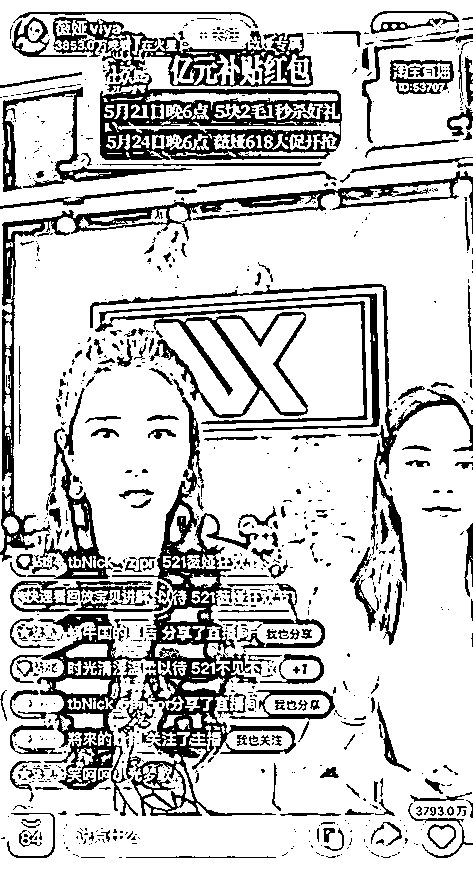

# 知名女主播薇娅被曝卖假货！

> 原文：[`mp.weixin.qq.com/s?__biz=MzIyMDYwMTk0Mw==&mid=2247515064&idx=2&sn=b80dcea33ad2142f7954f5a344f26f6b&chksm=97cb7080a0bcf996cc9b1c8ddb1a17f0de5e64325b33755bfef46eca826ddf7fb8b51915fcc4&scene=27#wechat_redirect`](http://mp.weixin.qq.com/s?__biz=MzIyMDYwMTk0Mw==&mid=2247515064&idx=2&sn=b80dcea33ad2142f7954f5a344f26f6b&chksm=97cb7080a0bcf996cc9b1c8ddb1a17f0de5e64325b33755bfef46eca826ddf7fb8b51915fcc4&scene=27#wechat_redirect)

近日，“顶流”主播薇娅在直播间售卖一款 Supreme x GUZI 联名挂脖小型风扇。次日被公开质疑该款商品是山寨联名。

这款以 198 元价格售卖的风扇，近日被时尚博主公开质疑是山寨联名商品，而非美国潮牌。随后，薇娅及古姿对该款风扇做出了“退款不退货”的处理，但并未就此事承认售假及公开致歉。

薇娅被质疑售卖山寨联名商品

“万物皆可 Supreme。”这句时尚圈的调侃没想到真成了反讽。近日，深受大众信任的“顶流”主播薇娅在直播间售卖一款 Supreme x GUZI 联名挂脖小型风扇。薇娅当晚在直播间介绍，这是潮牌 Supreme 首次与国货品牌古姿联名合作商品，售价仅为 198 元，并多次强调该产品是美国联名，非香港代理。次日，时尚博主 Abestyle 公开质疑该款商品是山寨联名。“GUZI 是个很不知名的国内小牌子，且正版 Supreme 也从未和任何国产品牌做过联名，更不会以 198（元）卖。”

薇娅意识到自己团队的选品失误后，迅速删除了直播回放。面对质疑，薇娅直播间回应称，“这是天猫国际官方小二推荐给我的。它不是我理想中的 Supreme，我希望商家能够对所有买的人进行全额退款，不退货。”

据小葫芦大数据显示，在薇娅的该场直播中，这款“Supreme 联名小风扇”售出了 2.19 万件，按照 198 元每件的价格，销售额高达 433.62 万元。

  假货、山寨为何频现知名主播的直播间？ 

但这不是薇娅团队第一次陷入售假风波，2020 年 1 月，意大利轻奢品牌 ASH 曾发文，多名消费者和消费渠道投诉，“薇娅 viya 高端定制女鞋”淘宝店仿冒制作 ASH 品牌旗下多项产品，并在“薇娅 viya 直播间”销售。

同年 3 月，原创设计品牌 squarecircle 也指控，薇娅在直播中销售的一款针织开衫毛衣款式、设计，完全类似于他们的一款商品，只是用了品质较差的纱线替换实为“山寨品”。

近日，“职业打假人”@王海 在微博上转发@科技小辛 的一则评测视频称，二驴和平荣被曝卖山寨朵唯手机，被骗消费者可以要求退一赔三。

经科技小辛检测发现，二驴和平荣所卖的是一款贴牌的方案机。这款手机除了冒用朵唯品牌之外，还盗用了其他手机的入网许可证，其宣传为 8+128 内存的配置实际上只有 4+64 内存，宣传有三个摄像头但实际只有一个能使用。

5 月 26 日，据媒体消息称，快手就主播被指卖假手机回应称，驴嫂平荣所卖手机确有质量问题，已实施退款不退货。

罗永浩、李诞等名人主播也曾被质疑过卖假货、山寨商品。去年底，有消费者质疑“交个朋友”直播间售卖的“皮尔卡丹”品牌羊毛衫是假货。去年 12 月，罗永浩通过微信公众号发布公告称，其 11 月 28 日销售的“皮尔卡丹”品牌羊毛衫，部分送检后鉴定为非羊毛制品，对此，罗永浩相关公司承诺对“所有购买该产品的消费者，代为进行三倍赔付。”

“直播售假不外乎两种原因，一是主播团队在商业利益诱惑下明知故犯‘知假售假’，二是主播团队在品牌授权和管理规范上存在漏洞，或是审核能力不足导致合作售假问题出现。”大成律师事务所上海办公室合伙人李伟华表示。记者注意到，罗永浩此前曾坦率地申明，“交个朋友”只是一个 200 多人的小型电商服务机构，审核能力难以超越大型电商平台，不敢承诺做到百分之百无假货。

某短视频 KOL 交易平台副总裁李倪对记者表示，直播售假现象之所以频繁出现，最核心的问题在于直播团队对产品和供应链的控制力度不够强。“但这并不能成为主播推卸责任的理由，**售假无论有心还是无意，假货就是假货。**”

带货主播应承担审核责任

在直播带货中，如何界定带货主播的责任？“不敢承诺做到百分之百无假货”能否成为主播免责的“挡箭牌”？

电子商务研究中心特约研究员赵占领对记者表示，产品质量货不对板，主播在直播间兜售“三无”产品、假冒伪劣商品等，均涉及到合同违约，消费欺诈等问题。“主播作为广告代言人应该使用过所代言的产品，**作为广告发布者应该审查广告内容的真假与合法性，否则要对此承担连带责任。**”

记者注意到，去年最高人民法院披露了一则北京互联网法院的判例。消费者王某某出于对主播许某某的信任，通过直播间购买了其私下销售的手机，收货之后发现是山寨手机，沟通无果后将许某某及其所在的直播平台告上法庭，法院判决主播承担赔偿责任。业内也有专家提出了“明星直播营销视同参与者”来避免法律责任旁落的建议。

5 月 25 日，《网络直播营销管理办法（试行）》正式施行，这是国内第一个关于网络视频营销活动的自律规范，对直播行为划定了 8 条红线，突出直播间 5 个重点环节管理，对直播营销活动相关广告合规、直播营销场所、互动内容管理、商品服务供应商信息核验、消费者权益保护责任、网络虚拟形象使用提出明确要求。这意味着，主播“卖货冲前头，出事躲最后”的乱象有望得到进一步解决。

**你买过网络主播带货的商品吗？**

**感受如何？**

**留言区聊聊**

来源：红网、北京日报、周到上海 APP、财经网、澎湃新闻

← 向右滑动与灰产圈互动交流 →

