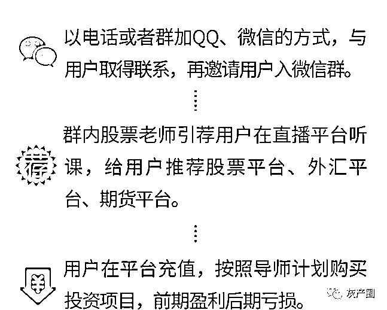
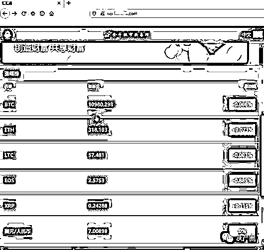
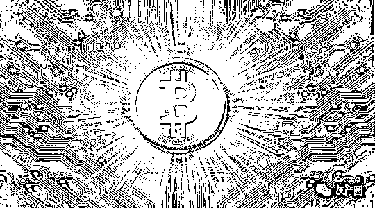
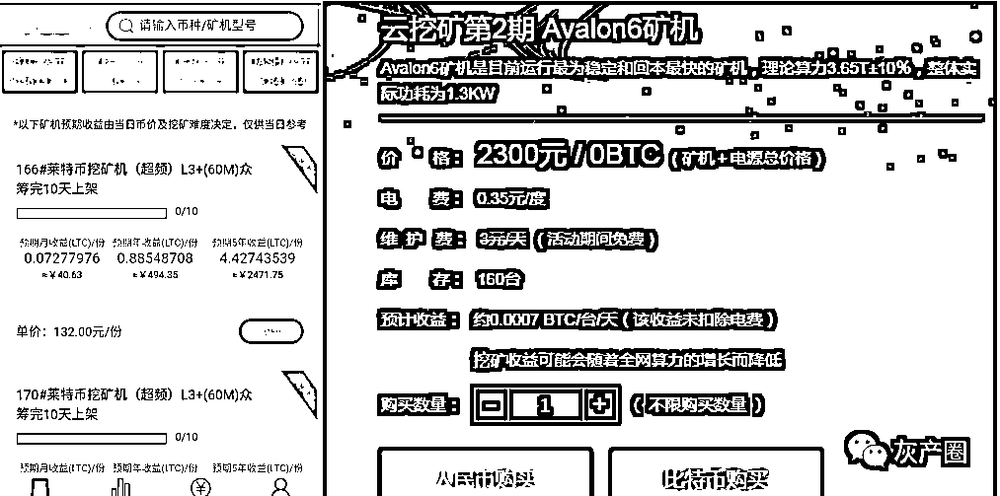
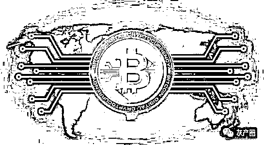
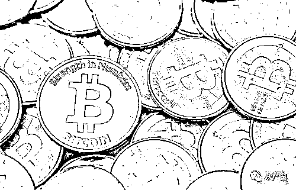
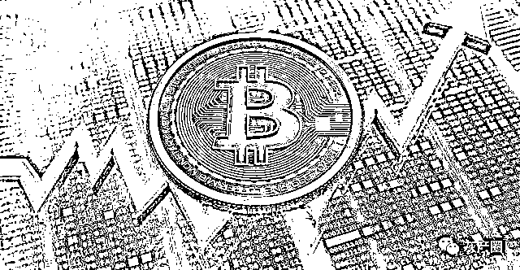

# 加密货币暴涨几十倍？是发财契机吗？

> 原文：[`mp.weixin.qq.com/s?__biz=MzIyMDYwMTk0Mw==&mid=2247515064&idx=3&sn=e66956d3409e44973a0f8fbbe49fe63e&chksm=97cb7080a0bcf9961efb54cd47bb94afb42e0edd703591dd7f570cc8eff2f29a6b9d7ac2b8a3&scene=27#wechat_redirect`](http://mp.weixin.qq.com/s?__biz=MzIyMDYwMTk0Mw==&mid=2247515064&idx=3&sn=e66956d3409e44973a0f8fbbe49fe63e&chksm=97cb7080a0bcf9961efb54cd47bb94afb42e0edd703591dd7f570cc8eff2f29a6b9d7ac2b8a3&scene=27#wechat_redirect)

近日，稳坐币圈热度头号交椅的狗狗币和 shib，价值暴涨暴跌无疑成为备受瞩目的加密货币，在全球范围引起社交和网络狂欢。“最佳带货王”马斯克的站台，让狗狗币一夜之间暴跌；紧接着，shib 也经历了涨跌，一夜之间天上地下。

世界通过比特币认识了区块链，也让无数人都重新燃起了一夜暴富的梦。由于虚拟货币市场的火热，市面出现了众多借助虚拟货币名义实施诈骗诈骗或非法集资的项目，不少平台打着虚拟货币、数字货币的口号，目的就是为了引导用户不断拉下线获利，表面炒高虚拟货币价值，私底下却干着大量资本套现的勾当，坑的就是一波波“韭菜”！

虚假理财平台，诈骗过程

即以荐股为名，吸引用户在虚假平台投资，骗取资金。

主要手段

使用喊单系统制作可伪造观众、点评等数据的直播授课系统，使用微盘系统搭建含指定客户亏损功能的虚假理财平台。

云矿机

## 

市面上还存在虚拟货币挖矿服务提供商，此类服务商提供矿机、网络、运行维护等服务，用户只需缴纳一定的租用、托管服务器的费用，选择所需挖矿的类型。所挖的币可在平台出售，即可获得收益。

由于虚拟货币市场不稳定，很多虚拟货币价格暴跌，大批炒币者损失惨重。同时，矿机市场云龙混杂，更多的是假借矿机的名义干着像云养殖一样的资金盘骗局。

空投项目

## 

空投原指飞机输送装备和物资，从空中投送到指定地点。空投项目指的是部分虚拟货币在推广的早期会以免费送的方式或以项目刚起步挖矿难度低的名义吸引用户关注进场，可以理解为空投项目就是刚诞生的虚拟货币平台项目。但空投项目与传统意义上的虚拟货币存在很大的不同，此类平台中大部分只是包装了区块链、虚拟货币名义，以拉人头获分成的资金盘骗局。

虚拟货币交易平台风险分析

## 

隐私信息泄露，资金或被盗刷

通常此类平台注册需实名认证，提交身份证照片、银行账号、手机号等重要隐私信息。如果个人信息被利用，很可能出现资金盗刷风险。

投资成本难以收回

虚拟货币市场不稳定，价格波动也很大，普遍出售价格远低于买入价格而亏损。

货币价值无法保证

平台自行发售的虚拟货币，市场认可度较低。且多数平台涉及传销，一旦平台跑路，其发行的货币价值为零。

云矿机运行状态无法保障

矿机服务商鱼龙混杂，用户购买的矿机无法自己操作，无法确保矿机的运行状态。

虚拟货币交易不合法

虚拟货币交易不在法规的保护之内，用户的权益无法保证。

透视虚拟货币的本质

## 

虚拟货币到底是什么呢？是逆风翻盘的发财契机，还是资本家的转场“游戏”？虚拟货币从本质上来说是网络中的字符串，其本身无价值，币种之间本质也无差别，与市场流通的货币挂钩、取得国家机构的认可、或获得绝大多数人的认可才会产生相应的价值。比特币正是由于得到部分国家、市场的认可，才有了今天看起来所谓的价值。但由于不确定性极强，更像一种赌博押宝式的“投机”工具，一旦出现崩盘，很可能一夜之间价值灰飞烟灭。卫士妹只能提醒各位，谨慎投资。

来源：网络侦查研究院，安全客

← 向右滑动与灰产圈互动交流 →

