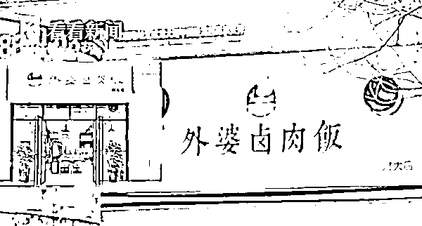
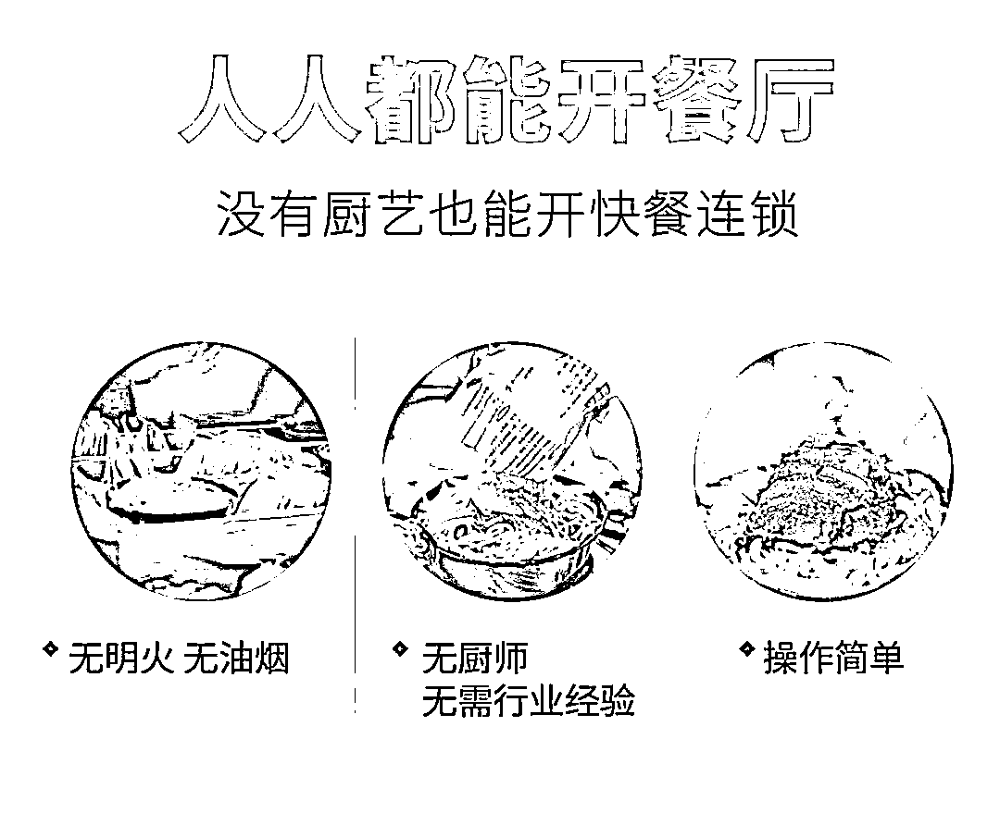
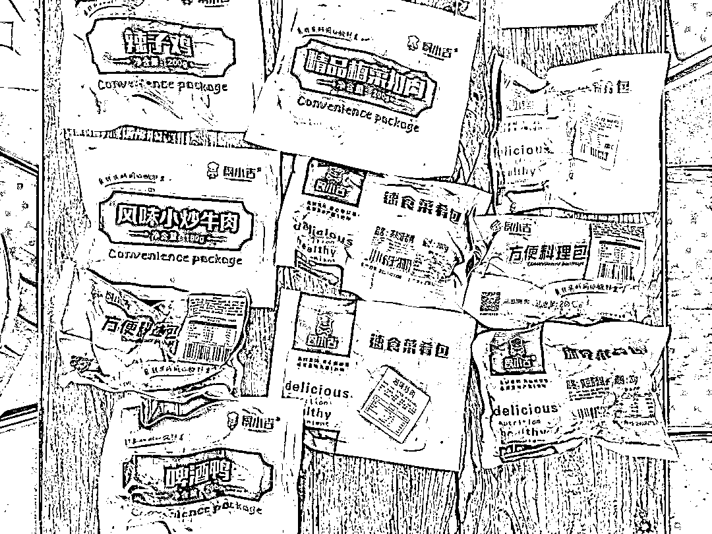
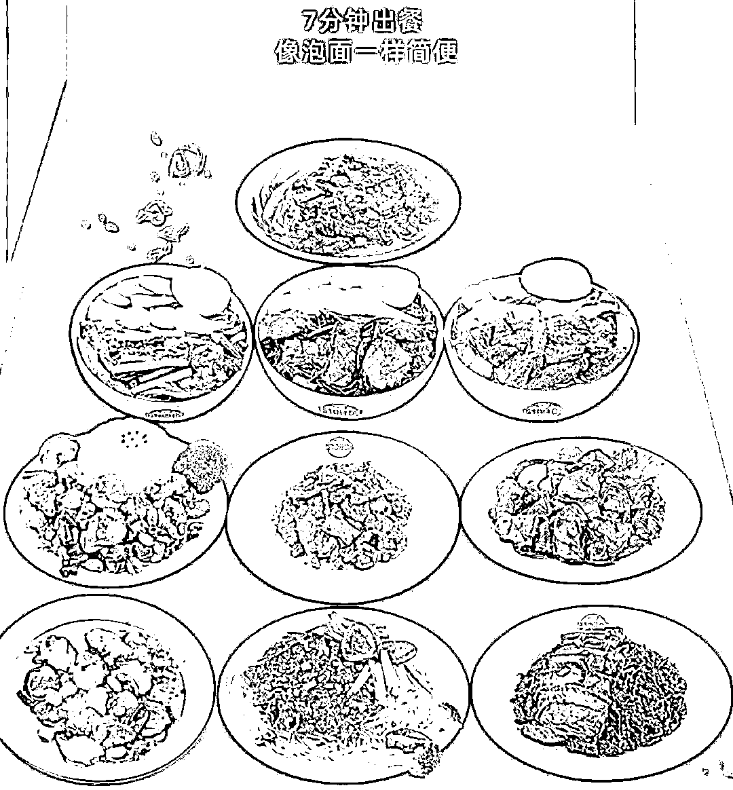
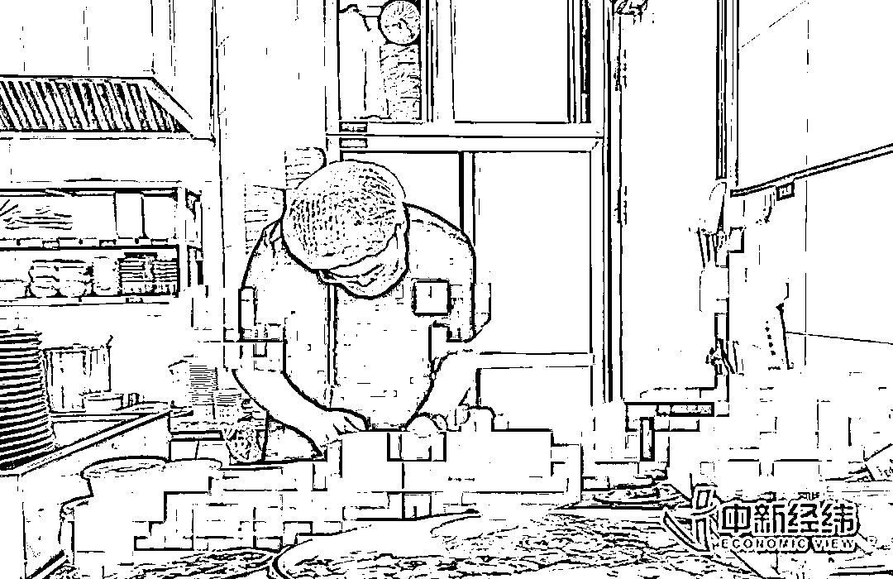
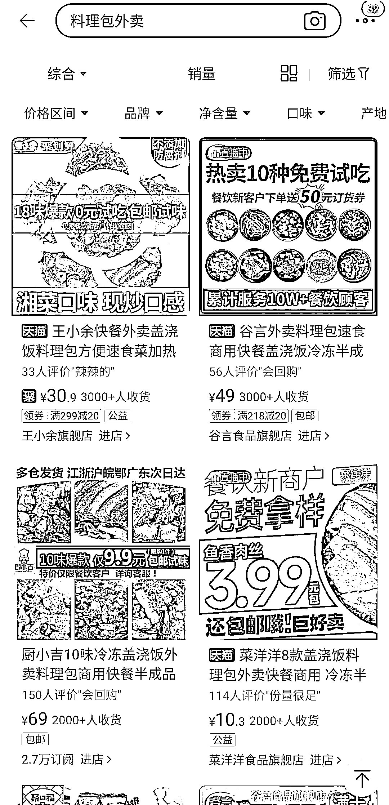
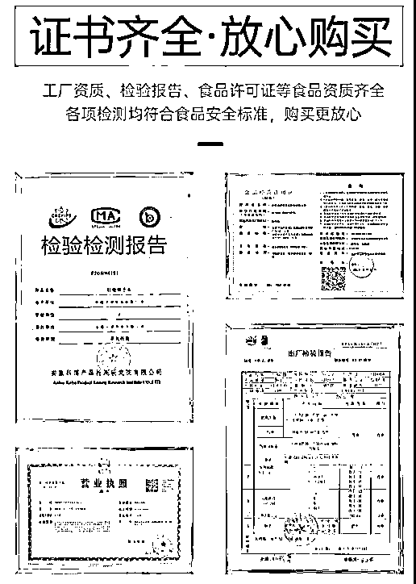
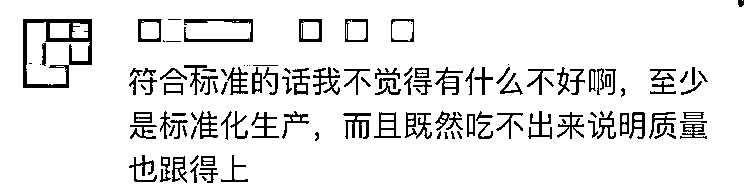
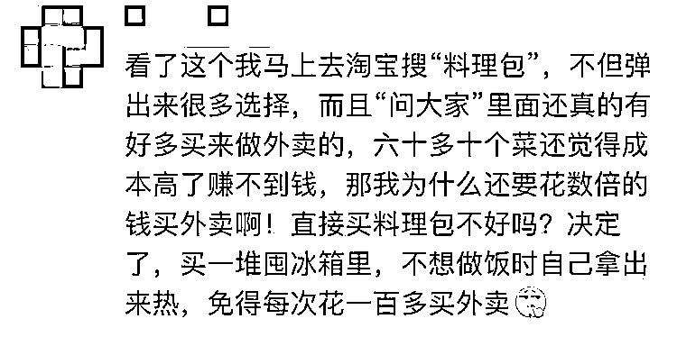
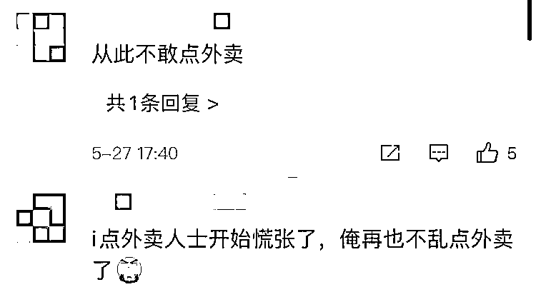

# 一年前就做好的外卖，你还敢吃吗？成本最低只要三块！？

> 原文：[`mp.weixin.qq.com/s?__biz=MzIyMDYwMTk0Mw==&mid=2247515064&idx=4&sn=3204b9e8e48b68ddb873fe7d250a0154&chksm=97cb7080a0bcf9966e7cedb2f54c92cd29500a37224059fb1df67788b20728f319cdf15d2e09&scene=27#wechat_redirect`](http://mp.weixin.qq.com/s?__biz=MzIyMDYwMTk0Mw==&mid=2247515064&idx=4&sn=3204b9e8e48b68ddb873fe7d250a0154&chksm=97cb7080a0bcf9966e7cedb2f54c92cd29500a37224059fb1df67788b20728f319cdf15d2e09&scene=27#wechat_redirect)

“叮~”

微波炉加热完毕！

剪开热气腾腾的料理包软袋

把菜肴盖在蒸好的米饭上

装盒、打包

不到 5 分钟，大功告成

它被妥帖地安置在门外等候的小摩托保温箱里

不到半小时

外卖小哥拎着餐盒

按响了你家的门铃

没错，这就是你吃到的外卖——速食料理包

最近有媒体曝出

你在外卖平台上花近 30 元点的卤肉饭

可能是由成本不到 5 元的料理包

简单加热而成

而且这份料理包

**可能一年前就已经做好了**

**你还会觉得它香吗？**

一时间

#使用料理包已成为外卖普遍现象#

成为微博热搜话题

早在两年前

就有外卖店铺开始使用料理包

2019 年 1 月

有市民举报了成都本地一家做卤肉饭的连锁店。

它在成都开设有多家分店，并且家家生意都很好 

在被暗访的作坊里面

**工作人员没有佩戴口罩和手套**

**徒手将西兰花摆在餐盒内**

更加让人震惊的是

她们从微波炉中**拿出一个个塑料袋打开**

**直接倒入饭盒内**

记者打通了这家卤肉饭的加盟电话，揭开了塑料袋的真面目。原来这些都是工厂加工过的卤肉饭**速热料理包，****成本 4 块 4 一包。**制作外卖的过程根本不用任何名厨明火。几个工作人员，几个微波炉就能轻松搞定。

**料理包现在到底有多“猛”**

对大部分普通人来说，料理包是个比较陌生的词，很多人听到这个名字的时候都是一头雾水，但是在外卖界，使用料理包却是商家们**心知肚明的秘密。**

没错， 这就是小白变厨神的秘密，一包在手，天下我有！

卤肉饭、香菇滑鸡、麻婆豆腐、三杯鸡、黄焖鸡，红烧牛肉，甚至老鸭粉丝汤、包子、馄饨，全部都有成熟的料理包制品。

四川一家外卖料理包供应商表示，“现在外卖店基本上都在用料理包，尤其是那些有几十个菜品的商家，一到中午，一个厨师根本就炒不过来，那肯定是用的半成品料理包。”

该供应商提供的产品报价显示，其可供应近 70 种不同菜品的料理包，包括主菜、配菜、下饭菜、汤等，**单价多在 3-10 元之间。**“餐饮店、外卖、机场、茶餐厅、网咖，我们都有供货，只要在开水里加热 2-3 分钟，就可以出餐。”

据介绍，**这些料理包部分可常温保存，保质期为 6 个月；部分需要零下 18 度冷冻保存，保质期为一年。** 该供应商还可以为客户提供定制服务，也就是所谓的“贴牌”，“单品 100 件起，5 个单品起定，可以根据客户给的配方做料理包，没有配方的，我们也能提供配方。” 

在电商平台上，也有不少商家售卖各种口味的外卖料理包，单包价格通常在 10 元以下，保质期多在一年左右，也有部分长达一年半。

料理包的流行很大程度上促成了外卖的标准化、工业化，而未来的餐饮业势必会朝着工业化的趋势前进 。

**料理包真的安全、卫生吗？**

据供应商介绍，使用料理包在外卖行业已十分普遍，消费者根本吃不出来，即便是被有关部门查到也没关系，**“我们有生产资质，每个产品都是符合国家标准的，也都有检测报告，就算是查到了也不怕。”**

某电商平台上专门售卖料理包的店铺也在商品详情页面介绍，工厂资质、检验报告、食品许可证等食品资质齐全，各项检测均符合食品安全标准。

那么，对于这样的外卖，

消费者能不能接受呢？

有网友认为

“料理包总比黑作坊干净得多”

“保质期范围内吃，应该没有问题”

还有网友“马上下单料理包”

有人则表示不能接受

“惊掉下巴”

“无法忍受不新鲜，即便是干净统一的冷冻包，

一年也有点久了”

 经常点外卖的白领熊女士表示，在保证干净、卫生、生产达标的前提下，自己是可以接受一些商家使用外卖料理包的，不过她认为这些**商家应将使用情况如实告知消费者。**

**商家有义务保证消费者知情权不被侵权**

上海汉盛律师事务所高级合伙人李旻表示，法律上并没有明确规定商家在哪些情况下需要对消费者达到何种程度的告知义务。**“只能说，如果消费者去问，那么商家肯定要如实回答，以确保消费者的知情权不受侵犯。”**

此外，李旻提到，判断外卖商家有没有侵犯消费者知情权，主要得看对方的主观意愿，是否有明确表态自己产品不是料理包，或者通过一些行为、言论等进行暗示，而不能简单以商家没有主动说自己使用了料理包就认定其侵犯了消费者知情权。

人的生活离不开一日三餐

外卖对于许多工作繁忙的人而言

更是应急之需

希望有关各方联手共同规范

让打工人吃的明明白白安安心心

来源：看看新闻 Knews、中新经纬、新华社、微博网友等

← 向右滑动与灰产圈互动交流 →

