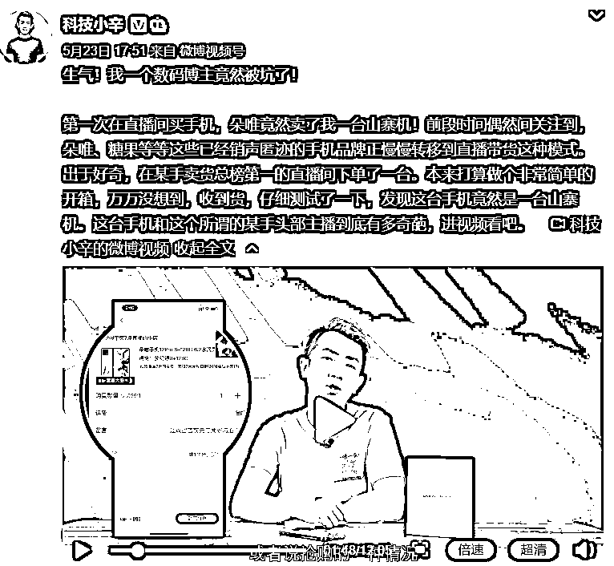
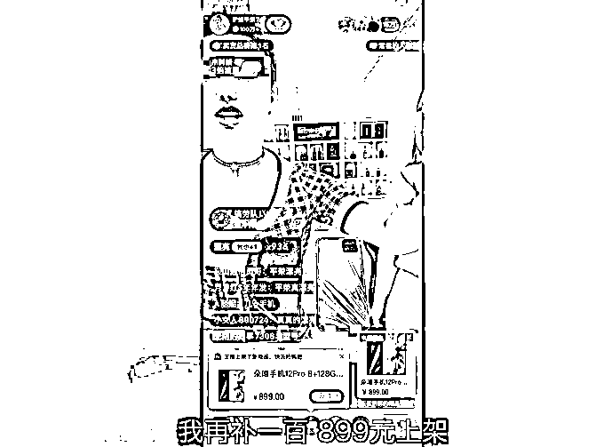
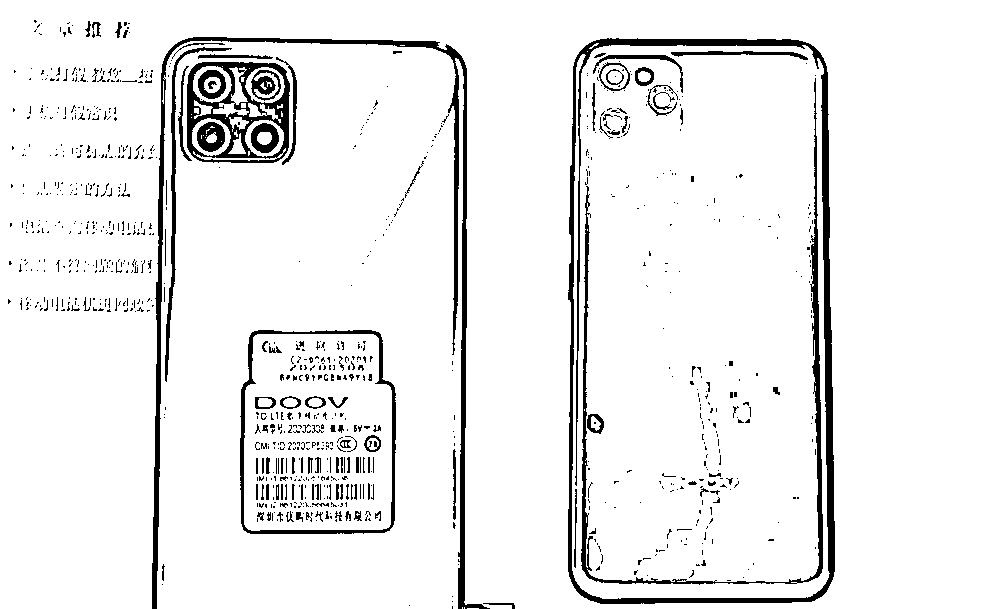
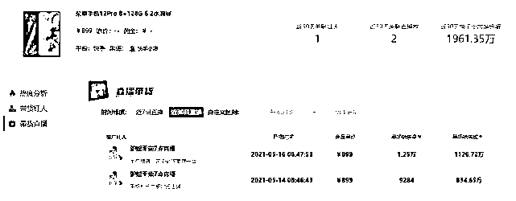
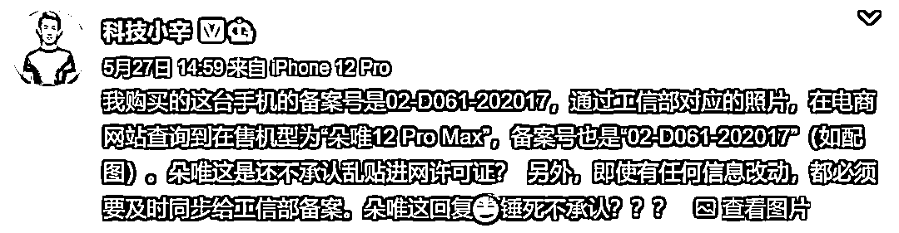
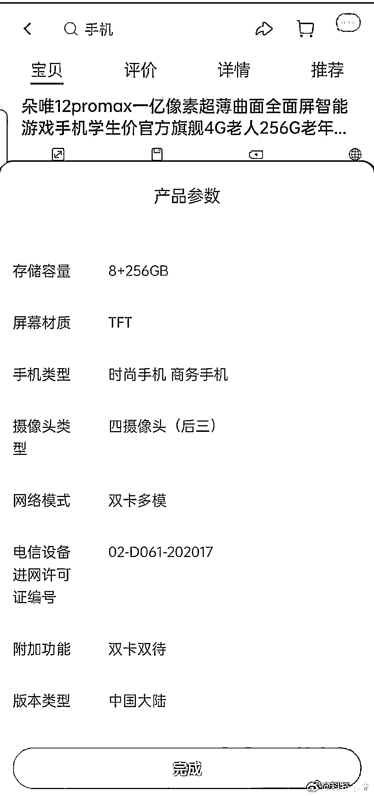
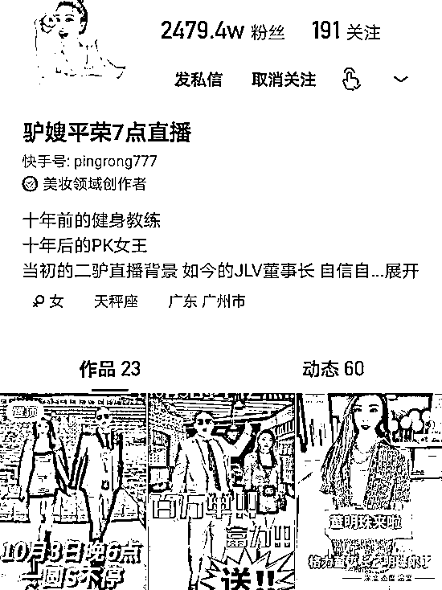

# 原价 4999 只要 899，2400 万粉丝主播被曝卖山寨机！平台：退款，手机您留着！

> 原文：[`mp.weixin.qq.com/s?__biz=MzIyMDYwMTk0Mw==&mid=2247515115&idx=1&sn=c8f589ecca13abc748342e3d90706692&chksm=97cb70d3a0bcf9c583eddfb01a44571df2dfefdde5c404feb7fa0e988765f76edc01a7d32a12&scene=27#wechat_redirect`](http://mp.weixin.qq.com/s?__biz=MzIyMDYwMTk0Mw==&mid=2247515115&idx=1&sn=c8f589ecca13abc748342e3d90706692&chksm=97cb70d3a0bcf9c583eddfb01a44571df2dfefdde5c404feb7fa0e988765f76edc01a7d32a12&scene=27#wechat_redirect)

又一网红带货翻车!

近日，科技数码产品评测机构 ZEALER 联合创始人、微博大 V“@科技小辛”发布的一期手机评测视频，引发了一场关于直播间售假谁来担责的讨论。

该博主在视频中称，14 号当天在快手“驴嫂平荣 7 点直播”（快手号：pingrong777）直播间下单了一款朵唯 12Pro 手机。收货开箱测试后却发现，这位“快手卖货总榜第一”，拥有 2400 多万粉丝的大主播推荐的竟然是一台贴牌山寨机。

这事被曝光后，迅速引起了热议，#网红二驴夫妻被指带货山寨机#话题一度冲上新浪微博热搜榜前三，许多网友表示，对于这种售假的主播应当予以严惩。

根据报道，快手官方回应称，“科技小辛”曝光的该款手机存在质量问题，全平台已下架，消费者将在 3 个工作日内收到来自快手平台的全额退款，并且不用返回手机。

**“驴嫂平荣”被指直播卖山寨手机**

**一场上万台** 

“前段时间偶然间关注到，‘朵唯’、‘糖果’等等这些已经销声匿迹的手机品牌正慢慢转移到直播带货这种模式。出于好奇，在某手卖货总榜第一的直播间下单了一台。本来打算做个非常简单的开箱，万万没想到，收到货，仔细测试了一下，发现这台手机竟然是一台山寨机。”5 月 23 日，数码博主“科技小辛”发布相关视频时，配发了上述文字。

“科技小辛”在视频中提及，他在网上看到一篇名为《一个月卖 4.7 亿，酷派、朵唯、天语粉丝纷纷在快手复活了》的文章，了解到这些品牌在快手平台上很火，特别是直播带货，甚至在单场直播带货中就能销售 1 万多台，月销售额上亿。为了测试这些品牌的手机质量如何，他就在快手头部主播“驴嫂平荣”直播间下单了“朵唯 12Pro”手机。

该博主称，“驴嫂平荣”自称该手机只能在其直播间才能买到，官网售价 4999 元，在主播不断降价和“补一百”的情况下，该博主最终以 899 元的价格抢到“库存充足”的该款手机。

“科技小辛”购买这款手机后，用手机背面的入网许可证，在工信部官网查询，发现和备案的手机不是一个型号。也就是说，博主在直播间购买的这款手机，用了其他手机的入网许可证。

“科技小辛”表示，这款手机宣称是“三摄”，但实际上，手机背面的三个摄像头只有一个能正常工作，另外两个摄像头都是假的。

另外，“科技小辛”往手机内拷贝了一个 1G 的文件，占用 2.4G 的内存，所以推断这款手机是一款售价 599 元 4G+64G 的，并不是“二驴夫妻”所谓的 8G+128GB。

博主在视频中介绍，一位深圳做供应链的朋友告诉他，这种机型应该是厂商生产的方案机，也就是通常说的山寨机。“哪家品牌看上了直接贴牌”，配置信息都可以伪造。

小葫芦数据显示，驴嫂平荣近日曾两次在直播间售出这款手机，销量分别为 9284 台和 1.25 万台，两场直播中这款手机的销量已超过两万台，销售额近 2000 万。目前，这款商品已经被删除。

**供货商称从朵唯厂家拿的货**

**合肥市监介入调查**

****

****据红星新闻报道，“科技小辛”一方正与直播间客服、手机供货商家以及快手平台进行沟通，“还没有确定的结论，我们目前掌握的情况就是视频里讲的，这台手机确实是不允许销售的‘山寨’机。现在也正在查，到底是主播知假售假还是主播也是受害者，被入驻商家坑了。因为这个商家不止是在主播这里卖手机，各大主播都有售卖此商家供货的朵唯、糖果等等不同型号的手机。”****

****而朵唯手机官方售后工作人员却表示，上述“朵唯 12Pro”手机系朵唯今年推出的新款手机，该手机与工信部的官网查询到的手机系同一款，“进网管理网站录入的是前期研发阶段的试产图片，后期产品的更新，外观是会有些改动的，具体的您可以看下手机设置里面的型号是否与网标相符，查询真伪可通过进网标志扰码进行查询。”****

****“科技小辛”随后表示，“即使有任何信息改动，都必须要及时同步给工信部备案”，指出朵唯乱贴进网许可证。****

********

********

****据上游新闻报道，合肥万鹏信息科技有限公司是“二驴夫妻”的供货商。5 月 27 日，该公司法定代表人彭鹏如是说：“是我给二驴夫妻供的手机，我是找朵唯厂家拿的货，我也不知道怎么回事，我还在调查。”****

****合肥市高新区市场监督管理局执法人员称，分管领导高度重视，将介入展开调查，待调查清楚后及时通报。同时该执法人员表示，将重点调查合肥万鹏信息科技有限公司与朵唯厂家的供货合同。“是甩锅还是怎么回事？一定会查得清。”****

******快手回应：******

******涉事商家涉嫌恶意欺瞒平台和带货主播******

************

******针对此事，快手方面回应称，5 月 18 日，该公司在日常巡检中发现，一款商家宣传为“朵唯 12Pro”的手机因质量原因引发退款申请率异常，随即对该款手机启动采买送检流程，等待权威检验结果。“22 日，自媒体的实测报道显示该商品疑似问题山寨手机，我们先行在平台上下架了所有该型号手机。”******

************

******5 月 25 日，来自第三方质检的最新报告显示，该商品存在质量问题。“为保护消费者权益，我们在当天先行执行了退款不退货，对已付款的消费者进行了外呼，消费者将在 3 个工作日内收到来自快手平台的全额退款，并且不用返回手机。”快手方面表示。******

******快手方面还称：“目前，快手电商已经启动涉及品牌方、经销商和带货主播的调查。经初步了解，涉事商家涉嫌存在恶意欺瞒平台和带货主播的情形，具体情况仍在核实取证中。待有确定结论后，我们将再采取进一步的处理措施。”******

****粉丝达 2400 万****

****30 天内带货手机累计预售额超 4.7 亿****

********

****“驴嫂平荣”是快手头部主播，粉丝量 2479.5 万，是另一名拥有 4371.4 万粉丝的快手主播“二驴”的妻子。两人在快手平台直播带货能力惊人，2020 年 5 月，格力董明珠携手平荣夫妻开启直播，最终销售额破 3.1 亿。****

********

****据“飞瓜数据”不完全统计，快手主播“驴嫂平荣”连续 30 内带货包括天语、糖果、酷派、索爱、中兴在内的超 20 款机型，单机售价在 679 元至 1499 不等，累计预售额超 4.7 亿元。****

****有自媒体的 4 月直播带货销售排行榜上，“驴嫂平荣”在主播薇娅、李佳琦、雪梨之后，排行第四。****

****值得注意的是，这已经不是“二驴夫妻”第一次陷入假货风波。2020 年末，快手另一主播辛巴直播带货假燕窝事件曝光后，“二驴夫妻”也被曝“售卖防辐射酒”，“二驴夫妻”主动道歉并赔偿。****

****实际上，并非“二驴夫妻”一家直播间出现了山寨产品。****

****不久前，薇娅就被时尚博主质疑在直播间售卖的挂脖风扇是山寨假货，此事也引发了争议。事后薇娅在回应中未承认售假，称该产品由天猫国际官方小二推荐，自己理解错误，并以退款不退货方式对该事件予以解决。****

****另外，罗永浩、李诞、超级丹等都曾因涉嫌售卖山寨货而陷入风波。****

****主播带货直播屡陷假货风波，平台的监管也遭受质疑。**** 

****24 日盘后，快手发布截至 2021 年 3 月 31 日为止 3 个月的季报。财报显示，一季度快手其他服务（包括电商）的收入为人民币 12 亿元，同比快速增长 589.1%，电商交易总额同比增长 219.8%，达到人民币 1186 亿元。****

****不过，25 日快手跳空低开低走，股价大跌超 11%。值得注意的是，目前快手每股价格在 204 港元左右，较 2 月 16 日创造的每股 417.8 港元的最高点已经下跌 51%。****

****来源：中国基金报****

********

****← 向右滑动与灰产圈互动交流 →****

********