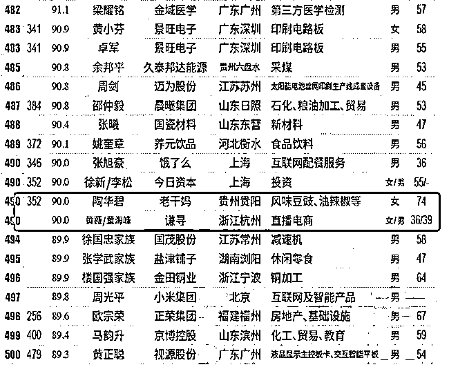

# 薇娅道歉

> 原文：[`mp.weixin.qq.com/s?__biz=MzIyMDYwMTk0Mw==&mid=2247515115&idx=2&sn=8d4a66471a2f0fdb851a733d91b30726&chksm=97cb70d3a0bcf9c5d66276a47b02a9439887d40c1b4bb878fda627351c310184d36dd8b9caf3&scene=27#wechat_redirect`](http://mp.weixin.qq.com/s?__biz=MzIyMDYwMTk0Mw==&mid=2247515115&idx=2&sn=8d4a66471a2f0fdb851a733d91b30726&chksm=97cb70d3a0bcf9c5d66276a47b02a9439887d40c1b4bb878fda627351c310184d36dd8b9caf3&scene=27#wechat_redirect)

## 

图：视觉中国 

## 近日，薇娅在直播间售卖一款 Supreme x GUZI 联名挂脖小型风扇。次日被公开质疑该款商品是山寨联名。

## （此前报道：[知名女主播薇娅被曝卖假货！](http://mp.weixin.qq.com/s?__biz=MzIyMDYwMTk0Mw==&mid=2247515064&idx=2&sn=b80dcea33ad2142f7954f5a344f26f6b&chksm=97cb7080a0bcf996cc9b1c8ddb1a17f0de5e64325b33755bfef46eca826ddf7fb8b51915fcc4&scene=21#wechat_redirect)）

## 5 月 28 日，薇娅公司“谦寻文化”发布道歉声明，表示因选品失误问题，向公众致歉。 

随后薇娅本人也立即转发，表示自己很惭愧，向大家诚恳道歉，并强调自己跟团队会永远铭记这次授权争议事件，同时也会承担这次事件后的相应责任。 

薇娅公司的这份声明主要提到了以下 5 点：

1、**承认了团队在选择潮流品牌产品上经验不足**，并再次道歉，表示团队会对此进行反思，此后严格加强相关知识学习。并且为了避免类似事件再次出现，团队已聘请专业知识产权律师参与相关产业评估。

2、在与品牌“古 X”进行合作前，虽按照合规流程签署了法律协议，并要求对方提供了授权文件，但依旧出现了问题，对此再次已购买该产品的消费者道歉。

3、目前该风扇企业已停止售卖此款产品，**凡是在薇娅直播间购买过此产品的消费者，可随时申请只退款不退货。**

4、**薇娅方表示绝不会回避及承担相应责任，**强调没有删除当时直播回放，感谢广大媒体监督，并恳请部分媒体删除不实信息，如薇娅卖假货，删除直播回放等。望之后，能给予澄清。

在声明最后，薇娅的团队放上了与品牌方签署的合作协议，以及美国至高无上品牌管理公司的总代理授权书、和美国至高无上品牌管理公司在美国的公司设立文件。

此外，就 Supreme 图文的使用，古姿 GUZI 出具的由四川正和嘉德文化传播有限公司授权四川速普锐品牌管理公司使用 Supreme 图文的著作权许可授权书及相应作品登记证书等证明文件。

谦寻文化表示：“经过核查，我们深知本次推广产品存在授权争议，我们再次向公众致歉，但古姿 GUZI 和我们都难以从法律层面进行维权，这是谦寻和薇娅团队成长中值得被铭记的教训。”

**“万物皆可 Supreme”******

******“万物皆可 Supreme。”这句时尚圈的调侃没想到真成了反讽。******

******薇娅当晚在直播间介绍，这是潮牌 Supreme 首次与国货品牌古姿联名合作商品，售价仅为 198 元，并多次强调该产品是美国联名，非香港代理。次日，时尚博主 Abestyle 公开质疑该款商品是山寨联名。“GUZI 是个很不知名的国内小牌子，且正版 Supreme 也从未和任何国产品牌做过联名，更不会以 198（元）卖。”****** 

******有报道称，薇娅意识到自己团队的选品失误后，迅速删除了直播回放。面对质疑，薇娅直播间回应称，“这是天猫国际官方小二推荐给我的。它不是我理想中的 Supreme，我希望商家能够对所有买的人进行全额退款，不退货。”******

******据小葫芦大数据显示，在薇娅的该场直播中，这款“Supreme 联名小风扇”售出了 2.19 万件，按照 198 元每件的价格，**销售额高达 433.62 万元。********

****************

******品牌方曾被列为老赖******************

**********工商信息显示，上述“挂脖风扇”的品牌方曾被列为老赖，近期更名并与薇娅合作。**********

 **********公开报道显示，美国潮牌 Supreme 于 2020 年成功在华注册商标“SUPREME NEW YORK”。但据悉，目前在国内市场中仍有不止一家公司在申请 Supreme 相关商标的情况。**********

**********新京报记者在中国商标网看到，“SUPREME NEW YORK”的申请人为美国章节四公司，类别涉及 25 类、28 类、43 类等，商品/服务分别包括服装绶带、浴帽等；游泳池（娱乐用品）、塑胶跑道等；饭店、旅馆预订等，均显示为“注册”。2021 年 1 月 14 日，章节四公司又申请了“SUPREME”（25 类）商标，商品/服务涉及服装、衬衫、成品衣等内容的，目前显示为“等待实质审查”。**********

**********此外，2020 年 11 月，至高无上品牌管理集团有限公司申请“SUPREME PRO”（25 类）商标，商品/服务涉及手套（服装）、 围巾；2021 年 3 月，至高无上品牌管理集团有限公司又申请了“Supreme”（11 类）商标，商品/服务涉及可穿戴电风扇、电风扇、可折叠电热水壶。目前，这两个申请均显示“等待实质审查”。**********

**********而除了章节四公司、至高无上品牌管理集团有限公司 2 家公司，在中国商标网上还有其他公司申请“Supreme”相关商标。其中，上海汇奢品牌管理有限公司申请的“SUPREME ANGEL”（18 类）于 2021 年 4 月 6 日核准注册，商品/服务涉及钱夹、手提包、行李箱等。**********

**********薇娅身价 90 亿**********

**********进入中国富豪榜前 500**********

********************

 **********根据最新的新财富发布的全国富豪榜单，年仅 36 岁的主播薇娅与其丈夫董海锋以 90 亿元财富值首次登榜，排名第 490 位，比肩 74 岁“老干妈”创始人陶华碧，以及饿了么创始人张旭豪。**********

**********这一步，老干妈用了 23 年，张旭豪用了 13 年，薇娅只用了 5 年。**********

********************

**********据公开报道，A 股 4200 余家上市公司，2020 年营收超过薇娅带货数额的，不到 300 家。有关数据统计，仅 2020 年，薇娅带货达 311 亿元，李佳琦带货达 218 亿元，辛巴带货则达 121 亿元，出道时间最晚的罗永浩带货 19.7 亿元。**********

**********假货、山寨**********

**********为何频现知名主播直播间？**********

********************

**********但这不是薇娅团队第一次陷入售假风波。**********

**********2020 年 1 月，意大利轻奢品牌 ASH 曾发文，多名消费者和消费渠道投诉，“薇娅 viya 高端定制女鞋”淘宝店仿冒制作 ASH 品牌旗下多项产品，并在“薇娅 viya 直播间”销售。**********

**********同年 3 月，原创设计品牌 squarecircle 也指控，薇娅在直播中销售的一款针织开衫毛衣款式、设计，完全类似于他们的一款商品，只是用了品质较差的纱线替换实为“山寨品”。**********

**********近日，“职业打假人”@王海 在微博上转发@科技小辛 的一则评测视频称，二驴和平荣被曝卖山寨朵唯手机，被骗消费者可以要求退一赔三。**********

**********经科技小辛检测发现，**二驴和平荣所卖的是一款贴牌的方案机。**这款手机除了冒用朵唯品牌之外，还盗用了其他手机的入网许可证，其宣传为 8+128 内存的配置实际上只有 4+64 内存，宣传有三个摄像头但实际只有一个能使用。**********

**********5 月 26 日，据媒体消息称，快手就主播被指卖假手机回应称，驴嫂平荣所卖手机确有质量问题，已实施退款不退货。**********

**********罗永浩、李诞等名人主播也曾被质疑过卖假货、山寨商品。去年底，有消费者质疑“交个朋友”直播间售卖的“皮尔卡丹”品牌羊毛衫是假货。去年 12 月，罗永浩通过微信公众号发布公告称，其 11 月 28 日销售的“皮尔卡丹”品牌羊毛衫，部分送检后鉴定为非羊毛制品，对此，罗永浩相关公司承诺对“所有购买该产品的消费者，代为进行三倍赔付。”**********

**********“直播售假不外乎两种原因，一是主播团队在商业利益诱惑下明知故犯‘知假售假’，二是主播团队在品牌授权和管理规范上存在漏洞，或是审核能力不足导致合作售假问题出现。”大成律师事务所上海办公室合伙人李伟华表示。**********

**********罗永浩此前曾坦率地申明，“交个朋友”只是一个 200 多人的小型电商服务机构，审核能力难以超越大型电商平台，不敢承诺做到百分之百无假货。**********

**********某短视频 KOL 交易平台副总裁李倪表示，直**播售假现象之所以频繁出现，最核心的问题在于直播团队对产品和供应链的控制力度不够强。**“但这并不能成为主播推卸责任的理由，售假无论有心还是无意，假货就是假货。”**********

************带货主播应承担审核责任************************************

************在直播带货中，如何界定带货主播的责任？“不敢承诺做到百分之百无假货”能否成为主播免责的“挡箭牌”？************

************电子商务研究中心特约研究员赵占领表示，产品质量货不对板，主播在直播间兜售“三无”产品、假冒伪劣商品等，均涉及到合同违约，消费欺诈等问题。“主播作为广告代言人应该使用过所代言的产品，作为广告发布者应该审查广告内容的真假与合法性，否则要对此承担连带责任。”************

************去年最高人民法院披露了一则北京互联网法院的判例。消费者王某某出于对主播许某某的信任，通过直播间购买了其私下销售的手机，收货之后发现是山寨手机，沟通无果后将许某某及其所在的直播平台告上法庭，法院判决主播承担赔偿责任。业内也有专家提出了“明星直播营销视同参与者”来避免法律责任旁落的建议。************

************5 月 25 日，《网络直播营销管理办法（试行）》正式施行，这是国内第一个关于网络视频营销活动的自律规范，对直播行为划定了 8 条红线，突出直播间 5 个重点环节管理，对直播营销活动相关广告合规、直播营销场所、互动内容管理、商品服务供应商信息核验、消费者权益保护责任、网络虚拟形象使用提出明确要求。这意味着，主播“卖货冲前头，出事躲最后”的乱象有望得到进一步解决。************

************来源：21 世纪经济报道、 红网、南国早报、新京报、中国新闻周刊************

************************

************← 向右滑动与灰产圈互动交流 →************

************************