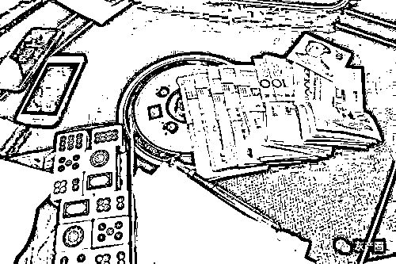

# 网络赌博平台上挣的钱真的能提现吗

> 原文：[`mp.weixin.qq.com/s?__biz=MzIyMDYwMTk0Mw==&mid=2247515115&idx=4&sn=38cb4605134808de9614a0cc597d3ae9&chksm=97cb70d3a0bcf9c57d479a038bceca32c453101103854203c6e285df2fc750329112b43c9afd&scene=27#wechat_redirect`](http://mp.weixin.qq.com/s?__biz=MzIyMDYwMTk0Mw==&mid=2247515115&idx=4&sn=38cb4605134808de9614a0cc597d3ae9&chksm=97cb70d3a0bcf9c57d479a038bceca32c453101103854203c6e285df2fc750329112b43c9afd&scene=27#wechat_redirect)

**天下之倾家者，莫速于博；天下之败德者，亦莫甚于博。** 

** ——蒲松龄**

今天来和大家聊聊关于网络赌博的事吧

线下的传统赌博，无论赌资还是筹码都以实体的方式存在，会让人保持一定警觉性。

可是在网络赌博中，博彩花样多，筹码只是数字，可能鼠标一点，就让人身陷其中。

与传统赌博十赌九输不同的是，网络赌博危害更大，十赌十输，没有例外。

为什么这么说呢？因为网络赌博更容易让人产生“动动手指就能赚钱”的错觉，网络的匿名性也会让人有一种虚假的安全感。

如果是在真正公平的环境下，以运气为基础的赌博行为应该是有人赢有人输。

但大家也都知道，线下赌局都可能有人“出老千”，网络赌博的暗箱操作就更让人防不胜防了。

**真实案例：**

      家住小店区南内环小区的阿香收到了网友“阿强”的微信好友请求，对方自称是她的相亲对象，添加后阿香表示他认错人了，但这并不影响“阿强”主动和她聊天！

渐渐熟络后，阿香称最近在网上报了一个微商学院的培训班学习理财知识。无巧不成书！“阿强”说他也是做短期投资的，和她分享理财小知识，还发来一个“中财理资”APP 二维码。

阿香下载注册后，发现是一个投注押单双的博彩 APP，尝试着充值了几次，按照“阿强”替她选择的项目投注，每一次收益都能到账并提现成功，阿香深信这个博彩 APP 可以让她赚钱！

阿香陆续充值 30 万元、50 万元、80 万元……，对方甚至还“贴心”替她充值了 18 万元，但此时的阿香已经无法提现，“阿强”也联系不上了，这才意识到被骗……

**套路揭秘：**

当我们在浏览网页、使用网络平台或软件时，各式各样的“网络赌博”广告信息常常会不经意间出现在我们眼前。这些广告信息往往以“致富、赚钱、提现”等字眼吸引眼球，试图诱导我们的关注和参与。

又或者以刷单、拉群荐股、网络交友、婚恋平台交友等等多种多样的引流方式引导我们进入网络赌博。

网络赌博已是违法

再加上诈骗

你不入局谁入局？

[`mp.weixin.qq.com/mp/readtemplate?t=pages/video_player_tmpl&action=mpvideo&auto=0&vid=wxv_1879102117127176193`](https://mp.weixin.qq.com/mp/readtemplate?t=pages/video_player_tmpl&action=mpvideo&auto=0&vid=wxv_1879102117127176193)

　　这些平台通常会先给新会员一点甜头，引诱其上钩，让新会员赢钱，但玩得久了，就通过后台作假方式修改胜率、杀大赔小，玩得越久输的概率也就越大，等会员投入大额资金的时候，就把钱套光。

       可能有人会问，我玩小点肯定能提现，没问题。是这样的吗？答案是否定的。因为，只要参与了，就算赢了钱，也未必能提现。如果运气好赢了钱，那么在提现时就会发现，前期小金额的盈利，可能会允许提现，如果后期赢的数额大一些，客服是不会给你转帐或者提现的。

平台会提示你：“需要达到一定的金额才能提现“，达到后平台又提示你：“需要玩够一定的时间、次数才能提现”。很多人，在不知不觉间，就已经把钱都输光了，甚至还有人，举巨债赌上身家性命，到最后人财两空，后悔莫及！

赌博本身就是违法行为，参与网络赌博的人在违法的同时也极易落入不法分子的诈骗陷阱。面对陌生人推荐的网站、软件要高度警惕，不要轻易转账汇款，切勿因贪图新鲜刺激和蝇头小利而遭受财产损失。

来源：太原市反诈骗中心，戒赌吧

← 向右滑动与灰产圈互动交流 →

