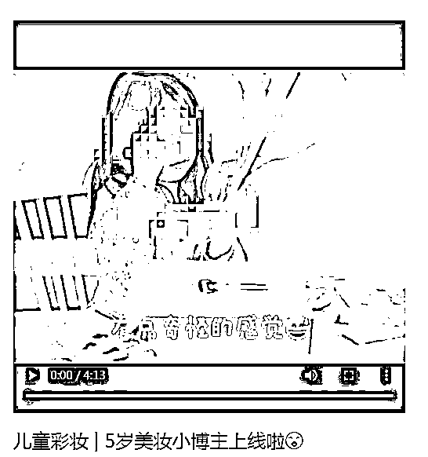

# 这种儿童视频突然火了！律师：可能涉嫌违法

> 原文：[`mp.weixin.qq.com/s?__biz=MzIyMDYwMTk0Mw==&mid=2247515115&idx=6&sn=fffea8650e8aad64393ac21edaef4c56&chksm=97cb70d3a0bcf9c5ca898128b4bb163f40d226d8cc0fed130536033818041ae978f8bea88dde&scene=27#wechat_redirect`](http://mp.weixin.qq.com/s?__biz=MzIyMDYwMTk0Mw==&mid=2247515115&idx=6&sn=fffea8650e8aad64393ac21edaef4c56&chksm=97cb70d3a0bcf9c5ca898128b4bb163f40d226d8cc0fed130536033818041ae978f8bea88dde&scene=27#wechat_redirect)

爱美之心人皆有之

孩子也不例外

但你敢信？

现在的小朋友对化妆的了解

甚至比大人还专业！

近年来，网络上出现的一批**儿童美妆博主**引发社会关注。

5 月 26 日，现代快报记者了解到，若用儿童博主代言化妆品，**可能涉嫌违反《广告法》及《网络直播营销管理办法（试行）》，情节严重的可处 100 万罚款。**

****

**△ 儿童化妆视频截图**

**开箱、讲解、试色、上妆**

**儿童美妆博主很专业**

****

**在某网络短视频 APP 里，**以“儿童美妆**”**为关键词进行搜索，就会出现不少视频。**内容多种多样，有儿童品牌彩妆测评视频内容，有儿童全脸彩妆化妆教程，还有儿童全套护肤教程 ……值得一提的是，一些短视频中，小博主还会针对某款儿童化妆品，进行开箱详细解说并试妆。**

**记者随机点开了一个视频，一名五岁女孩正在做“儿童化妆品开箱”，从粉底、眼影、腮红、唇膏 …… 小女孩的讲解非常专业，甚至在说到粉底液时，会用气垫蘸取少量粉底液在手背上进行试色。在没有大人帮助的情况下，小女孩用这套彩妆化了全妆。这个视频的发布者是小女孩的母亲，**目前在该平台上的粉丝数超过 10 万。****

********

****△ 网页截图****

****据某平台数据显示，**2020 年国内儿童彩妆消费同比 2019 年增长了 300%**，85 后的妈妈最爱给孩子买儿童彩妆。河北、山东、四川三个地区的销量已经超越北上广地区，成为儿童彩妆的前沿消费地区。****

****部分化妆品含有化学添加剂****

****可导致儿童皮肤过敏****

********

****“**现在市面上很多儿童化妆品，其实并不具备专业资质，而且压根儿就不属于化妆品，甚至仅仅是个玩具。**” 南京一位多年从事美容行业的工作人员告诉记者，很多家长其实无法分辨市面上的儿童化妆品是否属于合格产品。****

****△ 儿童化妆品套装****

****中国医学科学院皮肤病医院药师介绍，**儿童对药物、化妆品的吸收能力比成人强，频繁地化妆对儿童的皮肤是有害的。**而且儿童化妆品的说明书中对用法用量的介绍并不十分严谨，消费者在使用时也无法精确用量。****

****从很多儿童化妆的视频来看，不少儿童所使用的其实是成人化妆品。成人化妆品中往往含有酒精、丙二醇、防腐剂、香精等化学成分，**长期使用很可能会导致皮肤过敏等的问题。******

******小朋友直播或代言违法******

******情节严重可处 100 万罚款******

************

******江苏同大律师事务所律师李小亮表示，**如果是广告商直接委托小朋友视频代言化妆品，并在网络上发布，就涉嫌违法。**“《广告法》规定，利用不满十周岁的未成年人作为广告代言人的，应由市场监督管理部门责令停止发布广告。**情节严重的，处广告费用三倍以上五倍以下的罚款，广告费用无法计算或者明显偏低的，处二十万元以上一百万元以下的罚款。”********

******市场监管部门相关负责人则告诉记者，儿童化妆视频要区分不同情况。如果儿童化妆视频中并未刻意展示具体的产品，更多的是“表演式”地展示化妆技巧。从本质上来说，这类视频属于消费者个人行为。******

********什么年龄做什么事，********

******自然美才是最好的！******

****来源：红网，现代快报****

********

****← 向右滑动与灰产圈互动交流 →****

********