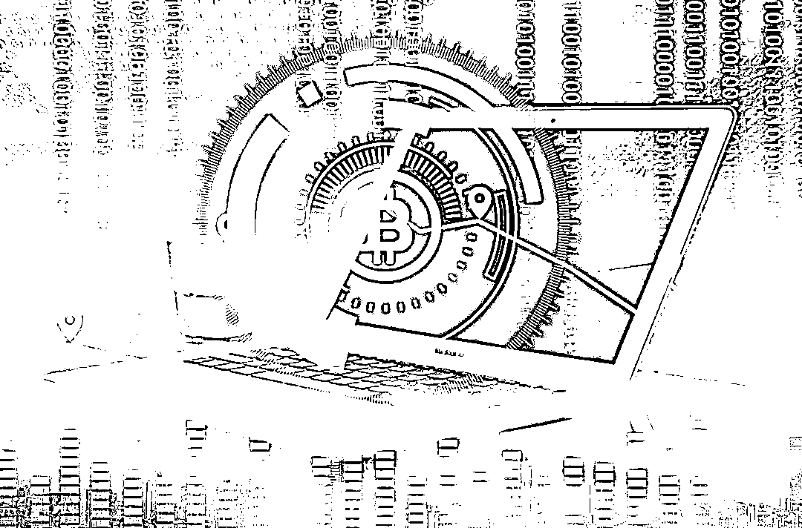
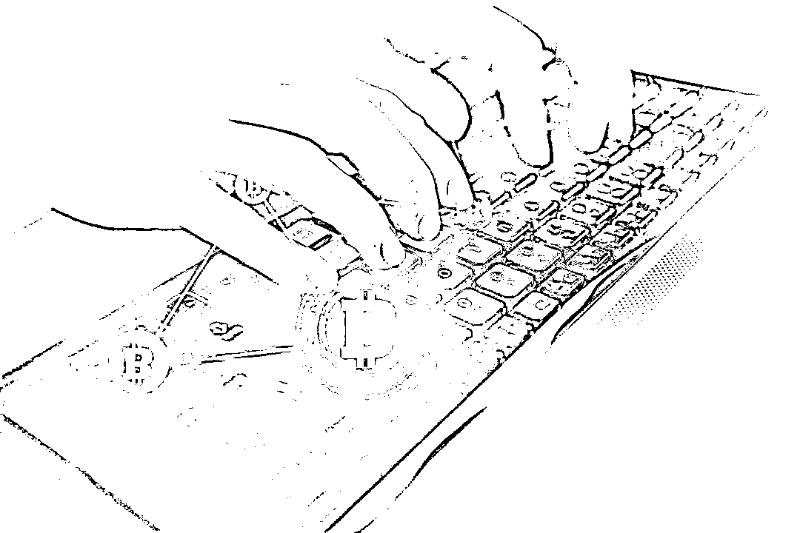
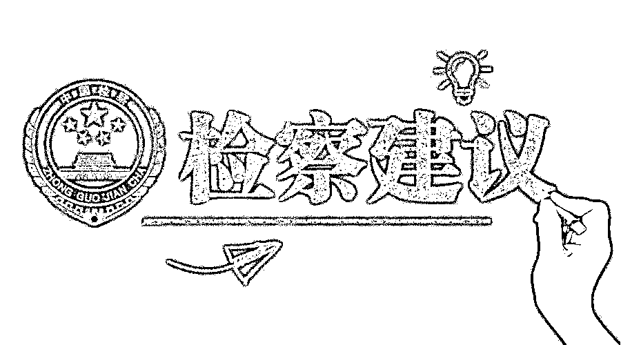

# 这个坑好大，资深玩家被骗 700 万！

> 原文：[`mp.weixin.qq.com/s?__biz=MzIyMDYwMTk0Mw==&mid=2247515186&idx=2&sn=91cf836943f19ed76d97274b97e19f94&chksm=97cb770aa0bcfe1cc65258818bf6f68f11d2dbbe4e9f96ec9d634a0b07129db0d504a1eb6556&scene=27#wechat_redirect`](http://mp.weixin.qq.com/s?__biz=MzIyMDYwMTk0Mw==&mid=2247515186&idx=2&sn=91cf836943f19ed76d97274b97e19f94&chksm=97cb770aa0bcfe1cc65258818bf6f68f11d2dbbe4e9f96ec9d634a0b07129db0d504a1eb6556&scene=27#wechat_redirect)

**10 年暴涨 838 万倍**

**挖矿机一机难求**

**比特币的疯狂不仅产生了**

**神秘的“币圈”**

**也让各种效仿比特币的**

**新型虚拟币、加密币**

**交易“一路狂飙”**

**……**

交易的繁荣，利益的诱惑，“币圈”鱼目混珠、鱼龙混杂，有人低价买进高价卖出，赚得盆满钵满，也有人深陷圈套，血本无归。日前，江苏省淮安市清江浦区检察院办理了一起诈骗虚拟币案件，以涉嫌诈骗罪对徐明、李阳、张杰批准逮捕并移交上级检察机关审查起诉。

帮人“炒币”赚差价

资深玩家被骗 700 万

图片来源于网络，与正文无关

30 岁的张先生从事比特币等虚拟币交易 7 年多，因为入行早、懂操作，逐渐成为了“币圈”的网红，很多人慕名找张先生交易。

2020 年 11 月，张先生经“币友”介绍，认识了同样做虚拟币交易的徐明和张杰。徐明等人自称是香港某基金公司的员工，由于这几年虚拟币市场火爆，比特币持续升值，**与比特币对应的以泰达币（USDT）为代表的一批“2.0 交易货币”也成为公司重点关注的投资目标。**

张先生炒虚拟币多年，对泰达币等也比较了解。作为号称保存在外汇储备账户、获得法定货币支持的虚拟货币，泰达币实现了加密货币与法定货币美元的 1：1 对等挂钩和兑换。该种方式可以有效防止加密货币出现价格大幅波动，被“币圈”视作虚拟币交易保值、硬通的“2.0 交易货币”。

据徐明等人介绍，由于比特币持续升值带来的“币圈”牛市，大量的交易活动需要泰达币作为“中间币”兑换，**香港某基金公司大老板准备大量收购泰达币，囤积居奇、拉高炒作，需要内地一些专业“炒手”操盘，因此慕名找到了张先生。**

开发泰达币的公司注册地就在香港，那边也有很多资本大鳄“炒币”，眼见可以和大公司合作，张先生很快就和徐明等人达成了“代购”协议。

按照协议，张先生以虚拟币交易权威网站火币网每日交易价格帮助徐明等人代为收购泰达币，交易完成后收取本金的千分之三作为交易手续费。为了交易安全，张先生和徐明等人特别制定了交易规则：**采用“线上转移虚拟币——现场核对确认——银行转账付款”模式，**即张先生通过 imToken 钱包（一种数字资产钱包，支持多链、多币种管理与兑换，常用于虚拟币交易）向对方钱包账户转移泰达币，转移过程双方现场确认再通过银行转账支付收购款。

起初，交易情况一直都很正常，同年 11 月 13 日，第一笔 30 万个泰达币以 199 万元完成了交易，张先生顺利拿到了首笔服务费。之后的 10 多天，双方再次完成了 3 次每笔 70 万个泰达币的交易。

然而，2020 年 12 月 3 日，当张先生再次按照约定向徐明提供的 imToken 钱包转移价值 700 万元的 110 万个泰达币时，交易出了“状况”。

交易当天，因有事无法前往四川成都与徐明现场确认交易，张先生特别委托朋友李先生帮助完成线下转账监督。谁知，张先生在线上刚将 110 万个泰达币转入徐明的虚拟钱包，徐明等人便先后以打电话、上卫生间等为由离开，不仅脱离了李先生的监督视线，还迅速将手机停机。

价值 700 万元的 110 万个泰达币被骗走，发现上当的张先生第一时间报警。

“币圈大鳄”系伪装

三人精心组织“骗局”

图片来源于网络，与正文无关

“国内对虚拟币交易一直不予承认，当时认为就算是骗了对方的钱，由于价值难以认定等原因也无法立案，所以就动了骗钱的念头。”2020 年 12 月，被警方从藏匿地抓获后的徐明等人交代了自己利用虚拟币交易实施诈骗的事实。

事实上，没有所谓的香港“大老板”，更没有所谓的“大规模囤币”方案，徐明、李阳、张杰 3 人，只有李阳一人长期从事虚拟币交易，其余二人仅对虚拟币有些概念认识。**三人此前一直在广东等地打工，2020 年 10 月，发现泰达币等虚拟货币炒作火爆后，三人萌生了以收购交易虚拟币为名实施诈骗的念头。**11 月初，徐明等人锁定了经常从事虚拟币交易的张先生，决定将其作为诈骗目标。

为了让张先生对他们的身份深信不疑，徐明等人花心思恶补了关于虚拟币的知识，努力把自己包装成“币圈大鳄”。“大鳄”必须要有雄厚的经济实力，徐明等人又从朋友那借来一大笔资金，租赁了多辆豪华跑车，将开跑车炫富等照片发到网上，将自己精心装扮成币圈“大鳄”。

2020 年 11 月，徐明等人成功结识了目标人物张先生。“我们自称香港的大老板打算囤泰达币，而国家为防止洗钱，对虚拟货币交易管控很严，通过火币网等渠道购买会暴露投资意图，所以到内地找职业操盘手偷偷购买……”徐明说。

为了使对方对“代购”深信不疑，徐明等人设计了一个循序渐进的方案，事前签订代购协议，许诺对方千分之三的交易服务费，前期成功交易几笔，等对方完全入套后，以要达成 1000 万个交易量为由，要求对方加快交易进度，最终以最大的一笔交易为目标，直接卷款跑路。

同年 12 月 2 日，当张先生告知徐明等人可以完成 110 万个泰达币交易后，徐明等人决定“收网”，并事前商量了卷款跑路的细节，准备了逃跑时的变装衣物、汽车等作案工具。12 月 3 日，110 万个泰达币达到指定的 im-Token 钱包后，现场参与交易的徐明、张杰按照事前准备的理由先后借故摆脱李先生的监督，迅速开车逃跑，并用网络电话通知李阳将到手的泰达币迅速变现。

目前，此案在进一步审理中。

虚拟币交易“套路深”

检察建议推动排查整治

图片来源于网络，与正文无关

“当前，涉虚拟币犯罪案件高发，不仅涉及诈骗、非法集资等犯罪，有些还涉及网络赌博洗钱。”负责该案办理的检察官孟海洋说。

随着数字经济的繁荣，因虚拟币具有持久、便捷、安全、匿名等方面的优势，一些不法分子开始盯上虚拟币，并由此延伸出利用虚拟币概念进行非法集资、电信诈骗等一系列的新型犯罪。

据了解，**当前涉及虚拟币的犯罪主要有三种形式：****一是**利用群众不了解虚拟币的特点，故意夸大虚拟币概念，以所谓数字经济投资名义非法融资、吸收公众存款，最终“爆雷”跑路；**二是**利用虚拟币可以变现特点，为网络赌博、电信诈骗等犯罪进行所谓“第三方”“第四方”支付，洗“黑钱”；**三是**直接以“币币”交换、“炒币”等名义实施诈骗。

尽管国家金融监管机构多次制发文件，要求清理整顿各类交易场所切实防范金融风险，中国人民银行、中国银行业监督管理委员会等单位也发布了关于防范比特币等虚拟币交易风险的通知，要求任何组织和个人不得非法从事代币发行融资活动，代币融资交易平台也不得从事法定货币与代币、“虚拟货币”相互之间的兑换业务，并进驻“火币网”“币行”等交易平台开展检查。但是，虚拟币市场的热度不减，地下交易、代币发行融资（ICO）等违法犯罪活动虽有所收敛，却从未消失。

虚拟币的暗箱交易严重干扰了正常的金融秩序，且隐藏了很多社会风险点。针对虚拟币犯罪等问题，**淮安检察机关专门发出检察建议，建议当地金融监管部门开展虚拟货币交易场所排查整治，**重点排查提供虚拟货币交易服务或开设虚拟货币交易场所、为境外虚拟货币交易场所提供服务通道，包括引流、代理买卖等服务，以各种名义发售代币，向投资者筹集资金或比特币等虚拟货币等违规行为，严厉打击虚拟币犯罪行为。

来源：检察日报

← 向右滑动与灰产圈互动交流 →

