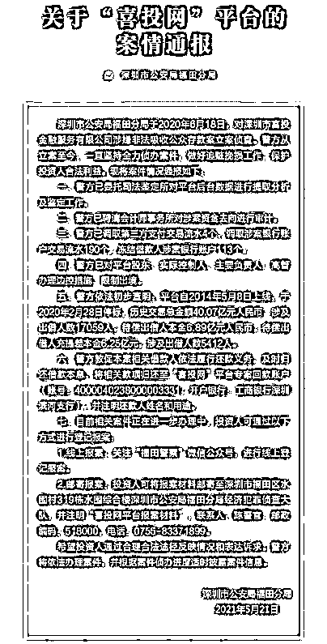
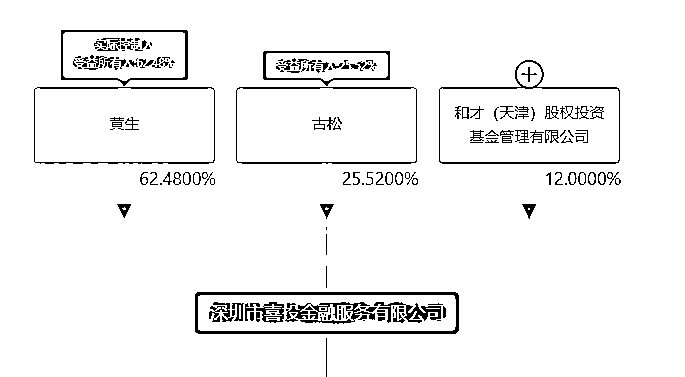
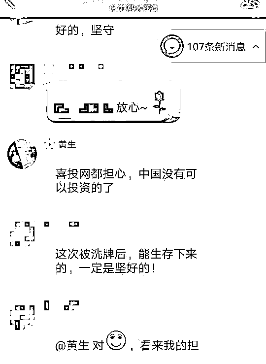
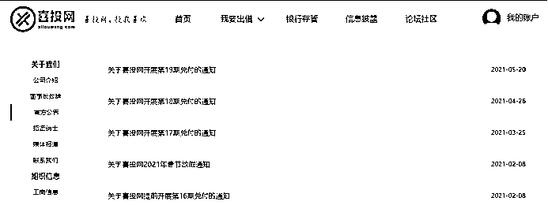
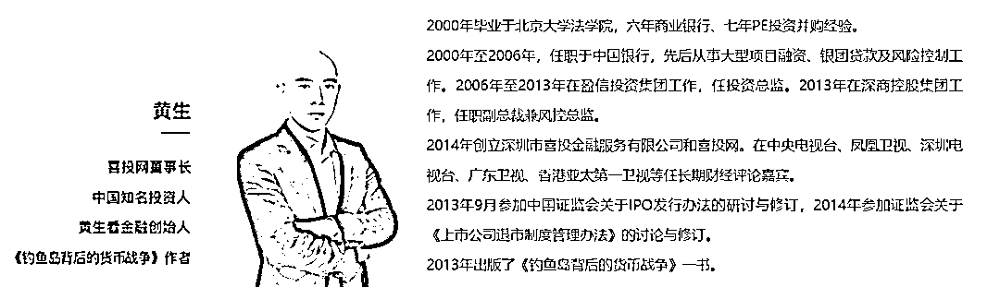
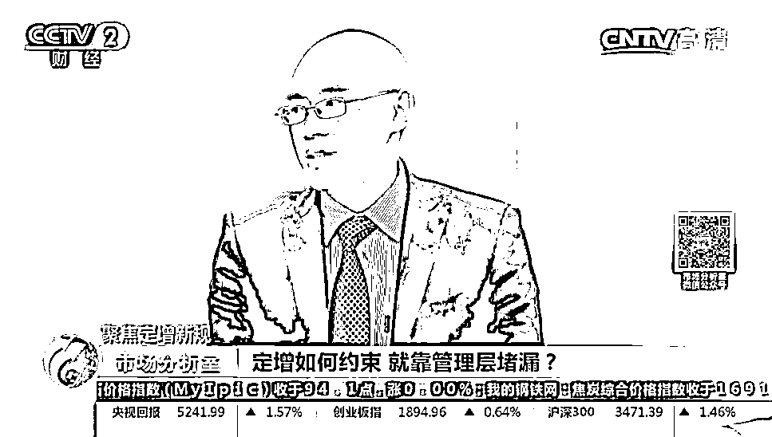
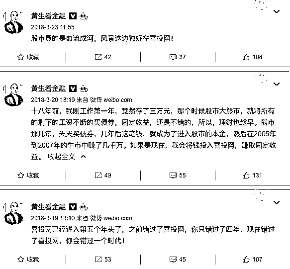

# 粉丝 300 万的财经大 V 被警方边控！微信文章篇篇 10 万+，旗下公司欠投资人 6 个亿

> 原文：[`mp.weixin.qq.com/s?__biz=MzIyMDYwMTk0Mw==&mid=2247515186&idx=3&sn=8c10b00082b38bac4ab09ef221c82a07&chksm=97cb770aa0bcfe1c57391b206e95e7b99e44c9ef0a5212852196cdded9802d6ac73e732e7b76&scene=27#wechat_redirect`](http://mp.weixin.qq.com/s?__biz=MzIyMDYwMTk0Mw==&mid=2247515186&idx=3&sn=8c10b00082b38bac4ab09ef221c82a07&chksm=97cb770aa0bcfe1c57391b206e95e7b99e44c9ef0a5212852196cdded9802d6ac73e732e7b76&scene=27#wechat_redirect)

拥有超过 300 万粉丝的大 V 黄生摊上事了。

近日，深圳公安福田分局对 P2P 平台“喜投网”进行了案情通报。通报表示，2020 年 6 月 18 日，深圳警方对喜投网涉嫌非吸案立案侦查，警方从立案至今，一直坚持全力侦办案件，做好追赃挽损工作，保护投资人合法利益。

通报中透露了一个重要信息：警方已对平台股东、实际控制人、主要负责人、高管办理边控措施，限制出境。

而黄生正是喜投网的董事长、法定代表人，持股占比达 62.48%。

黄生最为知名的一个标签是 “黄生看金融创始人”。“黄生看金融”是知名财经大号，在新浪微博上有 322 万粉丝，在微信公众号上自称“有数百万金融高净值粉丝”，文章篇篇 10 万+。

逾 5000 名投资人 6 亿多本金待偿

公开信息显示，喜投网由深圳市喜投金融服务有限公司运营，于 2014 年 5 月 8 日正式上线，注册资本、实缴资本均为 5022.73 万元，平台法定代表人为黄生，其亦为公司实控人，持股占比达到了 62.48%，其他股东还包括自然人古松（喜投网总裁、联合创始人，持股 25.52%），以及法人股东和才（天津）股权投资基金管理有限公司（持股 12%）。

喜投网成立后经历过一段顺风顺水的发展阶段。喜投网转发的一则媒体报道中提到：

> 2017 年时，喜投网经审计的净利润为 520 余万元。2018 年，在行业经历前所未有的“危机”之时，喜投网不但几乎未受到影响，更是逆市增长，据透露，其预期营业收入、利润均翻番，发展势头良好。

2018 年起，各地开始清退网贷平台，出清已成为大势所趋，越来越多 P2P 平台宣布良性退出。有粉丝曾在评论中质疑：“这段时间爆雷太多，你能确定你的喜投网不爆雷？”黄生给予的回复是：“很安全”。

然后，在 2020 年 2 月 17 日，喜投网突然通过发送用户账户系统消息的形式，宣布良性退出。

根据警方最新的通报，宣布良性退出一年多后，喜投网当前待偿岀借人本金 6.89 亿，待偿岀借人充提差本金 6.25 亿，涉及出借人数 5412 人。

值得注意的是，目前，喜投网官网仍在运营当中。5 月 20 日喜投网发布了开展第 19 期兑付的通知，通知表示用户可通过喜投网官方网站或喜投网 APP 登录个人账户发起兑付提现申请，预计 1-5 个工作日可到账。

在兑付通知中，喜投网多次提及兑付困难，兑付比例需根据实际回款情况确定。如第 18 期兑付通知中，喜投网提到了 6 点困难：

1、借款人绝大多数为小微企业主、个体工商户，去年新冠疫情爆发以来，经济波动加大，很多企业被迫停工停产后难以维系，外需极大萎缩，对外向型经济影响尤其巨大，大量借款人缺乏还款能力。

2、行业全面清退，大量借款人缺乏还款意愿，借款人逃废债的情况随着时间推移越来越严重。

3、涉网贷案件无法立案诉讼、无法申请执行，对失信借款人缺乏司法上的追偿措施。

4、接入央行征信工作被统一叫停，又丧失制约失信借款人的一项有力措施。

5、催收工作受到严格限制，稍有不慎就有可能被认定为暴力催收，更不用说采取拖车等方式了。

6、平台完全不能开展新业务，无新的收入来源，人员流失严重，难以长期维持一个成规模的催收队伍，催收工作越来越难开展。

北大毕业，300 万粉丝大 V

曾在其微博多次宣传喜投网

公开资料显示，黄生毕业于北京大学法学院，拥有多年金融行业从业经验。在喜投网官网上，他拥有四个头衔，分别是“喜投网董事长”“中国知名投资人”“黄生看金融创始人”和《钓鱼岛背后的货币战争》作者。

根据喜投网官网的介绍，黄生拥有六年商业银行、七年 PE 投资并购经验，曾任职金融机构，长期在多家电视台任财经评论嘉宾。

黄生，视频截图

正是凭借黄生的影响力，几乎从来不做宣传的喜投网，从而被外界所熟知。黄生曾多次在其微博宣传喜投网，仅 2018 年就发布了 60 余条相关微博。

黄生此前曾在采访中表示：“喜投网是唯一没有营销投入的 P2P 平台。”当被问及原因时，他反问道：“我一篇微信几十万，甚至几百万阅读量，这段时间最少也是“10 万＋”，粉丝粘度和忠诚度非常高，在别的地方投广告会有这么好的效果吗？”

在中国新闻网此前的一篇报道中提到，深圳的张先生表示，“我们在喜投网投资是因为这个平台是微博大 V 黄生创办的，我们看他的文章，慢慢相信他，才投了喜投网。”

张先生回忆称，自己很早就关注了黄生的微信公众号，看了几年后逐渐对他产生了信任。2018 年的一天，张先生在阅读一篇文章时看到了喜投网的链接，于是尝试投资了一两千元，之后慢慢开始追加，短短一年多，张先生投入本金超 100 万元。

值得注意的是，目前“黄生看金融”微信公众号和微博还在正常运营。

微信公众号最新一篇文章更新于本周一，内容与比特币相关，阅读量超 10 万，点赞和在看均达 1.1 万。微博最新更新为 5 月 20 日，粉丝已超 322 万。

来源：淮阴警方、中国社会组织动态，利箭在行动

← 向右滑动与灰产圈互动交流 →

