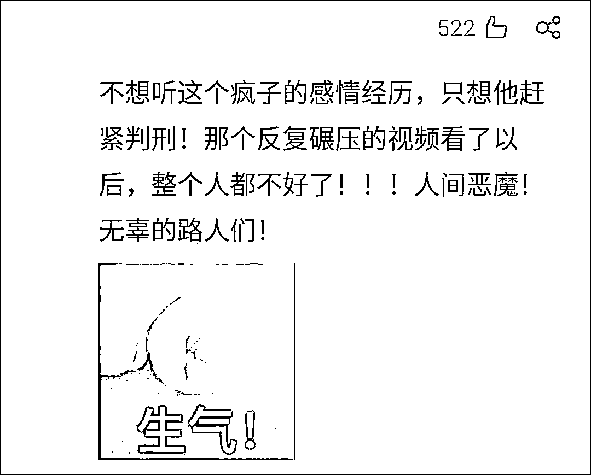

# "南京胖哥"，真正的平民英雄！

> 原文：[`mp.weixin.qq.com/s?__biz=MzIyMDYwMTk0Mw==&mid=2247515186&idx=4&sn=a783a3fd89d11f68a699fc79aca65b8f&chksm=97cb770aa0bcfe1c726f23eb60d29aeda1b3f971620461ab3419e86d8ec88d67540b342f9900&scene=27#wechat_redirect`](http://mp.weixin.qq.com/s?__biz=MzIyMDYwMTk0Mw==&mid=2247515186&idx=4&sn=a783a3fd89d11f68a699fc79aca65b8f&chksm=97cb770aa0bcfe1c726f23eb60d29aeda1b3f971620461ab3419e86d8ec88d67540b342f9900&scene=27#wechat_redirect)

5 月 29 日晚 21 时 45 分许，南京发生一起“驾车撞人并持刀捅人”恶性事件，造成包括犯罪嫌疑人本人、其前妻在内的 8 人受伤。 

根据警方披露的案件详情，犯罪嫌疑人吉某某被热心市民围堵，其中一名市民邱某某在主动上前、试图阻止吉某某继续行凶时被其用刀捅伤。

邱某某，便是当晚因挺身而出受伤、引发广大网友们关注的“南京胖哥”。网友们在各大社交平台上为他祈福，希望他早日康复，话题冲上微博热搜榜第一。今日下午，“胖哥”已完成手术，转至 ICU 重症医学科接受治疗，目前已脱离生命危险。

据现代快报，“南京胖哥”姓邱，今年 33 岁，南京本地人，以前是一名铅球运动员，身体素质非常好，人也很热心，乐于助人。

此前网传称身中刀伤的热心男子已逝世，“胖哥”的叔叔邱先生告诉@现代快报，“胖哥”已在南京鼓楼医院接受急诊腹内探查修补手术，转至 ICU 重症医学科接受治疗。

邱先生介绍说，昨晚九点左右，“胖哥”曾在微信朋友圈里发过两条短视频，第一条是说“新街口哪哪都堵”，第二条是他在车上拍的现场，“我在他下面评论，让他快回家，不要多管闲事，后来不知道他为什么把这条朋友圈删了。”

邱先生还告诉记者，“胖哥”的家境并不好，他爸爸因为患中风还在康复中心里，妈妈也几乎没有收入。

现代快报记者了解到，除了“胖哥”外，当晚 9 点左右，在秦淮区金銮巷附近，有多位热心市民上前阻止该恶性事件。其中，一位身着黑色短袖的市民用力拍打车门，一位背着双肩包的市民试图用共享单车挡住吉某某白色轿车，一位穿着白色短袖的女生在周围大声喊报警，寻求呼救……

在鼓楼医院门口，有不少市民送来鲜花和食物，感谢这位南京好人，希望他能够渡过难关。

  30 日下午 4 时许，楚天都市报极目新闻记者联系上“胖哥”家属邱先生。他称，自己正在外面给“胖哥”买生活必需品，“胖哥”已脱离生命危险。

邱先生还称，30 日有很多市民想来看望“胖哥”，目前“胖哥”还在重症监护室，但生命体征平稳，请大家不用太担心。“胖哥”目前无法接受探视，谢谢大家关心。 

根据南京市公安局常务副局长李明杰在新闻发布会上的案件详细通报，5 月 29 日 21 时 45 分许，南京公安 110 接群众报警，称秦淮区金銮巷有人驾车撞人并持刀捅人。南京市公安机关迅速组织警力赶赴现场处置，于 21 时 49 分到达第一现场开展现场调查和追缉工作。

吉某某撞伤、碾压、捅伤多人后，驾车逆向行驶，与被堵在现场车辆发生碰撞无法行驶，此时市民邱某某（即“南京胖哥”）前来阻止，吉某某下车持刀将邱某某捅伤。22 时 07 分，吉某某被赶到现场的民警控制。

该事件造成包括吉某某、其前妻在内的 8 人受伤，除 1 人为轻微伤，中度伤 1 人，重伤 2 人，危重 4 人，目前生命体征均平稳。南京市公安局称，经初步侦查，这是一起由犯罪嫌疑人吉某某因个人感情等矛盾引发的故意杀人案件，嫌疑人已被采取刑事拘留强制措施。

第一时间赶赴现场的警察、十几个小时内完成两次通报的南京警方，以及“南京胖哥”等见义勇为的南京市民……这起案件中涌现的正义面孔，令广大网友纷纷竖起大拇指：他们是真正的平民英雄！

一名网友称，懂搏斗的博主都说得很清楚，挺身而出、直面穷凶极恶的持刀罪犯有多么危险，但也因此彰显了“人海中的真心英雄”。

不少网友坦承，看完视频后，设身处地地想一下，自己“第一时间应该是赶紧跑，保护自己”。“我特别钦佩可以挺身而出者，因为我可能做不到。”“他冲上去的样子，真的很帅”。“侠之大者为国为民，侠之小者为友为邻”。

一位网友写道：

> “我想说，这世界有恶魔也有炙热的烈火，向平凡而又伟大的英雄致以我最崇高的敬意。我们没办法要求所有人都成为英雄，可能也没办法像他那样立刻挺身而出，但至少应该对他保持敬佩和善良。
> 
> 那个倒在地上的胖哥哥，是我看到过的最勇敢、热血的人之一
> 
> 还有那个推着单车路过，试图用单车当在汽车前面的小哥
> 
> 还有视频里喊着快报警的女生…………
> 
> 如果他们也在看微博，我想告诉他们，你们真的很棒，是我的榜样。”

“当时，有人主动报警，有人伸出援手，有人挺身而出。”一名网友写道，南京的安全不仅是警方处置迅速，还在于南京市民的主动积极。

也正因为如此，无数网民呼吁，向以“胖哥”为代表的见义勇为的精神和英雄的南京市民点赞，要“重奖见义勇为”。

与此同时，有网友发文批评冷嘲热讽、无端指责他人，以及打着“传递正能量”旗号传播血腥画面的人。

被碾压女子张某（即吉某某前妻）的同事 30 日告诉北京青年报，张某和嫌疑人吉某某离婚快三年了，根本不存在网传的出轨情况。

她称，在离婚前，张某就曾多次遭到其前夫家暴，而且其前夫还赌博，把他们买的房子也输了。“离婚后，她前夫还以孩子为理由跟张某要钱，大概一个月前，她前夫还给她姐姐打电话，说要见张某，要三万元，因为她前夫威胁说不见的话就把他们的儿子杀了，她担心儿子安危只能赴约，也不知道后来有没有给钱。”

有网友表示，看了犯罪嫌疑人行凶的视频后，只感想“无辜的路人们”，不想听这个“疯子”的感情经历，只想他赶紧判刑。

这一表态引发众多网友的共鸣。其中有人写道：“我现在不想听他有啥故事，就问他怎么判，判多重，怎么安抚治疗前妻和无辜路人？”

另外一位网友说道，“感情纠纷”不是残害他人身体生命的借口理由。

网友“雷斯林”则被一些为犯罪嫌疑人开脱的言论激怒：只要有这种恶性事件出来，总会有不知道哪来的消息，表示杀人犯也是没办法，谁让他老婆/女朋友出轨了呢？

他写道：“我觉得这些人的脑回路真的很神奇，每次不论是真是假，都要先给犯罪分子安一个老实人的名头……我真的求求你们放过老实人吧。杀人犯就是杀人犯，暴力分子就是暴力分子。你在什么都不清楚的情况下，就为他们洗白，不但侮辱了‘老实人’，更污名化了被他们伤害的受害者们。”

“南京胖哥”的伤情也牵动了广大网友的心，“南京胖哥”话题则一度登上微博热搜榜榜首。

大家纷纷留言，为“胖哥”的英勇点赞，并祝愿他早日康复：胖哥加油，努力好起来；需要我们帮助尽管说一声；南京好市民，希望你平安……

“早日康复！好人一定会有好报的！好人一生平安” 

“祝早日康复，往后平安喜乐，万事顺遂”

“胖哥早日康复，如果有困难希望可以开通捐款通道。”

在今天的新闻发布会上，南京市公安局常务副局长李明杰代表南京警方，感谢见义勇为的群众。

李明杰表示，案件发生后，许多热心市民向警方报警并现场协助阻止犯罪，对此警方表示敬佩和衷心感谢，南京的平安离不开广大人民群众的共同呵护。

[`v.qq.com/iframe/preview.html?width=500&height=375&auto=0&vid=j3249j0uh1j`](https://v.qq.com/iframe/preview.html?width=500&height=375&auto=0&vid=j3249j0uh1j)

视频来源：@荔枝新闻

另据楚天都市报 30 日报道，目前，南京市见义勇为基金会已经启动调查程序，并搜集到案件的相关视频及其他资料，马上进入确认环节。一旦被认定为见义勇为后，包括“胖哥”在内的见义勇为市民将根据相关规定落实奖励政策。

来源：观察者网

← 向右滑动与灰产圈互动交流 →

