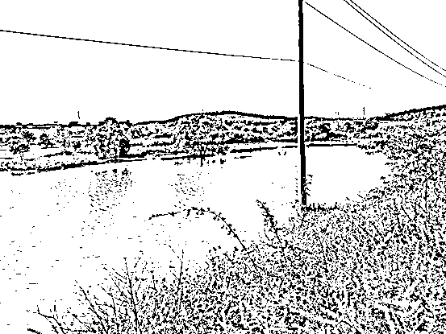

# 为逃避追捕，嫌疑人竟在深山里养起了大鹅……

> 原文：[`mp.weixin.qq.com/s?__biz=MzIyMDYwMTk0Mw==&mid=2247515186&idx=5&sn=6a86d18f11b915c9b3f0105dbf3277e3&chksm=97cb770aa0bcfe1cfe2557502d8a8e7ff49c60546d04f271959bce0726d8c99929d591b3bdd5&scene=27#wechat_redirect`](http://mp.weixin.qq.com/s?__biz=MzIyMDYwMTk0Mw==&mid=2247515186&idx=5&sn=6a86d18f11b915c9b3f0105dbf3277e3&chksm=97cb770aa0bcfe1cfe2557502d8a8e7ff49c60546d04f271959bce0726d8c99929d591b3bdd5&scene=27#wechat_redirect)

“嘎……嘎嘎……”在一群肥硕的大鹅间，一个身着乳白色 T 恤的年轻人正在熟练地搅拌鹅饲料。

面对不停向他拥簇过来的这些大家伙，他眼角掠过一丝得意。

“你好！”一个声音将他从畅想的思绪中拽了回来，他刚要发火。

四目相对，证件上金晃晃的警徽刺的他眼睛发涨。

“跑！”小伙子的下意识就要扭头。

忽地，五六只大手摁了上来，他被抓住了。

“兄弟，跟我去东莞，躺着就能赚大钱。”

2021 年 1 月 8 日，明媚的阳光，一扫连日来的阴雨天气。

龚某盯着手机屏幕愣愣地出神，“每笔 1%提成，躺着就能赚大钱。”他咀嚼着上线“代号 X”刚刚的来电，“时来运转了！”龚某猛地抬起头，往大腿一拍，径直往“好兄弟”廖某家走去。

在龚某道明来意后，廖某对这个“好兄弟”是感恩戴德，立马又去寻了两个同样有前科的“同道中人”，相约一起前往东莞“轻松赚大钱”。

随后的几天，龚某带着几人奔走吉安、赣州等地，办了十几张银行卡，并准备好手机卡、身份证复印件、U 盾组成“四件套”，便踏上了所谓的“财富之旅”。

到达宾馆后，龚某给“兄弟们”布置起了任务，通过手机将转账验证码、密码及时通报“接头人”，再由“接头人”把自己持有账户中的钱，转移到指定账户之中，而这些钱的来源就是网络诈骗或网络赌博犯罪集团的不法牟利。

每天住在房间日晒不到、雨淋不着、饭来张口、轻松赚钱的日子并不好过，两个月下来廖某等人的收入也仅仅就比之前的工资多了一点，大头都进了龚某的口袋。而龚某每天承担着同伙的一应花销，也经常捉襟见肘。

“挣这钱，不轻松。”随着发财梦离自己越来越远，廖某等人甚至心生退意，只是碍于龚某的面子，迟迟没有开口。

而就在廖某等人犹豫不决时，一张大网正迅速围住他们。

3 月 11 日，在警方的一次“断卡”行动中，廖某等人被江西省吉水警方抓获，他没想到的是，这个“不轻松的活”竟然还违法！

面对警方的审讯，廖某等人想都没想就将带他们“轻松发财”的龚某，抖露了出来，而当警方依线索对龚某实施抓捕时，见机不妙的龚某早已经逃之夭夭，被警方网上追逃。

藏身深山鹅棚，竟摸索出养鹅之道

在网上看到警方通缉令后，龚某经过几天的惴惴不安，突然灵机一动，打起了为躲避债务而假离婚的“前妻”的主意。

原来，龚某“前妻”家中有一个闲置的养鹅场，就在她们村的后山中，如此一来龚某就有了藏身之处，换个身份继续生活。

俩人一拍即合，龚某开着案发后“过户”给朋友的白色越野车，过起了以车为家、与鹅为伴的“逃亡”生涯。

与此同时，警方通过查阅出行数据、比对身份信息等多种技术侦查手段，就是找不到龚某，“他怎么就‘人间蒸发’了呢？”就在办案民警坚持不懈的追逃时，龚某一边买进小鹅，一边修理鹅棚，忙得热火朝天。

小鹅在早春时节得在鹅棚里养殖，白天喂 7 次，晚上还要加喂 3 次，不仅每次都喂青饲料，还要经常喂水……

不知是否因为别无它途，龚某竟真的一下子钻进了白鹅的养殖技术之中，每天不是在网上查找资料，就是捧着养殖技术书籍，进行实践操作。

随着时间的推移，龚某的口头禅渐渐地从“轻松赚大钱”变成了“鸭要腥、鹅要素，好草好水养肥鹅”。

还别说，龚某凭着自己 20 几岁吃苦耐劳的劲头和灵活的头脑，不到一个月，把这批小鹅养得又白又壮，长势喜人。

但虽然顶着“养鹅人”的身份，也有养殖棚可以住，龚某深知自己在劫难逃，可就是不甘心，他将所有的生活起居物都放在越野车上，晚上住也住在里面，目的很简单：依车而居，随时可逃。

“我怕它们饿着，请允许我喂饱这群鹅。”

4 月初，吉水警方再次梳理辖区网上在逃人员，看着龚某的网上通缉令，办案民警不禁泛起了嘀咕。

“龚某是否从始至终就未离开过金滩镇？会不会最危险的地方就是最安全的地方？”这个念头如同草原上寻觅到猎物踪迹的鹰隼，盘旋在办案民警的脑海之中，挥散不去。

龚某会躲在哪里呢？民警也多次来到龚某的家中，规劝其亲属让龚某投案自首。但龚某不为所动，抱着侥幸心理继续着他的“逃亡之旅”。

终于，在一次监控排查中，办案民警发现了那辆“过户”给舅舅的白色越野车的行驶踪迹。

“他果然在金滩镇！”顺着这条线索，警方掌握了龚某出行的大致时间和出行轨迹。

但接下来发生的事情，让抓捕民警傻了眼！

在他们循线一路来到了龚某车辆经常消失的村庄之后，在这里转了几个小时，都没看见龚某的白色越野车。

“一辆车怎么可能会凭空消失？”这个偏僻的小村庄，没有安装监控，加上连日来的雨水冲刷，掩盖了所有可能存在的痕迹。

“就这么算了？”就在打算收队之际，领队民警黄楠突然顺着进山的泥道，发现几道轮胎压下的车辙印。一问才知道，山里有个养鹅场，那是养鹅人家车辆压出的痕迹。

“莫非龚某逃进了深山？”黄楠当即决定沿着这条山间小路进行搜索。

经过崎岖山路上半个多小时行驶，警车驶进了这处养鹅人的养殖场。

民警正想前去找这家养鹅的老乡询问调查。远远一看，那个正在喂鹅的“养殖专业户”不是龚某又是哪个？

办案民警当即开展抓捕，并成功在养殖场里将龚某抓获。

看着这眼前的好山好水，以及肥硕的鹅群，龚某满眼留恋，“我怕它们饿着，能不能让我喂饱这群鹅再跟你们走。”

看着眼前五千只即将出栏的大白鹅，办案民警给龚某带上手铐后，陪着他完成了这一次投喂。

“早知如此，你又何必当初呢？”面对民警的质询，龚某微微的侧过半边脸，不舍的望向后视镜中的鹅群。

“嘎……嘎嘎……”声声鹅鸣，好似送别。

目前，该案还在进一步审理中。

来源：陈天赐、焦芳

← 向右滑动与灰产圈互动交流 →

