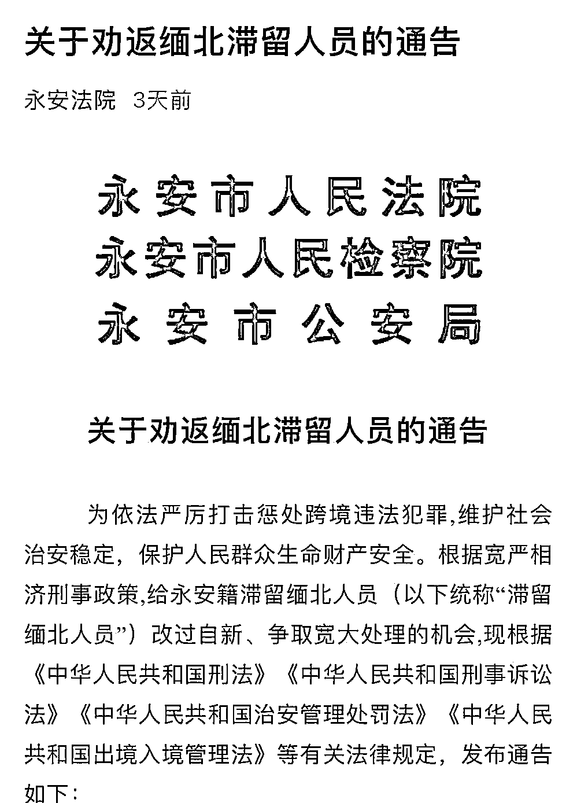

# 多地警方岀手：缅北电信诈骗人员立即回国！

> 原文：[`mp.weixin.qq.com/s?__biz=MzIyMDYwMTk0Mw==&mid=2247515249&idx=1&sn=1609dea7d7f2ec78a957c076e70954d0&chksm=97cb7749a0bcfe5fa26f752ee08c06785fa06761f06c004e6830791f07e9947b47a33f164183&scene=27#wechat_redirect`](http://mp.weixin.qq.com/s?__biz=MzIyMDYwMTk0Mw==&mid=2247515249&idx=1&sn=1609dea7d7f2ec78a957c076e70954d0&chksm=97cb7749a0bcfe5fa26f752ee08c06785fa06761f06c004e6830791f07e9947b47a33f164183&scene=27#wechat_redirect)

近几年来，随着国内对电信诈骗严打，众多电信诈骗团伙转移到国外，目前**缅甸北部逐渐成为国内电信诈骗团伙首选之地**。

据业内人士的不完全统计，目前该地区大概有十万多人从事电信诈骗。这些栖身境外的诈骗团伙，通过冒充公检法机关执法、骗贷、裸聊、刷单返现、投资理财、杀猪盘等方式，诈骗中国境内的同胞，危害极大。

[`mp.weixin.qq.com/mp/readtemplate?t=pages/video_player_tmpl&action=mpvideo&auto=0&vid=wxv_1784629494981427206`](https://mp.weixin.qq.com/mp/readtemplate?t=pages/video_player_tmpl&action=mpvideo&auto=0&vid=wxv_1784629494981427206)

近期，多地发布严厉通告，多种手段劝返本地籍缅北电信诈骗人员。此外，目前境外疫情仍处于高发态势，有部分不法人员铤而走险，通过非法渠道回国，给疫情防控带来了巨大的挑战和隐患。为此，有的地方开放了回国路线，供其选择。

[`mp.weixin.qq.com/mp/readtemplate?t=pages/video_player_tmpl&action=mpvideo&auto=0&vid=wxv_1886174275473031169`](https://mp.weixin.qq.com/mp/readtemplate?t=pages/video_player_tmpl&action=mpvideo&auto=0&vid=wxv_1886174275473031169)

人山人海的缅北归家队伍 

**福建省莆田市荔城区：对拒不返回人员采取“十个一律”******

****电信诈骗最早是由台湾地区的诈骗犯带来我国内地，随后被福建等地部分不法分子复制，当前各种国内外的诈骗团伙成员及管理人员不少是来自福建，在此前媒体报道中，福建的某地区，甚至有一整个村都从事电信诈骗的情况。福建当地监管部门对电信诈骗一直呈严厉打击状态。****

****5 月 26 日，福建莆田市荔城区公安分局通过“平安荔城”微信公众号发布消息，为坚决贯彻落实党中央决策部署，全力劝返莆田荔城籍缅北窝点人员（涉嫌非法出入境、电信诈骗和网络赌博犯罪行为），对荔城区 6 月 30 日前滞留缅北窝点拒不返回人员采取“十个一律”惩戒措施，力度之大，堪称宣告诈骗份子“社会性死亡”。具体内容如下:****

****1.一律强制拆除赃违。对缅北窝点人员及其直系亲属涉赃违建，一律予以拆除。****

****2.一律严审就学资格。缅北窝点人员子女在幼儿园、小学、初中新生录取和开学时，父母双方没有共同当面申请入学就读手续或面谈注册报名的，一律不得就读城区学校。****

****3.一律从严政审。缅北窝点人员及直系亲属在入团、入党、参军、考录公务员、考聘事业单位工作人员、就业等函询调查时一律从严把关，原则上不予通过。****

****4.一律从严问责问效。缅北窝点人员为党员、公职人员的取消本人及所在单位所有人绩效奖、平安奖、文明奖。缅北窝点人员直系亲属取消 3 年内绩效奖、平安奖、文明奖，并由纪委予以约谈问责。****

****5.一律列入失信人员。限制缅北窝点人员坐动车、坐飞机、住宾馆、子女就读私立学校等高消费行为。****

****6.一律冻结账户和网银。对缅北窝点人员及其直系亲属的银行账户、网银予以冻结反制，并取消相关业务资质。****

****7.一律曝光公示震慑。在城乡、闹市区域和学校张贴缅北窝点人员通告，在缅北窝点人员及其直系亲属住所喷涂打击电信网络诈骗犯罪永久标识。****

****8.一律全面深挖打击。对缅北窝点人员及其直系亲属所有违法犯罪行为，一律深挖彻查，从严从快重判、数罪并罚、判处实刑。****

****9.一律截断政策补助。对缅北窝点人员及其直系亲属一律取消林业、农业等政策性优惠补贴（助）,暂停一切政策补助和资质审查。****

****10.一律取消奖补资格。缅北窝点人员所在村（社区）一律暂停向上申请项目资金、财政奖补，一律取消“平安乡村”等当年度各项评选资格。****

********

******福建省永安市发布关于劝返缅北滞留人员的通告******************

******5 月 27 日，为依法严厉打击惩处跨境违法犯罪,维护社会治安稳定，保护人民群众生命财产安全。根据宽严相济刑事政策,给永安籍滞留缅北人员（以下统称“滞留缅北人员”）改过自新、争取宽大处理的机会,现根据《中华人民共和国刑法》《中华人民共和国刑事诉讼法》《中华人民共和国治安管理处罚法》《中华人民共和国出境入境管理法》等有关法律规定，发布通告如下：******

******一、本通告适用时限自发布之日起至 2021 年 6 月 30 日止。******

******二、本通告所指缅北滞留人员包括：持证出境逾期未归、偷越国(边)境、涉嫌组织他人偷越国(边)境和在境外从事涉及电信网络诈骗、赌博、走私、贩毒、帮助信息网络犯罪活动等跨境违法犯罪活动的人员。******

******三、目前仍然滞留缅北的永安籍违法犯罪人员，在本通告规定时限内，主动回国投案自首或通过家属及时联系户籍所在地党委政府、公安机关回国投案自首，并如实供述自己违法行为的，可以依法从轻或者减轻处罚；情节轻微的，可以免于处罚；情节显著轻微、危害不大的，将不以犯罪认定。******

******四、犯罪嫌疑人有揭发他人犯罪行为，经查证属实的，或者提供重要线索，从而得以侦破其他案件、成功劝返永安籍缅北滞留人员等立功表现的，可以从轻或者减轻处罚；有重大立功表现的，可以减轻或者免除处罚。******

******五、缅北滞留人员要认清形势，珍惜机会，尽快回国。有违法犯罪行为的,尽快投案自首,争取从宽处理。滞留人员亲属要主动配合党委政府和公安机关，及时联系劝促缅北滞留人员尽快通过正常渠道回国。凡在通告期间继续滞留或擅自闯关、偷越国（边）境入境的缅北滞留人员，公安机关将坚决采取有力措施抓捕归案，并依法严惩。******

******六、任何单位、组织或个人不得为缅北滞留人员提供隐藏处所、财物、交通工具，为其通风报信或作假证明包庇，或者提供其他便利条件帮助其逃匿。经查证属实，构成犯罪的，将依法追究刑事责任。******

******七、鼓励广大人民群众积极举报跨境违法犯罪线索，直接抓获或协助公安机关抓获和劝返永安籍缅北滞留人员的（滞留缅北人员的直系亲属除外），根据相关规定给予奖励。对威胁、报复举报人的，依法予以处罚；构成犯罪的，依法追究刑事责任。******

********如湖南常德澧县，江西宜春、上饶等多地也公布相关处罚措施，对滞留境外劝返不回或故意隐瞒跨境违法犯罪事实的，将一律从严处罚，非法定事由不得办理取保候审，不得判处缓刑，非法财物将一律冻结、查封、扣押、追缴，依法依规从严审核其家庭成员入团、入党、参军、考录公职人员等情形。********

********

********

****福建省龙岩市濯田镇公布 15 名疑似从事电信诈骗名单************

****5 月 26 日，福建福建省龙岩市长汀县濯田镇，公布了最新一批疑似在缅甸电信诈骗窝点 15 人名单，呼吁相关人员家属和朋友转告他们立即回国。****

****濯田警方表示，目前，境外疫情仍处于高发态势，有部分人员通过非法渠道出入境，给辖区的疫情防控带来了巨大的挑战和隐患。同时，可能从事电信网络诈骗和赌博等非法活动。为打击电信网络诈骗犯罪和保护大家的生命安全与健康，需要大家齐心协力，筑牢疫情防线，净化辖区治安环境。特通知赴境外长期未归人员且目前处于失联状态、家属也联系不上的人员看到此通告请主动与户籍所在地派出所，户籍地村（居）委会或家属取得联系。****

****濯田警方表示，自该公告发布之日起至 2021 年 5 月 31 日前，凡主动回国并到濯田派出所报到者，如有涉及案件可依法从轻或者减轻处罚；情节较轻的，可以依法免予处罚。****

****从警方公告的名单来看，公开的内容包括大头人像、姓名、出生年月、详细到家的户籍地址，非常详细，人员构成 90 后占多，还包括数名 00 后。****

********

****江西省龙南市：报备后可通过开放线路回国 严禁偷渡************

****5 月 25 日，江西省龙南市公安局发布《致龙南籍滞留缅北群众及家属们的一封信》，信中写道，当前，境外新冠肺炎疫情形势严峻，一些不法之徒为获取非法经济利益不惜铤而走险，偷渡至缅甸务工及从事电信诈骗、网络赌博等违法犯罪活动，并随时可能偷渡入境返回，对龙南市疫情防控带来巨大风险隐患。****

****滞留缅北人士，填写报备表后，可通过龙南市公开的四条回国线路回国，1.普洱市—孟连县—勐啊口岸和芒信口岸（货物口岸）；2.西双版纳州—勐海县—打洛口岸；3.临沧市—沧源县—永和口岸和芒卡口岸；4.临沧市—镇康县—南伞口岸。这四条路线均允许滞留在缅北地区的中国公民回国（包括没有合法有效证件的人员）。****

****为了防止偷渡，这四条路线均允许没有合法有效证件的人员回国。严禁龙南籍人员非法前往缅北投亲靠友、非法务工。对非法组织群众偷渡到缅北地区的组织者和参与者，将以组织、偷越国边境罪依法严厉打击。严禁龙南籍人员取道云南边境偷越赴缅北务工，违者将依照法律从严处罚。****

****信中还公布了奖惩措施。主动回国投案自首、配合劝返工作回国、主动交代问题、有重大立功表现的可以依法从轻、减轻或者免除处罚；心存侥幸或拒不配合劝返工作回国、不主动交代问题的人员，将依法从严、从重惩处。凡有协助将非法滞留缅北及境外从事违法犯罪的龙南籍人员劝返的，给予奖励 500 元至 1000 元。对威胁、报复举报人的，依法予以处罚；构成犯罪的，依法追究刑事责任。****

****最后，龙南市公安局呼吁，非法滞留缅北及境外从事违法犯罪的龙南籍人员要认清形势，珍惜机会，尽快回国，争取从宽处理。其家属要主动配合公安机关，及时联系规劝非法滞留缅北及境外从事违法犯罪的龙南籍人员尽快通过合法渠道回国。凡在通告期间继续滞留境外，拒不通过合法渠道回国的，公安机关将坚决采取有力措施抓捕归案，依法严惩。****

********

****四川省宜宾市南溪：5 月 31 日前滞留缅北人员务必回国************

****5 月 7 日，四川宜宾市南溪区发布《劝返滞留缅甸北部人员的告知书》，告知书表示，当前缅北社会动荡，自治政府、民团武装冲突频发，新冠肺炎疫情形势严峻、诈骗赌博窝点林立，已成为治安洼地，秩序异常混乱。****

****凡是滞留缅甸北部的南溪籍人员，至少提前 7 天通过电话向警方报备后，务必于 2021 年 5 月 31 日前，向当地申报入境，通过正规渠道回国。主动回国并如实供述违法犯罪行为的，可以依法从轻、减轻处罚；情节轻微的，可以免予处罚。****

****告知书表示，对于拒不回国人员，公安机关将依法从重从严打击，取消滞留缅甸北部人员及其家属一切政策性优惠、福利、补助等。凡提供有效线索经证的，按相关规定予以 100-2000 元的奖励。****

********

******回来吧，如果你在缅北！******

******千万别去，当你面对缅北诱人的机会时！******

****************

****来源：中国警察网****

********

****← 向右滑动与灰产圈互动交流 →****

********