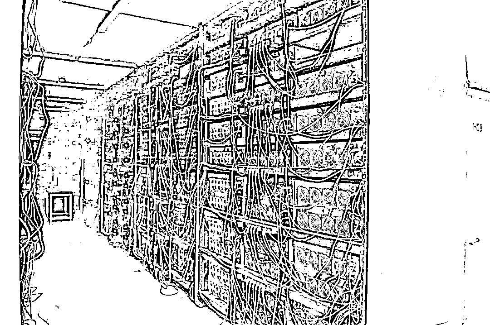
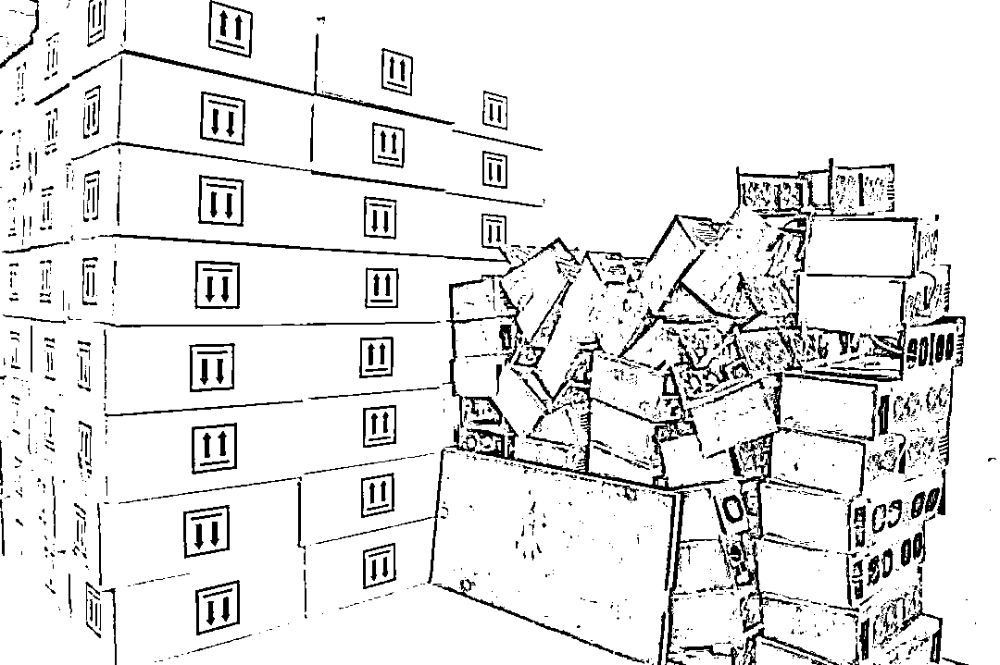

# 一个月“吃”掉 4500 万度电！这么“挖矿”能挖出来个啥？

> 原文：[`mp.weixin.qq.com/s?__biz=MzIyMDYwMTk0Mw==&mid=2247515249&idx=2&sn=6f8fa9a345ba206d128acbb4b995e141&chksm=97cb7749a0bcfe5f5d1b4bf634bea0493e68a825393cbdfb856d28bda1812105760df175868f&scene=27#wechat_redirect`](http://mp.weixin.qq.com/s?__biz=MzIyMDYwMTk0Mw==&mid=2247515249&idx=2&sn=6f8fa9a345ba206d128acbb4b995e141&chksm=97cb7749a0bcfe5f5d1b4bf634bea0493e68a825393cbdfb856d28bda1812105760df175868f&scene=27#wechat_redirect)

看似高大上的“大数据中心”

实则为虚拟货币“矿场”

能耗“无底洞”

……

近年来，虚拟货币风生水起，引得不少人趋之若鹜。比特币等虚拟货币没有实物，由计算机生成的一串串复杂代码组成，需要根据算法通过计算机运算获得，俗称“挖矿”。用于挖矿的“矿机”一般功率较大，需要消耗大量电力。

**“矿场”到底长啥样？挖矿究竟多耗电？**

近日，记者走访了西部某省份一家从事“数据业务”的企业。现场偌大的厂房内部用白色隔板分出约 30 间机房，每间机房的金属架上摆满了闪烁着彩光的服务器，杂乱无章的电线与插线板上盖着厚厚的灰尘。厂房里没有什么工人，只听见风扇的轰鸣声。

5 月 26 日，记者在企业现场看到，每间机房的机架上排满了“矿机”，现场风扇轰鸣，机箱外侧满是灰尘。新华社记者 张云龙 摄

“这些都是目前挖矿专用的主流品牌机型，应该就是一个‘矿场’。”一名同行的业内人士告诉记者。

记者多方了解到，**这家企业 2020 年全年纳税仅 25 万元，但月均耗电量却高达 2500 万度！今年前 4 个月，纳税仅 9 万元，但月均耗电量高达 4500 万度，折算能耗约为 1.5 万吨标煤。**

“在我们这里，这个能耗相当于大型乳品企业 10 条液态奶生产线的能耗总量。”一位当地人士告诉记者。

剑桥大学替代金融研究中心的研究显示，截至 2021 年 5 月 10 日，**全球比特币挖矿的年耗电量大约是 149.37 太瓦时（1 太瓦时为 10 亿度电）**，这一数字已经超过马来西亚、乌克兰、瑞典的耗电量，十分接近耗电排名第 25 名的越南。

庞大的电费支出让“矿主”们好像“候鸟”一般，哪里电费便宜就把“矿场”搬到哪里去。

一名“矿主”告诉记者，冬天他们一般在内蒙古、新疆等地用火电挖矿，一度电 0.3 元左右。到了春天，就陆续通过卡车将“矿机”运到川西地区，利用丰水期便宜的水电“挖矿”。如果和小水电站谈妥价格，电价可以每度 0.2 元左右。

因此，我国虚拟货币“矿场”大多分布在电力资源充足而电费便宜的地区，例如火电资源充足的新疆、内蒙古和水电资源充足的四川、云南。

5 月 26 日，记者探访“矿场”现场，一些设备“残骸”被随意堆砌在大厅一角。新华社记者 张云龙 摄

**虚拟货币挖矿的高能耗，已经引起了地方政府的高度警觉。**例如内蒙古自治区今年以来采取多项政策措施清退虚拟货币挖矿项目，截至 4 月底已关停清退 35 家挖矿企业。经初步统计，清退这 35 家挖矿企业可年节电 52 亿度，折合超 160 万吨标准煤。 

“近期看到当地出台打击虚拟货币挖矿的一些措施后，我们正在抓紧清理。”记者走访的那家企业的负责人表示，最高峰时厂房里有 2 万多台服务器。今年 2 月以来，一些服务器已陆续搬走了，现在约剩 1 万台。

整治力度不断加大。**5 月 21 日，国务院金融稳定发展委员会召开了第五十一次会议。会议明确提出，打击比特币挖矿和交易行为。这是金融委首次对于比特币公开发声，直言“打击”，态度鲜明有力。**

“这两天，周围有不少‘矿主’已考虑关停‘矿场’或转移到海外了。”一名“币圈”人士告诉记者，他们准备漂洋过海，将“矿场”搬到俄罗斯、芬兰、加拿大等当地允许且电力过剩的国家。

要把电用在促进经济发展的“刀刃”上。专家建议，电力资源充沛的地区可以建立市场准入、互联网企业用电大户监测、互联网异常流量监测等多维度常态化监测体系，加强源头把控。

来源：新华视点

← 向右滑动与灰产圈互动交流 →

