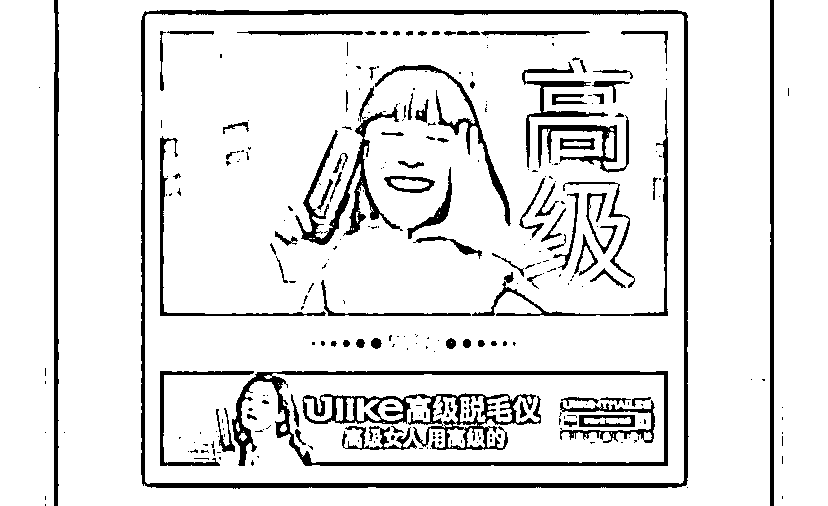
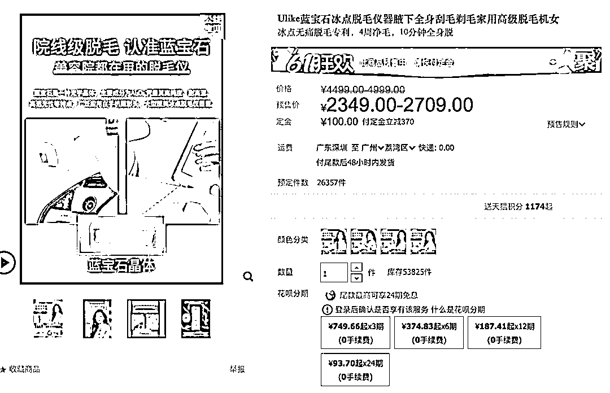
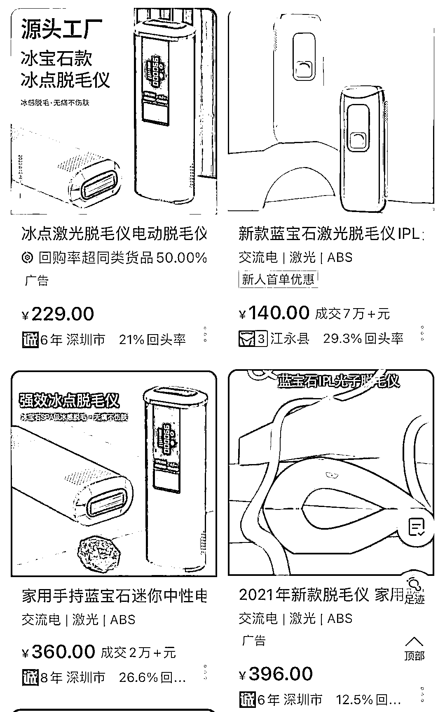
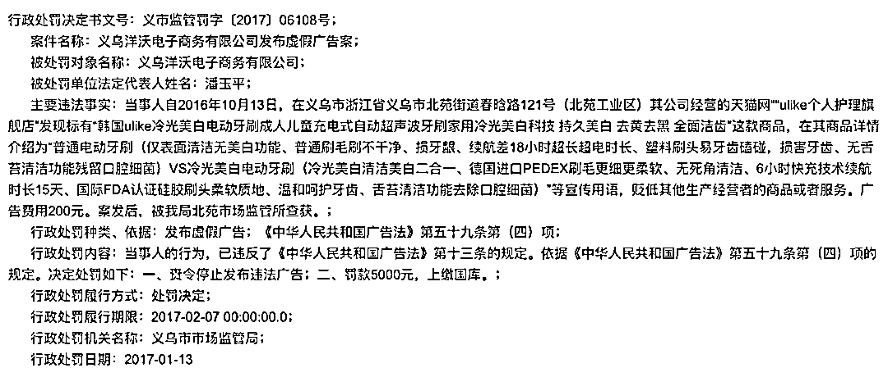
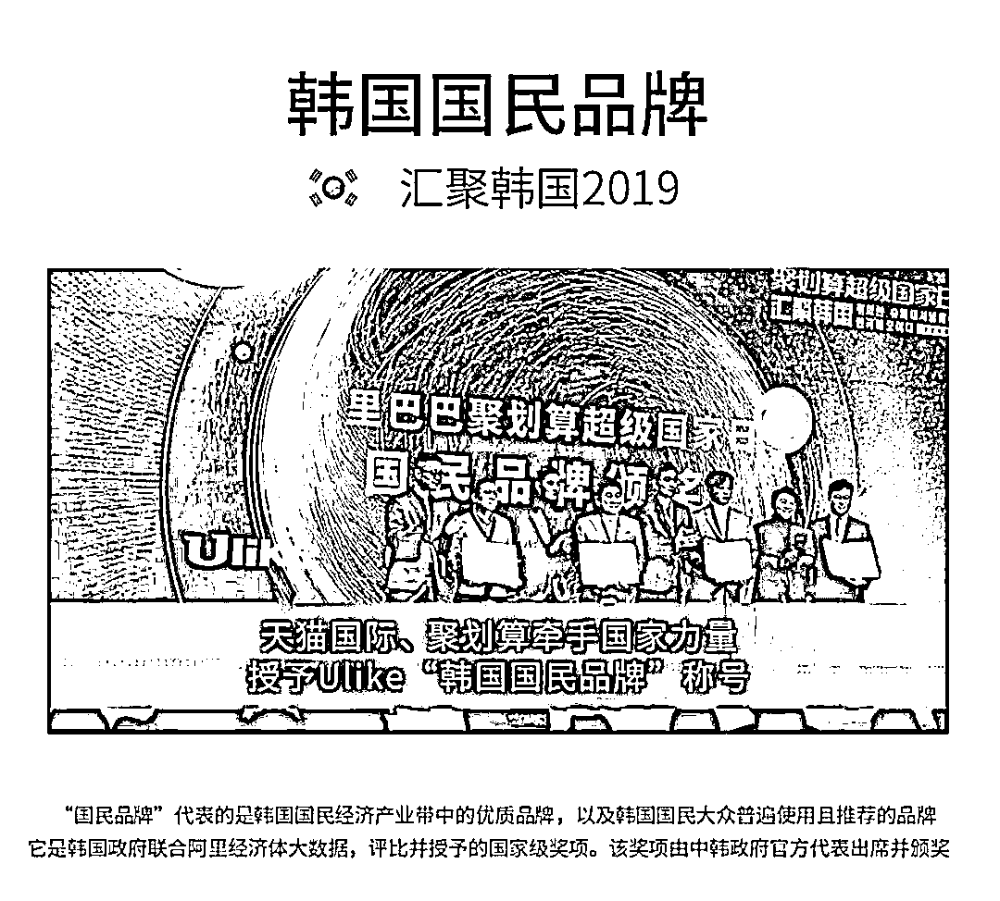
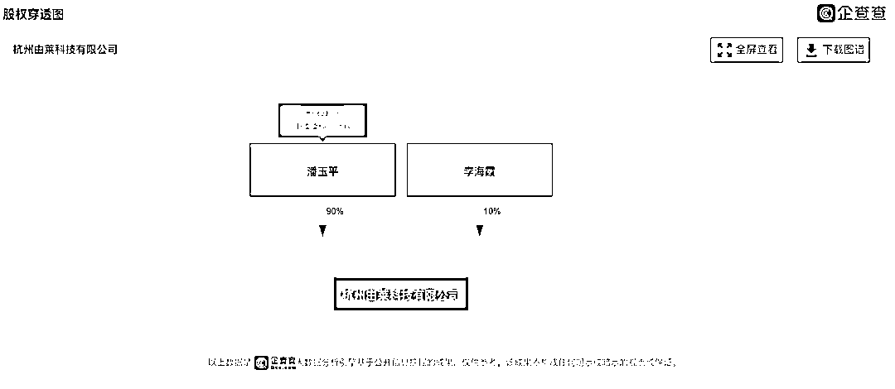
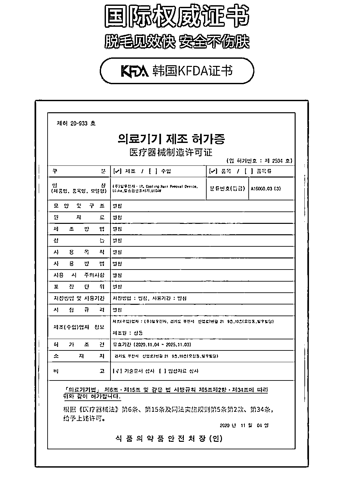
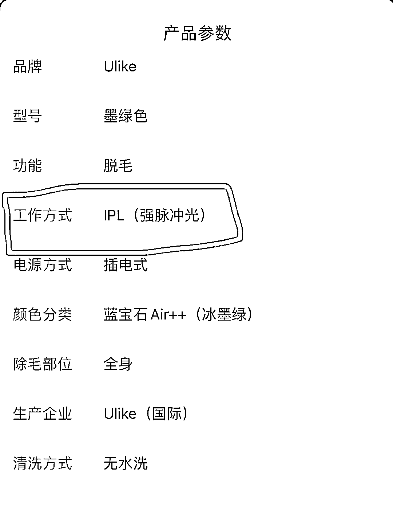

# 深扒：成本不过百、存在辐射骚扰的 Ulike 脱毛仪，你敢买吗？

> 原文：[`mp.weixin.qq.com/s?__biz=MzIyMDYwMTk0Mw==&mid=2247515249&idx=3&sn=b2696f51fccae793a4ecda68091f0e94&chksm=97cb7749a0bcfe5fb38945c3240bd12fc7751314f397c2f118b1a9526f95c8d979c6633e82e5&scene=27#wechat_redirect`](http://mp.weixin.qq.com/s?__biz=MzIyMDYwMTk0Mw==&mid=2247515249&idx=3&sn=b2696f51fccae793a4ecda68091f0e94&chksm=97cb7749a0bcfe5fb38945c3240bd12fc7751314f397c2f118b1a9526f95c8d979c6633e82e5&scene=27#wechat_redirect)

为了今年的 618 大促，Ulike 从几个月前就开始大范围投放广告，最出名的还是那条“高级”的电梯广告，不仅给人分了高低等级，还暗戳戳给自己抬咖“高级女人用高级的”。 

给电梯空间增添了聒噪外，让不少女性感到被冒犯，正经人谁会四处宣扬自己高级啊？

那么，“高级女人用的 Ulike”究竟是谁给的自信？是蓝宝石吗？

 ********01**********有蓝宝石的，真的高级吗？**

在 Ulike 的广告中，“有蓝宝石的才是高级的脱毛仪”，且不说这种宣传涉嫌不正当竞争，有蓝宝石的真的高级吗？

普通消费者大概一听蓝宝石，就带着对宝石的天然印象，认为用到了蓝宝石的 Ulike 就很高级啦。

Ulike 的产品价格也十分昂贵，蓝宝石 Rose 款的官网售价为 3999 元，蓝宝石 Air 款的售价为 4499-4999 元不等。

然而有媒体曾报道称，西门子的工程师拆机 Ulike 脱毛仪后表示，成本不过 70 元。

另据 21 世纪商业评论报道，深圳市宝安区一家生产蓝宝石美容配件的公司告诉记者，“家用脱毛仪内嵌蓝宝石价格在 40 元左右，通常都是 A 级，4 面的，2 面的会更便宜。现在好多做脱毛仪的一次性定 2 万多块，这样价格会更低。”

可见蓝宝石并不高级，只是 Ulike 利用信息差哄骗消费者的营销法宝罢了。只是被拿来重点宣传的蓝宝石成本尚且如此低廉，Ulike 脱毛仪的其他零件造价可想而知。

美商社查询了阿里巴巴 1688 发现，外观与 Ulike 几乎一致，并且也称用到了蓝宝石的脱毛仪，价格在两三百元的比比皆是，甚至最低价格为 135 元一台，量大还可以更优惠。

当然，便宜的激光脱毛仪可能材质更廉价，可能存在出光的稳定性不好，易皮肤烫伤等问题，但售价几千元的 Ulike 就避免了吗？

美商社此前将 Ulike 蓝宝石 Air+脱毛仪送到华测检测认证集团股份有限公司进行检测（检测机构“华测检测认证集团股份有限公司”是上市公司，检测能力毋容置疑），依据 GB 4343.1-2018《家用电器、电动工具和类似器具的电磁兼容要求 第 1 部分：发射》测试了该脱毛仪“辐射骚扰”项目，测试结果显示为“不合格”。

**检测报告获取路径**：登录网址华测官网：https://www.cti-cert.com→资源中心→报告查询→免登陆验证报告，或直接登录：https://mylims.cti-cert.com。报告编号：EED32N000156C，报告验证码：3915577890。检测机构客服电话：400-6788-333。

可见，贵价的 Ulike 脱毛仪也存在此类问题，这让我们更加怀疑，Ulike 卖几千元的脱毛仪和 1688 上几百元的脱毛仪到底有区别吗？Ulike 的钱果真都花到营销上了？

********02**********“精韩”的国产品牌**

让 Ulike 最花钱的，莫过于将自己包装成韩国品牌。

尽管中国制造的声量与日俱增，但仍然无可避免的存在一些膝盖软的精美精日分子，崇拜国外的月亮比国内圆。

Ulike 不精日也不精美，更奇葩的是，它精韩。“精韩”就是精神韩国人，形容在国内生活，却无比向往成为韩国人，处处以韩国为傲的人。

从哪些方面可以看出 Ulike 精韩呢？

首先 Ulike 的宣传中，不仅不承认自己是国产品牌，还处处暗示自己是韩国品牌（以前明说，现在都是暗戳戳的表达）。大多数听说过 Ulike 的人都以为它是个韩国品牌，美商社早期的文章中也曾受到误导，以为 Ulike 是韩国品牌。

难道大家都不约而同的把一个国产品牌认错成韩国品牌了？显然不可能，Ulike 品牌早期就是宣称自己是韩国品牌，后来国潮风起，才逐渐抹去了韩国身份。

美商社查询企查查发现一 Ulike 品牌关联公司义乌洋沃电子商务有限公司因发布虚假广告遭到处罚的处罚决定书。

根据处罚信息显示，该公司经营的“ulike 个人护理旗舰店”被发现标有“**韩国 ulike**冷光美白电动牙刷成人儿童充电式自动超声波牙刷家用冷光美白科技 持久美白 去黄去黑 全面洁齿”，给大家划重点，**韩国 ulike**，义乌市场监管实锤。

精神上，Ulike 一直认为自己是个韩国品牌，其品牌官网显示，Ulike 品牌成立于 2013 年，2014 进入中国市场并成立天猫旗舰店。 

会有一个国产品牌用“进入中国市场”这样的表达吗？这句话意思就是中国市场不是本土市场，品牌成立一年才进入中国市场，当然，Ulike 也十分鸡贼的没有明说自己是韩国成立的。

成立一年又回到国内销售，无非就是想利用一些国人崇洋媚外的心理促进产品销售，不得不说这一套打造假洋牌的运营，Ulike 很成功。

为了配合好韩国品牌的“人设”，Ulike 的代言人也是知名韩国明星全智贤。在 Ulike 天猫旗舰店内，产品的详情页也附上的是韩国的 KFDA 认证（后文细说）。此外，还洋洋得意的打出“韩国国民品牌”的称号，韩国有几个人用 Ulike 心里没数吗？

总而言之，处处弥留着韩国品牌的影子。你要说 Ulike 不是韩国品牌，恐怕它自己首先不同意。

然而 Ulike 的的确确是一个中国品牌。

根据企查查信息显示，第 11 类灯具空调的 Ulike 商品所属杭州由莱科技有限公司，该公司隶属于义乌洋沃集团，实际控制人和最终受益人均为潘玉平。

公开信息显示，潘玉平的公开身份为 Ulike 品牌 CEO。实际上，潘玉平也控制了所有以 Ulike 为商标的相关公司主体。

但可以确定的事，在 Ulike 相关的所有公司的股东及出资信息中，没有任何韩国人和资本的影子，除非潘玉平入了韩国籍。

这显然可以实锤号称韩国品牌的 Ulike 实际上就是个“精韩”的中国品牌，但如果你询问 Ulike 天猫旗舰店的官方客服，“Ulike 是韩国品牌还是国产品牌？”客服决不会正面回答你它是国产品牌，而是告诉你韩国制造和中国制造都有，你自己选购。如果你追问，客服只会机器人式的重复回答，绝口不提是国产品牌。

美商社就想问问 Ulike，承认自己是国货很丢脸吗？还是担心国货没办法卖出上千元的价格，和同样是国产、售价却低几倍的国产脱毛仪竞争了？

让 Ulike 无法认同自己中国出身的原因显然是后者，这也是 Ulike 把钱都花在包装自己是个韩国品牌上的主要原因。

********03**********备受争议的 KFDA 认证**

由于要证明自己是一家韩国品牌，Ulike 摆出了韩国食品药品管理局 （KFDA）的证书，以证明自己的资质。

然而，这份证书却遭到打假。

据 21 世纪商业评论报道称，2020 年 5 月，Ulike 特意在小红书上录制自己检索证书过程的视频，然而记者打开 Ulike 视频内提到的韩国食品医药品安全部官网，按照视频的步骤操作，却发现表格中提到的公司是“一宇电子”，地址在京畿道。

目前，没有看到 Ulike 公开说明其与一宇电子的关系，该公司早在 2007 年就已经注册，而 Ulike 品牌则成立于 2013 年。

此外，还有网友提出，Ulike 提供的所谓“韩国 KFDA 证书”实际上是医疗器械制造许可证并且这个证书和 Ulike 毫无关系，美商社也注意到，Ulike 天猫旗舰店提供的证书翻译为医疗器械制造许可证。

请问能制造代表产品合格吗？Ulike 贴出这个不是打自己脸吗？

实际上，由于美容仪市场竞争激烈，各家品牌为获取信任摆出各国认证已是行业惯例。去年，知名打假人王海就曾打假初普美容仪和慕金脱毛仪借用“FDA 认证”进行虚假宣传的事件，如今上述品牌早已撤下相关宣传，而 Ulike 仍在借此背书。

用知乎答主“咕噜噜噜”的解释，“目前国内家用脱毛仪并不是医疗器械产品，上市也只是强制 3C，类似的欧美 ce，美国 fcc，再加上其他国家类似的，这些都是各国的电子产品安全认证。只要厂商老老实实做合格产品，就没问题。所以，这个品类的有多少证书，极端点说，就是取决于厂商准备花多少钱买！想通过这些证书来判断产品好坏，基本捉瞎。”

根据 Ulike 品牌的介绍，Ulike 脱毛仪的工作方式为 IPL（强脉冲光）。

2018 年 8 月 1 日，国家药品监督管理局（简称 NMPA）将 IPL 脱毛仪列入二类医疗器械管理，分类编码为 09—03—04，要求各地强脉冲光脱毛类产品相关企业切实落实产品质量安全主体责任，确保上市产品的安全有效。

在天猫官方旗舰店内，Ulike 罗列了一系列证书，比如，上文提到的 KFDA 认证、欧洲 CE 认证等等，但却没有 NMPA 的证书。

当然，这并不妨碍 Ulike 销售，主管部门预留了 4 年多的申请窗口期，即便没有也能售卖 1 年多。

只是不知道，到了 2023 年，还能见到 Ulike 吗？

来源：美商社

← 向右滑动与灰产圈互动交流 →

