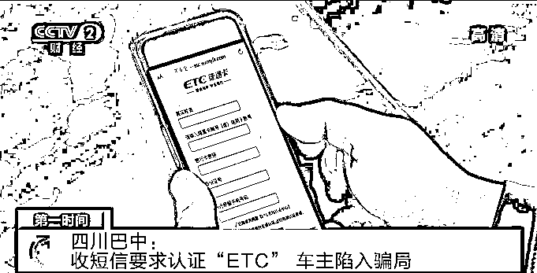
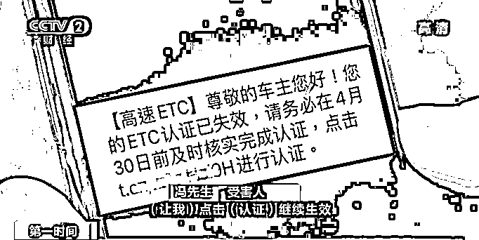
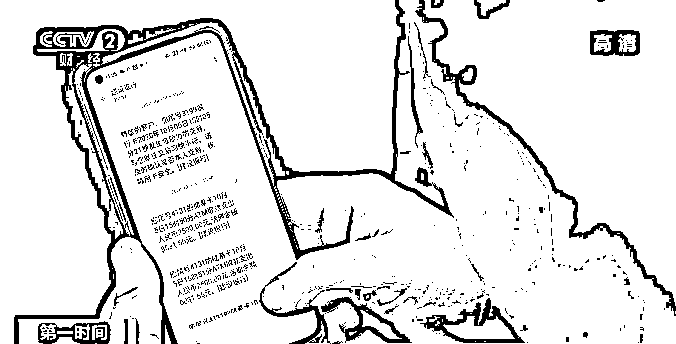
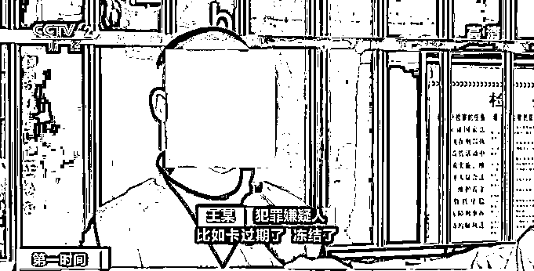
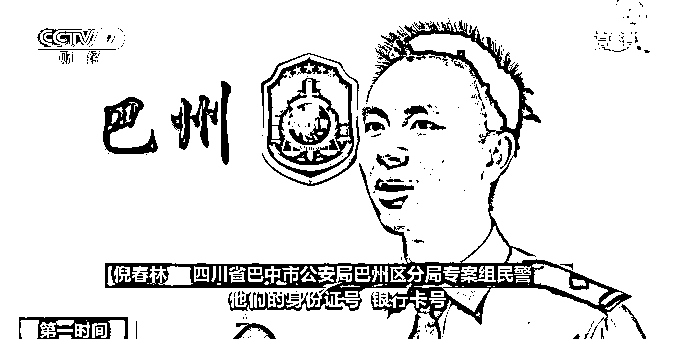
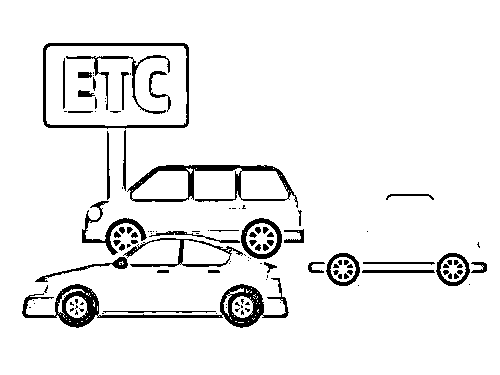

# 10 秒钟钱就没了！收到这种短信千万别点

> 原文：[`mp.weixin.qq.com/s?__biz=MzIyMDYwMTk0Mw==&mid=2247515249&idx=5&sn=6829f1df409f2c72de7ef2acf85ae598&chksm=97cb7749a0bcfe5fce426807d3ffcab433c2ce25fb1fc400f0dc174db104f914ef15110cd26e&scene=27#wechat_redirect`](http://mp.weixin.qq.com/s?__biz=MzIyMDYwMTk0Mw==&mid=2247515249&idx=5&sn=6829f1df409f2c72de7ef2acf85ae598&chksm=97cb7749a0bcfe5fce426807d3ffcab433c2ce25fb1fc400f0dc174db104f914ef15110cd26e&scene=27#wechat_redirect)

“ETC”电子不停车收费系统，

让车主通行高速路变得更为快捷方便。

然而，一些不法分子也将黑手

伸向了“ETC”车主，

致使不少粗心大意的车主

上当受骗。

近日，四川巴中警方就破获了一起

利用“ETC”实施电信网络诈骗的案件。

[`mp.weixin.qq.com/mp/readtemplate?t=pages/video_player_tmpl&action=mpvideo&auto=0&vid=wxv_1891707982170619905`](https://mp.weixin.qq.com/mp/readtemplate?t=pages/video_player_tmpl&action=mpvideo&auto=0&vid=wxv_1891707982170619905)

视频|央视财经《第一时间》

去年 10 月份，四川巴中的冯先生手机收到一条短信，提醒他的 ETC 账户将于 30 日内失效。

**受害人 冯先生**：让我点击认证继续生效，当时我也想了一下，我的 ETC 也办了几年了，心想可能也有这么回事，我就把这个链接点开了。 

冯先生按照链接页面要求，输入了自己的姓名、身份证号码、银行卡号、密码、手机号，并进行了提交。然而，当他再次输入手机验证码进行提交时，短短几秒钟，银行卡内的钱，就被迅速盗取了。

**受害人 冯先生**：接连来了 4 条短信，我银行卡上总共 11900 元，十秒钟之内就把钱全部取走了。

 冯先生报案后当地公安局迅速成立专案组，经过近三个月侦查，警方顺藤摸瓜，查获一条涉及 ETC 诈骗的非法利益产业链。犯罪嫌疑人通过冒充 ETC 中心、高速管理中心等机构名义，发送“ETC 过期认证、系统升级、失效激活”等内容，诱骗受害人点击短信中的“钓鱼链接”。

**犯罪嫌疑人 王某**：比如卡过期了、冻结了，我们过一段时间就会修改一下内容发给他们。因为短信前面有一个括号会显示 ETC 等，看着就像官方的， 所以他就相信是 ETC 官方发过来的短信。 

**四川巴中市公安局巴州区分局专案组民警 倪春林：**犯罪嫌疑人诱惑用户在钓鱼网站填写了他们的身份证号、银行卡号、手机验证码等信息后，就可以通过后台窃取这些信息，最后实现诈骗。 

目前，

**警方从四川、云南、重庆、海南、**

**江西、安徽等地抓获 22 名犯罪嫌疑人，**

**扣押赃款 290 多万元，**

**涉及案件 100 多起**，

案件正在进一步侦办中。 

来源 ： 央视财经

← 向右滑动与灰产圈互动交流 →

