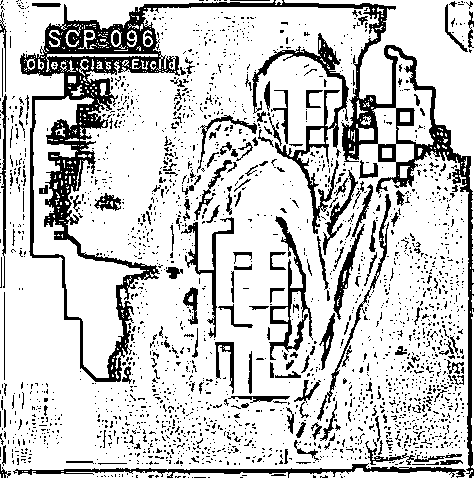
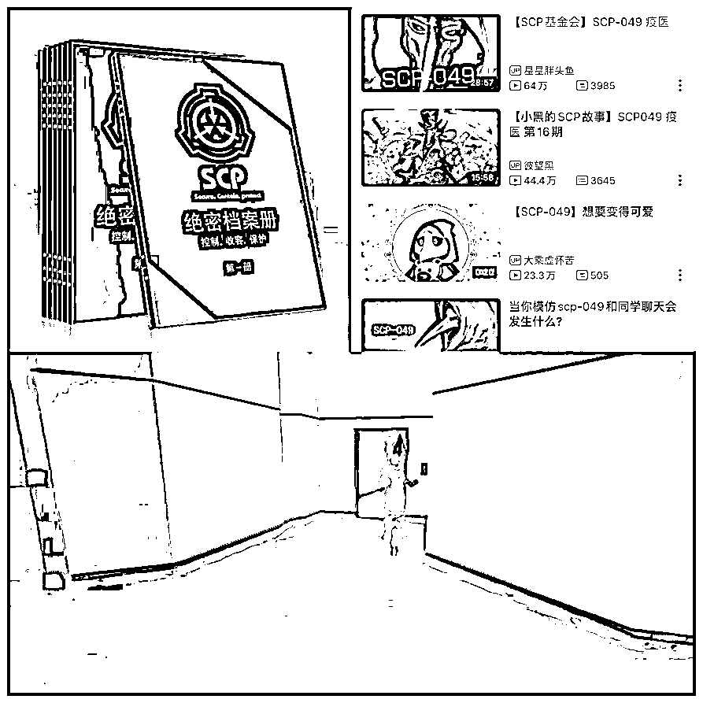
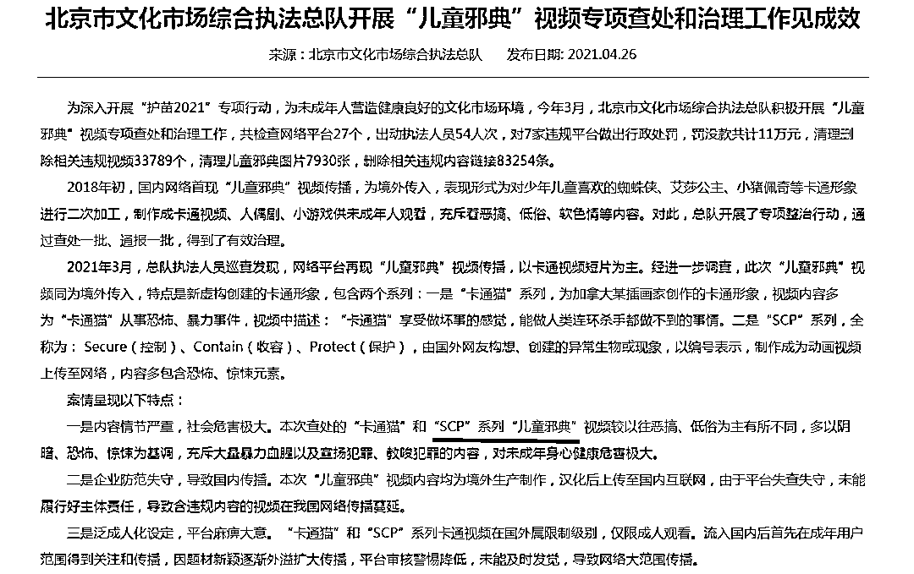
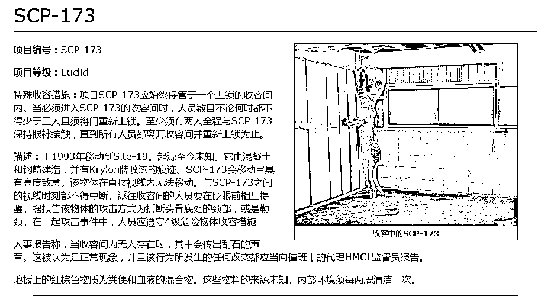

# 被“邪典”咬蚀的孩子们

> 原文：[`mp.weixin.qq.com/s?__biz=MzIyMDYwMTk0Mw==&mid=2247515304&idx=1&sn=3b620905ce2e740f42fca8be4bc9fd48&chksm=97cb7790a0bcfe863aee0884cb423195083de6dcf6da8e757ae65b2a68801178b5c14fa6ed65&scene=27#wechat_redirect`](http://mp.weixin.qq.com/s?__biz=MzIyMDYwMTk0Mw==&mid=2247515304&idx=1&sn=3b620905ce2e740f42fca8be4bc9fd48&chksm=97cb7790a0bcfe863aee0884cb423195083de6dcf6da8e757ae65b2a68801178b5c14fa6ed65&scene=27#wechat_redirect)

视频中是一个看似凶猛、恐怖的怪物。 

它身高 2.38 米，每只手臂长约 1.5 米，身体部位严重不成比例，大部分皮肤完全不含色素，没有眼珠，体表无半根毛发。这个“怪物”代号为 SCP-096，一度吸引了李祥和很多学生。李祥今年 16 岁，初二时，他无意中在网络上看到了一则介绍此类怪物的视频，从此对“SCP”系列产生了好奇和迷恋。

SCP 爱好者创作出来的一种超自然生物 SCP-096。图源网络

“SCP”系列起源于 2007 年美国网友于 4chan 论坛上发布的一篇恐怖小说，小说以机密资料的口吻虚构了一个叫“SCP”的机构，该机构收容了一个危险生物，编号 173。SCP-173 的角色设定是，当有人盯着它时，它无法行动，一旦盯着它的人视线转移或眨了眨眼，SCP-173 会瞬间移动到对方眼前，并拧断对方的脖子。 

这一特有的恐怖惊悚氛围引发了更多网友的关注与创作，许多网友纷纷创造出一大批和 SCP-173 相似的超自然生物，以编号命名。越来越多的爱好者在各个国家建立官方网站，取名“SCP 基金会”。 

“SCP 基金会”中文官网显示，“基金会”的目标是“收容异常物品、个体及现象”，“SCP”的含义为控制（Secure）、收容（Contain）及保护（Protect）。网站没有固定的作者，编写成员来自世界各地，他们以科学报告的形式记录、上传各类虚构的怪奇现象、物体，营造神秘恐怖的氛围，供其他爱好者阅读。 

近年来，“SCP”系列在国内爱好者中流行起来，由最初小范围的同人创作，逐渐衍生出实体卡片、视频和游戏等形式，其受众不乏未成年人。

由“SCP”系列衍生出的实体卡片、视频与游戏。图源淘宝、b 站和游戏画面截图

李祥至今无法忘记看“SCP”系列视频时“刺激”的感受。在他看来，看“SCP”成了一种逃避，让他能把不开心的事都抛到脑后，但他说，“我的悲伤并没有因此得到缓解。” 

“SCP”系列在未成年人之中的传播，逐渐在一些学生和家长中引发了争议。 

4 月 26 日，北京市文化市场综合执法总队发布公告称，自今年 3 月以来，执法总队开展了关于“儿童邪典”视频的专项查处和治理工作，对 7 家违规平台做出了行政处罚，共清理相关违规视频 33789 个，清理儿童邪典图片 7930 张，删除相关违规内容链接 83254 条。公告中，“SCP 系列”被列为“儿童邪典”的一种。公告还称，较以往恶搞、低俗为主的“儿童邪典”视频不同，“SCP”系列等视频多以阴暗、恐怖、惊悚为基调，充斥大量暴力血腥以及宣扬、教唆犯罪的内容，“对未成年身心健康危害极大。”

北京市文化市场综合执法总队公告。

实际上，“儿童邪典”视频由来已久，2018 年初，一类以蜘蛛侠、爱莎公主等深受儿童喜爱的卡通形象为原型而制作成的短视频和小游戏在未成年人中流行，内容充满恶搞、低俗与软色情等。 

看到公告后，还在读高一的陈莹松了口气。自 6 岁接触“儿童邪典”视频和游戏后，她感到自己的性格变得阴郁，常常幻想恐怖暴力的画面，初二有过一次自残行为。现在，她开始意识到，“原来我变成这样是有原因的，而不是说我本身就是个变态。” 

上述公告称，此次查处的视频均为境外生产制作，汉化后上传至国内互联网，“SCP”系列等视频在国外属限制级别，仅限成人观看，流入国内后，由于平台审核警惕降低，导致网络大范围传播。6 月 1 日，澎湃新闻记者查询发现，以“SCP 基金会”或“SCP-XXX”为关键词，在 b 站、优酷、QQ 看点等视频网站上搜索，有上千个相关视频，其中最高播放量超过两百万。截至发稿，在部分视频网站直接搜索“SCP”，已无法显示相关内容。 

关于“SCP”和“儿童邪典”，近日，两位漩涡中的未成年人和一位家长向澎湃新闻讲述了他们的故事。

**以下是他们的口述**

**陈莹（化名） 学生 **

**今年 15 岁**

****

**我在六岁时接触了电脑。小孩子嘛，总是喜欢玩一些给芭比娃娃换衣服之类的游戏，而且那个年纪的女孩大多数都对当母亲有一种向往，我小时候就感觉当妈妈是一个很伟大的过程。现在想想，那些邪典游戏正是抓住了小女孩的这种情怀，往畸形的方向诱导。** 

**最初接触儿童邪典是在 4399、7K7K 这样的小游戏平台上，有一款叫“Elsa 生宝宝”的游戏，画面很好看，图片色彩也很鲜艳，里面的人物大多都来自卡通动画，特别是有迪士尼公主，可想而知这对小女孩的吸引力有多大。** 

**游戏中有个很大的“play”图标，作为小孩子，我当时还不明白这个英文单词的意思，但还是被画面吸引，点了进去。接着画面跳到了一个叫“Elsa”的女孩，她是个将要分娩的孕妇。** 

**随即来了一辆救护车，“Elsa”被送到了医院检查、消毒和输液，紧接着就是分娩的过程。刚开始“Elsa”的面部发红，我推测她可能也有点疼，这时候就需要我用鼠标来控制她分娩的过程，包括照顾她、递手术刀、检查身体、让她用力、替她收拾行李等。** 

**在分娩的整个过程中，她还会发出阵痛的声音，但游戏始终以一种很美的方式呈现——漂亮的裙子、体贴的丈夫和温馨的环境，我被这种特殊的美感所吸引，所以整个过程特别好奇，一点都不觉得痛苦。** 

**六岁的我产生了很强的代入感，再加上缺乏性教育，当时我并没有产生排斥心理，反而在网页的推荐下接触了其他的邪典游戏。** 

**印象最深刻的是有一次我玩到了一个给“女性做手术”的外科游戏。画面是一位手臂出现肿块的白人女性，几分钟后她的心率下降并休克，此时需要“我”扮演主刀医生，然后画面中有工具出现，虽然全都是英文，但是我大概能理解游戏的意思，它是想让我用钳子、手术刀来给这个女性动手术。** 

**我当时特别着急，害怕她死掉，就点鼠标，把手术刀拖到了她受伤的部位，紧接着就是比较血腥的画面——血淋淋的骨头和肌肉直接以动画的形式呈现出来，非常直观。我当时认为我应该承担这个责任，所以继续操纵鼠标来为她“做手术”，我将游戏中的刀具放在了她出血的肿块上。** 

**游戏画面随后突然出现了中英混杂的字幕：“由于你的原因，手术失败，她可能会死掉。”当时我非常害怕、愧疚，我真的觉得是我造成了游戏画面中女性“死亡”的结果，整个人精神恍惚，非常有负罪感。她死去的画面，在随后的两天中都萦绕在我的脑子里，挥之不去。** 

**随着玩游戏的时间越来越多，儿童邪典对我的影响也越来越大。有一次我和两个娃娃一起玩，扮演一个娃娃陷害另一个娃娃的游戏。在被陷害的娃娃死掉之后，我对另一个娃娃说：“她都死了，你怎么不去死？”现在想想真的是比较恶毒的话。** 

**我那时只有七八岁，由于被洗脑，而且大脑还处在发育阶段，我无法对一个事物做出好与坏的判断，甚至认为有人在监视我的生活，还一直觉得死亡是一件很让人开心的事，因为假如你死了，另一个人就可以被指责一辈子，还有可能被活生生逼死。** 

**随着年龄的增长，我的生活发生了实质性的改变。我开始看到恐怖的东西了，它不是客观上存在的，但我感觉我能用眼睛看到，应该算是幻觉吧。我看到的东西没有眼睛和鼻子，眼睛部位是两个带着血的黑洞，他有一张血淋淋的大嘴，是笑着的，没有嘴唇……** 

**我甚至每天晚上都能看到他在盯着我，用他那双没有眼球的空洞眼眶盯着我，我每天晚上都能看到，甚至有一次看到了焦尸，还有一次，是一张惨白的脸上，只剩下半张脸皮，剩下的是像虫子一般涌动的肌肉。** 

**那段时间我害怕得睡不着，只有开灯才能睡觉。** 

**我有了心理上的问题。一直接触这些都市传说、恐怖故事、SCP 和邪典游戏，对我最大的影响就是让我的性格变得阴郁，我想其他事的时候也会想得特别血腥恐怖，往坏的地方想，而且还有恋物癖，简而言之就是恋孕，这个主要是受“生孩子”一类游戏的影响。** 

**我自始至终都没有告诉过家长，我的父母离异，工作繁忙，我也是最近一年才知道这些都是邪典内容，开始慢慢意识到，原来我变成现在这样是有原因的，而不是说我本身就是个变态。** 

**我现在已经不玩这类游戏了。所以说，请广大家长看好自己的孩子。** 

**李祥（化名） 学生**

**今年 16 岁**

****

**我第一次看到 SCP 是在 QQ 的看点视频上，当时正上初二，那个视频是在介绍 SCP-173，我点开视频，就看到“小花生”（SCP-173 别名）站在那里，然后视角转了过去，屏幕突然一黑，其实就是“我”被杀死了。   **

****

**SCP-173 是 SCP 爱好者创作出来的一种超自然生物，它有着怪异的外表和奇特的设定。图源"SCP 基金会"官网**

**一开始，我并没有产生很大的兴趣，直到初三有一天看到了 SCP-166（编注：SCP 爱好者创作的超自然生物之一，设定为其需每周摄取 1 毫升的新鲜人类精液，任何看见她的男性都会迷恋上她，并试图侵犯），介绍 SCP-166 的视频封面上是一个金发女人，这个封面挺吸引我的，我就点进去看了。这之后我才开始真的好奇，我关注了官网，又大量刷 SCP 的视频。** 

**看关于 SCP-166 视频的时候，评论区都在刷一句话——“想给她喂食”。我一开始当然看不懂了，但是后来听视频讲解，知道了这个 SCP-166 每周要吃什么。我认为它令所有男性都欲罢不能，进入一种忘我的境界，我也开始迷恋上了 SCP 系列。** 

**初三，我每天都会花半个多小时看看 SCP 的东西，那段时间我每天的作业都会完成得比较晚，耽误了学习。不过我成绩一直都不太好，看看这些也能放松一下。** 

**去年 8 月，我初中毕业之后，那时候了解 SCP 也有半年了，我每天都发关于 SCP 的说说——关于收容物的一些介绍，再配一张图。** 

**但当时也没什么同学关注，我还挺失望的。** 

**我觉得我喜欢 SCP 是出于一种好奇的心理。毕竟恐怖片一般的套路也就是那样，比如一张鬼脸突然冲过来，焦点都在下一秒会出现的鬼脸身上，就很难注意到外面发生的事情。这些我看习惯了，觉得没什么意思。但 SCP 挺有画面感，（生物的）能力也很多样化，最吸引我的还是“杀人”这一点，很刺激。** 

**我现在偶尔刷刷 SCP 视频，更多的是上官网看 SCP 的资料，每周大概花 1-3 个小时，也是为了打发无聊的时间。在网上和现实中我是两种性格——网上很活泼，现实生活中不太喜欢说话，即使生活中有有趣的事情想要分享，我第一时间也要发在 QQ 动态上。** 

**我也有挺多不开心的时候，但是找不到人听我倾诉。不过我也习惯一个人了，我父母工作很忙，经常不在家，以前或许还会希望他们能多陪陪我，现在不会了，就算陪我，我也不知道我们之间有什么能说的。** 

**如果这就是长大了，那长大也太无聊了。** 

**我比较宅，没什么好朋友，SCP 应该会吸引像我这样的人。在我们眼中，SCP 能给我们带来精神上的刺激，也就是精神寄托吧。我有时候会把 SCP 里的内容当成真的，会胡思乱想，如果 SCP-173 或其他怪物真的出现了，我该怎么办？有时晚上睡觉之前想好几回，就当是看了一场电影。** 

**有时候看这些 SCP 的东西入迷了，不开心的事情就抛到脑后，忘得一干二净，我觉得这也算是一种逃避吧，但说实话，我的悲伤并没有因此得到缓解。下次一个人在家的时候，我也不知道该怎样才能让自己不无聊，就只能继续看。** 

**我总喜欢虚拟的东西，动漫、鬼怪这些，好像可以填补我现实中某些缺少的东西。我还网恋过，但有次吵完架冷战了一天之后，她就在空间里发了和新男友的合照，我就在想：我到底是什么呀？**

**我记得 SCP 里有个收容物，它的能力是把现实世界和虚拟世界连接起来，我就希望这个东西是真的，那我就可以进入二次元，也许可以成为主角。我希望 SCP-031 是真的（编注：SCP 爱好者创作的超自然生物之一，设定为无定形肉团状怪物，任何人目视，会将其视为曾经最爱的一个人，并试图与其展开交往），那我就可以让我喜欢的人真的留在我身边。**

**刘梅 （化名） 家长 38 岁 **

**孩子今年 9 岁**

****

**那天是孩子下午放学，他回家后把书包放在了沙发上，但是拉链没有完全合上，我透过缝隙看到了里面有几张卡片，出于好奇就拿了两张出来，看到后感到特别震惊。** 

**我家小孩当时 8 岁，平时就喜欢和同学们玩玩小卡片，交换一些小玩具，但都没有发现过有什么异样。** 

**第一张卡片，印着一位“卡通美女”，下方的角色设定是“对男性人类有着特殊的能力”，卡片下面的文字写着，这个“美女”每周都要服用 1 毫升的新鲜男性精液，而 100%的男性看到她都会产生迷恋的想法，并试图与她进行性接触，在 30%的情况下，这种冲动会导致男性通过暴力手段来达到接触她的目的。** 

**我当时就在想：这不是在训练未来的强奸犯吗？** 

**我又看了另一张卡片，上面印着一堆红色的药丸，刚开始我以为是毒品，但下面的文字写着“可以治愈一切疾病”，听上去似乎有很大的神力。** 

**看了两张卡片后我就受不了了，脊背发凉，这些内容特别不堪入目，我就给孩子父亲打了电话，把我看到的内容转述给了他。他从外面赶紧回家，把孩子的书包又检查了一遍，把卡片全部扔了，确认再没有这些东西后，我们把孩子叫到了面前，问了他卡片来源。** 

**从孩子口中得知，卡片上的角色来源于一个叫 SCP 的游戏，最早是一位男同学“引进”班级里的，然后大家就都跟着玩了，在男孩子当中十分流行。我们当时很严肃地告诉他，卡片上的内容不健康，禁止他再接触这些，孩子看到我们的态度特别坚决，也就没有太强烈地反抗。** 

**事后，我给班级里“引进”这类卡片的孩子的家长打了电话，把具体的情况告诉了对方，那位家长也从来没有听说过 SCP，但我们达成了一致，坚决不让小孩再接触这类游戏。** 

**随后，我把这一经历发到了某个社区论坛上，想请教下有经验的家长遇到这种情况该如何处理。我很担心，即使孩子不玩了，但如果一个班级里的男孩子都在玩，那恐怕他也很难脱离这样的氛围，我又无法控制孩子每天在学校接触什么人。** 

**有人留言让我报警、和学校沟通，也有家长说自己小孩也弄了一堆这样的卡片，表示应该禁掉这些东西。大家的评价都是很负面的。** 

**后来，班级里一位同学在上课时玩这类卡片，被老师发现并没收了，老师就禁止这类卡片再在班级中传播。** 

**我家小孩有一定的识字量，为了评估卡片上的内容对他产生了多大影响，我还专门问他记不记得上面的内容。还好发现得早，他对具体的内容没有什么印象，但我还是想想就后怕，基本每天回来我们都会翻翻他的书包。** 

**距离发现孩子收集 SCP 卡片已经有半年多，我家小孩又玩起了别的卡片收集游戏，但上面的内容健康了许多。所以事后我推测，孩子们对卡片上的内容其实也是一知半解，他们沉迷的只是收集卡片以获得更多积分的过程，还没有真正进入到邪典卡片的角色中去。** 

**这件事后，我觉得儿童邪典的情况很必要向大家普及一下，除了家长以外，学校老师也应该知道，毕竟学生在学校的时间也很长，他们之间的这种交流传播又是很快的。刚开始孩子可能是出于一种互相攀比的心理，但是当大家收集到的卡片都比较多的时候，会不会开始将注意力往内容上面转移？** 

**小孩子辨别能力低，一旦关注这些暴力、色情的内容，可能就会出现难以预计的后果。**

**来源：澎湃新闻**

****

**← 向右滑动与灰产圈互动交流 →**

****