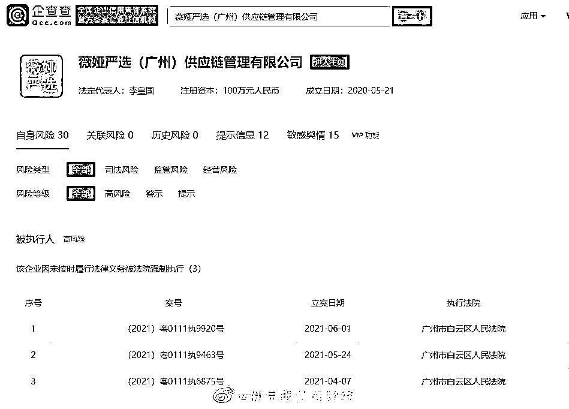
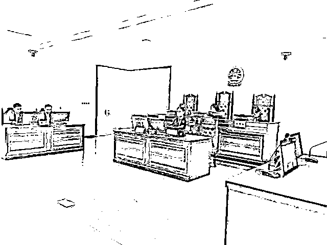

# “薇娅严选”被强制执行

> 原文：[`mp.weixin.qq.com/s?__biz=MzIyMDYwMTk0Mw==&mid=2247515304&idx=3&sn=c66918074a0d7697a7054515fb105e38&chksm=97cb7790a0bcfe8691235501c967861fb22900d6786c85a76c1ffd79a81f6c762cf7586ead21&scene=27#wechat_redirect`](http://mp.weixin.qq.com/s?__biz=MzIyMDYwMTk0Mw==&mid=2247515304&idx=3&sn=c66918074a0d7697a7054515fb105e38&chksm=97cb7790a0bcfe8691235501c967861fb22900d6786c85a76c1ffd79a81f6c762cf7586ead21&scene=27#wechat_redirect)

## 企查查 APP 显示，薇娅严选（广州）供应链管理有限公司于 6 月 1 日新增强制执行信息，目前该公司已被强制执行 40.50 万元，公司于 4 月 2 日被广州市白云区市场监督管理局列入经营异常名录。

## 企查查显示，主播薇娅曾因不正当竞争纠纷起诉该公司，法院认为被告薇娅严选公司实际在抖音中经营直播销售业务，与原告薇娅及谦寻公司的经营范围相同或类似，构成混淆。 

**薇娅状告“薇娅严选”**

**法院判赔 40 余万元**

****

**知名电商主播薇娅起诉薇娅严选公司不正当竞争一案，4 月 21 日由杭州市滨江区人民法院作出一审宣判。法院认定被告薇娅严选公司构成不正当竞争，判决其停止侵权、赔礼道歉，并赔偿原告经济损失 300000 元及原告为制止侵权的合理开支 101000 元。**

****

**（图为 4 月 21 日庭审现场。图片来源：杭州市滨江区人民法院。）**

**据了解，本案被告薇娅严选公司在抖音平台注册账号，更新发布商品进行推介销售，并为部分商家、厂家做直播等形式的推广、销售。抖音“薇娅严选”账号设置的昵称、头像及个人简介包含“薇娅”字样。**

**此前薇娅本人在公开场合表示，**面对“薇娅严选”这类“李鬼”，有时自己的亲戚都可能被误导。对此行为，她已建立团队处理维权事务。****

**今年 3 月 26 日，本案由杭州市滨江区人民法院公开开庭审理。**

**本案判决中，法院明确了艺名“薇娅”具有人格权和财产权双重属性。法院审理后认为，经过原告薇娅、谦寻公司对艺名“薇娅”长期、持续的使用及推广，艺名“薇娅”对于薇娅和谦寻公司已不仅仅起到作为艺名的作用，同时还具有了识别商品及服务来源的作用。因此，艺名“薇娅”既属于薇娅的姓名，具有人格权属性，其也因作为薇娅与谦寻公司经营活动中的商业标识，具有商品化权益，具有人格权和财产权双重属性，同时受民法典和反不正当竞争法的保护。**

**法院认为，被告薇娅严选公司实际在抖音中经营直播销售业务，与原告薇娅及谦寻公司的经营范围相同或类似。且被告薇娅严选公司成立时间晚于艺名“薇娅”具有极高知名度时间，具有极大的攀附“薇娅”知名度的主观故意，意欲利用“薇娅”的声誉和社会影响力谋取不正当的竞争优势。**

**最终，滨江区人民法院依法判处被告薇娅严选公司立即停止使用含有“薇娅”字样的企业字号并变更公司名称登记；立即停止在其生产经营活动中使用“薇娅”字样的其他不正当竞争行为；在《南方都市报》刊登声明，公开向原告赔礼道歉，为原告消除影响；赔偿原告经济损失 300000 元及原告为制止侵权的合理开支 101000 元。**

**“薇娅严选”冒名卷款跑路******

**经历了野蛮生长的直播带货，依然持续高温，薇娅、李佳琦等头部主播的光环吸引了无数渴望财富和成功的生意人。然而，光鲜之下，不少商家却遭遇了种种“套路”，带货不成反赔本，维权之路遥遥无期。**

**据时代财经此前报道，有商家反映在网上看到薇娅严选的直播带货广告，薇娅严选相关工作人员声称，每款合作产品押金为 5 万元，公司在 3 个月内以直播带货的形式完成 20 万元保底销售额，投入产出比为 1:4。**

**但实际带货效果很不理想。有商家表示，全程 2 小时，上架了 10 多件商品，但一件也没卖出去；还有商家表示，他的那场直播在线观看人数还只有 20 多人，两场直播下来，三款产品销售额仅 300 多元。但当商家们打算索要押金时却发现对方联系不上，疑似已卷款跑路。**

**当红主播名号屡被冒用******

**事实上，当红主播被冒用名号并非个案。**

**2020 年 9 月 8 日，杭州市萧山区法院判令美腕（杭州）电子商务有限公司、佳琦影视文化发展（杭州）有限公司停止向李佳琦侵权并道歉，赔偿金额为 16 万元。法院审理认为，上述两家公司未经授权，擅自在宣传资料、产品名称、产品包装、商用名片上使用李佳琦姓名、肖像用于经营，侵犯了李佳琦的姓名权和肖像权。**

**零售电商行业观察者庄帅告诉时代财经，随着平台流量红利消失，中小品牌或没品牌的厂家带货门槛更高，直播乱象暴露，“中小商家当然希望跟知名主播合作，一些 MCN 机构就有了可乘之机，**冒用头部主播的名号去欺骗商家和消费者**。”**

**不过，疯狂生长的直播带货也正在进入规范期。去年 11 月，广电总局下发了《关于加强网络秀场直播和电商直播管理的通知》，国家市场监管总局也已经发布《关于加强网络直播营销活动监管的指导意见》，明确了网络直播营销活动中的三大主体（网络平台、商品经营者、网络直播者）的责任，并在严格规范网络直播营销行为、依法查处网络直播营销违法行为等方面进行了规定，包括电商直播缴税问题也在被不断完善。**

**来源：21 世纪经济报道、新华社、企查查、新京报贝壳财经、时代财经**

****

**← 向右滑动与灰产圈互动交流 →**

****