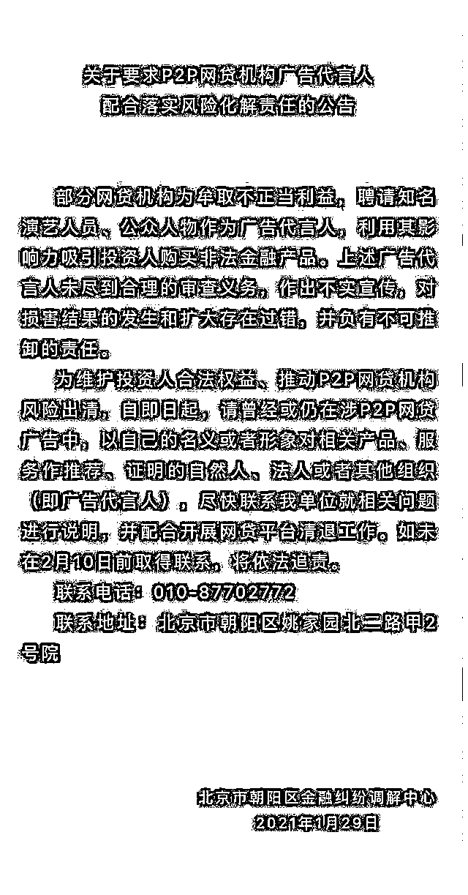

# 颤抖吧！给 P2P 代言的明星们，银保监会喊话：退钱！

> 原文：[`mp.weixin.qq.com/s?__biz=MzIyMDYwMTk0Mw==&mid=2247515353&idx=1&sn=eaa826c8d8a95f5096df6714e7fe778d&chksm=97cb77e1a0bcfef7fb033707ea2d578b1301d92fe77e114276fccc5ff586a0c0d78f1c500c1b&scene=27#wechat_redirect`](http://mp.weixin.qq.com/s?__biz=MzIyMDYwMTk0Mw==&mid=2247515353&idx=1&sn=eaa826c8d8a95f5096df6714e7fe778d&chksm=97cb77e1a0bcfef7fb033707ea2d578b1301d92fe77e114276fccc5ff586a0c0d78f1c500c1b&scene=27#wechat_redirect)

**为配合相关部门打击传销活动，现长期大量收集河南洛阳、河北秦皇岛、湖南长沙地区传销组织的信息，如有掌握信息者可联系灰产圈**

明星们的噩梦来了。 

P2P 网贷全面清退后，存量风险处置工作正在加速推进。6 月 1 日，银保监会召开新闻发布会通报近期监管重点工作。

其中银保监会副主席梁涛表示，对已立案的 999 家网贷机构，依法协调公安、司法等部门加快审理进度。加快追赃挽损，依法追缴高管奖金和明星代言费、广告费。

代言 P2P 的明星们请注意！

银保监发声追缴代言费

6 月 1 日，银保监会举办新闻发布会，为大家介绍近期监管重点工作的开展情况，并回答记者提问。

其中颇为引人关注的一点是，银保监会明确表态，要追缴明星代言费、广告费！

其中提到，防范化解重点领域风险取得积极进展。坚决打好防范化解金融风险持久战，银行业保险业风险持续收敛。

一是稳妥有序处置高风险金融机构。已接管的“明天系”6 家保险信托机构运行平稳，一批城商行、农商行风险化解取得积极进展，部分高风险信托机构得到妥善处置。

二是持续拆解高风险影子银行，大力整治“名不符实”的金融产品。前 4 个月，委托贷款和信托贷款净减少 5499 亿元。

三是加强信用风险防控。一季度银行业处置不良贷款 4632 亿元，超过去年同期。一季度末，银行业不良贷款余额 3.6 万亿元，不良贷款率 1.89%，较年初下降 0.02 个百分点。

四是配合地方政府化解隐性债务风险。严禁新增地方政府隐性债务，做好高风险地区的债务风险应对，有序化解存量风险。

五是稳妥推进网贷机构存量风险处置。截至 3 月末，存量业务尚未清零的停业网贷机构 1387 家，未兑付借贷余额 7161 亿元，比去年末减少 79 家、1046 亿元。

其中，对已立案的 999 家机构，依法协调公安、司法等部门加快审理进度。加快追赃挽损，依法追缴高管奖金和明星代言费、广告费。引入征信系统和地方资产管理公司，提高追偿专业化水平。 

1 月 29 日，北京市朝阳区金融纠纷调解中心发布公告称，部分网贷机构为牟取不正当利益，聘请知名演艺人员、公众人物作为广告代言人，利用其影响力吸引投资人购买非法金融产品。上述广告代言人未尽到合理的审查义务，作出不实宣传，对损害结果的发生和扩大存在过错，并负有不可推卸的责任。

上述公告的发布，意味着明星代言的 P2P 平台爆雷已有定性，即明星“负有不可推卸的责任”。

哪些明星要哭了？

**自 2014 年以来，先后有 e 租宝、中晋资本、理想宝、团贷网、网利宝、爱钱进、有利网等十几家平台爆雷，一度涉事代言的明星包括黄晓明、范冰冰、汪涵、杜海涛、王宝强、唐国强、杨迪等人。**

****此前报道：****

**[汪涵代言“翻车”，230 亿的锅，他该不该背？](http://mp.weixin.qq.com/s?__biz=MzIyMDYwMTk0Mw==&mid=2247500570&idx=4&sn=93c2cff47086cc7afaf14359a4dbada5&chksm=97cb0822a0bc813482262f71bf86755600363d5c43eea8838b06893f052a97e99109d94ddabe&scene=21#wechat_redirect)**

**[汪涵后，刘国梁为代言爱钱进道歉！37 万人合计 230 亿可能血本无归！](http://mp.weixin.qq.com/s?__biz=MzIyMDYwMTk0Mw==&mid=2247500826&idx=1&sn=8575f4fa7077cdac9b080220ce5c96bf&chksm=97cb0f22a0bc8634492e22f7633125363bf309fe768d14d984c1cc50247c169a61c82fc02114&scene=21#wechat_redirect)**

**[继汪涵、刘国梁危机后，杜海涛也翻车了？](http://mp.weixin.qq.com/s?__biz=MzIyMDYwMTk0Mw==&mid=2247501095&idx=3&sn=c0c6246cce998ec55e17034f941349a7&chksm=97cb0e1fa0bc8709b53b072d515fccfc7631a34028801c92043da4b4f517e2174e992d924a7a&scene=21#wechat_redirect)**

**这也引发了关于“明星是否该为代言的 P2P 产品负责”的讨论。**

**不过，从此前的报道来看，多数明星在代言平台出现违约事件后，尽管卷入了舆论风波，但多数都不了了之。** 

**2016 年，知名艺人张铁林为之宣传的鑫琦资产因涉嫌非法集资爆发危机，有大量网友在微博表示：“代言虚假广告的明星必须负连带清偿责任”，然而张铁林始终未对此发表看法。**

**随后，e 租宝、东虹桥金融、理想宝、团贷网先后爆发兑付危机，让李湘、黄晓明、唐国强、范冰冰等明星陷入代言泥淖。2016 年，e 租宝被认定为涉嫌诈骗，金额高达 700 亿。**

**为大众所关注的还有知名主持人汪涵代言“爱钱进”被声讨事件。去年 7 月，在爱钱进产品传出兑付困难消息后，多名投资者举牌喊出“爱钱进诈骗汪涵退代言费”的标语，一度登上微博热搜。**

**多位受骗的投资者表示，当时是看了汪涵的广告，相信他才购买涉事理财产品，强调汪涵需要为此负责。随后，汪涵就代言网贷平台一事向监管部门进行情况说明，并公开道歉。**

**汪涵道歉后不久，湖南台主持人杜海涛也因代言 P2P 平台网利宝引发争议。**

**一名网利宝理财 APP 的投资者称，他 17 年至 18 年期间看到了杜海涛代言的理财 APP 广告开始投资，目前损失了 120 多万。**

**杜海涛姐姐在直播带货时，有网友在弹幕中刷屏"你弟代言的网利宝把我们害这么惨"。**

**似乎是影响到杜海涛姐姐直播了，她直言："就没说法，咋地了？爱看看，不看出去，就这样，爱咋咋地"，说完便认真擦起手来。**

**随后屏幕外助理的声音响起"我只想说，最应该给个说法的是你们自己，没有人强迫你们去做。你这件事情都是你自己决定，跟海涛无关，人家海涛没牵着你的手说你必须给我签……"。**

**助理说完，杜海涛姐姐连着说了两个"你活该"。**

**2020 年 7 月 11 日，杜海涛工作室发布声明称，“网利宝”曾在 2018 年通过广告代理商与其进行拍摄中插广告的短期合作，未直接签过代言合同，合作前其审核了相关经营资质还注册使用过产品，广告合作早已结束，未再发布过此产品信息。**

**不过也有例外，2020 年，因曾经代言的“中晋系”投资理财产品爆雷，上万投资者被套牢，“九球天后”潘晓婷可谓深陷风波里，一度被投资者起诉要求赔偿。裁判文书显示，在“中晋系”爆雷后，潘晓婷已主动配合公安机关退还所有代言费。**

**银保监会曾发风险提**

****

**今年 4 月 22 日，银保监会消费者权益保护局发布 2021 年第二期风险提示，提醒金融消费者要理性看待明星代言，做到“三看一防止”，切实防范金融陷阱。银保监会称，金融产品信息不对称性高、专业性强，代言人自身如果没有辨别代言产品资质、不了解产品风险，可能产生宣传误导风险。**

**目前，明星为各类互联网平台或金融产品代言种类繁多，常见模式大致有以下五种：**

**一是为 P2P 平台代言。近年已有明星代言的平台爆雷，导致参与者资金受损。**

**二是代言涉嫌非法集资的产品。如“中晋系”集资诈骗案已导致万余名投资者遭受资金损失。**

**三是为互联网金融平台代言。网络平台操作更便捷，但也容易存在风险提示、投保告知不充分等问题，消费者切忌因明星代言而忽略风险告知事项。**

**四是为金融产品、平台站台。如“泛亚有色”曾邀请某学者出席活动，利用名人光环对公众造成消费误导。**

**五是为银行保险机构某类产品或整体品牌代言。如明星担任银行信用卡推广大使或宣传大使。**

**此外，部分粉丝无底线追星，为明星集资打榜等不理智追星行为也被不法分子利用，导致一些集资乱象。还有的利用名人效应过度营销宣传诱导过度消费和超前消费，有可能引发过度负债、暴力催收等问题。**

**来源：中国基金报**

****

****

**← 向右滑动与灰产圈互动交流 →**

****