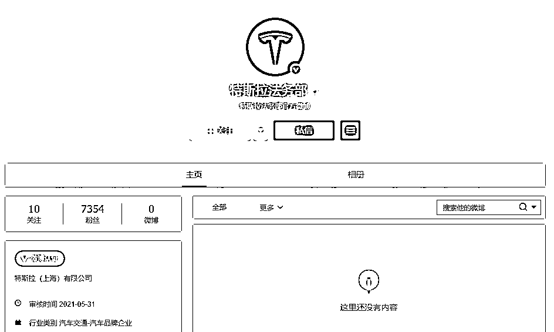
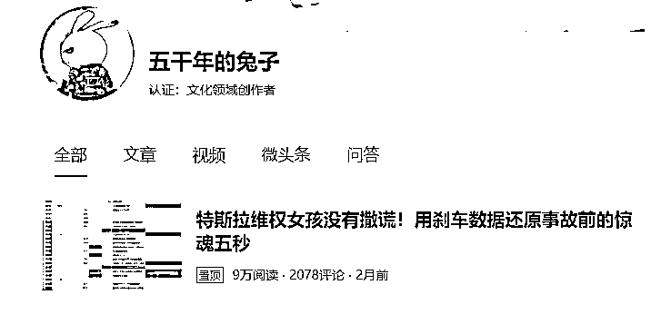

# 这是特斯拉要开始维权了吗？

> 原文：[`mp.weixin.qq.com/s?__biz=MzIyMDYwMTk0Mw==&mid=2247515353&idx=2&sn=098aa63643f805fc3da0493cc7565ece&chksm=97cb77e1a0bcfef7f7b796022b7309645e953cab27ffc8ecd3d96031981576f9ebaa0acb6ffc&scene=27#wechat_redirect`](http://mp.weixin.qq.com/s?__biz=MzIyMDYwMTk0Mw==&mid=2247515353&idx=2&sn=098aa63643f805fc3da0493cc7565ece&chksm=97cb77e1a0bcfef7f7b796022b7309645e953cab27ffc8ecd3d96031981576f9ebaa0acb6ffc&scene=27#wechat_redirect)

受车主维权、多起刹车失灵等事件影响，近期特斯拉负面消息缠身。

6 月 1 日，在微博上，有网友发现特斯拉注册了“特斯拉法务部”这一账号，简介为“独立思考，明辨是非”。截至发稿，该账号有 7000 余个粉丝。 

除了微博平台，**“特斯拉法务部”还在今日头条、抖音等平台注册了相同的账号。**

当前“特斯拉法务部”并没有推送相关内容，不过**有自媒体博主曝出，自己收到了“特斯拉法务部”私信诉讼警告。**

6 月 2 日下午，特斯拉因为开通法务部账号、私信警告自媒体登上了微博热搜。有网友表示，**这是特斯拉要开始维权了吗？**

特斯拉法务部发评论：

互联网不是法外之地

尽管一文未发，但“特斯拉法务部”已开始了行动。

5 月 29 日，今日头条自媒体博主“五千年的兔子”发帖称，特斯拉法务部私信了自己，声称公司已经在北京法院提起诉讼，而博主可以联系对方进行沟通。

私信内容是：我司注意到您仍在持续发布涉及我司的侵权内容。请知悉，我司已在北京法院提起诉讼。如希望进一步沟通，请通过上述联系方式联系。

特斯拉法务部还在帖子下面评论称，“互联网不是法外之地”。

面对特斯拉法务部的私信，“五千年的兔子”选择了“硬刚”，将自己分析特斯拉车辆数据的文章置了顶，还表示“会不会把房子赔掉”。

值得注意的是，“五千年的兔子”是“特斯拉法务部”今日头条账号关注的两个自媒体里其中的一个。

另一位被“特斯拉法务部”关注的自媒体账号是“晓波二手车”，其账号内容主要是分享买卖二手车的案例。

在特斯拉法务部的抖音账号上，其关注了 14 个账号，除了特斯拉官方相关账号，还有一些汽车领域的自媒体。截至 6 月 2 日，其**关注列表中的自媒体已有四家发表了向特斯拉道歉的视频。**

此前在 5 月 28 日晚间，“特斯拉客服支持”官方微博曾晒出多封来自自媒体的道歉信，自媒体对发布关于特斯拉不实或者负面言论进行道歉。

市值蒸发 1000 亿美元，中国销量暴跌

今年以来，特斯拉在国内多地频频被曝出事。从河南维权车主到广州特斯拉撞墙，到温州特斯拉“失控”，再到台州一特斯拉撞倒两名交警等等，特斯拉几乎每次都会被推到舆论的风口浪尖。

5 月至今，特斯拉市值蒸发 1005 亿美元，股价累计跌幅达 15%。有分析称，市值大幅蒸发，与近期特斯拉负面消息缠身不无关系。

在中国销量数据方面，特斯拉也明显下跌。

据乘联会数据，4 月新能源乘用车市场，外资品牌中则仅有特斯拉月销量破万，特斯拉中国 4 月份销量为 25845 辆，与比亚迪十分接近。但对比据乘联会 4 月初公布的“3 月份新能源销量排行榜”数据可以发现，3 月份特斯拉中国销量为 35478 辆。也就是说，**4 月份特斯拉中国的销量下降了近 1 万辆，环比下降 27%。**

乘联会统计数据还显示，4 月份，特斯拉主销车型 Model 3 的销量为 6264 辆，相比 3 月份的 25327 辆，环比大跌 75%。而另一款国产车型 Model Y 在 4 月份销售 5407 辆，相比 3 月份的 10151 辆，环比下降 47%。销量排名也从 3 月份的第三名，滑落至第 6 名。

对于在华销量受挫，特斯拉方面解释称，上海超级工厂对 Model Y 生产线升级，在 4 月曾停产两周，销量因此产生了波动。

值得注意的是，**除了中国市场，特斯拉在欧美的市场地位也日益受到威胁**。据 EV Sales 数据，4 月，特斯拉 Model 3 在欧洲市场的交付量仅为 1244 辆，与 3 月 2.82 万辆的交付量相比下跌 95%，直接跌出欧洲新能源车型销量前二十榜单。在美国市场，据摩根士丹利分析，特斯拉在美国的市占率从 2020 年年底的 81%下降至今年 2 月的 69%，损失的 12 个百分点的市占率几乎全部由福特野马 Mach-E 蚕食。

来源：观察者网，每日经济新闻

← 向右滑动与灰产圈互动交流 →

