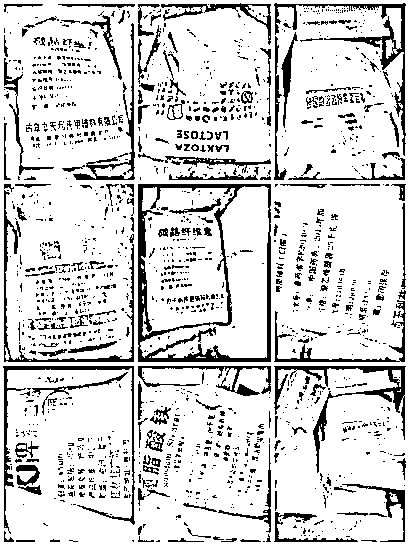

# 这种网红“糖果”千万别吃，可能会致命...

> 原文：[`mp.weixin.qq.com/s?__biz=MzIyMDYwMTk0Mw==&mid=2247515353&idx=3&sn=878ae7032cff93db187beddbd74509cb&chksm=97cb77e1a0bcfef7b4f1471bf1a81bb0e51423142f80a44e1a520a4b7bc72e57459d2738678d&scene=27#wechat_redirect`](http://mp.weixin.qq.com/s?__biz=MzIyMDYwMTk0Mw==&mid=2247515353&idx=3&sn=878ae7032cff93db187beddbd74509cb&chksm=97cb77e1a0bcfef7b4f1471bf1a81bb0e51423142f80a44e1a520a4b7bc72e57459d2738678d&scene=27#wechat_redirect)

夏天到啦 

又到了各位

秀身材的时候啦

看着在网络上的减肥教程

每次都在心里立志要减肥

无奈被美食吸引

或是没有足够的时间

**“一颗见效，任何体质包瘦！”**

如果您想减肥，在朋友圈看到这样的推广

会不会心动？

**购买所谓的网红“减肥糖果”**

这样的减肥产品不仅听着不靠谱

而且推广词也违反了广告法

近日

安徽省铜陵市市场监管局

就查处了一起

关于“减肥糖果”的违法案件

原来这些网红“减肥糖果”里

**添加了违禁药西布曲明**

目前，有关部门已依法将涉嫌构成

生产销售有毒、有害食品罪的葛某、邹某等

移送公安机关处理。

这个听起来很神的网红“减肥糖果”

究竟是怎么造出来的？

又有哪些危害？一起看看！

   **直播带货“种草”、微信支付“入坑”，网红减肥药含西布曲明，可能导致心肌梗死**

此前，一位消费者在某平台看网红直播“种草”了一种网红“减肥糖果”，通过微信转账的方式购买入手，服用后出现一系列不适反应，才发现自己被坑了，随即向铜陵市市场监管局投诉举报。

铜陵市市场监管局执法人员利用快速检测方法，初步判断该压片糖果添加了西布曲明，随即立案调查，并对该压片糖果进行法定检验，**检验结果西布曲明含量为 44.8mg/g。**

**西布曲明是什么？**

北京大学第四临床医学院、北京积水潭医院药学部主任药师，中国非处方药物协会专家张石革说：“**西布曲明曾被用作减肥药，其可抑制食欲中枢，促使人体的胃部饱胀感增强，食欲下降**，从而达到减肥的目的。但**西布曲明也会增加心脑血管疾病风**险，如心率加快、血压升高，**严重时可致脑中风甚至死亡，已被禁用。**”

**2010 年 10 月，原国家食品药品监督管理局停止西布曲明制剂和原料药在我国的生产、销售和使用，已上市销售的药品由生产企业负责召回销毁。**曾经在市场上大火的减肥药“曲美减肥胶囊”，也因以盐酸西布曲明为主要成分而被下架。

事实上，不仅我国禁用西布曲明，世界多国禁用该成分。

美国食品药品监管局（FDA）认为：受试人群使用西布曲明，其心血管事件风险超过其从体重减少中所获得的效益。

2010 年 1 月，英国、欧盟药品管理局（EMA）已完成对减肥药西布曲明（诺美亭）的下架通知，同年 10 月，德国、美国、意大利、加拿大等多国因西布曲明致数十人死亡而对其禁用。

西布曲明相关不良反应的案例比比皆是：土耳其 1 名 36 岁男性服用西布曲明大约 6 个月后患心肌病，导致心力衰竭。澳大利亚 1 名 40 岁女性服用西布曲明 25 天后出现心悸并晕厥。香港 1 名 37 岁女性服用含有西布曲明的非处方减肥中药，3 天后出现心前区疼痛症状，几天后发生心肌梗死。

更让人气愤的是，涉案网红还宣称食用此款减肥药“产后 26 天已瘦 33 斤”，殊不知西布曲明对特殊人群的应用危害更大，**如果妊娠早期服用，可能导致胎儿器官分化异常、畸胎，因此妊娠及哺乳期妇女要禁用。**

   **假药生产加工场所脏、乱、差，卫生条件甚至不如装修工地**

铜陵市市场监管局会同公安机关根据掌握的线索共同赴郑州对当事人葛某、邹某生产加工场所进行检查。其主要加工点位于河南郑州惠济区赵兰庄，执法人员现场发现并捣毁生产加工窝点 2 个，包括胶囊剂生产车间、压片糖果生产车间。

**生产加工场所脏、乱、差，各种原辅料随地堆放，地上满是粉尘，各种“制药”设备陈旧斑驳，****卫生条件甚至不如装修工地。**这种环境下居然生产的是给消费者食用的产品！

现场查获片剂和胶囊剂生产设备 20 台，包括搅拌机、制粒机、压片机、糖衣机、手工胶囊充填机以及化学原料合成设备等。

**   ****犯罪分子为什么铤而走险？**** 原因只有一个——暴利！**

办案人员介绍，公安机关在河南郑州，广东广州、湛江，安徽宿州 4 个抓捕点同时进行收网，**共抓获犯罪嫌疑人 12 名**。

经公安机关调查核实，当事人采购和销售西布曲明原料根据纯度定价，一般 7000 元/公斤左右。按之前检测的浓度 44.8mg/g，**每粒“减肥糖果”1g 估算，每粒的西布曲明成本约为 0.3 元左右。**

郑州生产加工窝点生产的压片糖果和减肥胶囊，以**0.8 元/粒**的价格销售给湛江中间商，中间商再以**1.6 元/粒**的价格销售给安徽、山东等“网红”零售人员，“网红”零售人员以**269 元/袋（10 粒）**的价格销售给受害人。

**在层层加价之下，一粒有毒有害可能致死的网红减肥药，价格翻了几十倍！**

现场查获的各种造假药的原料，包括压片糖果和西布曲明原料、片剂生产用辅料、空胶囊等，都装在玻璃丝袋子中，堆放在一起，外观看着像一包包水泥，共计 300 余公斤，货值 1000 多万元。

我国《刑法》规定，在生产、销售的食品中掺入有毒、有害的非食品原料的，或者销售明知掺有有毒、有害的非食品原料的食品的，处五年以下有期徒刑，并处罚金；对人体健康造成严重危害或者有其他严重情节的，处五年以上十年以下有期徒刑，并处罚金；致人死亡或者有其他特别严重情节的，处十年以上有期徒刑、无期徒刑或者死刑，并处罚金或者没收财产。

市场监管部门提醒广大消费者：**如果食用减肥类产品后出现食欲减退、失眠、口渴、便秘等症状，应高度警惕并通过全国 12315 平台投诉举报。 **

张石革建议消费者通过增加运动、合理膳食来减轻体重，减少盐、糖、脂肪的摄入，保持人体能量的收支平衡；如需要用药，应在医生的指导下进行。**不要轻信所谓“减肥”产品宣传，理性消费。**

据国家市场监管总局介绍，今年开展的“铁拳”行动聚焦民生领域，将加大执法力度，查办一批重点案件，严惩一批违法主体，曝光一批典型案例。

来源：人民日报、浙江之声

← 向右滑动与灰产圈互动交流 →

