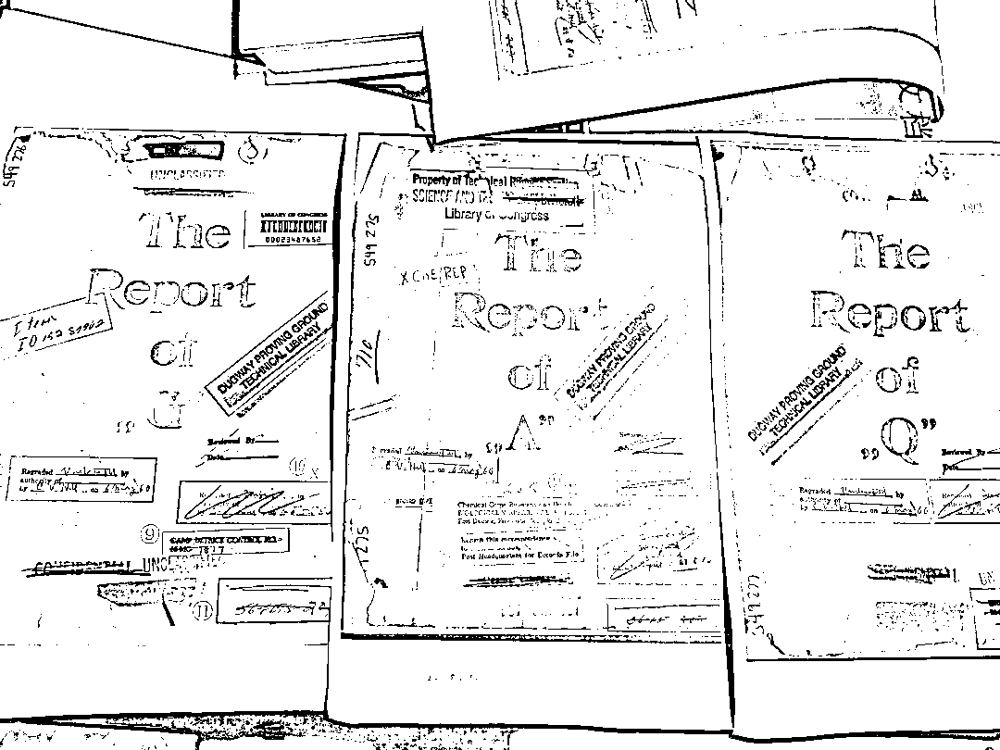

# 美国德堡基地与 731 部队的肮脏交易

> 原文：[`mp.weixin.qq.com/s?__biz=MzIyMDYwMTk0Mw==&mid=2247515353&idx=4&sn=0a93345d6cb58bb9a48bb8d639d2f90d&chksm=97cb77e1a0bcfef70e24ebc0030f0d2aaa214f7b2435ef0ad1f27245b0d90545eca4dc7fa23b&scene=27#wechat_redirect`](http://mp.weixin.qq.com/s?__biz=MzIyMDYwMTk0Mw==&mid=2247515353&idx=4&sn=0a93345d6cb58bb9a48bb8d639d2f90d&chksm=97cb77e1a0bcfef70e24ebc0030f0d2aaa214f7b2435ef0ad1f27245b0d90545eca4dc7fa23b&scene=27#wechat_redirect)

新华视点微信公号 6 月 3 日消息，近日，在中国外交部例行记者会上，有记者就美国政府再炒新冠肺炎疫情起源一事提问。

中国外交部发言人曾提到，公开资料显示，德特里克堡居然与侵华日军 731 部队有着千丝万缕的关系。

731 部队进行人体实验的炭疽菌实验报告封面图，上面有德特里克堡基地的字样。新华社记者 王建 摄

中国研究 731 部队方面的专家表示，事实确实如此，从 1945 年 9 月美国派德特里克堡基地的细菌战专家桑德斯调查日本细菌战有关情况开始，直到 1948 年 11 月东京审判结束，在此期间美军和日本之间达成了秘密交易。 

美国以豁免 731 部队成员战争责任为条件，得到了 731 部队进行人体实验、细菌实验、细菌战、毒气实验等方面的数据，并加以利用。

侵华日军第七三一部队罪证陈列馆人体实验展区，一张张英文人体实验报告书复印件，连成一面墙。新华社记者 何山 摄

731 部队对外称“日本关东军防疫给水部”，是二战期间侵华日军从事生物战、人体实验等研究的秘密军事部队，总部基地在哈尔滨市平房区。 

在位于平房区的侵华日军第七三一部队罪证陈列馆人体实验展区，一张张英文人体实验报告书复印件，连成一面墙。 

这些报告详细地记载了 731 部队进行人体实验的情况，包括解剖数据、彩色解剖图、器官感染路径和感染程度等记录，是能够证明 731 部队进行人体实验的直接证据。 

这些人体实验报告书的原始档案保存在美国国会图书馆科学技术部档案室，包括《炭疽菌实验报告》《鼻疽菌实验报告》《鼠疫菌实验报告》。 

据侵华日军第七三一部队罪证陈列馆研究员杨彦君介绍，这三个报告封面标识分别写有：“马里兰州德特里克堡基地生物战实验室化学部队研究与开发部，此函归还至战后总部档案部”，盖有“达格威实验基地技术图书馆”的黑色墨印。 

“这充分说明了 731 部队的这些研究成果成为美国德特里克堡生物武器研究的重要参考。”杨彦君说。

侵华日军第七三一部队罪证陈列馆展出的由德特里克堡基地调查人员对 731 部队调查后，撰写报告的复印件。新华社记者 王建 摄

侵华日军第七三一部队罪证陈列馆馆长金成民指出，日本投降后不久，美国德特里克堡基地的细菌战专家桑德斯于 1945 年 9 月至 10 月调查了日本细菌战有关情况。在日本期间，桑德斯问讯了 731 部队多名重要成员，最后形成了《桑德斯报告》。 

桑德斯返回美国后，德特里克堡基地又派出精通细菌战研究的汤普森，前往日本继续调查 731 部队。汤普森先后问讯了包括部队长石井四郎在内的 731 部队重要成员，撰写了调查报告书《汤普森报告》。

杨彦君说，从《汤普森报告》记载情况来看，石井四郎的供述过程经历了从回避到配合，从片面到全面的过程，提供了大量有价值的信息。 

“短时期内，石井四郎的态度发生如此巨大变化，除了美军施加的压力之外，石井四郎应是得知调查不会作为战争罪行证据来使用。”杨彦君说。 

1947 年 4 月，美国又派出德特里克堡基地植物实验部主任诺伯特·费尔前往东京，继续调查日本细菌战情况。1947 年 10 月，基地再派出埃德温·希尔博士等人前往日本调查细菌战。希尔曾担任德特里克堡基地基础科主任。 

《希尔报告》对桑德斯、汤普森、费尔等人的报告进行补充调查，也记录了美日之间的肮脏交易：美国为了得到 731 部队细菌战数据资料，支付了 25 万日元。

731 部队进行人体实验的鼻疽菌实验报告、炭疽菌实验报告、鼠疫菌实验报告的封面。新华社记者 王建 摄

美国长期从事细菌战研究的专家谢尔顿·H·哈里斯一直想证明，美国政府有意隐瞒石井四郎指挥日军在中国犯下的罪行。 

他在《死亡工厂》一书中披露了核心证据——《希尔报告》中有这样一段记载：“收集到的证据信息对我们开发细菌战十分珍贵……为了拿到这些数据共花费了 25 万日元，与实际研究成本相比，只是花费了如此低廉的价格就获得了珍贵的资料。” 

“这段描述是美国庇护 731 部队免遭东京审判的书面文件，从事件的过程和最后的结果来看，美国确实达到了单独占有 731 部队生物战和人体实验情报资料的目的。”杨彦君说，美国获得这些数据资料后，加以利用，进行了生物武器研究，德特里克堡基地战后能快速发展壮大，乃至现在成为美国军方的 P4 生物实验室。 

金成民表示，美国一贯坚持双重标准，同 731 部队进行的秘密交易，完全没有考虑 731 部队人体实验、细菌战这些违背伦理和文明准则的犯罪行为。 

正如谢尔顿·H·哈里斯在《死亡工厂》一书中记述：“实际上，（美国）国务院的态度是，只要不给美国带来麻烦事（即给予战犯免责之事的暴露）留下文字记录，就可以继续与石井四郎等进行交易。” 

来源：澎湃新闻，新华视点

← 向右滑动与灰产圈互动交流 →

