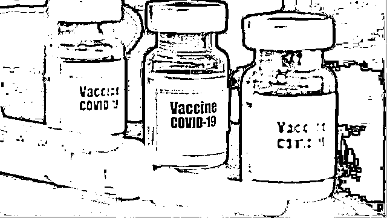
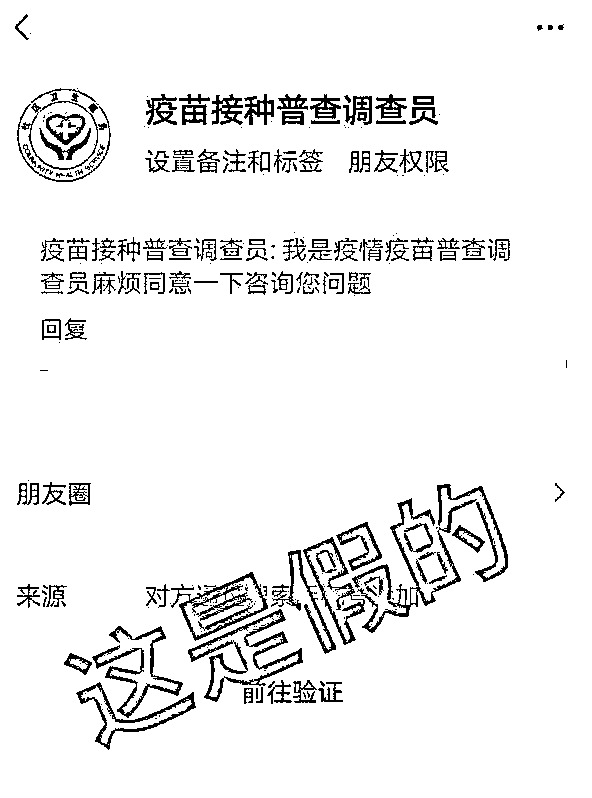
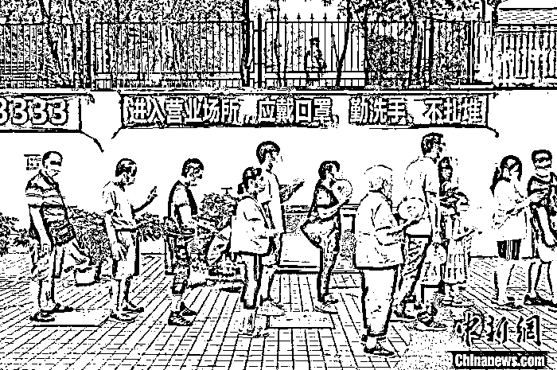
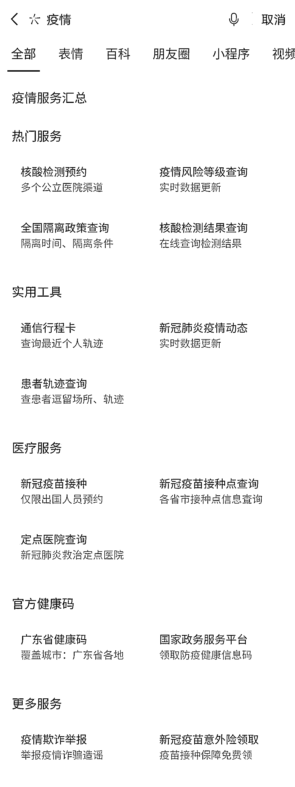
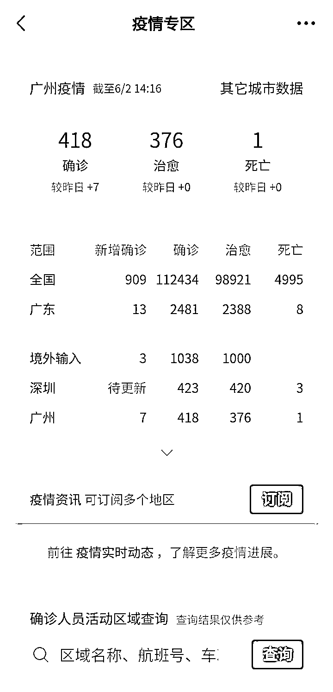
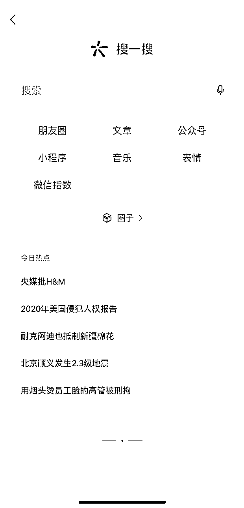
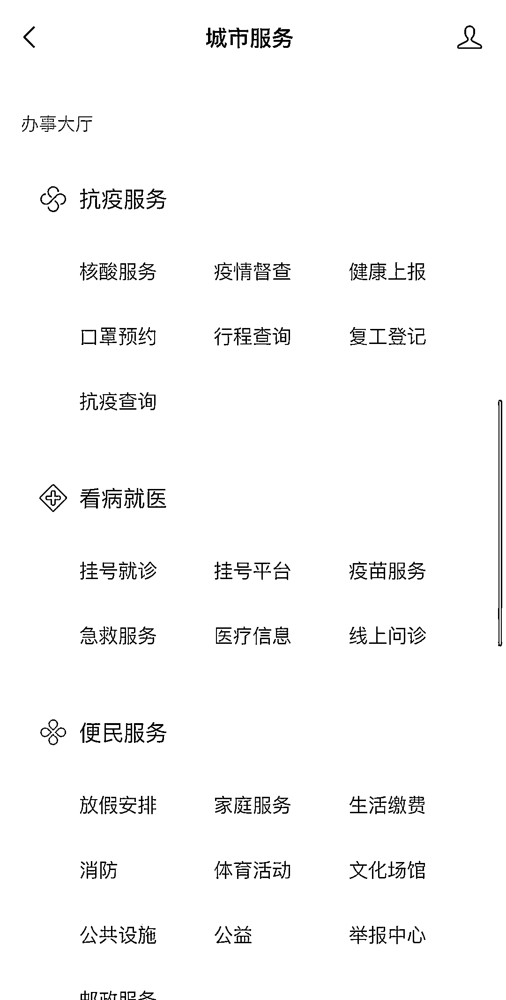
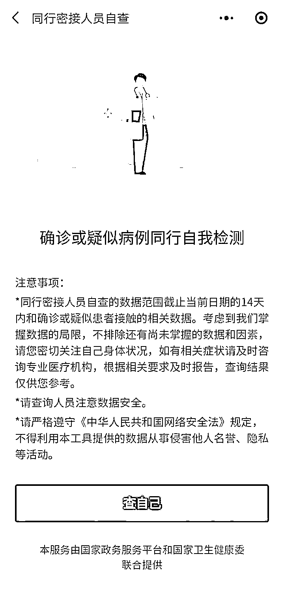

# 这些疫情假消息，别信！

> 原文：[`mp.weixin.qq.com/s?__biz=MzIyMDYwMTk0Mw==&mid=2247515353&idx=6&sn=2079b78b56f9e2555c18c13aa345b2d5&chksm=97cb77e1a0bcfef70c78efddac1517f00356e6d01651a6abcfee90a4a155bc728b3836d51144&scene=27#wechat_redirect`](http://mp.weixin.qq.com/s?__biz=MzIyMDYwMTk0Mw==&mid=2247515353&idx=6&sn=2079b78b56f9e2555c18c13aa345b2d5&chksm=97cb77e1a0bcfef70c78efddac1517f00356e6d01651a6abcfee90a4a155bc728b3836d51144&scene=27#wechat_redirect)

最近，在广州、深圳、佛山等地新冠疫情的催化下，许多市民接种疫苗情绪高涨，几乎出现了“一苗难求”的现象。就在大家忙着预约疫苗接种和核酸检测的时候，也有不少别有用心的人冒充疾控中心等单位，趁乱敲诈一笔。

根据最新消息，广州荔湾两街道调整为高风险地区，这也是新冠疫情爆发以来，广东第一次出现高风险地区。一时间，“加急做核酸通道”“虚假疫苗链接”凭空出现，“超时未打第二针等于没打疫苗”“国内疫苗无法抵抗印度变异株”等谣言四起。 

图片来源于网络

面对种种说法，你是否也产生很多问号？就让我们来说一说关于防控疫情那些事儿。

**这些疫情假消息，别信！** 

**错过第二针接种期，疫苗就无效（x）**

在广州市疫情防控新闻发布会上，广州市疾控中心副主任周斌表示，目前国家推荐的接种时间是第二剂次在三周到八周以内完成，这是希望大家完成第一针后，最短 21 天内尽快完成两针的接种，尽快产生免疫力。但是，即使超过八周再接种第二剂也没有问题，一样能产生抗体。只要大家后续完成第二针的接种，效果是一样的，不受影响。

**疫苗接种普查员加好友收集信息（x）**

不少市民反映称，接到自称是“疫苗接种普查调查员”的好友申请，大家注意了，这类信息是假的！添加好友之后，骗子一定会诱导大家填写银行卡、密码、手机验证码等个人信息，只要大家看到填写这些信息的要求，一定是诈骗！

图片来源于网络

**接种疫苗当天进行核酸检测（x）**

打新冠疫苗当天，不要做核酸检测，这样可以减少因接种片区疫苗株核酸片段污染造成的新冠病毒核酸检测阳性结果。原因是新冠病毒灭活疫苗，由新冠野病毒经过培养、灭活等工艺制备而成，病毒已经失去感染性和致病性，但仍存在新冠病毒的核酸片段。另外，接种过程中，抽吸疫苗、注射器排气等，疫苗可能会以液体或气溶胶方式直接或间接污染接种场所、接种人员和受种者等。

图片来源于中新网

此外，因聚合酶链反应检测灵敏度极高，如果在新冠病毒疫苗株核酸片段被降解前进行采样，很可能核酸检测结果呈阳性。

**疫苗对一再变异后的病毒没效果（x）**

现有的变异株仅是中和抗体的程度下降，但仍然还是维持在 50%以上的保护率，所以现有的疫苗可以应付变异病毒。重要的是，大家需要尽快接种疫苗，因为病毒的变异会继续发生，要想阻断它变异，防止完全能逃脱疫苗的免疫监视的变异株，我们就要阻断它传播，不给它机会继续变异。

专家表示，目前我们国家灭活疫苗的技术路线特别适合快速应对变异株，且有足够的研究能力和生产能力，根据比对变异株监控的结果，做出相应的反应。

不仅如此，还有许多市民收到假借官方机构名义发出的诈骗短信，要求市民点击链接预约接种新冠疫苗。其实这种含有链接的短信是典型的诈骗，诈骗分子诱导市民进入网站，进而骗取身份证号、银行卡账号密码等信息。

**加钱就可加急做核酸（x）**

如今人们对核酸检测的需求陡增，许多人由于工作要求，急着要用核酸检测合格证明。据媒体报道，家住邢台市的赵先生急需核酸检测合格证明，但又不能及时查到结果。这时候，他接到了一个自称疾控中心人员的电话，告知只要缴纳 500 元加急费用就可以快速出核酸检测结果。赵先生交了钱之后才发现，这是一场骗局。

无论是核酸检测，还是疫苗接种，大家要从正规渠道查询，不要被诈骗分子钻了空子。

**上微信，查疫情相关信息** 

目前，微信生态内已有丰富的疫情服务，大家可以一键获取许多有关疫情防控的官方信息啦。

**疫情专区服务**

微信搜一搜“疫情”“疫情服务”或在聊天中加#发送，即可进入疫情服务汇总专区，快速预约核酸检测，查询核酸结果、疫情风险等级、全国隔离政策、所在地健康码等等服务。

进入微信首页后，点击“我”-“支付”-“城市服务”-“疫情专区”，就能实时查看你所在的城市的疫情动态，及时了解身边的疫情情况。

**疫苗接种预约**

除了核酸检测外，微信中也可以直接预约疫苗接种。

  **方式一**

点击微信首页上方的搜索框（安卓手机点击首页右上角的“搜索符号”），点击“服务”，选择“疫情服务”模块的“新冠疫苗预约”或者在搜索框输入“新冠疫苗预约”，即可进入新冠疫苗预约的服务页面。

  **方式二**

微信上点击“我-支付-城市服务-抗疫服务”，也能进入新冠疫苗预约服务页面。

**查同行密接**

疫情当下，为了健康安全，建议不要去人群聚集的地方，但如果你有事出门，也要及时查询同程人称是否有密切接触者，微信搜索“”小程序，就能快速查同程密接。

**参考资料**

1、互联网联合辟谣平台.紧急提醒！这样的疫苗接种普查员是假的！

2、南方法治.可加急测核酸？这 3 种涉疫诈骗套路要小心|给个说法

3、南方日报.新冠疫苗个人预约暂缓，第二针还没打怎么办？回应来了

4、N 视频.接种疫苗当天不要核酸检测！原因有这三点

疫情之下，大家仍然要做好个人防护，坚持戴口罩、勤洗手、少聚集哦！

来源：微信 110

← 向右滑动与灰产圈互动交流 →

