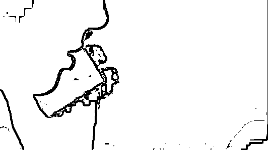

# 高考防骗指南！考生们要特别当心这些骗局！

> 原文：[`mp.weixin.qq.com/s?__biz=MzIyMDYwMTk0Mw==&mid=2247515353&idx=7&sn=a5a26d4e1ba72b8e91ad9be01b771a33&chksm=97cb77e1a0bcfef7b32c4464e0e078491e6877945d740bf5b1c12a08d8519e398561b6abe544&scene=27#wechat_redirect`](http://mp.weixin.qq.com/s?__biz=MzIyMDYwMTk0Mw==&mid=2247515353&idx=7&sn=a5a26d4e1ba72b8e91ad9be01b771a33&chksm=97cb77e1a0bcfef7b32c4464e0e078491e6877945d740bf5b1c12a08d8519e398561b6abe544&scene=27#wechat_redirect)

高考临近，一些诈骗分子又开始“蠢蠢欲动”。为了帮助考生和家长提高警惕，不受骗上当。反诈中心列举了与高考有关的种种骗局，避免考生和家长因此上当。

**考前阶段：“两卖一谣言”**

****01 卖题****

****诈骗分子利用钓鱼网站售卖所谓“高考真题”、“真题答案”等，标榜“准确率极高”、“违约退款”等，诱导家长、考生“预付订金”,或填写个人信息，实施诈骗。****

******02 “卖设备”作弊******

******此类骗局中，骗子散布销售短信橡皮、无线耳机等作弊器材信息，声称器材可以通过高考安检，并承诺在高考过程中帮助联系答题，传递答案，帮助考生考试过关。对此，警方表示，高考安保措施越来越完善，高考时各考点将使用电子屏蔽器和无线电探测仪等设备来强化考场管理，并加强考试期间的网络和短信管理。******

********03 网络谣言********

********“朋友捡到一个准考证，有认识的通知一下。姓名：×××，考点：一中，考场：013，座号：11，准考证号：204101311，联系扩散，别耽误孩子高考。帮助他人手留余香！”有没有觉得这条消息很眼熟？警方提醒，这些联系电话多为虚假号码，甚至有的是境外吸费电话，市民一旦拨打电话可能会支付高额话费。********

****************

**********查分阶段：“一骗一篡改”**********

************01 提前查询考分************

**********高考结束后，骗子会通过伪基站群发短信，称可查询高考成绩，并附有一个网址链接。不少考生收到此类信息后，便会迫不及待点开网址链接，然后手机便会被偷偷植入盗取网银的木马软件。还有的骗子会直接开价，要求家长支付 500 元至 1000 元的价格查询分数。此类骗局中，骗子利用家长“熬”不住的焦躁情绪作案，价格不贵，上当的人不在少数。**********

**********对此，警方郑重提醒，考生及家人查分时应认准教育部门指定的查询方式及查分网址，不要轻易点击手机短信里来历不明的链接。如果不慎点击，要立即卸载手机上的支付宝等快速支付工具，确保资金安全，并在备份手机通讯录等重要信息后，将手机重置或恢复出厂设置，或向专业技术人员求助清除病毒。**********

********************

************02 篡改考生志愿************

**********根据相关案件统计，我国多地都曾出现高考生被篡改志愿，未被志愿学校、专业录取的情况。对此，警方提醒广大考生要提高防范意识，妥善保管密码，不要委托他人进行网上信息查询或信息登记操作；志愿必须由本人填报，任何部门、学校、个人无权要求考生提供登录密码或代替考生填报志愿。**********

************录取阶段：“补录”骗局最易发生************

************01 分数不够花钱可“补录”************

**********骗子对考生家长谎称某高校名额没能招满，通过花钱“打点”可让考生获得补录名额，以此骗取考生家长钱财。也有嫌疑人在考前就用各种借口，让家长交钱保留名额。还有一些骗局中，骗子也会谎称有特殊关系，可以购买“内部指标”“计划外指标”。对此，警方提醒，正规的招生录取不会产生任何附加费用，凡是需要收取保证金、录取费、指标费的“招生指标”，一律不能相信。**********

************02 谎称帮忙申请助学金、补贴************

**********骗子利用一些考生家中经济困难，上大学需要通过助学金交齐学费的情况，冒充高校工作人员、教育部门工作人员，或者直接谎称手上有项目，可以为考生申请大学助学金，要求家长先交报名费。对此，警方提醒，当接到自称高校、教育、财政等工作人员的电话、信息，要发放“国家助学金”“返还义务教育费”“助学扶助款”时，考生及家长一定要主动与当地教育部门或学校联系求证。**********

************03 骗取家长生活费、培训费************

********冒充学生本人或学生老师，通过电话、发短信、网络留言、发来链接等方式，骗取家长学费、生活费、培训费。这种诈骗形式，从学生高考前到上大学后，一直可以实施，较为常见。对此，警方提醒，家长遇到电话、短信、网络留言、发来链接要钱的，一定要亲自联系学生本人核实，不要急于汇钱。********

**********04 伪造录取通知书诈骗**********

********骗子冒充高校招生办人员，向考生寄送伪造的录取通知书，让考生将学杂费打入指定的银行账号，以骗取钱财。类似此类骗局的手法还有制造虚假的钓鱼网站，骗子的目的就是骗取学生的生活费、学杂费。警方提醒，此类骗局中，骗子的准备工作都会非常专业。不仅会使用和原学校相似的校徽、logo，还配备了所有的课程资料，填写的大学地址也和正版一模一样。为此，考生和家长在登录学校和教育部门网站时，一定要有鉴别真伪的意识。要通过官网认证的链接或学校、教育部门官方发布的网址进入，转账汇款时要通过多种途径核实账号真伪。********

****************

**********假期阶段：三类骗局一定要当心**********

************01 机票退改签诈骗************

**********高考结束后，部分父母会支持孩子出去旅游。一旦收到“飞机故障、行程延误或取消，需要拨打退票电话进行改签或退票”的信息时，就要小心了，这很可能是诈骗分子设下的“圈套”，一旦按照短信中的联系方式退改签，很可能被骗输入“验证码”，将自己卡内的钱转给骗子。警方提醒，接到航空公司短信或电话称航班已取消时，万万不要拨打短信上提供的电话，应登录航空公司官网或拨打官方客服电话查询。**********

************02 刷单兼职诈骗************

**********高考结束后，不少考生会选择在暑期兼职勤工俭学。“网上刷单”足不出户就能赚大钱？往往能吸引到不少学生。警方提醒，“刷单兼职”十有八九都是骗局，诈骗分子一开始往往给一些报酬，待事主深信不疑后，诱骗其不断刷单，不再返还本金和报酬。**********

************03 网络游戏买装备、账号诈骗************

********好不容易度过了高考，假期时间宅在家里打游戏，也是不少考生的放松选择。警方提醒，要小心买装备、买账号诈骗。不法分子制作钓鱼网站，或在网上发布买装备、买账号信息，同时植入木马，小心装备没买成钱反而被骗走。********

********来源：石家庄市反诈中心，邯郸市反诈中心********

****************

****************

********← 向右滑动与灰产圈互动交流 →********

****************